When most people think of organizational structures, they usually think about trees.  Workers who work all day generally sit at the "bottom", and managers and other people that kinda do work and that you "report to" sit somewhere in the middle.  Meanwhile, there's a top tier where seemingly no work gets done.

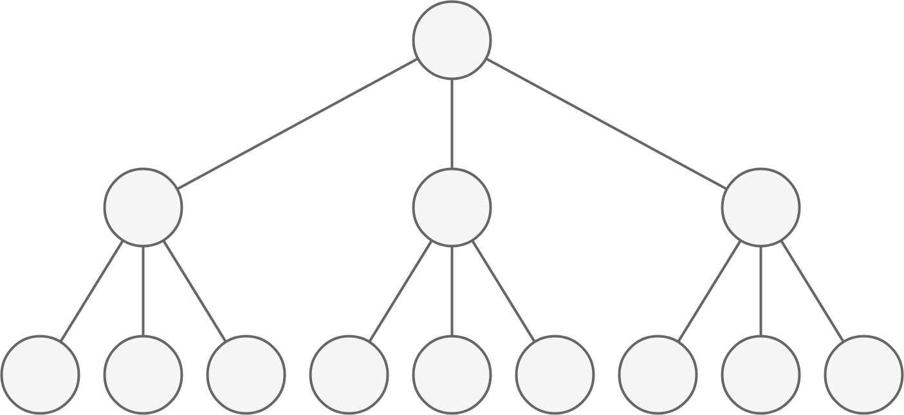

Of course, that's not true.  But what is true is that the *type* of work you do changes drastically the higher up a tree you go.  The leaf nodes at the bottom are generally focused on specific details of whatever the overall organization wants to do.  Middle and upper nodes are focused on ensuring the overall vision of the organization is achieved, and that an accurate representation of overall progress is understood.  This is insanely difficult work, because humans are difficult, and is usually focused around communication.

So let's imagine that the lines in our tree aren't just describing a hierarchy, they're lines of communication.  First of all, this is probably more accurate.

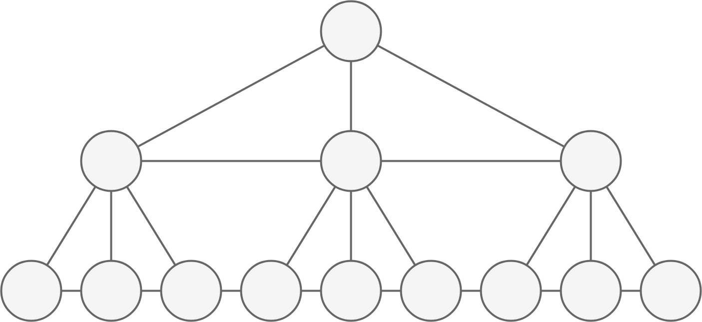

There are likely way more lines between layers, but let's stick with this for now.  The higher up you go, the larger the portion of your workload naturally dealing with people, communication, and ensuring that the overall vision is achieved.  We can visualize that with line stroke.

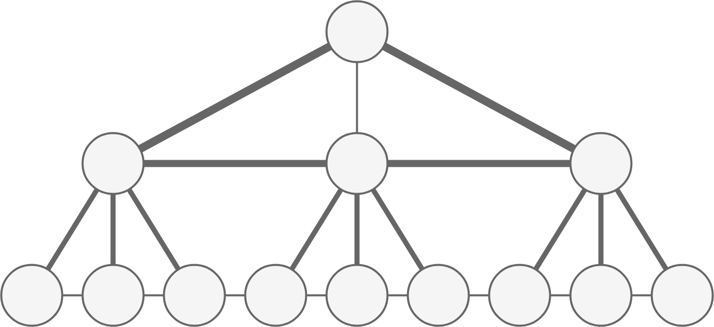

And in real life, these hierarchies get insanely big.  So big that, at some point, you get high enough up in a tree and the line strokes of all your edges are so big that it's literally all you do.  Think about the job of the President.  People say that you're the leader of the country.  But what you actually do is make speeches, institute policy, make decisions, and sign laws; in effect, you communicate.  A president doesn't even write his own speeches or policies, and he probably doesn't read the laws he signs either.  He's so high up that he's just a big 'ole communication machine.  It also means the President hardly ever understands much beyond a few edges worth of abstraction, and has no idea what any of the leaf nodes are actually doing.

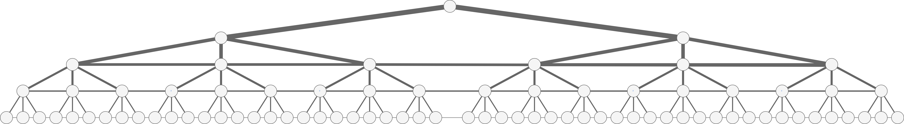

### Flatter Trees

Lots of organizations have huge numbers of layers.  This bothers people for two reasons.  First, line stroke is a measure of both internal organizational communication as well as how many different nodes and layers across the whole tree need to communicate.  So the more layers you have, naturally, the thicker the lines will be and the more of your job will just be communication and reporting.

Second, the bigger the tree the more internal nodes there are.  In a [full and complete binary tree](http://courses.cs.vt.edu/~cs3114/Fall09/wmcquain/Notes/T03a.BinaryTreeTheorems.pdf), for example, the number of internal nodes asymptotes towards half of all nodes as the tree grows.  Half of all nodes are doing communication and reporting.

People don't like this, and so a potential solution is to flatten that hierarchy.

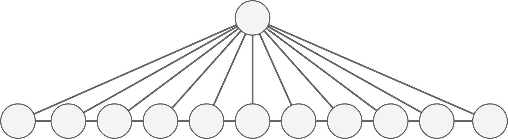

Which works somewhat.  There's less edges, less reporting and things appear maybe better.  Except now the vision, strategy, and communication is somewhat centralized on that one node.  Single points of failure aren't great, so this generally becomes something like

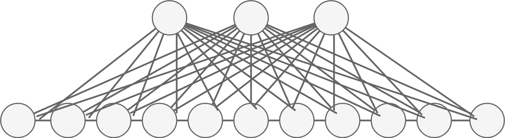

Our edges now don't have as much stroke; all the nodes have a higher percentage of their jobs focused on the actual work of the whole tree.  But our sacrifice is that there are more lines.  This isn't necessarily a bad thing, people *should* talk more, but we should all be aware that these are actually tradeoffs.

For engineers especially, there's this grandiose vision that we all have that we just want to be leaf nodes.  Point us at a problem and leave us alone.  But that's an illusion.  

### Brooks's Law

It's interesting to think about what other communication strategies could be tried.  Flattening a tree is all the rage, but could you go vertical?  

And if one person just reports to one other person, you can close the loop and completely democratize the process.  Vision is shared and passed back and forth, right?

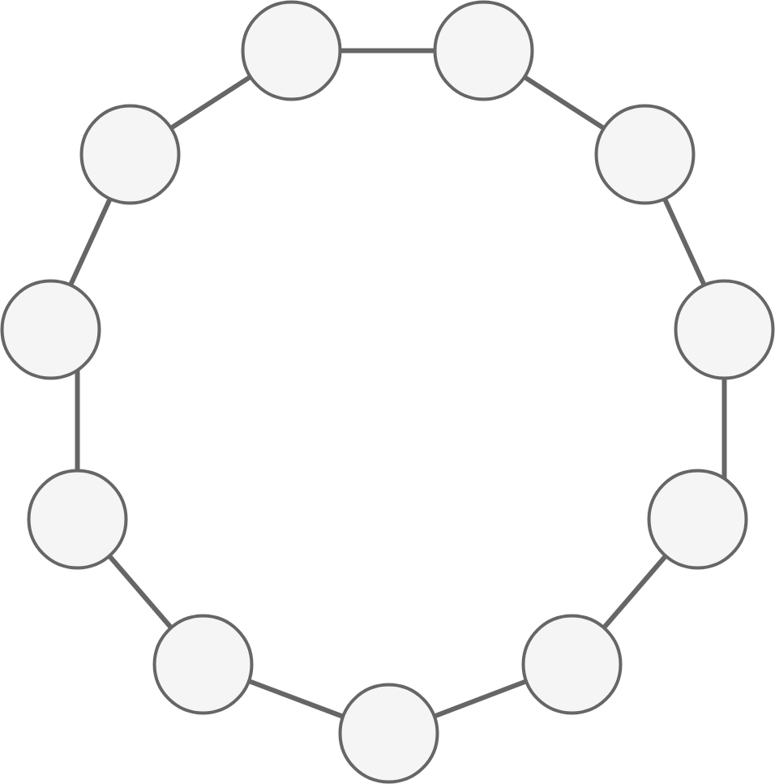

Of course not, because that's not how humans work and even if you could somehow constrain communication in that way, you've just introduced a giant game of telephone.  Awesome.

Fred Brooks realized all of this decades ago.  Every engineer in the software industry should read [The Mythical Man Month](https://en.wikipedia.org/wiki/The_Mythical_Man-Month) - it's one of the seminal books of software engineering.

[Brooks's Law](https://en.wikipedia.org/wiki/Brooks%27s_law) is usually reduced down to the quip: "Adding people to a late software project makes it later".  

Brooks decomposes this observation in detail, and one of the primary factors is the [combinatorial communication explosion](https://en.wikipedia.org/wiki/Combinatorial_explosion#Communication).  The number of paths, *l*, increases exponentially as the number of nodes, *n*, increases: 

Which means our simple circle actually looks like this.

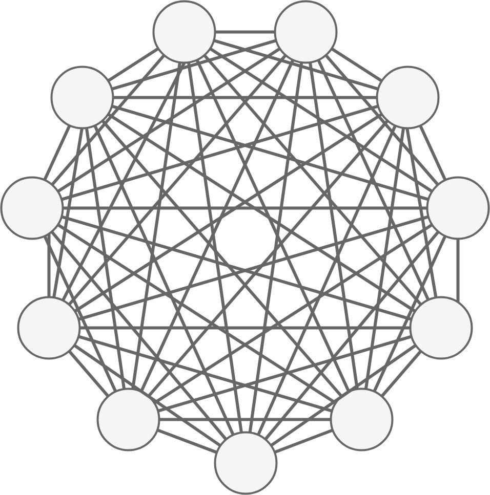

Yeah.  Be careful how many nodes you want in your graph.

### Work and Vision

Like I said before, the idea of leaf nodes is an illusion.  Given any project of sufficient complexity, you'll need to have a lot of nodes, which in turn will necessitate either or both thick edges and lots of edges.  

And let's be honest, all of my visualizations and scenarios are completely idealized.  Real organizations look more like this, with all sorts of politics, backchannels, and real and fake inaccuracies.  This is the engineer's nightmare.  Don't be that guy at the bottom, or well, anywhere actually.  All your work will just be reporting and communication!

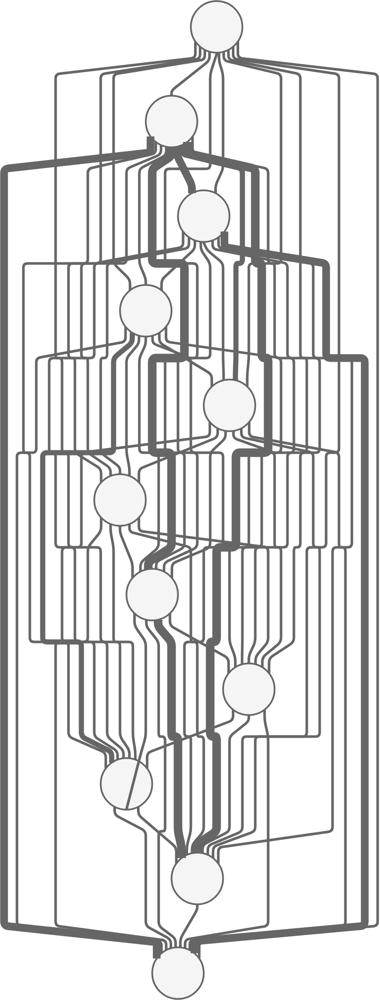

I think when people actually think about the idea of being a leaf node they mean something different.  If a problem is small enough, a single node can do the work, hold the overall vision, and have an accurate picture of the project's status.  That looks like this.

  

That node's got the strategy, the understanding of progress and the responsibility to execute.  Sounds pretty tough actually.  Expand slightly maybe and you're still really close to the idealized vision of a leaf node.

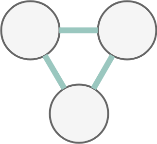

One, two, three, maybe four or five.  Those all sound like good numbers for this paradigm.  Everyone can share the vision.  Everyone has a sense of progress.  And everyone can focus on getting work done.  In short, everyone has autonomy.  The dream of being a leaf node is really the dream of being a small independent team.

### Choices

One big question is whether something like this can be achieved in a bigger organization.  Can one of the bottom sets of three nodes in this tree achieve that autonomy?

Maybe.  Sometimes.  Probably rarely.  But how often does real life end up more like this?

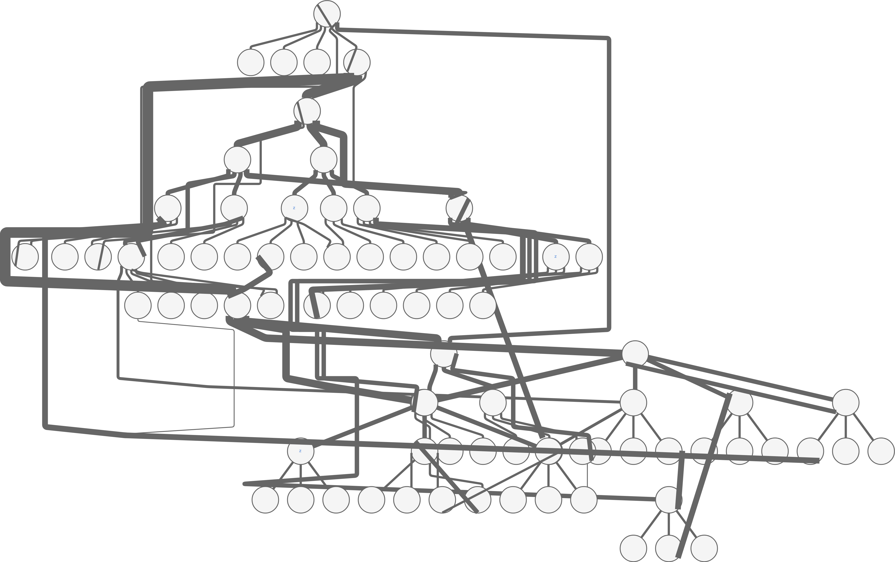

The Vision of the Leaf Node is a good thing.  But it's also a choice, and just like the choice of being a leaf node or an internal node in a big tree organization, it's one we don't understand well.   

For decades, the leaf nodes in big organization were blue collar workers and the internal nodes were white collar, so the internal nodes had more authority, prestige, and compensation.  But today, leaf nodes are just as often doctors, lawyers, engineers, or other knowledge workers.  Engineers, in our typical counter-cultural fashion, have eschewed the traditional views and many have rejected the internal nodes as valueless.

This is naive to the point of being foolish.  A big organization requires strong communication paths.  But big engineering organizations are still trying to figure out the right ways to select internal and leaf nodes.  And because of the long history of blue collar/white collar promotion from antiquated big orgs, that's still what most big orgs do.  Everyone knows of some not-so-good engineer that's been "promoted to the level of their mediocrity".

Is that fair?  I don't know.  There's a balance, since internal nodes need to have a strong sense of what it is they're communicating.  But a lot of the skills for handling vision, strategy, and reporting that are an internal node's responsibility are just different than pure engineering.  

Organizations still have a long way - probably decades - before we have a good handle on this problem.  There's a lot that needs to change, and a lot of it is simply historical artifacts.  

A first step, for each of us individual nodes, is to appreciate the different choices and tradeoffs that come with each.  A leaf node will have a lot of specific focus, but will have a significant lack of understanding and input into strategy, vision and communication.  An internal node won't have near as much bandwidth to focus on the specific details of what the organization is trying to do, but will have a better understanding of the overall goals and will be able to effect more change.  

And finally there's our idealized Vision of a Leaf Node, which we've shown is actually a completely independent small team working on a small enough problem that it doesn't need a large organization.  A small organization tackling a small problem like this is something a lot of people should aspire to.  If you limit an organization to a very small number of nodes, then everyone can focus mostly on real work that they love.  If you understand Brooks's Law, let communication flow between all the nodes and be very weary about adding more.  And with a small number of nodes, there can be a shared responsibility over the vision and an accurate picture of progress.  That responsibility also comes with all of the existential pressure and stress that's usually only felt by nodes at the top of a big organization; this is the cost of owning the vision.

The cultural and business tools and climate are in place now for this vision to expand and grow.  I'm really describing a small business, but there's so much more room now for small businesses that once could only be cultivated as small teams in big businesses.  In the technology industry, startups have been a singular focus of the last twenty years: start small with something novel and grow it big for a sale or IPO.  I think the next twenty years will focus on [smaller pieces that mostly stay small](https://www.indiehackers.com/).  
