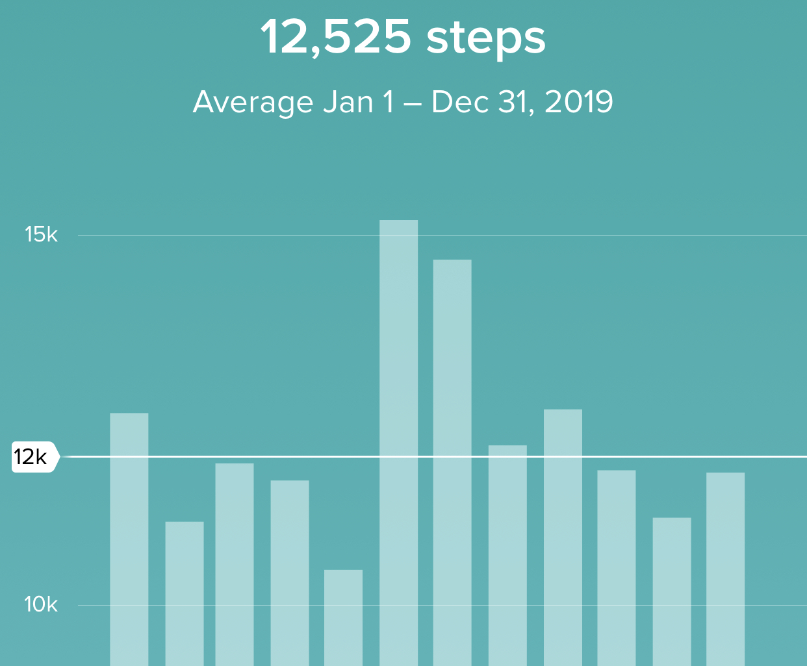
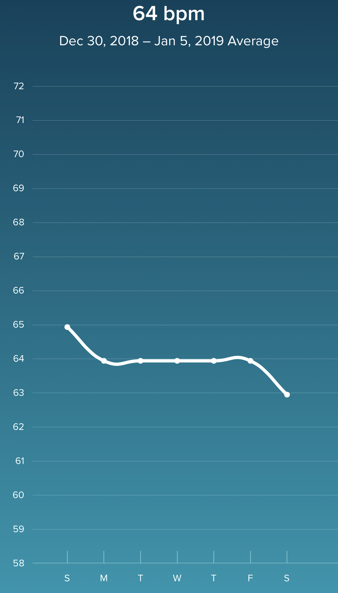
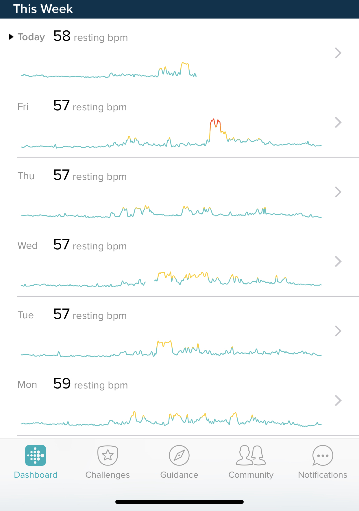
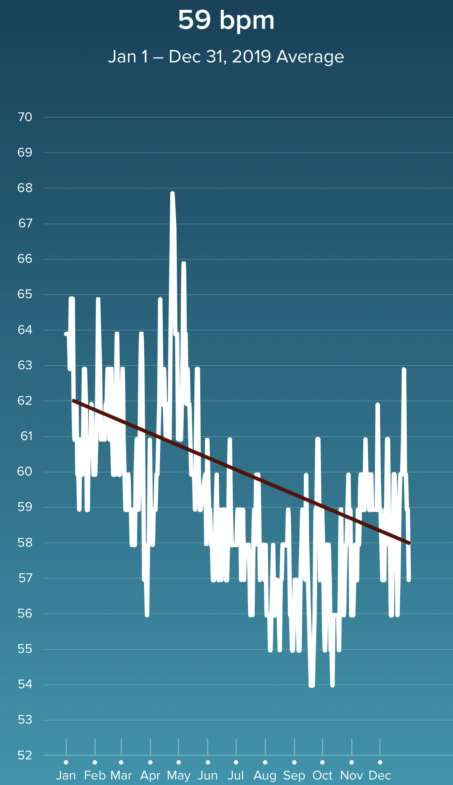

2019 was a really good year.  It’s also the end to a pretty incredible decade. Decadal reviews are the thing to do right now, so maybe I’ll jump on the bandwagon, but for now here’s 2019!

### The Year

Let’s see how I did on these goals:

- 215
- Yoga
- Walks
- Schedules
- 5k
- Duathlon
- Something Longer
- New Project

##### 215

Nope, didn’t get there.  Again.  I hit 229 over the summer.  It felt amazing.  I kept around 232-235 for most of the year and there’s a decidedly positive difference in how that feels to even 240-250.  But I’m still a ways off from where I need to be.  I've proven that I can make a big change in a relatively short amount of time, so I need to hit that extreme again to make it happen.  This will be revisited yet again in 2020.

##### Yoga

I kept this up for a couple of months and did it occasionally thereafter.  As much as I want it to be a thing.. it’s not my thing.  I enjoy stretching and incorporate it every time I run.  But the daily yoga routine is not happening.  This is a failure, but not one I’m particularly unhappy about.

##### Walks

I walked a lot this year.  It wasn’t every day but I’m still very happy with the difference.  This year marked a big step forward in health and fitness and there’s actually evidence in the data.  I got a Fitbit for Christmas last year and wore it all year.  I had one previously for awhile and found it fairly difficult to get to the 10,000 step mark.  Not so this year - I averaged 12,525 per day all year.  



Even cooler to see was the effect that this (and running) had on resting heart rate over time.

Here’s week 1 of 2019:



And the last week of 2019:



And because I’m a nerd, a reasonable looking trendline through all the data:



Fitbit has come a long way and it’s really neat to easily have data like this. I’m hoping to keep the RHR moving down.  RHR turns out to be a [pretty good proxy](https://www.ncbi.nlm.nih.gov/pmc/articles/PMC4754196/) for overall cardiovascular health, so I’m using it as a rough guideline for continued improvements.  

##### Schedules

This is a mixed bag, which makes sense since I was uncommitted.  I did focus on more sleep.  I’ve effectively cut out the TV habit completely (although the phone habit has replaced it), so both bedtime and mornings started earlier.  My daily schedule is better too.  Mornings are structured and I know how and when I'm setup to work on different things.  I’m happy with that.

##### 5K

I never explicitly did a race or set a very fast 5k time.  I did several workout sessions with 5k times in the low 25 range, but I didn’t get into the 24s and definitely didn’t get below 24.  I’ve done plenty of 7:30-7:45 miles this year, but never put it together.

##### Duathlon

But that’s fine because the duathlon went really great this year!  Comparing to the year before is a bit tricky because the first run was longer this year (they screwed up the measurements in 2018 and so it was only like 1.1 miles instead of 1.6).  Given that, I was a bit over 2 minutes faster this year, I averaged 21.0 mph on the bike and averaged 8:45/mile on the runs.  Total time was 1:50:17 and I really couldn’t be happier with this.

##### Something Longer

This was another definite success, and I learned a lot about writing too.  I wrote just over 42k words this year, but more importantly, 3 items were quite a bit longer.  Here’s the stats:

```
   14371 ./2019-07-06-beringia.md
     247 ./2019-03-14-farts.md
     581 ./2019-02-09-threefrustrations.md
     432 ./2019-01-13-artistry.md
     286 ./2019-01-12-signalnoise.md
    9476 ./2019-11-28-education.md
     677 ./2019-10-21-writing-with-keyboards.md
     422 ./2019-07-29-desk.md
    1934 ./2019-01-03-2019goals.md
     525 ./2019-07-07-entrepreneurship.md
     556 ./2019-11-16-simon.md
    1277 ./2019-01-13-carmax.md
     356 ./2019-10-10-50wr.md
    1630 ./2019-12-28-books.md
     666 ./2019-07-21-outrage.md
    8611 ../../../../stories/straight.md
   42047 total
```

- I wrote a short story of 8,600 words (28 pages)
- I wrote a [diatribe on education](/education-backwards/) that was 9,400 words (31 pages)
- I wrote an [essay about climate history and science](/beringia/) that was 14,000 words (50 pages)

All of these were great learning experiences.  The biggest lesson was that the amount of effort and cognitive load doesn’t scale linearly.  In other words, it feels more than twice as hard to write something twice as long.  When you’re trying to build a common story, set of themes, or narrative arc it feels much different when you can’t just load the whole idea in your head.  There’s more re-reading, ordering, and editing.

It also means that I wrote less other stuff.  Despite the longer efforts, my word count didn’t go up much because I didn’t write as many shorter posts - I just had to keep focus on what I was working on.

##### New Project

I think there were two here.  First, I didn’t expect to write any fiction this year.  Then I read _On Writing_ and Mr. King goaded me back into some storytelling.  Almost nobody has read it yet, but I’m pretty happy with it.

I also started a new little tech project, which is of course unfinished and unpublished.  It’s also of course something I didn’t really expect to do.  In other words, I had all these project ideas in my head and I’ve started none of them.  But this one came up as a question I wanted to answer and I started poking around and suddenly it became a populated postgres database with some toy [LiveView](https://github.com/phoenixframework/phoenix_live_view) rendering and such.  We’ll see where it goes because I definitely plan to put it out there at some point.

##### Reading and Curation

I already mentioned in my [list of top books for the year](/books-2019/), but I started reading more vociferously again and it’s been a good change.  In general, I learned a lot about the value of the act of curation in general.  I ran across this Tweet in November, and it resonated:

<blockquote class="twitter-tweet" data-lang="en"><p lang="en" dir="ltr">This was me. I don’t personally use ML-powered recommendations, i.e. no Facebook, Netflix, Spotify, etc. Developing taste is a fun and worthwhile process. Avoiding echo chambers is somewhat necessary to maintain sanity and personality. <a href="https://t.co/QUaMblrism">https://t.co/QUaMblrism</a></p>&mdash; Ash Fontana (@ashfontana) <a href="https://twitter.com/ashfontana/status/1198832383006367744?ref_src=twsrc%5Etfw">November 25, 2019</a></blockquote>
<script async src="https://platform.twitter.com/widgets.js" charset="utf-8"></script>

Developing taste is inherently valuable and is something we’re sort of naturally giving up over time as algorithms take over our lives.  If it’s valuable, it’s something we should pay more attention to and I’ve been keeping more lists of books, music, art, etc.  It’s also why I have an outsized happiness with my own little [Tumble](/tumble).

As an aside, I don’t believe it’s the case that [algorithms are what’s radicalizing our public dialogue](https://osf.io/73jys/).  That feels like an excuse to remove the burden.
