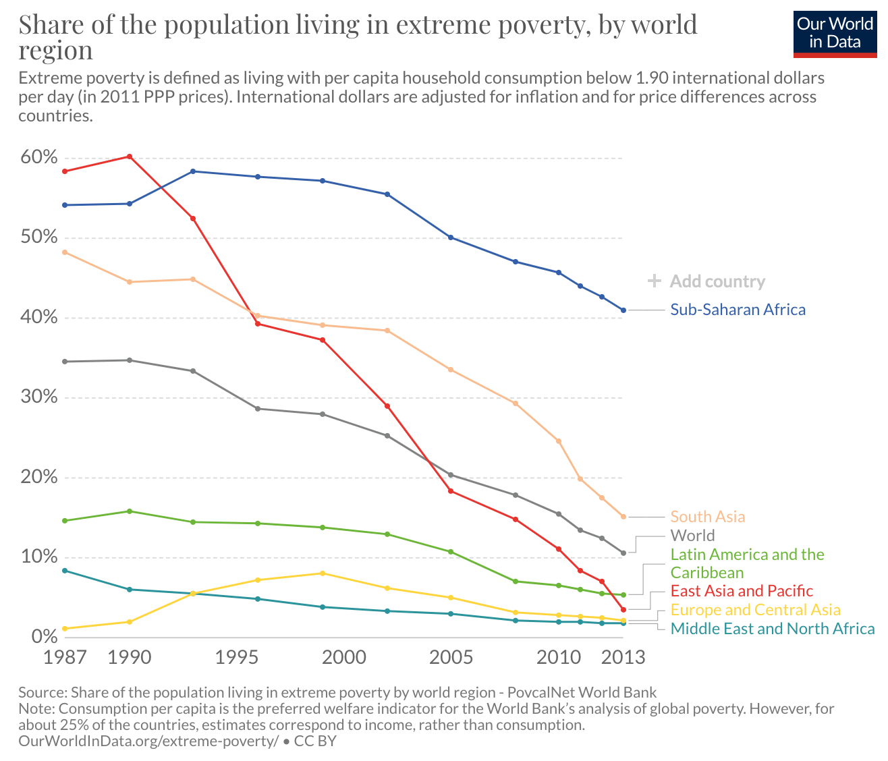
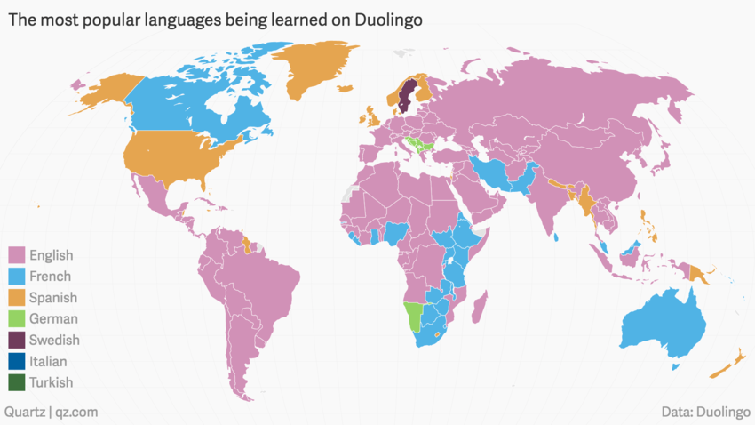
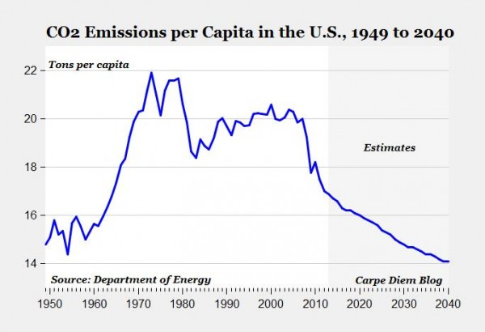
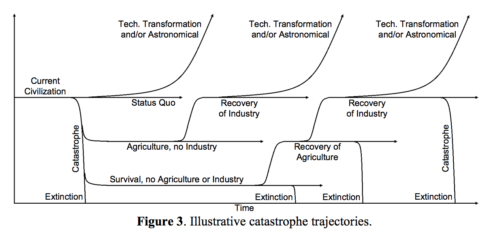

I tried [predictions once](/some_predictions/) ten years ago and [as it turns out](/2010-predictions-review/), I’m very optimistic and predictions are hard.  It’s a useful exercise, and one I’ll try to do on a decadal rhythm.  So here we go again!

### Extreme Poverty Will Be Halved Again By 2030

In 1990, the UN set a goal to half extreme poverty by 2015.  Even by [conservative measures](https://www.politifact.com/factchecks/2016/mar/23/gayle-smith/did-we-really-reduce-extreme-poverty-half-30-years/), the mark was hit early.

A huge component of the drop happened in Asia, driven by China embracing capitalist methods while dropping everything but authoritarianism from their socialist principles.  Thirty years ago, one of the big questions was whether we had enough raw resources and materials for all the billions of people in the world to have a reasonable standard of living.  We’ve now answered with an unequivocal "Yes".  Not only are there less poor people today than thirty years ago, but we also added over two billion people to the population total in the same time.  

This forces us to re-ask the question: what causes extreme poverty in 2020?  The answer appears to be bad governments and lack of capitalist incentives.  The [main problems](https://en.wikipedia.org/wiki/List_of_countries_by_percentage_of_population_living_in_poverty) lie in sub-Saharan Africa and the [ex-USSR](https://en.wikipedia.org/wiki/Uzbekistan) states in Asia with shaky or corrupt governments.  And in the new world, [Honduras](https://en.wikipedia.org/wiki/2009_Honduran_coup_d%27%C3%A9tat) had a coup in 2009, [Suriname](https://en.wikipedia.org/wiki/Suriname#21st_century) still has after-effects from the coup in 1980, and the whole world is familiar with the state of the [Venezuelan affairs](https://en.wikipedia.org/wiki/Venezuela#Nicol%C3%A1s_Maduro:_2013%E2%80%93present) after corrupt socialist rule.

What will be critical over the next ten years is how NGOs, charities, and more wealthy parts of the world manage the next phase of this problem.  It’s not sufficient to send money to these areas of the world.  It won’t make it to the people who need it and it won’t trickle down either; it probably never did.  A lot of these areas are resource rich but geographically poor.  Constructing lasting and valuable societal infrastructure in most parts of sub-Saharan Africa is far more difficult and costly than other places based on topography, climate, and weather.  It’s also arguable whether this is good for the world, as we are all rightly concerned about climate, ecological diversity, and the elimination of natural habitats.  Both South America and Africa represent enormous swaths of untouched land and significant diversity.  

One of our biggest challenges will be to find algorithms that effect the policy and societal changes needed to eliminate the rest of poverty.

### Nothing Much Happens With AI For At Least Ten Years

AI right now is one of the most over-discussed topics in tech.  What the general public thinks of is called AGI or [artificial general intelligence](https://en.wikipedia.org/wiki/Artificial_general_intelligence).  I think we’re _decades_ away from this, at minimum.  

On the other hand, a lot of people use the term to mean [Machine Learning](https://en.wikipedia.org/wiki/Machine_learning), and there’s loads going on in that field.  We’re getting [much better](https://fakejoerogan.com/) at [producing models](https://thispersondoesnotexist.com/) for all sorts of [specialized applications](https://towardsdatascience.com/can-machine-learning-read-chest-x-rays-like-radiologists-part-1-7182cf4b87ff) with an ever-increasing amount of training data.  That’s really great, and it has the potential to revolutionize fields like medicine and transportation.  But the potential tie between machine learning and more generalized forms of intelligence is overstated at best.

The only thing that’s going to happen around AGI in the next ten years is that the public may start to understand the gap between the two as machine learning applications become increasingly prevalent.

### Fossil Fuel Scarcity Won’t Be A Problem During Our Lifetimes

This isn’t to say it’s not time we move away from fossil fuels.  We need to and we will.  But most people still have a [peak oil](https://en.wikipedia.org/wiki/Peak_oil) hypothesis in their heads that everything will run out at some point.

It won’t.

Why don’t I think so?  Well, there’s a couple of reasons.  First, I think Tommy Gold had it right and there’s a significant amount of hydrocarbons (especially methane) living in the mantle.  This is known as the [abiogenic theory](https://en.wikipedia.org/wiki/Abiogenic_petroleum_origin#Foundations_of_abiogenic_hypotheses) and it means that there will always be more.

Second, it’s precisely _because_ we will move away from fossil fuels that this won’t be a problem.  Nuclear, wind, solar, and hydroelectric will all continue to make gains in efficiency and reductions in price until they’re cheaper and better than most fossil fuels.  

Coal, oil, and gas will likely be a huge component of energy use for decades to come.  So to state this more precisely, let’s take a look at the inflation adjusted price of oil per barrel over the last 150 years.

Oil prices won’t go over an inflation-adjusted price of $200 per barrel in our lifetimes.  On the other hand, gas prices at the pump will go up steeply.  This will be driven by government tax and policy to incentivize the shift away from fossil fuels.

### Two Billion Speakers Each for Chinese and English By 2030

The [statistics](https://en.wikipedia.org/wiki/List_of_languages_by_total_number_of_speakers) for English and Mandarin are interesting.  They are the only two languages in the world with over a billion speakers today.  What’s interesting is how that’s broken out:

| Language | First Language Speakers | Second Language Speakers |
| -------- | ------------------------| -------------------------|
| English | 379 million | 753.3 million |
| Mandarin | 917.8 million | 198.7 million |

Most people that know English know it because they have to know it, not because they were born speaking it.  On the other hand, most people that know Mandarin grew up speaking it because they were born in China.

What I’m really trying to say with this prediction is that English and Chinese have won.  As globalization increases, the need for common languages increase and the most popular languages will far outpace the others.  By 2030 I believe the second language portion of Chinese will be growing rapidly.  

This seems simple, but it’s actually a brash prediction.  If you look at what people are learning, Chinese isn’t even on the list:

And looking at a geographic map of popular languages - all of which are as [simplistic as they are inaccurate in detail](%20http://www.geocurrents.info/cultural-geography/linguistic-geography/misleading-language-maps-on-the-internet) - you can still see how much geography matters.  There’s large contiguous pockets of Arabic, Hindi, and French:

So what I’m predicting isn’t just a spread of language.  It’s a spread of culture.  Given the map above, a lot of the world wants to learn English; it’s become the primary lingua franca for a huge chunk of the world.  For Mandarin to do the same means China will continue to be more open.  The [Open Door Policy](https://en.wikipedia.org/wiki/Open_Door_Policy) would need a 21st century stage and the [Belt and Road](https://en.wikipedia.org/wiki/Belt_and_Road_Initiative) will need to grow and push culture out.  Can they do this?  Remains to be seen; it’s a huge task.  _Actually_ doing it probably means less authoritarianism and more democratic process, which would be a very good thing all around.  Hopefully the US - and the rest of the world - continues to pay very keen attention to how this happens.

Separately, I wonder what’s going to happen with Hindi and Spanish.  India is expected to pass China as the most populous country by 2030.  There’s no question that both languages will continue to have a huge number of native speakers.  But many people that grew up knowing Spanish or Hindi will likely also know English or Mandarin.

### Home Automation Is At Least 5 Years Out And Needs An Open Standard

Google and Amazon and Apple are all trying to own all of your home devices.  If it weren’t for attempts to push vendor lock-in, we’d all be living in better homes by now.  As it is, selecting products and brands and actual _things_ that you want to work in your home is difficult at best.  The interfaces are all different too - the closest I’ve seen that provides a unified interface is [ActionTiles](https://www.actiontiles.com/) and it’s completely custom (and I’m dubious at how good a job it really does).

I think we’re really five years out from this becoming commonplace, and that’s assuming an open standard begins development, like, right now.  Which is something I’m happy to report is actually happening.  The new [Connected Home Over IP](https://www.connectedhomeip.com/) standard has all of Amazon, Google, and Apple on board.  So there’s a real chance of this happening.  If it really has legs, maybe it will be faster than five years.  All of the behemoths have to get along.  So I doubt it.

### Voice Interface Applications Will Remain Peripheral

For decades now, voice has been portrayed as a killer app.  And the time for it is always just around the corner; in just a couple of years you’ll be able to do everything you wanted by talking to your computer.

Now, it feels like a part of that might actually be true.  Abundant training data and better machine learning has made these models a lot better.  Lots of people talk to Alexa or Siri or Google.  But if you really think about it, how people use voice is still very specific.

Voice’s primary use is in one-off queries.  Siri, show me directions to New York City.  Google, how fast can a cheetah run?  Alexa, what’s the weather today?  Add any state or multi-step processes and using a voice interface starts getting messy.

Furthermore, most of the time when voice is used it’s because a keyboard is not an option.  I use voice to search on my Apple TV because typing is a pain in the ass.  But when a keyboard is available, anyone that can type well usually does.

Finally and most important, power users don’t use voice.  Developers, business-minded folks, or really anyone that is using a computer to perform complex operations doesn’t use voice to do any of that.  They use a keyboard and a cursor.  And until a [direct brain-computer interface](https://www.neuralink.com/) gets good enough, they always will.  

So voice interfaces will remain only a useful novelty for one-time, stateless interactions with a computer for the foreseeable future.

### Quantum Computing Will End Up Being Not That Big Of A Deal

Right now, there’s a lot of fear and uncertainty around quantum computing.  But in the long term, quantum computing is cool and useful, but not scary.

A lot of the fear is based around the fact that quantum computing nullifies almost all [common encryption schemes](https://en.wikipedia.org/wiki/Post-quantum_cryptography) used today to protect sensitive information.  So with a proper quantum computer, you could break the encryption of almost any protected system today trivially, including governments, banks, etc.

We’re still searching for confirmation of [quantum supremacy](https://en.wikipedia.org/wiki/Quantum_supremacy), and to be clear, I believe the abilities of quantum computers will open up new windows of computational capacity for us.  But they won’t pose the kinds of problems that most people are really worried about.  The concern around quantum computing is one of relative power, which makes this a [fallacy of composition](https://en.wikipedia.org/wiki/Fallacy_of_composition).  

The best explanation I’ve heard for this comes from [Bryan Caplan](http://www.bcaplan.com/) who asks you to imagine you are in a crowd in a stadium and everyone is sitting down.  If you stand up, you will briefly have a much better view than everyone else around you.  That is until more people start standing up, and more, and more, until everyone is standing and you end up right back where you started.

Quantum computing is only a danger during this transitional phase when it’s expensive and hard to build.  Assuming they eventually go the same way as standard computing capabilities then they will one day be cheap and ubiquitous.  And everyone will be back on the same playing field.

### 2024 Presidential Predictions

Everybody is talking about 2020, so let’s talk about 2024.  A month ago, it seemed like Trump was a shoe-in to win again.  Bernie Sanders is an outright communist and I can’t imagine the US electing him President.  Now Biden is surging - a very smart move by the Democratic party and don’t pretend that this wasn’t coordinated - and the stock market has tanked.  The playing field looks much different and much more even.

So here’s my 2024 prediction:
- If Trump wins, the 2024 President will be a career politician.
- If Biden wins, the 2024 president will not be a career politician.

PG wrote long ago that [It’s Charisma, Stupid](http://www.paulgraham.com/charisma.html) that wins presidential elections.  He’s right, although I think we could generalize that even more into some sort of social mystique.  Back when he wrote that it was still the TV Age and all that mattered was the minute long video that showed up on the 6 o’clock news.  Today we’re peppered with little rays of political personality all over the place.  It’s on YouTube, on TV, on Twitter, on Instagram, on Facebook.  If people are crazy enough, they can watch hours and hours of every political rally Trump puts on.  Or Sanders.  Or Warren.  Or whomever.

People _liked_ that Trump was an outsider in 2016.  Now that he’s been around for a few years, people like the idea of a stable, noble,, august and, well, presidential President.  

But we’re fickle.  And whatever we want now, we’ll want the opposite in four years.

### US Hegemony Continues

If the Presidential election is about charisma, stupid, then nation-state power has a corollary:

It’s geography,  stupid.

I never realized this until reading [Prisoners of Geography](https://www.amazon.com/Prisoners-Geography-Explain-Everything-Politics/dp/1501121472).  It is undeniable that some locations carry great advantages over others.  And the United States has the best in the world.  You’ve seen it before, but take another look:

We have expansive access to the two biggest oceans in the world.  This is critical for shipping and commerce, with direct access to both Europe and Asia.  And the oceans provide military access that other nations clamor for.  Russia has gone through great efforts to hold access for it’s [Northern](https://en.wikipedia.org/wiki/Severomorsk) and [Baltic](https://en.wikipedia.org/wiki/Kaliningrad_Oblast) fleets.  They may even consider [some ports](https://en.wikipedia.org/wiki/Port_of_Sevastopol) worth [annexation](https://en.wikipedia.org/wiki/Annexation_of_Crimea_by_the_Russian_Federation).  Meanwhile, China is literally building new islands to stake a [claim on significant rights to the South China Sea](https://en.wikipedia.org/wiki/Territorial_disputes_in_the_South_China_Sea).  We take it for granted, but we have literally hundreds of miles of water to both our east and our west.

Next, consider the strategic impact of Hawaii and Alaska.  Through Hawaii we can stretch our influence all the way across the Pacific.  Alaska provides additional Pacific and Arctic reach and huge amounts of natural resources.  We are [number one](https://en.wikipedia.org/wiki/List_of_countries_by_oil_production) in the world in oil production and [number two](https://en.wikipedia.org/wiki/List_of_countries_by_natural_gas_production) in natural gas production.

And finally, the lower 48 have many positive properties as well.  We have only two borders, Canada to the north and Mexico to the south.  Both are relatively large, stable, Westernized allies.  The middle of the country is filled with incredibly [rich farmland ](https://en.wikipedia.org/wiki/Breadbasket#North_America) that is navigable and connected by the [Mississippi River Basin](https://en.wikipedia.org/wiki/Mississippi_River#Watershed).

In geography alone, there just isn’t another country in the world quite like it.

And aside from that, we have another secret weapon.  We have the Declaration of Independence and the Constitution.  It’s hard to overstate the importance and value of these two documents, produced as they were by a bunch of farmers in a backwater city in the 18th century.  They are undeniably amazing.  They capture not just the right values, but the right way to get the right values: with freedom, even from [majorities](https://en.wikipedia.org/wiki/Federalist_No._51).  As George Will said:

> “America had an exceptional revolution, one that did not attempt to define and deliver happiness, but one that set people free to define and pursue it as they please.”

Freeman Dyson, one of my personal heroes, said in a [talk on heretical ideas](https://www.edge.org/conversation/freeman_dyson-heretical-thoughts-about-science-and-society) that he believed America has less than a century left as the top nation.  He said we would start declining and go the way of Britain, France, and Spain before us.  I disagree.  The United States isn’t going anywhere for a long time.  Unless we cede either our land or our ideals, we will remain something very special in the world for a very long time.

### The Future of the Business of Computing: Part 1

Just a couple months ago, we had the [first day in history](https://qz.com/1777889/apple-microsoft-amazon-alphabet-now-worth-combined-4-trillion/) where this country has seen FOUR trillion dollar companies [at the same time](https://www.wsj.com/articles/alphabet-becomes-fourth-u-s-company-to-ever-reach-1-trillion-market-value-11579208802).  They were:

- Microsoft
- Amazon
- Google
- Apple

In case you hadn’t noticed, that spells MAGA.  I don’t know which group this is more ironic for - the anti-Trumpers or the people that believe a President can very fundamentally drive the economy.  Either way, it’s great.

These four are a part of [Big Tech](https://en.wikipedia.org/wiki/Big_Tech).  FAANG is another common acronym, although I definitely prefer my MAGA big four for the red and spluttering faces it can cause.  

My contention here is that Big Tech is here to stay, roughly in it’s current form.  Google, Amazon, Apple, Facebook, Microsoft, and Netflix aren’t going anywhere. They’ve each found a piece of human capital that has been underserved for most of human history and monopolized it.  They’re the top of the market.  In 10 years, they’ll still be at the top of the market, possibly joined by 1 or 2 others like Stripe.  Ten years is long enough for big tech companies to die (right Yahoo!?), but these won’t.  They’ve all demonstrated an acumen, strategy (including acquisition), and, quite frankly, ruthlessness that will keep them growing.  

More precisely, the big four that were a trillion dollars in valuation in early 2020 will have at least a combined $5T market cap in 2030.

### The Future of the Business of Computing: Part 2

On the other hand.. the ability for people to build things is increasing exponentially.  I talked about this in [Leaf Nodes](/leaf-nodes/), but there’s more to say.  

Engineers have been special because we can take complex ideas and make them a (complex) reality.  This skill is slowly being democratized from computing outward.  [Software is eating the world](https://a16z.com/2011/08/20/why-software-is-eating-the-world/).  And the rise of no-code tools is expanding the set of people that can start a business.

The [portrait](https://www.indiehackers.com/) of an [entrepreneur](https://www.starterstory.com/) [is](https://getmakerlog.com/) [changing](https://earnestcapital.com/).  The amount of capital and investment required is diminishing.  And there will be at least an order of magnitude more of them in the future.  You will know people that have started or work at a small computing company with less than 10 people.

### The World Will Be Better

I started this list with an optimistic prediction and I want to end on one too.  There’s a lot of doom and gloom floating around right now.  In large part, this is because of the fracturing role that mainstream media holds in our pantheon of institutions.  But it’s time to clear the air.  Let’s look at a few graphs.

Infant Mortality per Thousand Births

CO\<sub\>2\</sub\> Emissions Per Capita

GDP Per Capita over Centuries

Death Risk from Climate Catastrophe

Life Expectancy

Matt Ridley declared the last decade to be [the best in human history](http://www.rationaloptimist.com/blog/best-decade-in-history/).  It’s hard to argue with that.  We are healthier, wealthier and more educated than ever before.  Many of the new problems of the first world - like obesity, diabetes, and depression - are problems of abundance not scarcity.  And the developing world is catching up faster than ever before, which is fantastic.

I found [a paper](http://gcrinstitute.org/papers/trajectories.pdf) recently by a consortium of economists (including Robin Hanson) that takes a long view on where human civilization is going.  It contains this amazing chart:

That’s it.  That encompasses all of the options we have.  We still have a lot of troubles and problems ahead of us.  We need to deal with many huge new challenges in our world.  We need to manage our entire planet as an ecosystem.  We need to continually decrease our energy expenditure while increasing our GDP, a process known as dematerialization.  But we will.  We’ve never been a particularly static species, especially over the last 500 years.  Small yearly growth rates lead to exponential curves, as long as we avoid world-destroying catastrophes.

So my last prediction is to echo the economist, [Julian Simon](https://en.wikipedia.org/wiki/Julian_Simon):

> This is my long-run forecast in brief: the material conditions of life will continue to get better for most people, in most countries, most of the time, indefinitely.
