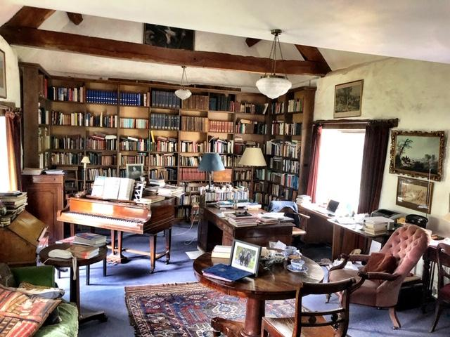
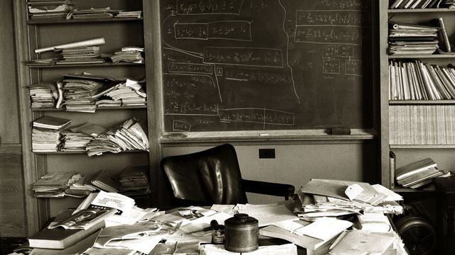
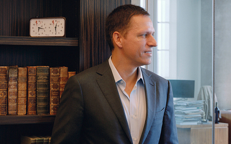
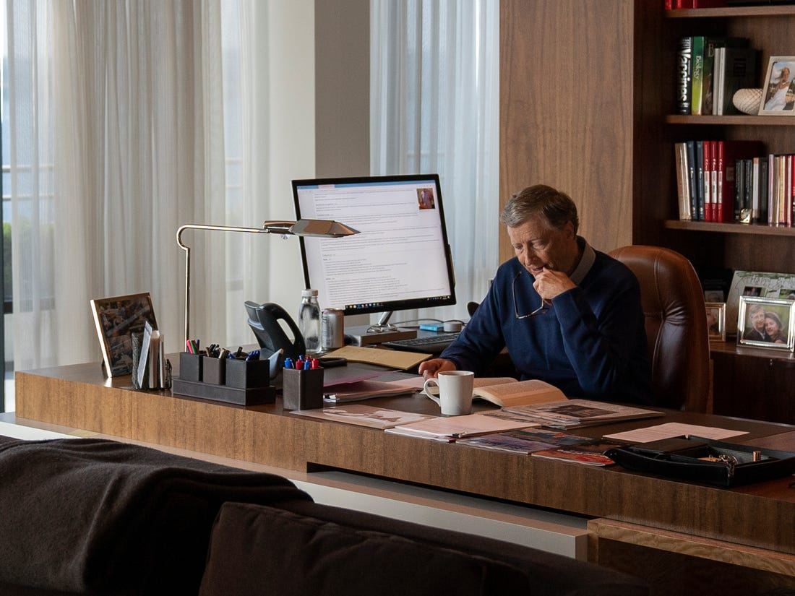

Sir Roger Scruton died in January at the age of 75.  I had the opportunity to see him speak once in DC, long before I read anything by him.  He was funny, brilliant, and unapologetically British.  I still remember one of his high-brow jokes from that evening:

> “It’s important to note that the Church of England is defined not by the first word of its name, but by the third.  Which means that all the bishops of the Church of England can essentially be atheist and still carry the main article of the faith!”

A few weeks after his death, I was talking with my wife about what I wanted in a home office and I stumbled on this Twitter thread.

<blockquote class="twitter-tweet">
Pic 1 - Typical &quot;man cave&quot; from the postmodern era   Pic 2 - Classical ”man cave&quot; (Sir Roger Scruton&#39;s office/study) <a href="https://t.co/HwD4mAeBt0">pic.twitter.com/HwD4mAeBt0</a>
&mdash; Josh (@JoshLeCash) <a href="https://twitter.com/JoshLeCash/status/1217219968820891648?ref_src=twsrc%5Etfw">January 14, 2020</a></blockquote> 

---

This was Sir Roger’s office:

Since we had also been fighting about how many books we have in the house (and I use the term ‘fighting’ pretty loosely - but ‘vigorous and spirited debate  interrupted by laughter’ doesn’t have the same ring), I sent the picture to Maureen.  _This_, I said, _is what I want in an office.  Books everywhere, desks to write or draw, and places to sit and read and think._

In addition to being brilliant, Scruton was also an antiquarian; he loved fox hunting and opera and this room looks the part.  You don’t need to have an office that looks like it was plucked from the 18th century (although I personally like a little bit of dust).  But when you start to look around a bit - if you can find an honest depiction - you start to sense a theme.

Here’s Einstein’s office:

A small glimpse at Peter Thiel’s.  Note the piles of paper.  And there’s the chess clock’s primacy on the shelf:

And Bill Gates (just a bit neater):

Places to sit and think.  A desk, sometimes with a computer (but to the side).  And above all, books and papers.  The Twitter thread above called Scruton’s office a man-cave, but that’s not how we think about a man-cave.  In the modern vernacular, a man-cave is a place to hang out, watch sports, drink beer, and play pool.  I’m all-in for all of those activities, but in our rush to  capitalize on our ultra-lux leisure activities we’ve also culturally jettisoned one of the most satisfying elements of our humanity.  

Whether on our own or with others, how often do we just sit and think?

#### Slowing Down

We’re a couple of weeks into the Great Coronavirus Episode of 2020 (TM) and I’ve been spending a lot more time this week in my office.  The rest of the family is safely ensconced in Delaware - which has both pros and cons; I miss them dearly  - and I’ve been trying to take advantage of the opportunity and make some habits.

Each day I get my cup of tea and clop downstairs and settle into the chair in my office.  I’ve moved books and my chair more times than I’d like to admit and I’ve brought in a heater because the basement is cold.  I’ve fiddled with how things are laid out on my desk.  I’ve also wasted plenty of time following some thread of thought online, or toying with paperwork that doesn’t matter, or doodling on one of my uncountable pads of paper.

And yet it doesn’t feel wasted.  It feels like the accumulation of at-bats and swings you need to take before you hit a homer, or even just a single to right-center field. I’m settling into the batter’s box, learning more about how my office should feel, and taking practice swings.  Thinking and building from the things you think is like a game of baseball.  You need to build a rhythm.

The rhythm is coming.  I’ve finished reading two books this week and I’m halfway through one more.  I’ve gotten some actual paid work done.  I’ve written several thousand words and finished some much-needed editing.  I’ve also done some coding, which was a welcome reminder that those skills haven’t entirely atrophied and are ready and waiting when chunks of time and attention are yet available.

This isn’t meant as a litany of success; in fact it’s decidedly not.  One of the books I’m reading is the first Percy Jackson, a series meant mostly for teens.  The written words, when they’ve come, have been excruciatingly slow and infuriatingly disordered and I’m thinking about abandoning a storyline entirely.  The coding is relatively simplistic and on a project that’s of no major import to anyone.

But it’s been intellectually stimulating.  It’s made my brain work.  It’s been _fun_.

Here’s another thing I’ve been doing every day.  I’ve been taking long walks.   On the rainy days I’ve got the neighborhood and the blooming cherry trees to myself.  And on days when the sun is out so is everyone else.  Adults are walking when they’d usually be working.   Kids are riding their bikes more than ever before.  Parents are playing with their children, or teaching them to rollerblade with a steadying hand on their back, or drawing chalk cartoons with them on the sidewalk.  Older people are out too, staying away from others and staying safe, but they’re out enjoying the flowers of spring or riding the bike they grabbed out of the back of the shed for the first time in years or pulling weeds in their gardens.

The death and economic destruction of this pandemic is obscene, and we all need to keep doing our part.  Keep staying healthy, keep staying away from everyone so that the spread will fade, and keep praying for the healthcare workers on the front lines.

At the beginning of all this, I overheard a lot of people talk about going stir-crazy.  “How am I going to work all day?” or “I’m going to go crazy with the kids home from school for weeks.”  Things like that.  They were taking it seriously, and they were ready to stay home and social distance, which was good.  But they mostly weren’t worried about the death and economic destruction.  They were worried about their day-to-day schedule and life.  And I couldn’t help but wonder if there isn’t a silver lining in this pandemic for those it doesn’t touch directly.  

This has been in the back of my brain all week.  I shared a quote with some of my closest friends by text a few days ago:

> “All of humanity's problems stem from man's inability to sit quietly in a room alone.” — Blaise Pascal

Considering that I’m home alone and the rest of them are all saints taking care of a combined 33 kids mostly under the age of 13 at home, I think it was more than a little bit tone-deaf.  Which is about par for the course.  I’m pretty tone-deaf sometimes.

But there’s a truth in the quote that resonates for all of us in some way.  We shuttle our kids from activity to activity and shy away from a real relationship with them.  We flit from one newscast to another and escape a deeper reading of the topic.  We snap a single Instagram take on the rebirth and happiness of Spring and forget to just sit and watch the flowers grow.  We hide our insecurity and emptiness behind the artifice of our life.

And now, for many, the artifice has crumbled.  Our frenzied activity has slowed to a crawl.  Other than our homes and social media, we have nowhere to be or to be seen.

In the microcosm of my anecdotal neighborhood experience, it’s been wonderful to see all the long walks, the bike rides, the laughter with children, the gardening.  In contrast to the death and destruction and overzealous negative hype of the media, the hope and change available right now in our every day life is the hope and change we always dream of.  And people seem to be taking advantage of it.  What new projects, new companies, new books, new poems, new plays, new music, new hobbies, new gardens, and new or renewed relationships are happening right now?  Spring is the season of rebirth and there’s never been a better occasion for us to be agents in our own future.

> Hope springs eternal in the human breast;
>
> Man never Is, but always To be blest.
>
> The soul, uneasy, and confin'd from home,
>
> Rests and expatiates in a life to come.
>
> — Alexander Pope

#### The Life of the Mind

In case you were wondering, the word “expatiate” in that poem means “to speak or write at length or in detail.”  There’s an advanced level of poetry that you attain when you can use a word like expatiate in verse.  Achievement unlocked Mr. Pope!

We are all meant to conjure from the mists of the future the life we can dream in our heads.  This is an endemic human trait, and an emphatically cerebral one.  It’s called the life of the mind because it all starts in our heads, in the creative consciousness given to us by a mysterious God.  What could be a more fitting and natural way to approach the divine than to imitate an act of creation that we still question?  Why _are_ we here?  Why does existence.. _exist?_  Billions of years of existence and we still don't know.  

Some of us take the idea of imitating creation literally.  Tolkien certainly did.   His concept of Sub-creation was behind the spectacle and the depth of Middle-Earth.  Writers, painters, and other creatives all try to create their own worlds and telepathize them into the minds of others.  I’ve always been drawn to this, and what I learned this past week is that the schedule of a writer is the kind of life of the mind for me.  It’s not unlike that of a software engineer, except perhaps that the constructions you build in your head are more abstract.  It takes time and space to wrestle with patience and skill and build visions out of words that will be unlocked in the minds of others.

The life of the mind can conjure more than just words and worlds.  It can build the future we want to see and the future self we want to be.  It can take the form of hobbies, drawings, metalwork, writing, doodles, software, model rockets, or plans for our family.  It can help change the way our body looks, hatch a new charity, launch a new company, or simply bring us the sheer joy of discovery.  And we can live the life of the mind with others; first by reading and conjuring on our own.  Then by being willing to share, which leads to lively and deep conversations over a cigar, a whisky, a coffee.  Or over a spaghetti dinner with our kids.

The Great Coronavirus Episode of 2020 (TM) is a chance for us to recapture the potential we have to live a life of the mind.  For most of our history, life was too nasty, brutish and short for most people to participate.  As the wealth of the world has increased dramatically through the ages, more and more people have had the time and space to live a life of the mind.  

But the speed of life has increased too, and we’ve been perfectly willing to amputate our thoughts and transplant the mental processes of the external world to cover up the scars.  We hide our own political opinions behind pundits on CNN and Fox News.  We rely on and feed from the groupthink on Facebook and Twitter.  We take the triumphs and failures of sports teams as our own and let them fill our emotional tank.

There’s nothing wrong with any of these things in small doses.  There _is_ something wrong with them forcing the atrophy of our own thoughts and dreams for the future.  Right now, there's time to reconsider the balance.  To read more, to draw, to play with our kids, to take long walks or garden (and don’t kid yourself, these activities are as cerebral as they get); in short, to think.  Our lives and the world will be richer for it.

We have the time.  We need to make sure we have the space too - a study, a library, a favorite bench and chair in the back of the garage.

I’ll be working on my office.

#### An Exhortation On Reading

Re-reading this essay so far, it has turned out to be highly opinionated, and probably arrogant too.  C’est la vie; that’s a mark against my writing and you’re probably right on.  The point is that we all have the capability and the drive to make real in the world the visions that start in our head, and that we will all be better off for trying it.

But regardless of _what_ exactly we want to conjure in the world, there’s a common activity that underpins all of it.

_Reading._

Reading is one of the most magical activities humans can participate in, right up there with eating and sex.  It is the best form of telepathy we have, where one person can start a thought and have it complete in the mind of another.  Stephen King, whose idea of telepathy I’m regurgitating, gives an example in _On Writing_:

> “Look- here's a table covered with red cloth. On it is a cage the size of a small fish aquarium. In the cage is a white rabbit with a pink nose and pink-rimmed eyes. [...] On its back, clearly marked in blue ink, is the numeral 8. Do we see the same thing? We’d have to get together and compare notes to make absolutely sure, but I think we do. There will be necessary variations, of course: some receivers will see a cloth which is turkey red, some will see one that’s scarlet, while others may see still other shades. [...] The most interesting thing here isn't even the carrot-munching rabbit in the cage, but the number on its back. Not a six, not a four, not nineteen-point-five. It's an eight. This is what we're looking at, and we all see it. I didn't tell you. You didn't ask me. I never opened my mouth and you never opened yours. We're not even in the same year together, let alone the same room... except we are together. We are close. We're having a meeting of the minds. [...] We've engaged in an act of telepathy. No mythy-mountain shit; real telepathy.”

Other mediums can get close.  Good movies or TV can build a world rich in form and detail, but they do all the hard work for us.  They leave less to the imagination and so end up more passive than a book.  Plays, opera, and musicals are better still.  But reading is for our minds what the back squat is for our bodies; it builds more mental muscles more quickly than any other exercise.

Reading does more than just exercise our imagination.  It’s also a process of metamorphosis.  Our universe is wildly complex and full of detail and nuance.  So much so that it can take hundreds of pages (or more!) to properly capture a single subject.  Some things can only be understood well with this level of investment.  If you believe this to be true, then there’s a startling conclusion.  

People that read live in an entirely different world than people who don’t.

Literally, a different world!  The veneer of ideas gains depth from reading that can be found nowhere else.  For better or worse, every time I hear of someone that doesn’t read, I think of this line from _Hamlet_:

> There are more things in Heaven and Earth, Horatio, than are dreamt of in your philosophy.

And it’s not just the detail and completeness of the ideas that are built, it’s also the _types_ of ideas reading let’s us entertain.  Aristotle said “it’s the mark of an educated mind to be able to entertain a thought without accepting it.”  It’s easy to dismiss a sound byte from a personality on the other side of a shallow opinion.  It’s a different thing altogether to understand and able to accept or reject a well-reasoned and detailed argument.

Which is why when we read, we should also read heterodox thinkers.  We’re already fed the mainline thoughts and opinions in whatever media we decide to consume.  Authors that have arguments counter to prevailing thought have a larger task to fulfill in their writing and, by definition, need to provide a fuller view of the topic.  Just like our world expands by reading _at all_, our world expands even further by reading authors we’ve been told not to agree with.  

One of the dangers of our modern age is the way our society segments by opinion. We no longer entertain or even tolerate those who disagree with us and we end up in an [echo chamber](https://en.wikipedia.org/wiki/Echo_chamber_(media)) of our own - or worse yet, others’ - opinions.  By reading well and widely we counteract the siren of the echo chamber and encourage free thinking in ourselves and others.

For all of these reasons, reading is the most vital activity for an active and fulfilling life of the mind. A life of the mind is something all of us need to foster. And right now many of us have the time.
