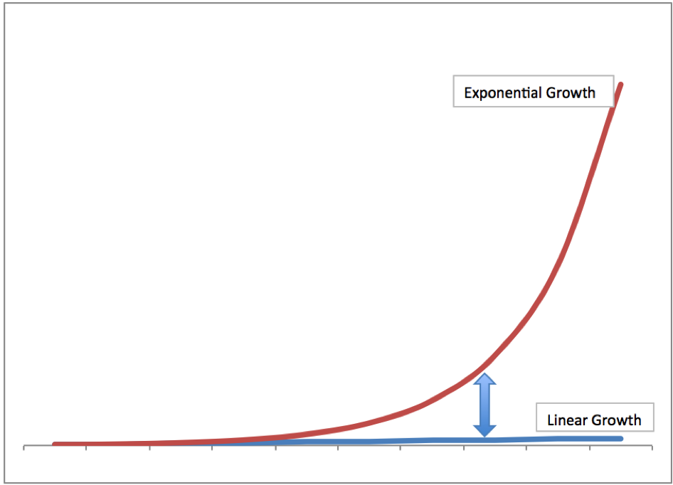
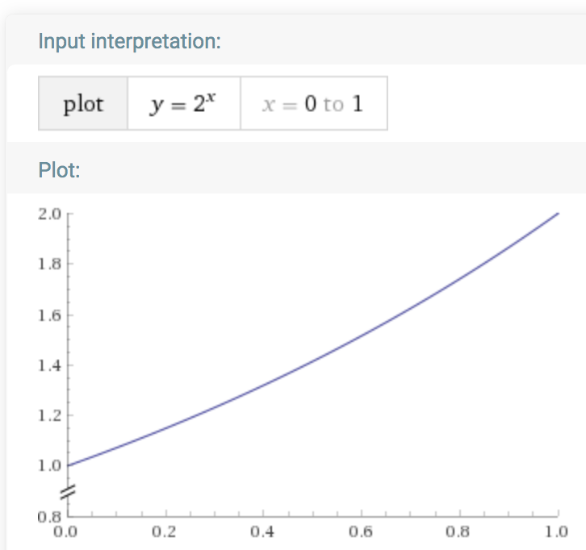
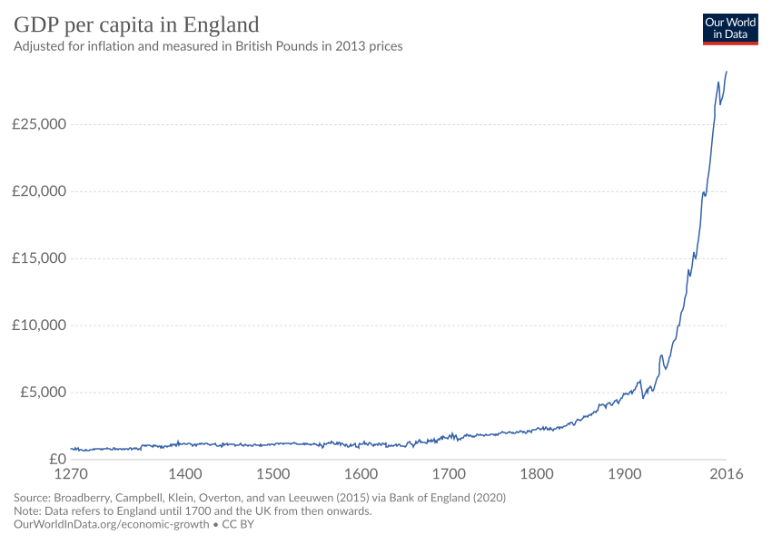
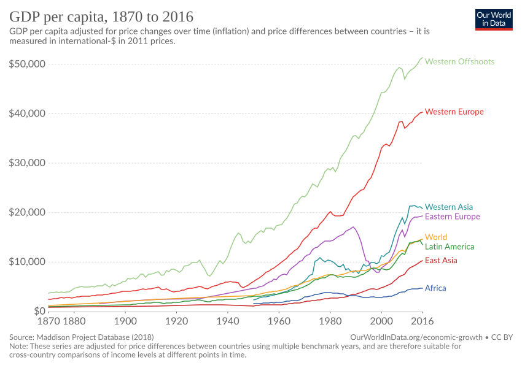
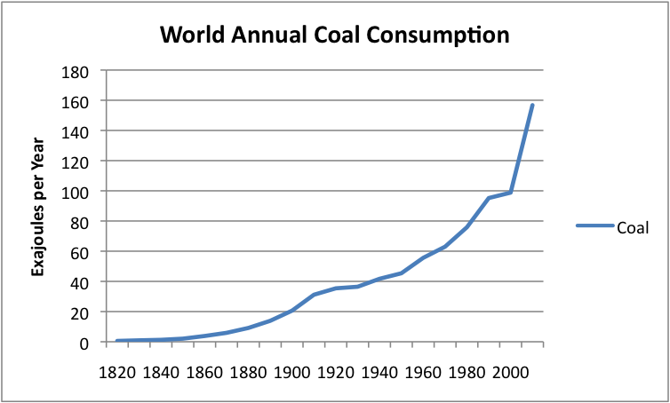
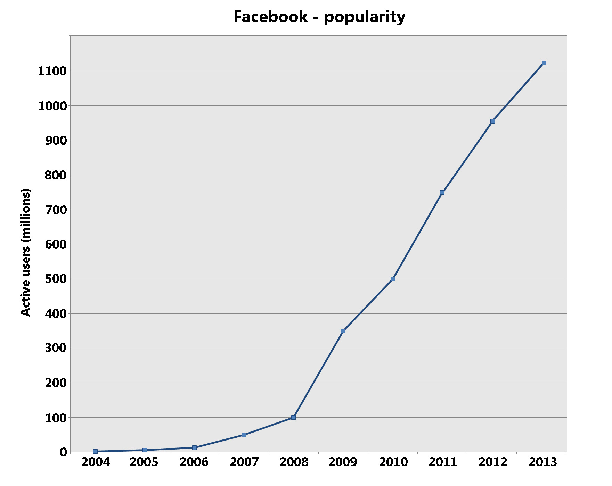
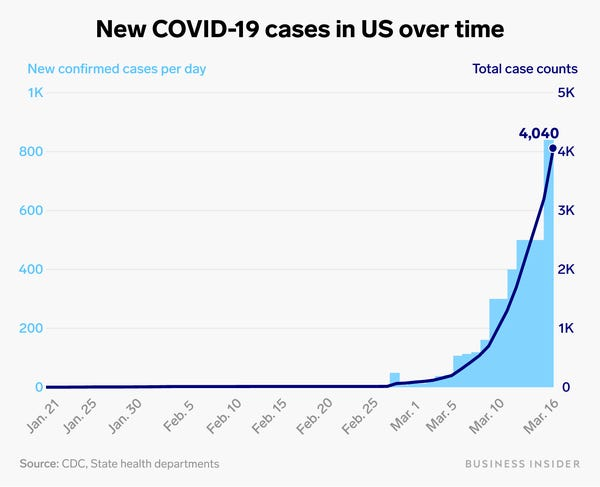

## Exponentials

I’ve been thinking a lot about [exponential functions](https://en.wikipedia.org/wiki/Exponential_growth).  Specifically how often they can be misconstrued or misappropriated.  Our current intelligentsia familiar with this type of math like to remind the more innumerate that exponential growth is incredibly non-intuitive and hard for humans to understand.

Which is true.  But there’s a second-order version of this too, which is that even among the mathematical literate (or semi-literate), there is a canned version of exponential growth packed tightly in our heads.  Which looks like this:

We’ve seen these curves before for all sorts of different things.  There’s two problems with being able to really comprehend them.  The first is that if you don’t have the complete timescale, the exponential nature of the curve becomes a lot harder to see.  Here’s an example that looks closer to a linear fit:

Doesn’t look like very speedy growth, but that thing is about to take off.

The other issue is that we don’t do well with low bases for our exponents.  The graph above is y = 2^x.  We do very poorly understanding exponentials like y = 1.01^x.  It’s still exponential, but the growth rate will be much, much slower.

Which, in part, leads to amusing commentaries like George Will’s observation of DC:

> “The problem with Washington DC is that it’s made up of a bunch of politicians who still believe there’s a 1% difference between 2% and 3% growth."

That 50% difference in growth rate leads to huge differences over generational timescales.  It’s how we end up with all of our amazing exponential GDP graphs.  It’s why [Tyler Cowen argues that economic growth is actually a moral imperative](https://www.mercatus.org/bridge/essays/economic-growth-moral-imperative). For instance, here’s England:

And here’s the same thing for the entire world.  East Asia and Africa there are on the same curves as the rest of the world, just shifted to the right in time.

We see a lot of graphs like this.  For example, here’s coal use over time (seems like it could be scary):

And Facebook users:

And US Coronavirus cases:

## Sigmoids

That’s a lot of curves going up and to the right.  Some of them are very, very good; I tend to be strongly aligned with Cowen’s argument on growth.  But other curves are potentially very bad.

Up and to the right is a common thing.  But what I’m beginning to wonder more and more is how many of these scenarios that we think are exponential are actually sigmoid functions in disguise.

Sigmoids are talked about much less than exponentials.  I had planned to say much more on why S-curves are so frequently overlooked and difficult to forecast, but [Constance Crozier beat me to it](https://constancecrozier.com/2020/04/16/forecasting-s-curves-is-hard/).  The point is that many of the things that we see as exponential are not.  If the curve is being forecast over some sort of population - like users, people, or some finite natural resource - then the curve can saturate and it’s not exponential.

These curves are effectively [Cumulative Distribution Functions](https://en.wikipedia.org/wiki/Cumulative_distribution_function), describing how fast we get to saturation, and they are often some flavor of sigmoid.  CDFs evaluate a variable over some range, for instance the probability of a particular event over time.  Even the probability of a rare event would asymptote to 100% over a long enough time interval.  

But what about the measures that do not apply to a population or resource?  For example, is there some hard limit on our overall economic growth as measured by GDP that will cause us to slow down?  And how could we even tell?   It’s certainly true that well over 95% of what makes up our current GDP would have been impossible for a 19th-century economist to understand, let alone predict.  To say that differently, we as a species are constantly changing the scale on which we measure these curves.  This is a very peculiar property.  

What about our coal use?  The earth is finite so there’s _some_ theoretical resource limitation but it’s a very, very large number and it seems doubtful that this will ever be the limiting factor.  It seems more likely that the reason coal will become a sigmoid is because some other technology will take over and cause the desire for goal to go away.  It will be the constant change and technological development of our species that will become the limit.

And what about coronavirus?  [Herd immunity](https://en.wikipedia.org/wiki/Herd_immunity) is the end state of an [R0 above 1](https://en.wikipedia.org/wiki/Basic_reproduction_number).  In other words, the sigmoid curve represents the probability over time that you and I and everyone will get it.  And as time increases, the answer approaches 100%.  The real question that everyone needs to battle out is how quickly we want to get there.  How fast should the upward slope be.  Too fast and we do bad things like cause needless death and misery because the healthcare system can’t keep up.  Too slow and we cause needless death and misery because everything is shut down, people don’t have purpose or ways of creating wealth and value, and mental health and social norms deteriorate.  When you breakdown all of the public policy debate, the question everyone is really trying to answer is “How fast is the slope?”  

There’s good and bad reasons to want to go fast and slow.  For example, optimism for the near-term development of a therapeutic or vaccine that drastically lowers the death rate is a great reason to go slower.  A desire to reshape American values and greatly expand the welfare state in socialistic ways using [Modern Monetary Theory](https://en.wikipedia.org/wiki/Modern_Monetary_Theory) is definitely not.  But then, it was Lenin who said “sometimes history needs a push.”

## Limits

The most important question to ask when looking at an exponential curve is “Does this thing have a limit or not?”  If it does, then it’s a sigmoid.  It has to be unless there’s a way to change the limit.  

The number of users on Facebook is a sigmoid.  The limit is the number of humans, and I think Facebook will eventually end up somewhere over 90%.  It’s important for businesses to understand and know where they stand on thus curve.  Peter Thiel talks about going from Zero to One - creating something new.  This is the beginning of a seemingly exponential curve.  Many businesses are built to specialize in the exponential part of the curve and then get hamstrung when they hit the next stage.  When they start to asymptote towards saturation.  This is why so many huge companies are in so many different verticals.

I am convinced that most of what we think is exponential growth is actually sigmoidal in nature.  In fact, the only curves that really have a chance of staying exponential over long time periods - like the next few hundred years - are GDP or GDP-correlated.  GDP has no real limit and is a chaotic agglomeration of all of the [creative destruction](https://en.wikipedia.org/wiki/Creative_destruction) of our entire human enterprise.  For better or worse (and I will headily argue for better), various flavors of capitalism are the system we use as a species to further our combined output, technology, and drive.  

In the book [Sapiens](https://www.amazon.com/Sapiens-Humankind-Yuval-Noah-Harari/dp/0062316095), Harari talks about three major revolutions in human history: Cognitive, Agricultural, and Scientific.  The cognitive revolution gave us the tools we need to understand different levels of abstraction.  The agricultural revolution delivered us enough energy surplus that we could put our efforts towards more than just food production and reproduction.  The scientific revolution has given us the ability to reform and reshape our natural resources into nearly anything we can imagine.  We learned how to make chemistry, physics, and biology power centuries worth of iterative invention around energy, light, construction, and creativity.

Today it feels as if we’re at the beginning of a fourth revolution.  I hesitate to call it the Computer Revolution; computers are an intimate part of this revolution, but it’s about more than that.  Over the last couple of decades our GDP growth curves have been slowly decoupling from our natural resource curves.  We have gotten to a point where we are not merely consuming and transforming more of the raw materials around us.  We don’t need more stuff, we need less of it.  And we can do more with it.

Buckminster Fuller called this ephemeralization, but it’s more recently been named [dematerialization](https://en.wikipedia.org/wiki/Dematerialization_(economics)).  Andrew McAfee described it brilliantly last year in his book [More From Less](https://www.amazon.com/More-Less-Surprising-Learned-Resources_and/dp/1982103574).  Dematerialization is the most important global trend today that isn’t being talked about enough, because it goes against the recurring themes of consumption, over-use, crony capitalism, and ever-increasing natural resource usage that are popular right now.  

Of all the joyful truths of history, perhaps the most potent is that our world is not a zero-sum game.  A vast and latent soup of reality, sprinkled with the key ingredient of human ingenuity and creativity, endowed by the creator of your choice, makes for a delicious and productive recipe.  GDP measurements are, after all, a proxy for our ingenuity and creatively destructive ways.

This fourth revolution is a revolution of ingenuity and creativity.  We have the tools now to transform bits and atoms in all sorts of new ways.  We have no idea where this is going to lead, just as we had no idea that agriculture would lead to cities or that steam engines would lead to computers.  But the world will be bigger, more interesting, more _exciting_ than it was before.  

It’s hard not to be optimistic when looking at exponential growth.

> There are more things in heaven and Earth, Horatio, than are dreamt of in your philosophy.
