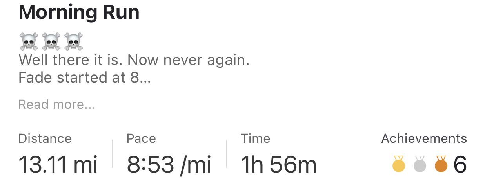
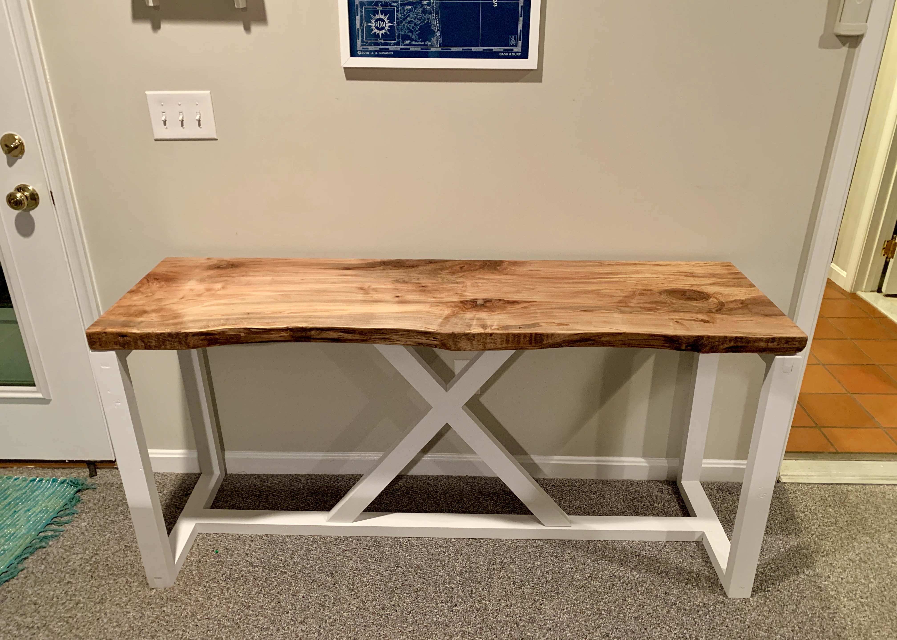

So 2020 happened.  And a lot of it felt like this.


But a lot of it was really great too.  In the midst of a lot of angst and frustration and fear and loneliness, 2020 also provided a unique opportunity to try some changes in life.  I feel like I took advantage of it.

Which is humbling.  And carries a little guilt.  It’s hard not to feel guilty after having a year so good when you know so many people had a year with many struggles.  It’s important to stay humble, help whenever you can, and keep on going.

Keep on going.  That last one can get overlooked sometimes because we know it’s so important to be thankful and to help others, and we rightly focus on those.  But it’s important for us to take whatever circumstance gives us and run with it too.  A lot of this year was just a day after day push to keep on going, which made it great for some goals and maybe not so good for others.  

Early this year I got perhaps the best compliment I’ve ever gotten.  From my wife.  We were just getting ready for the day and talking about what we were going to do - I think I was talking about running.  We had talked the night before about people we knew in high school that had peaked way back then and the rest of their lives were just not as good as the golden age of junior or senior year.  Well, she looked at me and said, “You still haven’t peaked yet.”  That gave me such a rush.  About to turn 40, probably nearing halfway through life, and - according to the person closest to me - still with plenty of climbing to do.  It’s not that I’ve done anything special I think - I just keep on going.  But reflecting over my goals of the last few years - weight loss and health, hobbies, reflection, writing - there is definitely something intentional in them about trying to be a more complete person.  I think that’s why I like this yearly review and goals process so much.

Now that it’s the end of the year, I’ll have to ask her if it’s still true!  Not sure what she’d say, but I do know that the reverse is true too: she hasn’t peaked yet either.  Anyway, on with the review and then on to 2021!

Here was last year’s list:

- \< 220 pounds
- Run a sub-54 10k
- Run a half marathon
- Run a mile under 7 minutes
- Write a book
- Learn to work from home
- Give up IG
- Reading
- One more secret goal

##### 219 or Less

Strictly speaking, this is a failure.  The lowest I hit this year was 224 and I’ve been maintaining 224-227 for about 6 months now.  But something strange happened on the way this year.

I stopped caring much about the number.

The number has always been a proxy - a metric to measure progress towards being more healthy and more fit.  This year I got to a point where 8/min miles were a regular thing (more on that later) and 225 felt like a reasonable weight.  I’m still a big guy, no question there, but I feel good now in a way that I definitely didn’t 3 or 4 years ago.  

What’s been even better is that I never really dieted this year at all.  Maybe that’s not so great, actually, but I’ve been active enough to deal with it.  So far.  So here’s some other (measured but possibly meaningless) proxies for fitness too.  Steps in 2020 averaged almost 16k per day (I started taking long walks in March during the pandemic and that continued all year):


Heart rate stayed nice and low:


I don’t think I’m going to have a weight goal in 2021 now.  I’m going to have additional goals around healthy lifestyle and I’ll probably end up losing weight, but not caring about the number in the same way feels really _good_. Since the beginning of 2017 when I hit an all time high of 278 lbs, this has felt like a multi-year process to get into a more healthy and sustainable place long term.  And now feels like a new phase.

##### Sub 54-min 10K

Crushed it actually.  Not much else to say; this year running became a big part of my routine.  Happy.


##### Half-marathon

This is the one I was most nervous about.  13.1 miles is fucking far.  I didn’t train for this too well.  The longest run I did previously was a 10 miler in July, and I did the half in November.  I was doing negative splits (each mile faster than the last) up to 5 miles as training instead of longer distance, and that made the second half of the run really hard.  The fade started around mile 8 and by mile 10 I was really dragging.  By the end, I was toast.  I laid down in the street quite unintentionally and stayed there for a few minutes.  

And the most exciting thing was the time.  I thought 2 hours or less was a big stretch, but it happened.



It’s worth noting that Maureen and the kids met me half way through with water and a new shirt, so a few minutes should be added in clock time.  Whatever, 2 hours flat still works for me!

##### Sub 7 Mile

This was the running goal I was most excited about.  I’ve learned that I like running fast for shorter distances than I do for longer runs.  About 5 or 6 miles is my max for enjoyment.

Anyway, this took training too, I did quite a few days of interval work at the track to build up tempo and speed.  It paid off.


A 6:30 mile at 225 lbs at 40 years old feels really good.

##### Write A Book

Definitely not.  There were two abortive fiction attempts; I couldn’t stand either of them.  I did manage to edit and finish [one story](https://www.kanonical.io/straight_and_narrow/), but it was short.  I also came up with and started outlining an idea for something non-fiction. This is frustrating and there’s more work to do here for sure.

Almost 40k word count for the year on the blog.

```
     596 ./2020-04-05-dreams.md
    2821 ./2020-10-26-voting.md
    1009 ./2020-01-08-2020.md
    1106 ./2020-12-28-contrarian.md
    2942 ./2020-03-29-lifemind.md
    1158 ./2020-01-06-review.md
     779 ./2020-12-19-untranslatable.md
    1145 ./2020-07-16-stripe.md
     764 ./2020-12-14-boggle.md
    1231 ./2020-12-17-raggedy.md
    1611 ./2020-05-28-exponentials.md
    1489 ./2020-09-22-cincinnatus.md
    9111 ./2020-03-21-straightandnarrow.md
     895 ./2020-12-31-books.md
    4752 ./2020-08-27-choosewealth.md
     506 ./2020-12-05-mob.md
     444 ./2020-03-18-formative.md
    1416 ./2020-02-20-old.md
     545 ./2020-05-29-pools.md
    3360 ./2020-03-12-2020-predictions.md
    1722 ./2020-03-05-2010-predictions-review.md
   39402 total
```

##### Learn To Work From Home

Thank you pandemic.  I feel better about this than I ever have, although I’ll admit I still prefer sitting outside at a coffeeshop quite often.  But this has been moving in a positive direction.  A lot of the issue here has been 1) a feeling of guilt that I’m home but not hanging out with the family and 2) constant kid interruptions that makes any kind of deep work impossible.  Well 1 has been mostly dealt with and the kids are getting a bit older such that 2 is - well, it’s still a problem but it’s way better.  A positive trend line that will hopefully continue.

##### Give Up IG

Hahaha, not quite.  But here’s a good trick.  I threw all social media in a folder called STOP on the very last page of my phone.  It works.


About halfway through the year I tried a new experiment that helped too.  I started posting quotes to Instagram stories.  People seemed to enjoy them and it sparked a few good conversations along the way.  It also got me into a regular schedule for looking at IG.  I’d post one quote in the morning and one in the evening and spend 5 or 10 min checking things out and then put it away.  So while it wasn’t given up exactly, IG was at least controlled.  

##### Reading

I kept track of all the books I read this year.  Which means I have a list.  There’s 58, which is a little over a book a week; a good/sustainable clip that feels about how I used to read before I let phones and other distractions get in the way.  Here they are:

- [Weapons of Math Destruction](https://www.amazon.com/Weapons-Math-Destruction-Increases-Inequality/dp/0553418831/ref=sr_1_1?crid=1EDVDIA9J0BPJ&dchild=1&keywords=weapons+of+math+destruction&qid=1609712383&sprefix=weapons+of+math+%2Caps%2C150&sr=8-1) - Cathy O'Neil
- [More From Less](https://www.amazon.com/More-Less-Surprising-Learned-Resources_and/dp/1982103574/ref=sr_1_1?dchild=1&keywords=more+from+less&qid=1609712395&sr=8-1) - Andrew McAfee
- [Energy and Civilization: A History](https://www.amazon.com/Energy-Civilization-History-MIT-Press/dp/0262536161/ref=sr_1_1?crid=2488JYV0K01XZ&dchild=1&keywords=energy+and+civilization&qid=1609712411&sprefix=energy+and+civil%2Caps%2C140&sr=8-1) - Vaclav Smil
- [Gone Tomorrow](https://www.amazon.com/Gone-Tomorrow-Jack-Reacher-Publisher/dp/B004T6DZWQ/ref=sr_1_2?crid=C6PII7Q3W64F&dchild=1&keywords=gone+tomorrow+by+lee+child&qid=1609712432&sprefix=gone+tomorrow%2Caps%2C147&sr=8-2) - Lee Child
- [Stubborn Attachments](https://www.amazon.com/Stubborn-Attachments-Prosperous-Responsible-Individuals/dp/1732265135/ref=sr_1_2?crid=2EO7S6VKLLJFF&dchild=1&keywords=stubborn+attachments&qid=1609712451&sprefix=stubborn+att%2Caps%2C141&sr=8-2) - Tyler Cowen
- [Agent to the Stars](https://www.amazon.com/Agent-Stars-John-Scalzi-October/dp/B01B99CI8C/ref=sr_1_2?crid=3SBHOM29C84EW&dchild=1&keywords=agent+to+the+stars&qid=1609712467&sprefix=agent+to+the+st%2Caps%2C143&sr=8-2) - John Scalzi
- [Astrophysics for People In A Hurry](https://www.amazon.com/Astrophysics-People-Hurry-deGrasse-Tyson/dp/0393609391/ref=sr_1_1?crid=1BV3U3XN75UXL&dchild=1&keywords=astrophysics+for+people+in+a+hurry&qid=1609712579&sprefix=astroph%2Caps%2C166&sr=8-1) - Neil DeGrasse Tyson
- [On The Shortness of Life](https://www.amazon.com/Shortness-Life-Penguin-Great-Ideas/dp/0143036327/ref=sr_1_1?crid=240TW6MLQAXJX&dchild=1&keywords=on+the+shortness+of+life+seneca&qid=1609712600&sprefix=on+the+shortness+of+life%2Caps%2C139&sr=8-1) - Seneca
- [Dignity](https://www.amazon.com/Dignity-Seeking-Respect-Back-America/dp/0525534733/ref=sr_1_1?dchild=1&keywords=dignity&qid=1609712614&sr=8-1) - Chris Arnade
- [Leviathan Wakes](https://www.amazon.com/Leviathan-Wakes-James-S-Corey/dp/0316129089/ref=sr_1_1?crid=2XXZD9XHJG8WP&dchild=1&keywords=leviathan+wakes&qid=1609712627&sprefix=leviathan+%2Caps%2C159&sr=8-1) - James S.A. Corey
- [Crooked River](https://www.amazon.com/Crooked-River-Agent-Pendergast-19/dp/1538702967/ref=sr_1_1?dchild=1&keywords=crooked+river&qid=1609712638&sr=8-1) - Douglas Preston and Lincoln Child
- [The Case Against Education](https://www.amazon.com/Case-against-Education-System-Waste/dp/0691196451/ref=sr_1_1?crid=2HG31C4VL7L&dchild=1&keywords=the+case+against+education&qid=1609712655&sprefix=the+case+against+education%2Caps%2C139&sr=8-1) by Bryan Caplan
- [Old Man's War](https://www.amazon.com/Old-Mans-War-John-Scalzi/dp/0765348276/ref=sr_1_1?dchild=1&keywords=old+mans+war&qid=1609712669&sr=8-1) - John Scalzi
- [The Madness of Crowds](https://www.amazon.com/Madness-Crowds-Gender-Race-Identity/dp/1635579988/ref=sr_1_1?crid=1J8G1F8UFPA4&dchild=1&keywords=madness+of+crowds&qid=1609712682&sprefix=madness+of+%2Caps%2C154&sr=8-1) - Douglas Murray
- [Discipline Equals Freedom](https://www.amazon.com/Discipline-Equals-Freedom-Manual-Mk1-MOD1/dp/1250274435/ref=sr_1_1?crid=37AHOT9QR19R1&dchild=1&keywords=discipline+equals+freedom&qid=1609712695&sprefix=discipline%2Caps%2C155&sr=8-1) - Jocko Willink
- [Percy Jackson and the Lightning Thief](https://www.amazon.com/Lightning-Thief-Percy-Jackson-Olympians/dp/0786838655/ref=sr_1_4?crid=12A94SYS5LR8N&dchild=1&keywords=percy+jackson+books&qid=1609712766&sprefix=percy+jack%2Caps%2C163&sr=8-4) - Rick Riordan
- [The Spy Who Came In From The Cold](https://www.amazon.com/Spy-Who-Came-Cold-George/dp/0143124757/ref=sr_1_1?crid=1I95UK8LF4CAF&dchild=1&keywords=spy+who+came+in+from+cold&qid=1609712785&sprefix=spy+who+caame+in+%2Caps%2C153&sr=8-1) - John LeCarre
- [Green Philosophy](https://www.amazon.com/Green-Philosophy-think-seriously-planet/dp/184887202X/ref=sr_1_1?dchild=1&keywords=green+philosophy&qid=1609712803&sr=8-1) - Roger Scruton
- [Socialism Sucks](https://www.amazon.com/Socialism-Sucks-Economists-Through-Unfree/dp/162157945X/ref=sr_1_3?dchild=1&keywords=socialism+sucks&qid=1609712815&sr=8-3) - Robert Lawson and Benjamin Powel
- [Agents of Innocence](https://www.amazon.com/Agents-Innocence-Novel-David-Ignatius/dp/0393317382/ref=sr_1_1?crid=31526UZ6KNNA3&dchild=1&keywords=agents+of+innocence&qid=1609712830&sprefix=agents+of+inno%2Caps%2C164&sr=8-1) - David Ignatius
- [The Bell Curve Wars](https://www.amazon.com/Bell-Curve-Wars-Intelligence-Republic/dp/0465006930/ref=sr_1_1?dchild=1&keywords=bell+curve+wars&qid=1609712843&sr=8-1) - Steven Fraser
- [The Mom Test](https://www.amazon.com/Mom-Test-customers-business-everyone/dp/1492180742/ref=sr_1_1?dchild=1&keywords=mom+test&qid=1609712851&sr=8-1) - Rob Fitzpatrick
- [The Man Who Solved The Market](https://www.amazon.com/Man-Who-Solved-Market-Revolution/dp/073521798X/ref=sr_1_1?crid=23X0CJHNDSHOQ&dchild=1&keywords=man+who+solved+the+market&qid=1609712870&sprefix=man+who+solved+the%2Caps%2C143&sr=8-1) - Gregory Zuckerman
- [I am Pilgrim](https://www.amazon.com/Am-Pilgrim-Thriller-Terry-Hayes/dp/1439177732/ref=sr_1_1?crid=F0VEUAEWZL3A&dchild=1&keywords=i+am+pilgrim&qid=1609712882&sprefix=I+am+pil%2Caps%2C141&sr=8-1) - Terry Hayes
- [The Fabric of Reality](https://www.amazon.com/Fabric-Reality-Parallel-Universes-Implications/dp/014027541X/ref=sr_1_2?dchild=1&keywords=fabric+of+reality&qid=1609712895&sr=8-2) - David Deutsch
- [Make](https://makebook.io/) - Pieter Levels
- [Persuader](https://www.amazon.com/Persuader-Jack-Reacher-Lee-Child/dp/0440245982/ref=sr_1_3?crid=3VVOUVU44OMRT&dchild=1&keywords=persuader+jack+reacher&qid=1609712993&sprefix=persuader%2Caps%2C150&sr=8-3) - Lee Child
- [Casino Royale](https://www.amazon.com/Casino-Royale-James-Bond-Fleming/dp/1612185436/ref=sr_1_1?crid=2Z5Y3ZWGNZUTX&dchild=1&keywords=casino+royale+book&qid=1609713275&sprefix=casino+royale%2Caps%2C157&sr=8-1) - Ian Fleming
- [The Revolt of the Public](https://www.amazon.com/Revolt-Public-Crisis-Authority-Millennium/dp/1732265143/ref=sr_1_1?dchild=1&keywords=revolt+of+the+public&qid=1609713291&s=books&sr=1-1) - Martin Gurri
- [The Deep Blue Good-By](https://www.amazon.com/Deep-Blue-Good-Travis-McGee/dp/0812983920/ref=sr_1_1?crid=29CWORYX35D7E&dchild=1&keywords=deep+blue+goodbye&qid=1609713304&s=books&sprefix=deep+blue+good%2Cstripbooks%2C141&sr=1-1) - John D. McDonald
- [The Last Emperox](https://www.amazon.com/Last-Emperox-Interdependency-John-Scalzi/dp/0765389169/ref=sr_1_1?crid=3RNE0Y79HMGYK&dchild=1&keywords=last+emperox&qid=1609713318&s=books&sprefix=last+empe%2Cstripbooks%2C144&sr=1-1) - John Scalzi
- [Homo Deus](https://www.amazon.com/Homo-Deus-Brief-History-Tomorrow/dp/0062464345/ref=sr_1_1?dchild=1&keywords=homo+deus&qid=1609713330&s=books&sr=1-1) - Yuval Harari
- [The New Girl](https://www.amazon.com/New-Girl-Novel-Gabriel-Allon/dp/0062834959/ref=sr_1_4?dchild=1&keywords=new+girl&qid=1609713342&s=books&sr=1-4) - Daniel Silva
- [How To Win An Election](https://www.amazon.com/How-Win-Election-Ancient-Politicians/dp/0691154082/ref=tmm_hrd_swatch_0?_encoding=UTF8&qid=1609713358&sr=1-6) - Cicero
- [Running Blind](https://www.amazon.com/Running-Blind-Jack-Reacher-Child/dp/0515143502/ref=sr_1_1?dchild=1&keywords=running+blind&qid=1609713408&s=books&sr=1-1) - Lee Child
- [The Satanic Verses](https://www.amazon.com/Satanic-Verses-Novel-Salman-Rushdie/dp/0812976711/ref=sr_1_1?crid=16UCO3GGH97CE&dchild=1&keywords=satanic+verses+by+salman+rushdie&qid=1609713422&s=books&sprefix=satanic+v%2Cstripbooks%2C150&sr=1-1) - Salman Rushdie
- [How Innovation Works](https://www.amazon.com/How-Innovation-Works-Flourishes-Freedom/dp/0062916599/ref=sr_1_1?crid=Z0KGBHYA5AO4&dchild=1&keywords=how+innovation+works+matt+ridley&qid=1609713436&s=books&sprefix=how+inno%2Cstripbooks%2C139&sr=1-1) - Matt Ridley
- [Foundation](https://www.amazon.com/Foundation-Isaac-Asimov/dp/0553293354/ref=sr_1_1?crid=1PWGZLE368IYO&dchild=1&keywords=foundation+asimov&qid=1609713448&s=books&sprefix=foundation%2Cstripbooks%2C165&sr=1-1) - Isaac Asimov
- [Consider Phlebas](https://www.amazon.com/Consider-Phlebas-Culture-Iain-Banks/dp/031600538X/ref=sr_1_1?crid=2OFHEHD9ZD6VF&dchild=1&keywords=consider+phlebas&qid=1609713461&s=books&sprefix=consider+phle%2Cstripbooks%2C148&sr=1-1) - Iain Banks
- [How To Destroy America In Three Easy Steps](https://www.amazon.com/Destroy-America-Three-Easy-Steps/dp/006300187X/ref=sr_1_1?crid=1W7RRTNRVZ6IY&dchild=1&keywords=how+to+destroy+america+in+three+easy+steps&qid=1609713473&s=books&sprefix=how+to+des%2Cstripbooks%2C150&sr=1-1) - Ben Shapiro
- [Cynical Theories](https://www.amazon.com/Cynical-Theories-Scholarship-Everything-Identity_and/dp/1634312023/ref=sr_1_1?crid=12CAQYIGGDYYS&dchild=1&keywords=cynical+theories&qid=1609713485&s=books&sprefix=cynical+th%2Cstripbooks%2C146&sr=1-1) - Helen Pluckrose and James Lindsay
- [Secret Sanction](https://www.amazon.com/Secret-Sanction-Brian-Haig-ebook/dp/B000Q9INC2/ref=sr_1_1?crid=MHOB3CKO8LUJ&dchild=1&keywords=secret+sanction+by+brian+haig&qid=1609713498&s=books&sprefix=secret+sanc%2Cstripbooks%2C133&sr=1-1) - Brian Haig
- [The Problem of Socialism](https://www.amazon.com/Problem-Socialism-Thomas-DiLorenzo/dp/1621575896/ref=sr_1_2?dchild=1&keywords=problem+of+socialism&qid=1609713511&s=books&sr=1-2) - Thomas DiLorenzo
- [The Skystone](https://www.amazon.com/Skystone-Dream-Eagles-Camulod-Chronicles-ebook/dp/B008PE4022/ref=sr_1_1?dchild=1&keywords=skystone&qid=1609713521&s=books&sr=1-1) - Jack Whyte
- [I Will Teach You To Be Rich](https://www.amazon.com/Will-Teach-You-Rich-Second/dp/1523505745/ref=sxts_sxwds-bia-wc-nc-drs1_0?crid=34Q8PI0WJOF4B&cv_ct_cx=i+will+teach+you+to+be+rich&dchild=1&keywords=i+will+teach+you+to+be+rich&pd_rd_i=1523505745&pd_rd_r=9e988b4f-9b97-498e-8900-1f18cb6dd525&pd_rd_w=4qnwQ&pd_rd_wg=95SnB&pf_rd_p=a64002b9-9c26-4361-b8a1-b0f5a4835670&pf_rd_r=89ER6ERDM6AA8P5GA58G&psc=1&qid=1609713564&s=books&sprefix=I+wil%2Cstripbooks%2C166&sr=1-1-38d0a374-3318-4625-ad92-b6761a63ecf6) - Ramit Sethi
- [Loonshots](https://www.amazon.com/Loonshots-Nurture-Diseases-Transform-Industries/dp/125062309X/ref=sr_1_1?crid=C6V9JTLG9W22&dchild=1&keywords=loonshots&qid=1609713581&s=books&sprefix=loonshots%2Cstripbooks%2C148&sr=1-1) - Safi Bachall
- [Black Rednecks and White Liberals](https://www.amazon.com/Black-Rednecks-Liberals-Thomas-Sowell/dp/1594031436/ref=sr_1_1?crid=2E9AX3JND2UB8&dchild=1&keywords=black+rednecks+and+white+liberals+thomas+sowell&qid=1609713594&s=books&sprefix=black+redne%2Cstripbooks%2C146&sr=1-1) - Thomas Sowell
- [Legend of Bagger Vance](https://www.amazon.com/Legend-Bagger-Vance-Novel-Golf/dp/038072751X/ref=sr_1_1?crid=DPEKYJHAF23H&dchild=1&keywords=legend+of+bagger+vance&qid=1609713605&s=books&sprefix=legend+of+ba%2Cstripbooks%2C149&sr=1-1) - Steven Pressfield
- [Red Sparrow](https://www.amazon.com/Red-Sparrow-Novel-Trilogy/dp/1476706131/ref=sr_1_1?crid=173RP6SR6L1IA&dchild=1&keywords=red+sparrow&qid=1609713615&s=books&sprefix=red+spa%2Cstripbooks%2C141&sr=1-1) - Jason Matthews
- [River God](https://www.amazon.com/River-God-Egyptian-Wilbur-Smith/dp/1499860803/ref=sr_1_1?dchild=1&keywords=river+god&qid=1609713627&s=books&sr=1-1) - Wilbur Smith
- [Surreal Numbers](https://www.amazon.com/Surreal-Numbers-Donald-Knuth/dp/0201038129/ref=sr_1_1?crid=1VPEWH1F012MU&dchild=1&keywords=surreal+numbers&qid=1609713639&s=books&sprefix=surreal+n%2Cstripbooks%2C171&sr=1-1) - Donald Knuth
- [The Hard Thing About Hard Things](https://www.amazon.com/Hard-Thing-About-Things-Building/dp/0062273205/ref=sr_1_1?crid=2NGWV70LB13RC&dchild=1&keywords=the+hard+thing+about+hard+things&qid=1609713651&s=books&sprefix=hard+thing+about%2Cstripbooks%2C150&sr=1-1) - Ben Horowitz
- [A Mathematicians Apology](https://www.amazon.com/Mathematicians-Apology-Canto-Classics/dp/110760463X/ref=sr_1_2?crid=MC68K2S29691&dchild=1&keywords=a+mathematician%27s+apology&qid=1609713665&s=books&sprefix=a+mathema%2Cstripbooks%2C146&sr=1-2) - GH Hardy
- [Letters to a Young Contrarian](https://www.amazon.com/Letters-Young-Contrarian-Mentoring-Paperback/dp/0465030335/ref=sr_1_1?crid=2MIR6AOB7SAA8&dchild=1&keywords=letters+to+a+young+contrarian&qid=1609713683&s=books&sprefix=letters+to+a+young+contr%2Cstripbooks%2C142&sr=1-1) - Christopher Hitchens
- [The Silence](https://www.amazon.com/Silence-Novel-Don-DeLillo/dp/1982164557/ref=sr_1_2?dchild=1&keywords=the+silence&qid=1609713693&s=books&sr=1-2) - Don DeLillo
- [Beneath the Scarlet Sky](https://www.amazon.com/gp/slredirect/picassoRedirect.html/ref=pa_sp_atf_stripbooks_sr_pg1_1?ie=UTF8&adId=A03690742XR6G1LBJO5N1&url=%2FBeneath-Scarlet-Sky-Mark-Sullivan%2Fdp%2F1503943372%2Fref%3Dsr_1_1_sspa%3Fcrid%3D2AKA9GHX7M4XC%26dchild%3D1%26keywords%3Dbeneath%2Ba%2Bscarlet%2Bsky%26qid%3D1609713707%26s%3Dbooks%26sprefix%3Dbeneath%2Ba%2Bsc%252Cstripbooks%252C147%26sr%3D1-1-spons%26psc%3D1&qualifier=1609713707&id=6637321890550424&widgetName=sp_atf) - Mark Sullivan
- [Little Book of Hygge](https://www.amazon.com/Little-Book-Hygge-Danish-Secrets/dp/0062658808/ref=sr_1_3?dchild=1&keywords=hygge&qid=1609713721&s=books&sr=1-3) - Meik Wiking
- [Night School](https://www.amazon.com/Night-School-Jack-Reacher-Novel/dp/0804178828/ref=sr_1_1?crid=V5SU1AOEWCYG&dchild=1&keywords=night+school+lee+child&qid=1609713733&s=books&sprefix=night+school%2Cstripbooks%2C148&sr=1-1) - Lee Child

There's some interesting statistics here: 26 were novels and 32 were non-fiction.  5 were re-reads of old favorites.  I was also surprised by the number of books I started and didn’t finish (11).  Some I started and just wasn’t ready for (Brideshead Revisited, Conservative Sensibility) and others just didn’t keep my interest (Ninth House, Caliban’s War, The Nightengale).  Others were good but I dropped them halfway through and I’m not sure why (Good Omens, The Body):

- The Conservative Sensibility - George Will
- Ninth House
- The Nightengale
- Caliban’s War
- Good Omens
- On Writing Well
- The Glass Hotel
- Brideshead Revisited
- The Body: A Guide for Occupants
- Nomad
- Why Most Things Fail

I’m glad I metricked this and kept a list.  It got me back on track.  But there’s something about the [Tyranny of Numbers](https://thomasjbevan.substack.com/p/the-tyranny-of-numbers) that makes me not want to continue; I won’t be _more_ happy because I read 60 books next year and beat 58, for instance, so I don't think this goal will continue.

##### The Secret Goal

Well, I was going to try to learn the harmonica this year.  I didn’t really want to tell anyone because I have some incredibly musical friends and I wanted this to just be for me.  I didn’t have the discipline and interest to keep going with it though.  I learned some basics, but it turned out to be way harder than I expected.  I regret not having learned a musical instrument when I was younger though, so something like this may still happen.  One Day.

##### Other Notable Things!

Woodworking became a new hobby this year completely out of the blue!  We ended up doing a few house projects ourselves in the spring and one thing just kind of lead to another.  It’s been really fun to explore making things in a new way, and I’m halfway to having a decent workshop now.  Here’s the highlights!

Mid-century modern record table made from curly maple and walnut with mitre keys and hairpin legs:


Farmhouse console table with live edge ambrosia maple slab top and maple base painted white.  Half-lap joints everywhere and no hardware:



A mitre saw station with hinged in and out feed platforms:


And speaking of building things, another pandemic project was [CollegeValue](https://www.collegevalue.dev/).  I put this together with Phoenix LiveView based on Department of Education data as an experiment to better understand the return on investment of different colleges and majors.  These two tables in particular are really interesting:

- [Top Earnings After Debt for Specific Majors at Specific Colleges](https://www.collegevalue.dev/fields/rank)
- [Top Earnings After Debt Colleges](https://www.collegevalue.dev/colleges/rank)

I’ve never seen the data laid out this way, but it gives some interesting (and perhaps obvious) insight into where the best return on investments lie: Computer Science and Nursing.  
