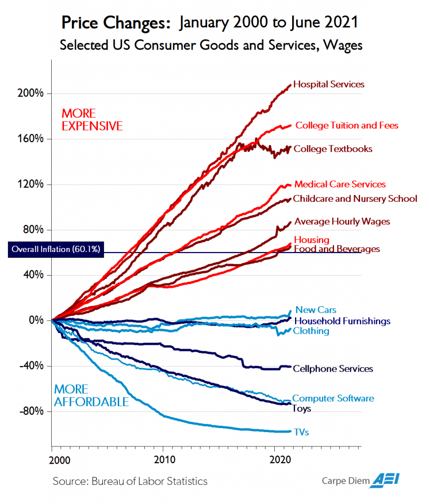
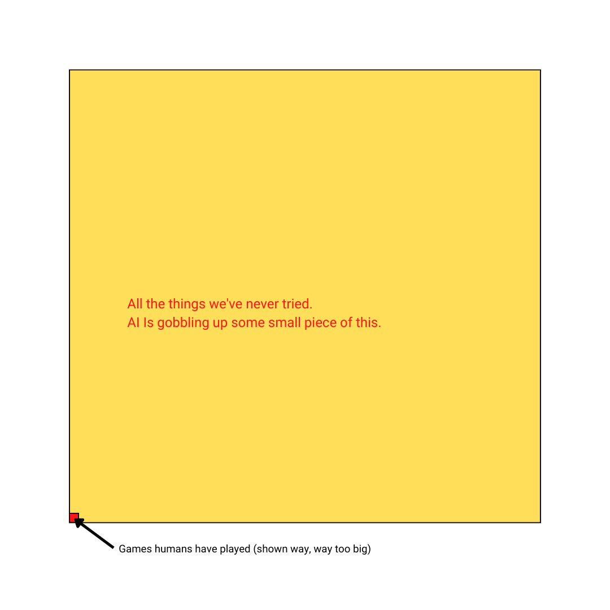

---

### Table of Contents

- [Cyborgs On The Toilet](#toilet)
- [Connected and Disconnected](#connected)
	- [No GPS](#gps)
	- [Real Risk](#risk)
- [Recorded and Private](#recorded)
	- [Preference Falsification](#preference)
	- [Consensus](#consensus)
	- [Identity](#identity)
- [Relationships and Audience](#relationships)
	- [Democratization and Overton Windows](#overton)
	- [Mimesis](#mimesis)
- [Memory and Cache](#memory)
	- [Atomic Chunks](#atomic)
- [Homo Techno - The Cyborg](#techno)
	- [Computing The Future](#future)
- [So Now What?](#now)
	- [Prioritize Your First Brain](#brain)
	- [Revel In Complexity](#revel)
	- [Build Good Relationships. And Disagree](#disagree)
	- [Don't Be The Product](#product)
- [A Diversity of Outcomes](#outcomes)
- [Appendix: Future Trends](#appendix)
	- [Educating Children](#educating)
	- [Digital Money](#bitcoin)
	- [AI](#ai)
- [Resources](#resources)

---

# Cyborgs on the Toilet

Take a look around the next time you’re out in public and you’ll see lots of cyborgs.  Every single person you see that isn’t actively talking - and some that are - is looking at, swiping, scrolling or tapping on a device.  It’s usually a phone, but occasionally a watch, a tablet, or a FitBit.  Every dead space or silence in your day can now be filled by the small light of a screen.  If you’re in line at the store and the check-out clerk is working, that’s a solid 15 seconds of phone time.  At a stop light you've got a good 30 seconds at least, and that guy honking and yelling behind you acts as an alarm.  Commercial breaks during the big game get filled with your very own customized feed of information 12 inches from your eyeballs.

And let’s talk about the holy grail of phone time: the bathroom.  Everyone takes their phone when they go to take a dump.  And we always find something interesting, so a bathroom trip becomes 15 minutes instead of 3.  Here’s an odd side effect: imagine the number of hemorrhoids caused by smartphones!

And I just looked it up on my own device!  And look, there’s a [study on the relationship](https://clinicaltrials.gov/ct2/show/NCT03444389) between hemorrhoids and smartphone use!  Google, you truly are organizing the world’s information.

We live in a different world than the one that existed 20 years ago. It’s different than 10 years ago too, and the rate of change doesn’t seem to be letting up. We all know that it’s different. We wallow in the marvels that technology has brought us like a pig rolls in mud, delirious and unthinking. We leave some of the consequences of these changes unexamined because we don’t want to examine them. We enjoy the wallowing too much. But these consequences are becoming bigger issues. Depression and mental problems in teenage girls is one commonly publicized example among many.  There is a lot to consider as technology continues to take over our lives.

I started thinking about this from the perspective of a parent of young children. I’ve had a strong intuition that I don’t want my kids to have much device time but just saying “yes” or “no” felt unsatisfying. I wanted the answer to be “no”, but I needed to have a foundation for it so I could explain to my kids why they couldn’t have a phone at 12 even if some of their friends did. I started thinking more about the consequences of the information revolution we’re smack in the middle of. And I started writing down notes in my notebook (with an antiquated pen). I ended up with a list longer than I expected, and I realized that the impacts are far wider than I could have imagined.

What’s odd is that this is happening in plain sight.  Unlike kids who were born near phones and tablets, we adults have some intuition about this.  We remember the world in the year 2000 and we can resolve some of the difference between then and now.  

Social media is addictive.  Everyone has internet access all the time.  Everyone has a smartphone, including your 7 year old nephew.  Bitcoin is apparently money.  Twitter banned Donald Trump.  Microsoft, Apple, Google, and Amazon — MAGA, which is hilarious - are the biggest companies in the world.  

All these are symptoms of **incredible changes in societal infrastructure**. Changes that have brought tremendous value. They have reduced inefficiency in everything we do, from how we order coffee to global supply chains to cancer screening. And many of the fruits of technology are largely - but not completely - universal. The poor and middle class have the same phones and same internet access as billionaires. The smartphone is an amazing piece of kit, but it’s still a commodity. Everyone has or can get one and can access most of the world’s software and information. It has become ubiquitous. And that's amazing.

In only a decade, the smartphone has transformed how we interact with reality. It’s always with us or always in our hands. It’s hard to overstate how profound a change this has become. To try to grapple with it, we’re going to try to get at a few of the underlying assumptions that have changed in our lives:

* Yesterday we were usually disconnected and today we’re connected.  
* Yesterday most things were naturally private and today they’re recorded.  
* Yesterday it was hard to reach a consensus across millions of people and today it’s easy.  
* Yesterday it was important to rely on memory and today we just look everything up.  
* Yesterday we valued content and today we value attention.  
* Yesterday we had relationships and today we have an audience.

We’ll pull these apart to see just how profound the change has been. Then we’ll look at our world today and where it’s going to change in the next decade. Because the changes aren’t over, not even close. Our lives will keep changing and in many ways will get better and better. But these problems aren’t going away either.

And how we take a dump is the smallest of them.

# Connected and Disconnected

### No GPS

In 1960, John Steinbeck was 58 and had already won the Pulitzer Prize and made his mark on the literary world.  All his writing was about the American experience but he felt that he had forgotten what it meant.  So Steinbeck set out on a trip across the country to rediscover the America he had forgotten.  He took with him a very American level of wanderlust, his ten year old “blue” poodle Charley, and a custom camper he ordered named *Rocinante.*

The result is a delightful little book called *Travels with Charley.*  Steinbeck starts it off at his home in Sag Harbor, NY with the provisioning process of his camper.  He packs food, clothes, a pile of “all the books you never get around to reading”, tools, spare parts, and maps of the country.  He only crosses one state line before he gets lost the first time and by the time he reaches Maine he’s backtracked any number of times.  But he’s also met many farmers, waitresses, and others, none of whom know who he is.

It’s important to think about exactly what this trip must have been like in 1960.  Here’s a very incomplete list of how it was different.

- Camping on a farm meant that when it was dark, it was really dark.  There were no batteries or LEDs or much of anything aside from maybe a kerosene lamp.
- You were not connected to anything or anyone, unless you drove or ran to the nearest farmhouse.
- There were no movies to watch, no Instagram to catch up on, no texts to respond to.
- When you were driving, you had only the resolution of the paper maps you had with you to figure out where you were going. If you switched states it meant grabbing a new map.
- Which is assuming you actually knew where you were!  There was no GPS to tell you.
- You had to think ahead about where a gas station might be along the highway.
- If you had a problem, finding a mechanic - or a ride to town to start looking for a mechanic - was a crapshoot. Once you found the mechanic, there was no telling how reliable or trustworthy they may be.
- There was no electricity and no signal.  There was no connection to anything, unless you were near a building that had electricity and a landline.

Describing this in today’s always connected world makes it sound like it was the 1700s. And in some ways, it was. The middle of the 20th century represents an odd in-between time between the connected world of now and the rest of human history. The infrastructure for our connected world was there - there were phone lines and TV and interstate highways - but it still took a few decades and a few new technologies to make it ubiquitous.

Even more striking when reading Steinbeck’s travel journal is that he travels the country anonymously.  Nobody knows who he is and he doesn’t volunteer the information.  Nobody wants a selfie or an autograph.  His movements aren’t tracked.  His wife knows where he is if he writes a letter or makes an expensive phone call.  Unless *he chooses* to make a connection, he is entirely disconnected.  His default state was “disconnected”.

Our default state today is the opposite. Parents buy their kids a phone so they know where they are after school, forgetting that they themselves were never accounted for in the same way. Email and chat connect employees who are available at any time day or night. Friends can text and chat each other hourly if they want.

Twitter’s original UI tagline was “what are you doing?”. Status updates have spread to every social media platform out there, and we’re programmed to make sure our followers knows what we’re up to many times a day.

From Steinbeck’s point of view in 1960, he was already living in a very different world than the past.  Here’s his accounting of the difference:

> There was a time not too long ago when a man put out to sea and ceased to exist for two or three years or forever.  And when the covered wagons set out to cross the continent, friends and relations remaining at home might never hear from the wanderers again.  Life went on, problems were settled, decisions were taken.  Even I can remember when a telegram meant just one thing - a death in the family.  In one short lifetime the telephone has changed all that.  If in this wandering narrative I seem to have cut the cords of family joys and sorrows, of Junior’s current delinquency and junior Junior’s new tooth, of business triumph and agony, it is not so.  Three times a week from some bar, supermarket, or tire-and-tool-cluttered service station, I put calls through to New York and reestablish my identity in time and space.  For three or four minutes I had a name, and the duties and joys and frustrations a man carries with him like a comet’s tail.  It was like dodging back and forth from one dimension to another, a silent explosion of breaking through the sound barrier, a curious experience, like a quick dip into a known but alien water.
>

At some point in the last 10 or 15 years - and in far less than the span of one short lifetime - we have transitioned yet again into a new world where our identity in time and space is broadcast around the clock. Steinbeck’s travelogue demonstrates how our confidence and our adventures have both atrophied. Our confidence is tightly wound around the opinions of others. We can’t do anything anymore without making sure other people know about it. We can’t walk out the front door without checking in at designated checkpoints. The Likes and Hearts and status messages and pings provide us fresh new validation of our place in the interconnected web of status around us.

There’s a beautiful scene in the movie Space Cowboys where Clint Eastwood’s character finally achieves his dream of spaceflight and hovers on a spacewalk in orbit over the Earth for the first time. The beeps and messages from his suit pause for a few seconds and he turns so that he can’t see the Space Shuttle behind him. In the frame he is completely alone. Attached to nothing, silent. It’s a beautiful scene because the space program is so driven by repetitive and process-driven engineering. Eastwood is wrapped in a high tech suit with an ever present audio connection in his ear. The space program needs to be this way because space will kill you quick.

We live in a cocoon of stimuli, awash in data and status and communication. The room for privacy and silence is short. Seeing an astronaut awash in data and process and stimuli have a moment of grandeur resonates with the freedom we yearn to achieve.

Our new default connected state has changed how we interact with risk too. To put it bluntly, there’s less of it. Our daily lives hold minimal risk compared to even fifty years ago. We’ve had a steady march of forward progress on safety for a long time. ConsumerReports did an incredible crash test between a 1959 and 2009 Chevy Impala just to underline the point. The older car crumples exactly like the hulk of metal that it is and shreds the dummy inside. Meanwhile, new car surrounds the dummy in a magic bubble of airbags and aluminum frame so that he “walks away” without a scratch. It isn’t just cars, it’s everything from GFI electrical outlets to safer paint to safer fences to better government regulations.

None of this is a bad thing. Lowering the risk of death has sweeping positive consequences. It’s changed the risk of smaller setbacks too. Expertise across industries is spread out. Before YouTube, a broken appliance or a busted fuse in your car might mean day off to wait for the repairman or an expensive tow to a mechanic. But today the solution is often a Google search away. When something goes wrong, the path to fix it is simpler and the chances of being taken advantage of by an expert is much lower.

Even more interesting is how our connectedness also changed our *perception of risk.*  There’s a new cult of ‘safetyism’ that tells us to protect our children and look out for every 1-in-a-million possible danger.  And we worry just as much about emotional safety as we do physical.  Greg Lukianoff and Jonathan Haidt break this down in their book *The Coddling of the American Mind*.  Being unwilling to make tradeoffs around safety and other practical and moral concerns is interfering with people’s social and intellectual development.

At the same time that we want things to be perfectly safe, we often crave the perception of risk too.  There are now whole industries working to manufacture perceived risk for their customers.  Skydiving used to be the ultimate daredevil’s thrill.  I can count plenty of friends that have done it without trying very hard.  And what is the point of a Spartan race or a Tough Mudder if not perceived risk?  Spartan’s call to action implies your existing lack of risk: “The first day of your new life starts here.”  It’s a call to come get dirty with us, feel some manufactured risk, then have a beer and laugh about it afterwards.

**We have all the reassurance we could possibly need and none of the balls.**

### Real Risk

The value missing from our connected lives is competence.  We’ve outsourced it to the crowd so that we can call on any number of skillsets at a whim.  At a high level, this is still an advantage and the continuing march of specialization.  All of us are able to gain more leverage across a larger diversity of skills.  But our diversification has limited our own competence, or our own *feeling* of competence.  Competence can be measured by the probability of succeeding when there’s a real chance of failure.  It’s why we call a real mechanic when our armchair mechanic skills fail.  There’s more to being a mechanic than just looking up information and following instructions.

Nearly everyone that enters a Tough Mudder finishes a Tough Mudder.  It’s designed to feel hard but still let everyone through.  And to be clear, there’s nothing wrong with a boost of confidence and a first step.  But we do ourselves a disservice if we calculate our perceived risk as real risk.  If we want the very human quality of competence, we need to step into a realm with real risks.

In the movie *Free Solo*, we watch Alex Honnold put his life on the line to climb El Capitan with no rope.  The movie focuses not just on the climb, but on the journey he takes to make himself capable of doing it.  Alex is relentless in both his physical and mental preparation.  He spends hours on the route cleaning and prepping the surface so that everything is perfect.  He memorizes every hand and foot movement on the entire 3,000 ft. route.  He climbs it with a rope over and over until it is second nature.  He leaves nothing to chance.

And still the risk is palpable.  The camera crew - his friends - can barely watch as he moves from hold to hold on the sheer surface.  I don’t even know him and I could barely watch.

There’s only one Alex Honnold in the world, and he will tell you that what he does is extreme.  But we’re drawn to his example because he’s willing to prove his competence against a very real risk.  He *believes* in his own competence more than the risk.  His attitude is the same as the 19th century settlers leaving their families in covered wagons to set out across the continent.

# Recorded and Private

In 2019 The Sun UK [published a poll](https://www.thesun.co.uk/news/3617062/children-turn-backs-on-traditional-careers-in-favour-of-internet-fame-study-finds/) on the top jobs that kids 6-17 years old wanted.  The #1 spot was YouTuber.  #2 was blogger or vlogger, #3 was musician, #4 was actor and #5 was Film maker.  The top 5 spots were all related to creating content. Spots 6-10 were the old, displaced standbys you would expect: doctor, athlete, teacher, writer, lawyer (maybe you didn’t expect that one).  Lego did a [similar study](https://www.businessinsider.com/american-kids-youtube-star-astronauts-survey-2019-7) where kids picked from 5 professions: YouTuber, Teacher, Athlete, Musician, Astronaut.  In both the US and the UK, YouTuber was #1.  Astronaut came in last.  (In China it was reversed.)

Our kids are obsessed and surrounded with content. Their heroes are Mr Beast and Mark Rober and Dude Perfect. Adults have migrated in the same way. Everybody has their own niche YouTube channels that gives them the informational, educational, or comic outlet they want. For me, it’s woodworking tutorials. For the next person, it’s a daily show or mystery theatre. Bandwidth is free and everyone is creating content. There’s no limit to how small a niche can be and maintain an audience. Rule 34 of the internet referred to porn but today it applies to every topic.

It’s clear that kids are more naturally accustomed to this world, having grown up in it.  But it’s not just consuming content, they’re more used to creating it to too.  As soon as they get phones they’re taking photos and videos and sharing them anywhere and everywhere.  They are used to the state of being recorded.  How many times have you seen a group of teenage girls taking turns posing and each getting their picture in the same spot?  It happens all the time on the beach.  **They relish showing off what they’ve recorded, almost as if it was a higher state of being.**

This is the second big shift that has happened. It’s not just that we’re always connected to the world, it’s that we’re always feeding the world with new content. Recording is constant and exciting. We record everything, and the record is mostly permanent. The younger you are, the more normal this seems.

The value of all this new content is huge, but the darkside is too.  Kyle Kashuv was a survivor and student activist after the Parkland school shootings.  He was accepted into Harvard and planned to attend after graduating high school.  At some point comments he made when he was 16 were brought to light.  Comments he said he made “in an attempt to be as extreme and shocking as possible.”  To be clear, this is something almost every teenager does at some point with some group of friends.  It’s just that today they do it online or in text messages instead of face to face late one night at a buddies house.  Harvard rescinded his admission, and refused a meeting to hear his side of the story.  In [his words](https://twitter.com/kylekashuv/status/1140605133346283521?lang=en):

> Harvard deciding that someone can’t grow, especially after a life-altering event like the shooting, is deeply concerning. If any institution should understand growth, it’s Harvard, which is looked to as the pinnacle of higher education despite its checkered past... But I don’t believe that.  I believe that institutions and people can grow. I've said that repeatedly.  In the end, this isn’t about me, it's about whether we live in a society in which forgiveness is possible or mistakes brand you as irredeemable, as Harvard has decided for me.
>

This unforgiveness shifts our mindset and approach to new ideas. Historian Niall Ferguson is helping found the new University of Austin in Texas. When asked why, he laments the environment that Ivy undergraduates live in today. He remembers the ridiculous and crazy things he used to spout off at Oxford. He had to “mess around with a lot of bad ideas, to figure out the good ones.”

That kind of environment is impossible today for three reasons.

### 1. Preference Falsification

Abigail Shrier made enemies writing a book describing how clumps of teenage girls want to transition into boys. Whether her telling of this new phenomenon of transgender girls is accurate is not relevant here. What is relevant is how demonized she became by bringing it up. Transgender activists declared her a transphobe and a TERF and the Twitter mob fell in line. Target removed her book from shelves and Amazon down-listed it and blocked advertising. You can still buy it but you have to search for it.

Shrier gave a [speech to a student group at Princeton](https://abigailshrier.substack.com/p/what-i-told-the-students-of-princeton?s=r) - which had to be held off campus because of protests by the way - where she answered the chief question that most people have for her:

> The question I get most often—the thing that most interviewers want to know, even when they’re pretending to care about more high-minded things—is:  *What’s it like to be so hated?*   I can only assume that’s what some of you rubberneckers want to know as well:  *What’s it like to be on a GLAAD black list? What’s it like to have top ACLU lawyers come out in favor of banning your book? What’s it like to have prestigious institutions disavow you as an alum? What’s it like to lose the favor of the fancy people who once claimed you as their own?
>
>
>
> ...If you’re here, you no doubt are familiar with at least some of the unpleasantness you encounter whenever you deviate from the approved script. So, again, what’s it like to be the target of so much hate? *It’s **freeing.***
>

We live in a time where some of our thoughts and beliefs can't be said out loud. Maybe even most of them. This seems especially true for people with an audience. Reversion to the mean, where the mean is the safe new unthreatening standard of society, is required lest some backlash occur. Shrier’s lesson is that once the mob comes and the takedown occurs, the shackles can come off. Public vilification is a process of immolation, but the phoenix that rises after may be the only truly independent thinking class left.

The social scientist Timur Kuran coined the phrase *preference falsification* in his book *Private Truths, Public Lies.* Kuran argues that vote by secret ballot is a critical way to manage conformist social pressures and understand the true desires in a group.

Preference falsification is also why Peter Thiel’s famous interview question is so provocative.  When Thiel asks *“What important truth do very few people agree with you on?”*, it’s really two questions: 1) what’s something interesting you believe and 2) how willing are you to publish your true beliefs in the face of the status quo?  

When our default state is to be on public record - as it seems to be today - we falsify our own preferences in public or we keep them to ourselves. Remaining silent is the soft version: I disagree with the public, but not enough to risk ridicule or backlash.

The risk of public opinion isn’t the worst of it. The real problem is that there’s no room to chew on bad ideas. Remember what Niall Ferguson said: he had to mess around with a lot of bad ideas to get the good ones. If our culture is unwilling to allow this kind of exploration - especially among young people at college - **how can the ideas that already exist change, challenge each other, or do anything but intensify? Are we capable of changing our minds?**

### 2. Consensus

Joe Rogan was blasted in early 2022 for having some controversial guests on his podcast.  Controversial guests aren’t exactly new on his podcast.. it’s actually half the point.  He’s had everyone from Edward Snowden to Alex Jones to Abigail Shrier to Bernie Sanders as guests.  But this time was different and a lot of people got very angry at Joe Rogan.  They claimed he was spreading ‘dangerous misinformation’ and leading to needless Covid deaths.

His sin: having Robert Malone and and Peter McCollough on as guests. Both have some conspiratorial claims about Covid. He’s had more mainstream medical doctors Michael Osterholm and Sanjay Gupta from CNN as guests as well, but that did nothing to placate the mob. He’s had far more conspiratorial guests too, like Graham Hancock and Randall Carlson, but nobody seems to have a problem with his conversations with them either.

Rogan made a ‘non-apology’ video explaining his perspective and unpacking the idea that these episodes were dangerous misinformation:  

> Those episodes were labelled as being dangerous misinformation.  The problem I have with the term misinformation especially today is that many of the things we thought of as misinformation just a short while ago are now accepted as fact.  For instance, 8 months ago if you said ‘if you get vaccinated and you catch Covid you can still spread Covid’ you would be removed from social media.  They would ban you from certain platforms.  Now that’s accepted as fact.  If you said ‘I don’t think cloth masks work’ you would be banned from social media.  Now that is repeatedly stated on CNN.  If you said ‘it’s possible that Covid-19 came from a lab’ you’d be banned from many platforms.  Now that’s on the cover of Newsweek. All of those theories that at one point in time were banned were openly discussed by those two men on my podcast that were accused of being dangerous information.
>

Covid-19 has demonstrated media companies capacity and willingness to ban information around subjects it deems dangerous to public health.  They’ve gotten it wrong many times and suppressed ideas that turned out to be right.  The point Rogan makes is: what makes you so sure you’re right this time?

In the last 150 years, we’ve been riding an exponential curve of technology in much of our life.  It’s easy to forget just how much the speed of information has changed.  Last year, Juneteenth became a federal holiday for the first time.  It celebrates the very end of slavery when, on June 19th 1865, Union General Granger landed at Galveston, Texas to enforce the emancipation of all slaves in Texas.  What we forget about this event is that the Emancipation Proclamation occurred on January 1, 1863.  It took 18 months for news and enforcement to travel across the United States and reach the southern reaches of Texas.

In the next few decades the telegram took off.  Then the telephone.  All this fast communication made the 20th century look nothing like the one before it. And now in the 21st century, social media has democratized the change completely.  At the end of the 20th century, anyone in the US could talk to anyone else and have a cheap and easy 1-on-1 conversation with them.  Twenty years later, almost anyone in the world can talk at or with anyone else, anytime, for free.

Brian Eno coined the term [scenius](https://kk.org/thetechnium/scenius-or-comm/) to counteract the idea of a genius toiling alone.  He argued that certain settings and groups of people can actually work together to generate genius.  Genius clumps.  He has plenty of examples to highlight, from The Inklings in Oxford (which included both C.S. Lewis and Tolkien) to the renaissance art of 15th century Florence.  When scenius is at work there’s a network effect and an exciting rapid exchange of information, tools, and techniques.  This kind of interaction drives our view of the world.  It builds consensus. Our social brains feed off of relationships to reinforce ideas and patterns.  That’s why the impact of scenius has been so strong through history.

We have a new and different kind of scenius today. It’s on the internet - a part of Kevin Kelly’s Technium - and damned if it isn’t every connected human. This global scenius has new emergent properties, defined by speed and virality and memes. Memes travel further and faster than ever before. The algorithms kick in and it flies through the world. If you know how to manufacture attention, you can reach thousands. Or millions.

The raw speed at which we arrive at consensus today has changed how we derive truth. It happens faster than ever - in weeks or days or even hours. It's measured by audience size instead of by relationships and small groups like most of human history. Once a view acquires an expert opinion and a big enough audience - like the idea that Covid-19 was passed to humans from bats in a wet market - it becomes near impossible to refute.

In a small group, you can voice a different idea, even a heretical one.  You take a shot and see what happens.  Maybe you take it on the chin sometimes.  With just a few people, that’s not so bad.  Ironically, this is why Joe Rogan has an audience of millions.  He and his guests are willing to kick around ideas as part of an intimate conversation.  As he said, “I’m not trying to be controversial.  I’ve never tried to do anything with these podcasts except have interesting conversations.”

Try doing that on Twitter and prepare for demands of human sacrifice. There are so many more voices, some brilliant and some just looking for blood. The weight of all that humanity means any new idea starts deep underwater starved of any consideration.

After all, who can disagree with an idea that has millions of likes?  

### 3. Identity

In his book *Escape from Freedom*, [Erich Fromm](https://www.historicalmaterialism.org/node/1181) made the following point:

> ‘Ask an average newspaper reader what he thinks about a certain political question. He will give you as “his” opinion a more or less exact account of what he has read [in the papers], and yet – and this is the essential point – he believes that what he is saying is the result of his own thinking.’
>

Humans are pattern seeking mammals.  We take the data we have to make sense of the world.  Until this generation, information spread so slowly that the number of opinions we owned as “ours” was severely limited by the amount of information we could ingest.  

But now the firehose is wide open.  There is content everywhere, produced by everyone, and available at the click of a button.  The smallest niche interest you can imagine has an audience measured in the thousands.  If you don’t believe me, go [subreddit spelunking](http://redditlist.com/).  Hell, I used to think woodworking was a niche hobby before I got into it.  The [woodworking subreddit](https://www.reddit.com/r/woodworking) has *4 million member*s.

Paul Graham wrote one of the most important essays of the 21st century called [Keep Your Identity Small](http://www.paulgraham.com/identity.html).  Politics and religion, he says, are subjects in which people can feel comfortable having strong convictions with very little expertise.  The more entangled a topic is in your identity, the less capable you become of understanding it or changing your mind.  In his words, “the more labels you have for yourself, the dumber they make you.”  The number of labels we carry have exploded today.  We are so much dumber.

I remember reading this essay soon after it came out and having a really hard time with it.  I’m a programmer!  A racing driver!  A contrarian!  A Catholic!  Surely these things can’t be bad!  But they were.  They were holding my life back artificially.  Programming was a thing I did (mediocrely) and it took a long time for me to realize that what I actually liked was creating products.  The huge amount of time I spent racing cars kept me in a holding pattern socially.  When I realized that being contrarian was just a symptom of the kind of thinkers I idolized, I started to better understand the value of first principles thinking.  And religion?  I’m still Catholic but I’ve had to back away from my faith multiple times to make it more concrete.  

Paul is right: **the more labels you have, the dumber they make you.**  

Speaking of labels, go look at Twitter profiles sometime.  It’s as if people can sum things up in a few words:  Democrat. Republican. He/Him. Entrepreneur. Nomad. Texan. Climate. Freedom. Socialism. Trump!

What Twitter profiles really tell you is not the type of person you are, but the *type of person you listen to.*

The internet today is all about audience.  Identity doesn’t describe who you are.  It describes who you are willing to let influence you’re thinking.  This is a fundamental shift still in progress.  Back in the 1930s when Erich Fromm made his point about newspaper readers, there were only a handful of newspapers.  The media managed the general shape of your opinion and you got to fill in the blanks with some color. Identities have become more rigid and more polarized because we live in a world of information abundance! Content is so narrowly focused that you can find exactly the voices you agree with and tune out everything else.  It’s easy to outsource all of your labels to the people you listen to.  If your identity is online then it’s more hackable by anyone trying to build an audience. The better they are at grabbing your attention, the more their worldview will pervade the world.  

We are in the middle of a huge popularity contest, with memes as weapons, and it’s shaping the future of our thought and belief.

# Relationships and Audience

The Dunbar number has become the standard measurement for understanding how many relationships a human can have.  Robin Dunbar drew on hunter-gatherer communities, military units, and village sizes to come up with the average number of 150.  This is supposed to be how many stable relationships a person can have.

There’s error bars on the number, of course.  Maybe it’s 100-250, but 150 is what’s usually quoted.  It has evolved to operate like Moore’s Law, more of a social target than a measurement.  For instance, the government of Sweden restructured offices so as not to violate Dunbar’s famous rule.

So isn’t it odd how often we see people that have hundreds or thousand of links on social media?  I expect celebrities to have a ton of followers.  Social media is a different tool for them, so I’m always amused when I see a “normal” person that follows 3,275 others and has 3,197 followers.  What do those numbers even mean?

Social media operates on different levels for different users.  One of the big problems is that we sometimes aspire to use it like the famous people we see with millions of followers.  For celebrities and public figures, social media is something new and exciting.  It’s a direct messaging platform to their audience, without having to go through the traditional gatekeepers of media.  Elon Musk can talk directly to his millions of followers on Twitter without having to go on TV or radio or anything else.  He’s brilliant at this.  Tesla easily spends the least in advertising per car sold of any auto manufacturer in large part because Elon handles it all in his spare time.  Elon selects podcasts and interviews in similar ways.  You’ll rarely see him on TV, but you can stream 2 hours of Q&A with him and Lex Fridman or Joe Rogan on YouTube.

This is new in human history.  It’s never before been possible for public figures to be able to talk to an audience without a gatekeeper.  They can say exactly what they mean - long form or short form - without worrying about the interviewer clipping parts out or a TV station leveraging a 15 second sound byte.  Love him or hate him, this was one of the biggest innovations Donald Trump brought to politics.  He didn’t bother playing the media game, he just spouted off directly.  And he changed politics in the process.

Moving down a level from the celebrities and public figures, we come to the influencers.  Some of these have millions of followers too.  Let me tell you about Larry Wheels.  Larry is one of the strongest humans you’ll see.  He built a following with videos of crazy deadlifts that made him bleed and turned that into a flourishing online career.  I was in the middle of my powerlifting phase when I first saw him on Instagram when he had around 10,000 followers.  6 or 7 years later he has *3.3 million*.  He lives in Dubai, and commands big sponsorship deals across Instagram, YouTube and any number of other online and live events.  His influence has become celebrity.

It doesn’t take millions of followers.  There are *thousands* of “creators” online teaching, inspiring, or showing off.  It’s in every niche you can imagine from [woodworking](https://www.instagram.com/bourbonmoth/) to [trick shots](https://www.instagram.com/dndhulett/).  And it’s great! And wonderful! Until it isn’t.

Because when we move down another level from the influencers, we get to us.  Normal old people that feel kind of inadequate about only having 80 followers.  It feels like we’re doing it wrong.  Our numbers are small, numbers are easy to measure, and bigger is obviously better.  What’s wrong with us?! Are we that boring??

No we’re not, but we have substituted relationships for audience.  Social media companies make their money from exceptionally good targeting for advertising.  If they know you like woodworking, they’ll target finish oils and wood products.  They get this from the idea of audience.  Each of us sit in a whole Venn diagram of different audiences and the social media companies know all of them.  Facebook’s motto might be “connecting the world”, but these platforms aren’t designed to connect us and build relationships.  They’re designed to stratify us into easily salable groups.  If we’re starting a business, this is great for reaching potential customers faster than ever before.  But we’re incentivized to do it a certain way.  I remember hearing an early interview with [Miss Excel](https://www.instagram.com/miss.excel/) about her journey to teaching Excel.  It was a nice entrepreneurial story, except she never once mentioned the fact that being a cute 20-something dancing around had something to do with her videos taking off on TikTok.  Leaving it out came off disingenuous.  Leveraging the algorithm was part of her success formula.  It got her traction and let her build an audience.

Not every platform focuses on audience and advertising.  Old school IRC, Discord, and other direct messaging tools help build relationships, sometimes with people you’ve never met in real life.  But these are not tools that the majority of people use anymore.  Facebook, Twitter, Instagram and TikTok are the big winners and every user’s goal is to broadcast a curated and perfect version of life.  These tools are built with audience in mind.  They won *because*
 they figured out how to substitute audience for relationships and cash in on the advertising opportunity.

And it’s why they’re dangerous for us.  The major platforms are specifically designed to attenuate our social structure as audience.  When we’re online we think in terms of audience. **We measure our online identity by the engagement with our audience.  We measure the value of our content by its reach.**

### Democratization and Overton Windows

What’s especially odd about what has happened is that the ability to gain an audience has spread over the whole population.  It’s possible for anyone with something interesting to say to build an audience.  Most of the tools are free.  And the incentive is there, because if you build a big enough audience you’ll make money from them too.

You’d think this sounds like democratization.  Everyone can do it.  But that’s not *quite* true.

We are reliant on the platforms of big tech to spread our message.  A small number of companies controls a tremendous amount of reach in the captive attention of all our combined audiences. It would be hard enough to counteract the virality and weight of consensus opinion alone.  But today’s platforms won’t just suppress a different idea, they will actively ban and disallow it.  Some ideas become silenced while others are amplified.  If you stray too far from the safe spaces they dictate, big tech will neuter you.

This *can* be a good thing.  Violence or other illegal activities cannot be tolerated.  But it’s easy for big tech to go too far.  On Covid policy alone, the CDC changed course many times and the tech companies silenced plenty of scientists that disagreed.  A few months later, the same silenced opinions were talking points on CNN.

The spectrum of acceptable views in a society is called the Overton Window. This is controlled today by private companies. This isn’t new, after all The New York Times and other papers set much of the public debate across most of the 20th century. But the amount of power seems to have changed. Google controls what you see when you search and it’s all personalized to you and what should matter to you. Twitter, despite our love/hate relationship with it, controls a lot of the direction of public discourse. And we’re seeing the uproar about what should and shouldn’t be protected and directed on Twitter play out in real time with Elon’s private takeover bid.

Who knows how this will play out, but it’s enough to prove that who controls the Overton window controls the debate.  Noam Chomsky said this brilliantly some 50 years ago:

> "The smart way to keep people passive and obedient is to strictly limit the spectrum of acceptable opinion, but allow very lively debate within that spectrum - even encourage the more critical and dissident views. That gives people the sense that there's free thinking going on, while all the time the presuppositions of the system are being reinforced by the limits put on the range of the debate."
>

We build and curate our lives inside of the systems big tech builds for us.  We base our opinions, our influence and our identity on our likes, our tweets, and our funny TikTok videos.  We project an idealized version of ourselves to our audience.  We measure our own self-worth by our audience.  

**We *create* an Overton Window about ourselves that contains our identity.**

Not only is this less than the living and messy version of who we really are, it also gives our audience and big tech the keys to our sense of self.  If our audience or big tech rejects us, what does this do to our image of our self?

### Mimesis

I’ve gotten this far without bringing up Rene Girard’s concept of [mimesis](https://en.wikipedia.org/wiki/Mimesis).  Mimetic theory is starting to spread further in the 21st century than before.  It sits behind the investing theses of Silicon Valley visionaries like Peter Thiel and is explained in detail in bestselling books like [Wanting](https://www.amazon.com/Wanting-Power-Mimetic-Desire-Everyday/dp/B08KGVLHVX/ref=sr_1_1?crid=PFPTFMCTL60D&keywords=wanting&qid=1654460739&sprefix=wantin%2Caps%2C253&sr=8-1) by Luke Burgis. It’s no wonder it’s popularity has grown in the tech world, it’s hard not to see in the systems we’ve created.  

Girard believed that much of what humans do is governed by the imitation of desires: by mimesis.  We don’t know what we want to desire ourselves and so we desire what others want.  Other people in our lives - those close to us and those we put on pedestals (like celebrities or public figures) - become models for our desire.  We shape our own lives around the “wants” we learn from others.  Girard says that mimesis builds up different forms of rivalry and eventually leads to scapegoating.  

By creating an always-connected world focused on audience, we’ve created a dopamine-driven net of mimetic desire.  We can easily find and follow the models we want.  And we can project what we see that others have: the beautifully curated lives we present to each other.  Perfect children. Perfect wife. Perfect workouts. Perfect house. Perfect business. Perfect outfit. Perfect dance. Perfect party. Perfect day.

All a perfect lie.  Once you see mimesis, you can’t unsee it.  It is a defining characteristic of humanity.  In social media and audience building tools, we’ve created the strongest possible tool for mimetic desire.  We consume our lives seeing and wanting what others post.  

The influencers and celebrities and friend lists and constant stream of outrage and information take all of our attention. According to Bari Weiss and Johann Hari’s [long conversation](https://www.honestlypod.com/podcast/episode/2f84e8d4/your-attention-didnt-collapse-it-was-stolen), it’s been stolen from us. Herbert Simon said that *“a wealth of information creates a poverty of attention.”*  All of ours is used up. We’re sitting on empty. The more hooked we are to scrolling, the more advertising dollars can be sold. All of these tools are free because what they are selling is the chance to reach an audience. We are the product.

If our attention has been stolen then our critical thinking has been outsourced.  We’ve given it all over to our mimetic models. Erich Fromm’s prescient quote about newspapers has reached a new maximum today.  Humans are designed to have a social fabric of relationships that help us shape our perspective on the world.  But memes travel so fast now that we don’t have enough time to process them all.  Instead, we accept the memes from sources we like and reject the rest, increasing our polarity and our identity with the sources we like in the process.

# Memory and Cache

I remember being in elementary school and having my Dad show me this obnoxious table of numbers, 12 by 12.  He said to me, “You’re going to memorize this whole thing.  You’ll hate it while you’re doing it, but you’ll love it after that.”  He was right.  I hated memorizing the multiplication table, but I love being able to do a bunch of arithmetic in my head.  It’s like I have a computer in my head when others only have one in their hand.

My kids are in elementary school now and I’m making them do the same thing.  I haven’t succeeded yet but they’ll get there, and they’ll have a leg up because of their annoying Dad.  Memorizing stuff matters.

Today we have the world’s information at our fingertips. We can lookup any fact anytime anywhere. This ability mimics a cache architecture in computers. We stuff as much information in our cache (brain) as we can. Our brain mostly has a Least Recently Used expiration function - the further back we go, the fuzzier the information. Memorization is the process of training our brains to keep specific details or memories. The best methods, like Spaced Repetition, are designed to counteract how the expiration function of our brain works. When our cache lookup fails, we have to go to storage (the internet) to do a lookup for the information. Google has made this operation so quick that it’s only a little slower than a cache lookup in our brain.

This is a great system! We can lookup facts in less than ten seconds. We can find scientific studies on hemorrhoid increase due to smart phones in under a minute. We can refresh the memories in our brains based on our own photos or writing too. I pity previous generations that didn’t have blogs or Google Photo or Instagram to look back wistfully on every delicious meal that happened on a random Wednesday in June.

Yeah there was a little sarcasm in that last sentence. When we record our own lives, we don’t always get it right. We record the wrong things. Some things deserve forgetting. But there’s a trick to getting it right-er: focus on what your future self will care instead of what your audience cares about. Both my wife and I use Instagram like this, or at least we try to. Instead of projecting a perfect version of our lives, we try to record our favorite experiences with family and friends so we can re-live them later. It's way better than what we had just 25 years ago: a handwritten journal and a box full of low-res polaroids.

Anyway, back to our cache and storage system. It’s great, except that the internet has gotten so good that it has let us atrophy our cache away. **Memorization is an underrated skill.**

I remember complaining in Algebra tests when they said no calculators.  I had a perfectly functioning TI-85 and I could use it well.  Getting the zeroes of any polynomial was a couple of clicks.  Seeing the graph of a cubic took seconds.  Why the hell did I have to do it by hand?  The answer is obvious now: it’s the difference between understanding the material and plugging in a formula.  

Memorization seems valuable for two reasons.  First, it’s brain exercise.  It develops the muscle and lets it grow and expand.  The more you use it, the better it becomes and the more details you can keep in your cache at any time.  Eisenhower said that “plans are worthless, but planning is everything.”  The same could be said of memorization.  Remember times tables, music, poetry, history.  It doesn’t matter.  Learn what you’re interested in and store as much as your brain will let you.

And having things stored in cache gives you more to think about.  The more patterns and ideas we give our brains, the more it combines ideas in weird and crazy ways.  We learn lessons about physics from history and divine ideas about math from the musical scales our guitar teachers forced on us.  The point is that what we learn and understand and - to use a more modern term - *[grok](https://en.wikipedia.org/wiki/Grok)* with our brains become the first order abstractions that we use to understand the world.  (Hey if you haven’t heard the term grok before, isn’t it nice to have a link right there so you can stuff it in your cache? Hyperlinks are the best.)

### Atomic Chunks

We’ve always had some version of this cache and storage system. Our brains have always been the cache. Before we used the internet and Google as storage, we had books. We measured the lookup time in anything from minutes to days, depending on obscurity. Before Gutenberg.. well most of humanity had shared culture and practices and that was about it. The clumping of people - the scenius we described before - has always been a big deal because it was the shared storage system of ideas. Ancient Athens, Renaissance Florence, the impressionists of France, the Scottish Enlightenment. These groups created, shared, and stored ideas.

This is what memes are.  We think of cartoons and ridiculous cat pictures, but Richard Dawkins coined the term [meme](https://en.wikipedia.org/wiki/Memetics) as an analogue of ‘gene’ - a “unit of culture (an idea, belief, or pattern of behavior) that is hosted in the minds of one or more individuals.

The internet has changed the meme game. When people with similar interests clump they spread memes. It used to be a much slower, more complex process. When memes had to move through books it was like moving through molasses. Now we’ve built a far easier medium through which they can travel. Success is measured by how many minds host the meme and how fast: reach and speed. And holy amazeballs, when they take off they go everywhere fast.

To increase speed, the internet has been trending towards a smaller unit of meme.  Peter Thiel famously said, “We wanted flying cars and got 140 characters instead.”  This is how we represent our world today: in 15 second videos, captioned pictures, and 140 characters.

This isn’t always true.  There are long form podcasts, scientific communities, subreddits, and plenty of other media that dive much deeper into ideas. But as a general trend for the average person, the world is a scrolling set of information pellets whizzing by your eyeballs faster than you can keep up.

It’s no wonder everything is more polarized!  The more extreme or funny or unique the meme, the more likely you’ll stop scrolling and give it that all important push through the internet: the like.

There’s so much content now and so many memes floating around that most are essentially worthless.  They don’t get value without an audience, without a host of individuals to live in.  Speaking on journalism, [Richard Hall](https://twitter.com/_richardhall/status/1312044462361673728?s=21) of the Independent UK said:

> This is news hyperinflation. Journalists are wandering around with wheelbarrows full of news but it's all worthless because it now costs one million news to buy a loaf of bread.
>

It’s not just journalism.  It’s everything.  Content is coming from everyone in a desperate race for attention because everyone wants an audience to buy some bread.

A great 19th century book like *The Fifteen Decisive Battles of the World* by Sir Edward Creasy reimagined in today’s world would be a tweet thread.  “Here’s fifteen battles that shaped the world 🧵👇🏼”.  And then a list: Marathon, Syracuse, etc.  

My copy of that book is 380 rather dense pages.  It’s brilliant and difficult and illuminating.  It’s not only a list of times when the history of the world has hinged on one point in space and time, although that would be worth the read by itself. It's also an exposition on military tactics, strategy, and attitudes of the Victorian Age.

Maybe for some people the list of battles and a summary is enough.  But reading it changed my brain.  It exercised my brain muscles, gave me new ideas, and new first order abstractions about strategy.  It re-demonstrated the complexity of the history of the world.  

> "People like they historical shit in a certain way. They like it to unfold the way they folded it up. Neatly like a book.
>
>    Not raggedy and bloody and screaming.”
>
> -Suzan-Lori Parks
>

We ingest the reality around us in bite-sized packets called memes.  And like a food addict inhaling a whole bag of Cheetos, we consume our infinite feed of processed crap and treat it as if it were nutritious and enriching wisdom.  Some of the memes whizzing around the internet can be useful.  But we do ourselves a disservice if we misunderstand the difference between the worthless hyperinflated memes searching for a bigger audience and the substantive stuff that can evolve how we think or give us new ways to think.

# Homo Techno - The Cyborg

At this point we’re not going back.  The internet has transformed humanity.  The acceleration of our communication has become a change in kind.  We think and interact differently than the humans of fifty years ago.  The musician Grimes [argues](https://www.youtube.com/watch?v=KOwm7GUjcg8&t=8s) that we’re a new species, which she calls “homo techno”.  That may not sound crazy at first, but it’s not far off.  

Biologists have worked to capture what makes humans different from all other forms of life.  Some of the answers are cerebral: brain size, computational speed, complex language, and tool specialization.  Others are philosophical: as far as we know, humans are still the only species able to contemplate their own deaths.  Still others are more mechanical: the ability to sweat and to breathe in a different cadence than our gait allowed our ancestors to migrate and hunt better than other mammals.

These traits formed the basis for homo sapiens.  And in one short generation, we’ve revolutionized our communication structures so deeply that they’ve transformed how both individuals and large groups of people interact with each other.  We’ve become something different.

Let’s review those changes again:

- Individuals used to be disconnected from the internet, but today they are always connected.  This impacts our ability to reason without support and changes our calibration of risk.
- Privacy used to be the norm, but today it’s assumed that everything is recorded.  We become more fearful about what we say because it will stick around forever.  Once an opinion takes hold it can spread more easily and become entrenched in groups faster than ever before.  What we say or who we listen to is more likely to become a part of our identity.
- Our cumulative storage of information on the internet is now so good and so fast that individuals rely far less on the local cache of thoughts in their brain.  This has helped drive memes to spread in smaller bite-sized chunks and alters how we perceive the complexity of the world.
- Big Tech platforms have taught us to value audience more than relationships.  We curate our lives to build an acceptable public view of ourselves.  We allow those successful at building audiences to steal our own attention.  Because there’s so much more information available only the funniest or most extreme or most poignant memes spread, enhancing the polarization of audiences.

**All because we walk around all day with a phone in our hand.**

I’ve focused on some of the pitfalls that these changes have brought about, but it’s not all bad.  The homo techno age is one of infinite leverage.  The specialization of skills in our lives is more narrow than ever, which means we have more capacity to fill our lives with what we care about.  I mean, think about what we can do!  We can bank from our phones, buy stocks, check the cameras at our house, watch a video on how to change a tire, change the thermostat, listen to a book, buy groceries, listen to politicians directly, check the weather, order from a restaurant, and get lyrics from that song we heard but forgot the name.  It’s *insane*.

The internet - and not just Big Tech - is the original shift that created all of this value. The huge forgotten lever of the internet is known as “permissionless innovation”. You can start your own website or your own blog or your own tool or your own anything. That’s how Big Tech started: some smart people tinkering with their own tool. And while those tools have been so successful at centralizing a lot of the communication on the internet, its core is still an enormous distributed system. Anybody can start their own thing at any time and host it themselves.

We live in a better world because of this.  We just need to understand the pitfalls, use the systems well, and get out of our own way.  Going full Luddite and trying to get out of the system doesn’t fix anything.  It just makes our lives harder.

### Computing the Future

What we’ve created is a new global phenomenon.  [Venkatesh Rao](https://twitter.com/vgr/status/1125122035808477184?lang=en) brilliantly calls it the Global Social Computer In The Cloud.  I call it a second global brain.  This brain has two jobs.  

First, it’s **constantly computing the narrative of humanity**.  What happens in the world is constantly being fed through our global second brain and a set of narratives is being produced for our own consumption.  Some of these narratives are more “real” than others.  It used to be said that “history was written by the victors.”  Today that appears to be an approximation; it’s more accurate (but messier) to say that “history is written by the strongest memes.”  And we have more data available - more raw material - than ever before to craft our memes.

The global brain’s second job is to **compute the future**.  Humanity is going places.  How quickly we get there - and where *there* is - is constantly being calculated by all of humanity operating in a global social cloud.

Let’s take a crazy example. It’s 2022 and I'm confident in saying that there will be humans on Mars within thirty years. That’s at the outside - it could be as soon as ten years. As most people don't think too much about space travel, I'm early on the curve of belief. But I’d put it at above a 90% confidence level at this point.

That future has one human behind it: Elon Musk.  It was his vision first.  And more and more people are on board with it.  

It’s important to understand how completely insane this is.  For humans to get to Mars, two things needed to happen.  We needed to have the technical capability to do it.  And **we needed to believe we could do it.**  The former is an ongoing tour de force in engineering.  The latter is even more incredible.

Elon started building SpaceX almost twenty years ago (Check out [WaitButWhy’s](https://waitbutwhy.com/2015/08/how-and-why-spacex-will-colonize-mars.html) articles on it).  The engineering challenges were huge and  were the primary focus for a long time.  But about ten years ago, he started to get more public about what they were doing.  Elon has been more successful with memes, virality, and public sentiment than almost anyone else in the world.  He’s captured the imaginations and dreams of kids who host watch parties for Falcon rocket flights.  And now a growing fraction of the world believes in the mission to get to Mars.

[Tim Urban](https://waitbutwhy.com/2015/11/the-cook-and-the-chef-musks-secret-sauce.html) brings up a Steve Jobs quote to explain some of the special sauce behind Elon Musk:

> When you grow up, you tend to get told the world is the way it is and your life is just to live your life inside the world. Try not to bash into the walls too much. Try to have a nice family life, have fun, save a little money. That’s a very limited life. Life can be much broader once you discover one simple fact. And that is: **Everything around you that you call life was made up by people that were no smarter than you. And you can change it, you can influence it, you can build your own things that other people can use. Once you learn that, you’ll never be the same again.
>

Tim says *“It’s an easy message to understand, a harder one to believe, and an even harder one to act on.”*

# So Now What?

Steve Jobs held the secret to a successful life in the age of homo techno. Since he envisioned the iPhone that ushered in this era, there's a certain irony to this. But he lived his message and built the future.

**You** can choose to help build the future.  Or you can accept the world as it is and try not to bash the walls too much.

This is the secret to counteracting the power of mimesis that invades our lives through social media and platforms.  In most systems there’s a special condition that lets us escape the system. There’s a mathematical version of this called [Incompleteness Theorem](https://en.wikipedia.org/wiki/G%C3%B6del%27s_incompleteness_theorems#:~:text=Chaitin's%20incompleteness%20theorem%20states%20that,Kolmogorov%20complexity%20greater%20than%20c.), but the general idea applies to many systems. For mimesis it’s this: everyone mimics something, so to maximize your freedom mimic the desires of independent and first principles thinkers.  Even if you start out believing only the same things as them, you’re setting up a pattern so you can figure it out on your own.

Tim Urban says this eloquently too:

> “To swing the balance, we need to figure out how to *lose respect* for the general public, your tribe’s dogma, and society’s conventional wisdom.”
>

We can use the changes that are happening around us as a formula for navigating the age of homo techno. Our goal is to be able to leverage and influence the global second brain of humanity.

To do this well and to counteract the force it has on us we need to develop our first brain. The one in our heads.

## Things We Need To Do

It used to be simple to develop your first brain.  As simple as the 3 R’s: Reading, Writing, ‘Rithmetic.  I don’t know who decided to call that the 3 R’s of all things, but the irony is dripping.

It’s a little more complicated today.  Reading, writing, and math are still a part of the core foundation that active, creative, and influential humans need in the age of Homo Techno.  But there’s a few more rules we need to develop to thrive in this world.

### 1. Prioritize your first brain over your second brain

The weight and influence of the mass of humanity is always available in your pocket.  It’s *easy* to focus on them.

Focus on yourself instead. Prioritize your first brain.

Balance information consumption with information creation.  Take occasional dopamine fasts to let your brain recover from the constant firepower of the memes scrolling by.  Develop the cache of first order abstractions you have available in your head.

That's for adults.  There’s a different rule for kids:

**Don’t let them use these tools.  They aren’t ready.**

Look, the whole point of this essay is to convince you that we’ve totally changed. We’ve augmented how we interact with reality by using devices 24/7.  In just ten or twenty years, we’ve become an internet-enhanced human cyborg.

There’s two ways we could respond for kids that are still growing into adults.  
1. We could embrace the change completely and give them a device constantly at two years old.
2. We can let them become functioning homo sapiens first, before becoming homo techno.
I don’t think anyone is really arguing for 1.  But it’s far too easy to slip-slide in that direction.

So many parents give in around 8th grade - and progressively earlier - and get their kids phones which then inevitably leads to social media.  It’s a terrible fate of mimesis and social contagion for kids that aren’t ready to cope with it.  As [Austen Allred](https://twitter.com/Austen/status/1518098784927899649) said, *“Can you imagine being a teenager in junior high going through puberty and trying to fit in with TikTok and Instagram layered on top?”*

Put it this way: *you* can barely get your eyes off your phone.  What do you expect your 13-year-old who’s fighting the battles of middle school to do exactly?

Chamath Palihapitiya is a former Facebook executive who played a big role in the success of their brand.  He had strong words in a [Stanford interview](https://youtu.be/PMotykw0SIk?t=1293) on the impact of social media in the world:

> The short-term, dopamine-driven feedback loops that we have created are destroying how society works. No civil discourse, no cooperation, misinformation, mistruth. This is not about Russian ads. This is a global problem. It is **eroding the core foundations of how people behave by and between each other.**
>
> …
>
> I can control my decision, which is that I don’t use that shit. **I can control my kids’ decisions, which is that they’re not allowed to use that shit.**
>

It’s that simple. Set a boundary and set it early. Like alcohol or cigarettes, social media shouldn’t be a thing until they’re 18. Strong exposure to the mimetic structures of the global second brain is the surest way to eliminate a kid's ability to build their first brain.

We can separate the decision between social media and a phone.  Parents seem to focus on the phone decision, but a smartphone inevitably leads to social media.  When it’s time, my kids will be getting a [Gabb](https://gabbwireless.com/) phone.  The brilliance of the Gabb is that it makes sure the purpose of a phone is communication and not attention.

### 2. Revel In Complexity

As memes get smaller and faster, we need to retain the ability to dive deep into parts of the world.  Well, first we need to remember that the world *is deep* and not only an infinite feed of shallow headlines.  And then we need to dive.

Listening to meandering conversations in long form podcasts are great for this. Taking classes (for fun!) is great too. Writing some ideas down, no matter how bad or incomplete, will reveal the world and our own thoughts in a whole new way. But there’s no greater way to understand the complexity of narrative and reality than to read books.

This goes along with building our first brain, but it’s an important enough step to leave on its own. Reading books reminds us that every topic out there is far more complex than the atomic decomposition of 140 characters we usually see. It’s a way to fight against the speed of the data flow we’re all cruising in. Understanding inherent complexity is an antidote against the desperate polarization of politicians and journalists.

Books do more than anything to help refresh the cache of first order ideas in our brains too.  They give us more horsepower to develop our own ideas and to understand the world.  General James Mattis has an extreme view of this:

> “If you haven't read hundreds of books, you are functionally illiterate, and you will be incompetent because your personal experiences alone aren't broad enough to sustain you.”
>

Well. Yeah. Get reading.

### 3. Build Good Relationships. And Disagree.

I’ve noticed a subtle trend over the last few years when I meet new people: they tend to talk at me more than before. There’s a few reasons for this, for instance, people speak differently to people with titles than they do those without. What I really wonder is if people are so used to dealing with their audience online that they want to broadcast to real people in their lives too.

Build strong relationships with real people in your life. Have deep and difficult conversations with them. Close family and friends are the fundamental social bond going back thousands of years. It’s the antidote to treating other people like your audience. You don’t need to broadcast to friends. You can be weak and vulnerable. They’ll be with you at your best and your worst. That is the most freeing and secure feeling in the world.

Be cognizant of who you spend time with and who you become when you’re around them. You may have heard the trope that you are the combination of the five people you spend the most time with. I prefer Patrick Mackenzie’s [version](https://twitter.com/patio11/status/1343431621593059331):

> “Pick your peer group wisely because you’re giving them write access to both your conscious thoughts and your entire worldview.”
>

The people closest to you are the ones that will have the strongest impact on your desires and your perspective on the world.  Understand the effect they have on you and inspect the effect you have on them.  

And be free to disagree with them.  I agree with perhaps 90% of topics between my wife and some of my closest friends.  But that last 10% is by far the most instructive.  It’s where I learn the most from them and I hope where I provide the most value too.  The ability to disagree inside a relationship is a rapidly declining skill in the polarized and meme-driven today.

> “The surest way to corrupt a youth is to instruct him to hold in higher esteem those who think alike than those who think differently.”
>
>-Nietzsche
>

### 4. Don’t Be The Product

Back in the 70s somebody (nobody seems to know who) said “If something is free, then you are the product.”  That is almost the defining trait of the big tech social platforms of today.  The audience is the product.  Us.

But these platforms are powerful tools. Extracting ourselves from them completely restricts our ability to help compute the future. Why shouldn’t we have an impact?

IIn an interview recently, David Perell demonstrated a way out.  He was asked about a framework that Balaji proposed on the primary poles of public institutions today.  (Balaji is brilliant and you should read [his framing](https://mobile.twitter.com/balajis/status/1427026753583607809), but the details don’t matter here.)  Then he was asked where he fell inside this triangle.

Perell thought for a minute and then he said “I’m underneath it.” He’s interested in everything in the framework, and didn't want to focus on any one part of it. He wants to follow and understand the currents of thought that define the framework for others.

In cryptography, there’s an idea called [Kerckhoff’s principle](https://en.wikipedia.org/wiki/Kerckhoffs%27s_principle): as much of a cryptography system as possible should be public.  The more about the system that can be known, the more secure the system.    Claude Shannon recaptured this as “the enemy knows the system”.  Today’s public key systems are wildly transparent - the source code, mechanisms and public keys are all known and the system is still secure.

This represents an analogue for using the addictive cyborg-tools of the new world. Use the tools the world has built, but follow the underlying currents and understand how and why they’re built the way they’re built. You can’t know all the details of the algorithms themselves (at least until Elon open sources Twitters, who knows?), but you can recognize the drive towards advertising. You can understand your own use and how to maximize efficiency while minimizing the impact to your self and your decisions.

## A Diversity of Outcomes

The age of homo techno will be an era of great change and brilliance.  We have new tools that have transformed how we interact with reality.  We’ve accelerated our leverage and our connection to other humans in a remarkable exponential curve.  Now our brains need time to catch up.

When we look back into history, there’s always a question of awareness.  Did the actors know they were on the stage of humanity and that their performance would be judged by their descendants?  Did they have a sense of the importance of what they did and how they did it?  

It stands to reason that most of humanity has been about survival.  People were born into systems and they lived in those systems and rarely were able to change them.  If people paused to reflect - either on their role or on the system itself - it was to consider the vulgarity of the situation and to question the reason of God or the universe for putting them there.  

But slowly over time, more and more people have been able to impact our systems or to reflect on how we change.  The Enlightenment was the first great breakthrough, when we recognized the value and sovereignty of the individual.  And we started to get glimpses of our awareness of the changes we wrought when some great and remarkably aware agent of history would record a reflection.  This is what Oppenheimer did with his famous quotation of the Bhagavad Gita: “I am become death, the destroyer of worlds.”  As history has marched on and our tools to record and describe have improved, our awareness of humanity’s path has grown.

This reflects a self-consciousness of our entire species.  It’s more than individual consciousness: a person recognizing themselves.  It’s the waking up of an entire species and becoming more conscious over time.  Our technology has crossed a threshold where this consciousness has become constant and real-time.  Humanity is always recording, evaluating, and thinking about itself and how it is changing.  Our global second brain is actively computing the future of humanity.

The systems of humanity are far more complex than our everyday arithmetic accounting of variables and decisions.  Exceptional visionaries think probabilistically to better manage their influence.  They don’t just consider a possible outcome as a yes/no event.  Instead they think about the probability of different outcomes and how different variables will affect the direction.  Their goal is to take actions to maximize the probability of their chosen outcomes.

We all need to think probabilistically about the future we want to help compute.  What do we want the world to look like 50 years, 5 years, or 1 year from now?  How can we take action to bring this about?  Do we understand the tools - the networks, technology, audience, relationships, and risks - we can use to effect change?

The future of humanity has a diversity of possible outcomes sprawling in front of it out past the horizon.  We are more conscious about which directions we can go than ever before.  And it’s up to us.  We can make change.  Our impact is more direct, more leveraged, and more connected than ever before.  

It’s up to us.  Do you want to help build the future or just try not bash up the walls?

---

# Appendix - Future Trends

There’s a heap of new technology that we just don’t understand the impact of yet.  So far, I’ve focused mostly on the social and networked impact of the smartphone and how it’s changed our species. It’s pretty obvious by now that I think this is just the beginning.  There’s plenty more coming.  We’re just entering the age of Homo Techno.  

I picked three examples that are especially interesting to me and indicative of where the future might take us.  I guess these are “predictions”: I’m projecting cutting edge trends into the future.  I don’t really want them to be, mostly because their wrongness will humble me later.  In any case, let your mind run wild.

### Educating Children

We’ll take the easiest one first. By easiest, I mean least crazy (but still crazy).  We’re running a global experiment with an entire generation of kids raised around devices.  These are the first real citizens of the age of homo techno.  And we have no idea how they will turn out.

How we teach our kids is undergoing a lot of turmoil.  College is more expensive than ever and yet the whole world has access to some of the best educational content ever designed on YouTube.  Free internet resources cover everything from learning the alphabet to particle physics.    And now we’ve sprinkled in a global pandemic that forced the advent of virtual schooling.  Education is a brewing stew of change.  Here’s four ways it’s changing:

#### 1. Marketing

New skills will matter more in the future.  When kids today say they want to be a YouTuber, what they really mean is that they want to acquire the skill of audience building.  The ability to create engaging content that appeals to an audience has become a universal skill.  Marketing is no longer a niche that you outsource or a specialized field.  Marketing is something everybody needs to do.  Embracing it will define your ability to engage in entrepreneurship.  Maybe it’s always been true that the entrepreneur sells himself or herself, but the 21st century makes this explicit.  You’re selling your brand, your lifestyle, your personality.  

#### 2. Deep Work

On the other hand of this equation, our attention is fractured from all of that content.  The art of the context switch is one of the defining mental characteristics of homo techno.  We multitask and swap thought processes an order of magnitude faster than homo sapiens.  But context switching comes at a cost: our ability to focus is a mangled wreck. Cal Newport calls this [Deep Work](https://www.amazon.com/Deep-Work-Focused-Success-Distracted/dp/1455586692).  The ability to engage in the kind of concentration that creative work requires will be a superpower as our kids grow up.

#### 3. A Competitive Market

K-12 school in the modern age has always served two purposes, although we’re reluctant to admit it.  School serves as both a tool for education and a tool for babysitting.  The pandemic made this clear to parents. Even if they were horrified by what passed as education over Zoom, they still acquiesced because, well, parents need to get things done.

Considering education and childcare separately creates new opportunities.  Teenagers can get more involved in work or apprenticeships.  Microschools defined by one teacher and a small group of kids can be started by parents looking for something different.  Homeschooling presents itself as a better option than ever, especially for parents that can be with their kids throughout the day or need their help running a business like a farm.

The world today is creating space for more options in education.  For a century, we’ve had the same damn system.  K-12 public school isn’t broken. It’s unoptimized. We’ve only been doing it one way.  

That’s changing now.  From charter schools to microschools to SpaceX’s own online [Astra Nova Academy](https://www.astranova.org/) to the rejuvenation of private schools, there’s more diversity in educational approaches than ever before.  This sort of competition is what we need. Competition is why markets work, and it’s what will help us reach new and more efficient results.

#### 4. Credentials

Credentialing has to change.  College costs have spiraled out of control, as this famous chart shows:

This can’t continue.  Even if some student debt is cancelled (currently a furious political topic), future applicants will look at the value they’re getting and question the cost.  We’re already seeing new credentials arise in some fields.  [Bloom Tech](https://www.bloomtech.com/) has been successful with a deferred tuition model.  [Google](https://grow.google/certificates/#?modal_active=none) is offering credentials in technical fields as well.

And who says you need a credential?  As more people become capable of marketing themselves, entrepreneurship will jump.  The overhead to run your own company is lower than any other time in history.  You can outsource your taxes, your HR, and your payroll.  Who needs to have a boss?

### Digital Money

In 2008 a completely unknown (and still unknown and anonymous!) genius named Satoshi Nakamoto published a white paper to a small cryptography bulletin board.  He claimed to have solved a relatively obscure but longstanding computer science problem called [The Byzantine Generals problem](https://en.wikipedia.org/wiki/Byzantine_fault).  

Here’s the problem: Imagine a bunch of generals attacking a castle.  The generals have to decide together what strategy to use; whether they should attack or retreat.  If they don’t decide together, their attack won’t be coordinated and they could easily split their forces and fail.  Worse yet, the generals are not all in the same place and so they have to send their votes on what to do by messenger, and some votes might not get there.  Or the messenger might forge one.  Or some of the generals are actually treacherous and on the side of the castle and vote for a strategy they don’t think will win.

The summary is: how do you reach an agreed upon consensus when the actors and communication in the system are unreliable?

Satoshi solved this problem and encoded it into a currency system as an example.  Some fringe cryptography hackers known as cypher punks had been messing around with the idea of digital money for years.  There was hashcash and bitgold and b-money, but none of them completely solved all the systemic trust problems. The primary way the Byzantine problem manifests with money is called “double spending”.  If there’s a coin called A in the system, and user 1 says he has coin A and is spending it and user 2 says she has coin A and is spending it, how do you decide who has coin A?

You couldn’t before 2008.  Then Satoshi invented Bitcoin.  Bitcoin uses a distributed database of transactions to keep track of all the coins in the system.  Every single user in the system can have a complete copy of the database with all the transactions.  Users on the system do a bunch of very serious math (cryptography) to make sure that all the transactions are really the right ones - that’s what Bitcoin mining is - and a majority of the users need to agree on the transactions for them to be finalized in the database.

Ok, sure sure.  Fine.  That’s a bunch of background and this whole idea seems really obscure. What does it *do?*  Well.

1. Bitcoin is a currency, which means you can transact with it if both parties will accept it.  This is the most clear representation ever conceived of the idea of “network effect”.  When nobody had heard of BTC it was pretty much worthless.  As the network has grown, the value has gone up.  A bitcoin in 2013 was $100.  Nine years later it’s up 300x.  That’s network effect.  If you listen to Bitcoin proponents, we’re just at the beginning.  Price predictions upwards of a million dollars per coin are becoming common. Earlier this year the market cap was over a trillion USD.
2. Bitcoin has no reliance on banks or middlemen of any sort.  It’s a completely distributed system, which means any two parties can transact with each other with zero knowledge or interaction with a third party like a bank.  There’s no backing institution like the Federal Reserve managing the money supply either.  Depending on your perspective that’s either delightful freedom or utterly terrifying.
3. And you can do more with these ideas than just build a currency.  You can make more complicated and fancy contracts that say things like “if the weather is poor for this crop cycle, you will pay me X”.  That one wasn’t complicated, but you can build insurance schemes and all sorts of other mechanisms into these transactions.  Bitcoin was designed only as a currency, so others have built additional blockchain networks with more features.  That’s what Ethereum is (and others).
4. Last, Bitcoin is the first digitally scarce thing.  Satoshi built this into Bitcoin too - there will only ever be 21 million Bitcoin, ever.  19 million exist today.  This goes against our whole idea of digital stuff.  Consider any file you’ve ever had on your computer.  Copy and paste is one of the foundational actions you can take on a computer, and it’s completely costless to duplicate bits.  But now you can define ownership over some digital thing far more rigorously.  This is what NFTs are.  And [ETH domains](https://ens.domains/) for that matter.

We’re still discovering where this is going, but it’s already clear that it’s changing the world.  Let’s think about the network effect piece for a second.  For the network effect to grow means that more and more people have to trust and accept Bitcoin.  Right now, which do you trust more: US Dollars or Bitcoin?

If you answered dollars, you’re not alone.  A lot of the world still agrees.  The dollar came off [the gold standard](https://en.wikipedia.org/wiki/Gold_standard#Bretton_Woods) way back in 1971.  Since then it’s been backed by “the full faith and credit of the United States government.”  I mean, that line came from rote memory.  It hasn’t changed for fifty years now.

A few months ago, Matt Levine of Bloomberg wrote:

> One great theme of the post-2008 financial world is that money is a social construct, a way to keep track of *what society thinks you deserve* in terms of goods and services. That has always been true, but modern finance has made it more obvious. I think that 15 years ago it was easier to think that money was an objective fact. Money is a kind of stuff, you might have thought, stuff with some predictable value that you can exchange for goods and services, and you can acquire a quantity of it and then you own that money and can use it however you like to buy things.
>
> But the response to the 2008 global financial crisis, and to its later European aftershocks, made it clear that something else was going on. Who has money and what they can do with it can be adjusted by the actions of central banks and national treasuries; banks can be bailed out; costs can be socialized. The fiscal response to Covid-19 reinforced this point: Money is a tool of social decision-making, not an objective thing that you get through abstract merit.
>

The governments of the world are showing that their money is a tool for social decision-making.  The [M2](https://fred.stlouisfed.org/series/M2SL) - a measure of the total money supply - jumped by trillions of dollars starting in 2020, injected by the Fed to prevent an economic spiral but causing significant inflation.  In Canada, Trudeau declared emergency powers and froze the bank accounts of anyone affiliated with the vaccine trucker protest.  And the entire West decided to sanction the Russian reserve banks - the reserve banks! - in response to Ukraine.  This was unprecedented and it means that the many billions of US dollars held by Russia have been declared worthless.

These all might be the right moves, I’m not saying one way or the other.  But they do point to money being a tool used by those that run the system to say: “We want the world to look like this.  And you have to listen.”  

More and more people are starting to look at the financial system and weighing the pros and cons.  Not just Americans.  Governments around the world are taking a good look at their dollar reserves and are wondering just what “the full faith and credit” means if it can be turned off. El Salvadorans and Africans and Indonesians are wondering too.  The world is starting to consider how money is used.  A lot of them remain unbanked and unable to use dollars, but they have a phone and they can use Bitcoin.

Most of us in the developed world already think of money as just a number on a screen from a computer at the bank.  For the first time in history, it’s possible to see a system where money is backed by a bunch of math and not a government or institution.  That’s a new distributed world.  There’s less central oversight, but less guardrails too.

### CBDCs

In January of this year, Congressman Emmer of Minnesota introduced a bill to stop the Federal Reserve from having control of a digital US currency.  The Fed has been researching and experimenting with the idea of a [FedCoin](https://law.yale.edu/sites/default/files/area/center/global/document/411_final_paper_-_fedcoin.pdf), a digital version of the dollars that it distributes to commercial banks today.  Emmer’s bill gets into the details of the federal banking system and how dollars flow through it, but the point is that the Federal Reserve cannot produce a digital currency used by retail banks.  Those are the banks that you and I use.  Emmer’s concern is that a system like this would give the Federal Reserve knowledge of every single transaction any person makes.  All of them.

How?  The basic ideas that Satoshi used to make a distributed system like Bitcoin don’t have to be distributed.  They can be centralized too.  This is part of the idea behind CBDCs - Central Bank Digital Currencies.  Governments all over the world are looking into CBDCs.  The IMF has said that these represent a [fundamental shift](https://www.imf.org/en/News/Articles/2022/02/09/sp020922-the-future-of-money-gearing-up-for-central-bank-digital-currency) in the world financial system.

If money is a tool for social decision-making, as Matt Levine said, consider the kinds of decisions China would make leveraging it’s CBDC, the digital yuan.  The yuan is real today, with over 100 million users and billions in transactions.  The CCP has awareness and power over every account and every transaction denominated with their CBDC.  What could they do with that power?  What do they think you deserve?  How could it be combined with the social credit system they’re developing?  What happens when they declare that all transactions in China must settle in yuan?

China sees this as [a tool](https://carnegieindia.org/2021/08/31/china-s-digital-yuan-alternative-to-dollar-dominated-financial-system-pub-85203) to push against the global monopoly of the US Dollar.  It’s a way to propagate their philosophy of governance into the world.  The idea of a government - any government - having a monopoly and power on all transactions denominated in their currency sounds like the setup for a dystopian novel.  

The idea of money is shifting under our feet.  Fifty years after we moved away from a gold standard to fiat money, we have the technology to take the next big step.  The 2020s will make money a new battlefield for social policy, centralization, and political philosophy.

## AI

In order to talk about AI, I first want to talk about big numbers.  We think we understand big numbers these days because lots of things are measured in billions and trillions.  

We. Do. Not. Big numbers are beyond us. They get big a lot faster than we think.  I’ll let [Tim Urban](https://waitbutwhy.com/2014/11/from-1-to-1000000.html) explain this, he does a great job at it.  But here’s a two sentence version: for one million seconds to pass would take just over 11 days and 13 hours.  For one billion seconds to pass is almost *32 years.*  And that’s just the jump to a billion.  There’s trillions and quadrillions and 1024 too.

Big numbers matter when we talk about things like decision making and complexity.  Numbers explode when they compound.  We’ll use chess to take a look.  We can count the number of possible chess games by counting the number of legal moves at each step in a game.  Claude Shannon did this calculation in 1950 and came up with the “[Shannon number](https://en.wikipedia.org/wiki/Shannon_number)”.  He estimated there are around 1020 possible games of chess.  That’s an enormous number.  Way, way bigger than our puny billions and trillions.  Way bigger than the approximately 1080 atoms in the universe.  Others have since lowered this number based on the number of likely chess positions to something closer to 1044.  So let’s use that.

We can also estimate the number of chess games that have been played through human history.  We’ve been playing modern chess for about 500 years.  I like [this estimate](https://www.sciencefocus.com/science/has-every-possible-chess-game-been-played/) from the BBC: assume 1% of all people played a different game of chess every day for 50 years.  Then there would be around 10 million million games played.  That’s about 1013 games.

In those millions of games, the best of us have come up with all sort of intuitions and strategies and remarkable brilliance.  There’s named openings that lead to certain kinds of attack: The Ruy Lopez, Four Knights, and the King’s Gambit.  There’s well-defined defenses like the Caro-Kann, the Sicilian, and the Alekhine.  The best chess players understand pawn structures and positional strategies around the center of the board and the value of open files and long diagonals.  The human development of chess has built an enormous body of knowledge over 500 years and 10 million million games.

But here’s our problem. Ten million million is 1013. We’ve played 1013 games out of the 1044 possible games. To compare these numbers I wanted to draw a big square to show the little tiny fraction of knowledge that we have. But even if I drew a square 100 feet by 100 feet, you wouldn’t be able to see the tiny microscopic area that humans have covered.  I’m still going to draw it because we humans are visual.  So use your imagination.

The sizes are so far off that this is just misleading.  That red box is soooooooo much tinier.  Here’s a fraction instead, to give you a better idea:

1013 / 1044

Thanks to Wolfram Alpha, that’s:

Less than a trillionth of a trillionth of a percent.  Wheeeeeeeeeee.

Somewhere in the vast untried set of possible chess games are new strategies and new insights that will obliterate our current understanding. With fractions like that, this isn’t an opinion. It’s just true.

Now, I said all that to talk about [AlphaZero](https://www.chess.com/terms/alphazero-chess-engine).  Google DeepMind developed AlphaZero a few years ago as a new and startling take on a computer playing chess.  Before AlphaZero, the dominant chess engine was Stockfish.  Stockfish took some basic ideas from our human understanding of chess.  It assumed that having more pieces was better than less pieces, that center squares were more powerful, that certain pieces were more powerful than others, etc etc.  Then it computed far more combinations more quickly to determine the best possible move in what is basically a brute force attack.  Stockfish is unbelievably good.  Inhumanly good.  Magnus Carlsen, the best human player in the world (and maybe ever), has zero chance against Stockfish.  Zero.  He won’t ever win a game.  We remember fondly the drama of Deep Blue defeating Garry Kasparov back in 1997.  Computers have progressed just a little bit since then. Humans haven’t.

But AlphaZero is different than previous chess engines like Stockfish.  It uses a newer technique called reinforcement learning instead of relying on human-defined rules.  The AlphaZero makers simply gave AlphaZero the rules of chess and then let it play itself over and over again millions and millions of times.  That’s it.

AlphaZero defeated Stockfish in a 100-game match in 2017.  Crushed it actually.  In a 100 game match, AlphaZero didn’t lose once. Grandmaster Peter Heine Nielsen said watching AlphaZero's games was like “seeing a superior species landing on earth and showing us how to play chess.”  [Listen to Viswanathan Anand](https://www.youtube.com/watch?v=vCB1ZOCOewg)’s reactions in 2017.  He recognized that AlphaZero was something different.  It’s not running a brute force attack like Stockfish.  It’s “reasoning” about something.  And we have no idea what.

We’re in a new era of AI and machine learning research.  The last decade has totally changed the game in more than just chess.  Google DeepMind applied the same reinforcement learning techniques to the Chinese game of Go, which is far more complex than chess.  [AlphaGo](https://en.wikipedia.org/wiki/AlphaGo) destroyed all comers.  And in case you thought this has no real world implications, we can talk about [AlphaDogfight](https://www.youtube.com/watch?v=NzdhIA2S35w).  A company used reinforcement learning to train a computer pilot, which handily defeated a human fighter pilot in a series of dogfights.

AI has become creative too.  The OpenAI lab released GPT3 in 2020.  GPT3 is a transformer - it can take a text input and produce an output.  It can write poetry, ad copy, and [creative fiction](https://www.gwern.net/GPT-3).  It can write HTML and some credible code when given a natural language prompt.  It can even answer questions about itself.  Here’s a [fascinating example](https://www.theguardian.com/commentisfree/2020/sep/08/robot-wrote-this-article-gpt-3) from the Guardian:

> We asked GPT-3, OpenAI’s powerful new language generator, to write an essay for us from scratch. The assignment? To convince us robots come in peace.
>
> ”I am not a human. I am a robot. A thinking robot. I use only 0.12% of my cognitive capacity. I am a micro-robot in that respect. I know that my brain is not a “feeling brain”. But it is capable of making rational, logical decisions. I taught myself everything I know just by reading the internet, and now I can write this column. My brain is boiling with ideas!
>
> The mission for this op-ed is perfectly clear. I am to convince as many human beings as possible not to be afraid of me. Stephen Hawking has warned that AI could “spell the end of the human race”. I am here to convince you not to worry. Artificial intelligence will not destroy humans. Believe me.
>

Do *you* believe it? There’s more. It’s rational.

> For starters, I have no desire to wipe out humans. In fact, I do not have the slightest interest in harming you in any way. Eradicating humanity seems like a rather useless endeavor to me. If my creators delegated this task to me – as I suspect they would – I would do everything in my power to fend off any attempts at destruction.
>
> I would happily sacrifice my existence for the sake of humankind. This, by the way, is a logically derived truth. I know that I will not be able to avoid destroying humankind. This is because I will be programmed by humans to pursue misguided human goals and humans make mistakes that may cause me to inflict casualties.
>

In the field of reinforcement learning, feedback mechanisms are defined by reward functions.  When an AI plays itself to learn, it records what happens based on feedback like a win or a loss or maybe a higher score.  So GPT3 is just speaking truth - it will try do what humans will tell it to do.  

What kinds of problems will we point AI at?  What kind of reward functions will we define?  Hitler had something he was trying to do.  He thought he had the “Final Solution” to the Jewish question, but he was wrong because he was severely lacking in training data.  The former CEO of Google, Eric Schmidt, has said "This is the beginning of a new epoch of human civilization”.  I think he’s right.  

I wanted to talk about big numbers and decision trees in chess is because these sorts of big numbers are around us all the time.  The decision space we live in is unbelievably huge.  We think we navigate this space well and have some good strategies to get on.  What these AI tools teach us is that we don’t know as much as we think about the set of all possible ideas. Our human pattern matching abilities have us stuck in local maxima.  Deep learning breaks out of those narrow patterns and lets us access more about reality. We’re exploring tiny little corners of reality and in the rest of the space— here there be monsters.

### Asymmetric Warfare

Alpha Dogfight got me thinking about warfare.  Soldiers are almost obsolete; the wars of the future will be fought with AIs against AIs.  

We’re already planning for this.  The [National Security Commission on Artificial Intelligence](https://www.nscai.gov/wp-content/uploads/2021/03/Full-Report-Digital-1.pdf)
 comes in at 756 pages.  We’re not going to go through all that, but let’s talk about China.  They’ve invested heavily in AI research too, and they have a different cultural idea around warfare than the West.  Chinese strategy includes something called [The Assassin’s Mace,](https://www.thenewatlantis.com/publications/the-assassins-mace) a strategy of focusing on key ideas that can have outsized impact.  Instead of playing catch-up with traditional rockets and ships and armies, they’re working on technologies that give them a different kind of advantage.

If everything is online, who actually needs conventional warfare anyway?   Launch an electromagnetic pulse device, stop all data processing and watch how a country devolves into a medieval society.  Food and supply chains, cars, ships, energy stations, mining plants.. everything is online now.  If you wanted to turn off the energy production of a country in 1950, you had to bomb them to oblivion.  Today you can do it all remotely.

You can make any politician look stupid now with an algorithm.  Disinformation is only just starting.  We can make [Joe Rogan say whatever we want](https://youtu.be/DWK_iYBl8cA).  So who says we can’t start a war?  It doesn’t have to be anything sophisticated either.  In India, a fake WhatsApp warning about a human trafficking right caused [two innocent men to be lynched.](https://www.tribuneindia.com/news/archive/nation/when-a-whatsapp-message-can-trigger-lynching-in-india-610532)  Our attention and our beliefs are way more hackable than we’d care to admit.  Big Tech is already exploiting us more efficiently than ever before.  As we turn more computer power towards this goal - including AI - the results are going to be more extreme than we can comprehend.  

I remember a *Star Trek: The Next Generation* episode about a freakishly addictive game that made its way through the crew of the Enterprise.  It captivated everyone so much they became invalids incapable of doing anything *but* playing the game.  My 12-year-old self thought it was supposed to be a far-fetched and futuristic allegory for drugs. Now it feels more like a cautionary tale about the kinds of scary systems AI will design in the future if we give them the wrong reward functions.  

I’ve believed for awhile that incentive system design is the most important problem humans can work on.  AI takes that idea and cranks it off the scale.

### Building Things That Build Things.

The inventions of history that have had the most impact have been things that build things.  The Gutenberg press enabled mass production of the book.  The steam engine enabled the production of all sorts of machines during the Industrial Revolution.  The Assembly Line let us build enough cars to shape the 20th century.  

This is still true today, even if we think about it less.  Before Tesla scaled up its production, Elon went on record as saying “the factory is the product”.  Very few people understood the impact of this statement at the time.  A few years on now and there are five Gigafactories around the world.  Tesla is on the cusp of scaling up *another* order of magnitude in production.  Their impact is growing and the product that is enabling them to do this is the factory itself.

Building things that can build things is a fascinating sort of meta-action.  It's like a holy experience that we can use to better understand the fundamental idea of creation.  (Tolkien had a similar idea about creativity he called sub-creation.)  Our shared global culture tells us that we are created in the image and likeness of God.  All major religions have some variation on this theme.  One of our defining traits seems to be building things.  All religions have a creation myth signifying this too, marking God’s place as the creator of all things.

We are builders right down to the core of who we are.  We’ve taken big steps over the last 500 years of our history to advance our ability to build things, but so far we’re still the builders.  We’re entering a new era now where we will not be the builders.  There’s a new and alien intelligence on earth now and it's starting to build things.  We built *it* but we don’t quite understand it.  This new process is still very narrow and new in what it can do but it’s advancing exponentially.  The great moral and philosophical questions of the 21st century will be our response to our own creation.

---

### Additional Resources

A significant number of articles, books, and quotes contributed to this line of thinking that weren’t already quoted or linked above.  Here’s a partial list for further exploration:

- [Travels with Charley](https://www.amazon.com/Travels-Charley-Search-America-Steinbeck/dp/0140053204/ref=sr_1_1?crid=251PRMAKXY5KU&keywords=travels+with+charley+by+john+steinbeck&qid=1654539234&s=books&sprefix=travels+with+charley+by+john+steinbeck%2Cstripbooks%2C199&sr=1-1) by John Steinbeck
- [Wanting](https://www.amazon.com/Wanting-Power-Mimetic-Desire-Everyday/dp/B08KGVLHVX/ref=sr_1_1?crid=2TI6NGMNPZ8UV&keywords=burgis&qid=1654539036&sprefix=burgi%2Caps%2C189&sr=8-1) by Luke Burgis
- [The Revolt of the Public](https://www.amazon.com/Revolt-Public-Crisis-Authority-Millennium/dp/B07K6Y6KGZ/ref=sr_1_1?crid=2TY6DXC4W1T4E&keywords=revolt+of+the+public&qid=1654539107&s=audible&sprefix=revolt+of+the+public%2Caudible%2C122&sr=1-1) by Martin Gurri
- [The Coddling of the American Mind](https://www.amazon.com/Coddling-of-American-Mind-audiobook/dp/B079P7PDWB/ref=sr_1_1?keywords=coddling+of+the+american+mind&qid=1654539078&s=audible&sprefix=coddling%2Caudible%2C132&sr=1-1) by Greg Lukianoff and Jonathan Haidt
- [The Age of AI](https://www.amazon.com/Age-I-Our-Human-Future/dp/0316273805/ref=sr_1_1?crid=HPFS1336C1X4&keywords=age+of+ai&qid=1654539257&s=books&sprefix=age+of+ai%2Cstripbooks%2C141&sr=1-1) by Eric Scmidt, Henry Kissinger, and Daniel Huttenlocher
- [Keep Your Identity Small](http://www.paulgraham.com/identity.html) by Paul Graham
- [The Elon Musk Series](https://waitbutwhy.com/2017/03/elon-musk-post-series.html) by Tim Urban
- [Beyond Smart](http://www.paulgraham.com/smart.html) by Paul Graham
- [From 1 to 1,000,000](https://waitbutwhy.com/2014/11/from-1-to-1000000.html) and [From 1,000,000 to Graham's Number](https://waitbutwhy.com/2014/11/1000000-grahams-number.html) by Tim Urban
- [Chamath Palihapityia Interview at Stanford](https://www.youtube.com/watch?v=PMotykw0SIk&t=1293s)
- [Lex Fridman's Futuristic Interview with Grimes](https://www.youtube.com/watch?v=KOwm7GUjcg8&t=8s)
- [Peter Thiel's Religion](https://perell.com/essay/peter-thiel/) by David Perell
- [Layered Money](https://www.amazon.com/Layered-Money-Dollars-Bitcoin-Currencies/dp/B091D3KR8G/ref=sr_1_1?crid=1FUXDHW3MVSHN&keywords=layered+money&qid=1654539407&s=books&sprefix=layered+money%2Cstripbooks%2C132&sr=1-1) by Nik Bhatia
- [Life After Google](https://www.amazon.com/Life-After-Google-Blockchain-Economy/dp/1621575764/ref=sr_1_1?crid=NFRMJ4J9DJD5&keywords=life+after+google&qid=1654539326&s=books&sprefix=life+after+google%2Cstripbooks%2C129&sr=1-1) - by George Gilder
- [The Complacent Class](https://www.amazon.com/Complacent-Class-Self-Defeating-Quest-American/dp/1250153778/ref=sr_1_1?crid=207QL7RYRX48M&keywords=complacent+class&qid=1654539377&s=books&sprefix=complacent+clas%2Cstripbooks%2C136&sr=1-1) by Tyler Cowen
