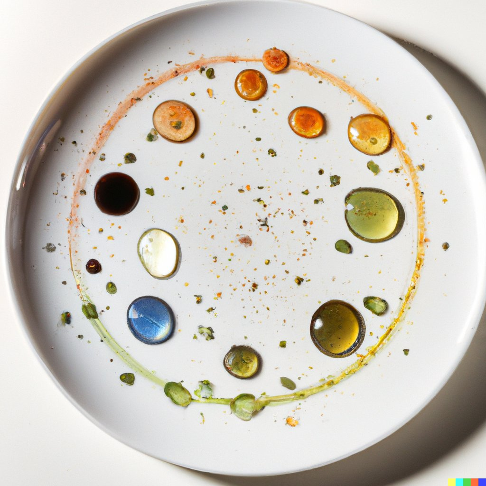
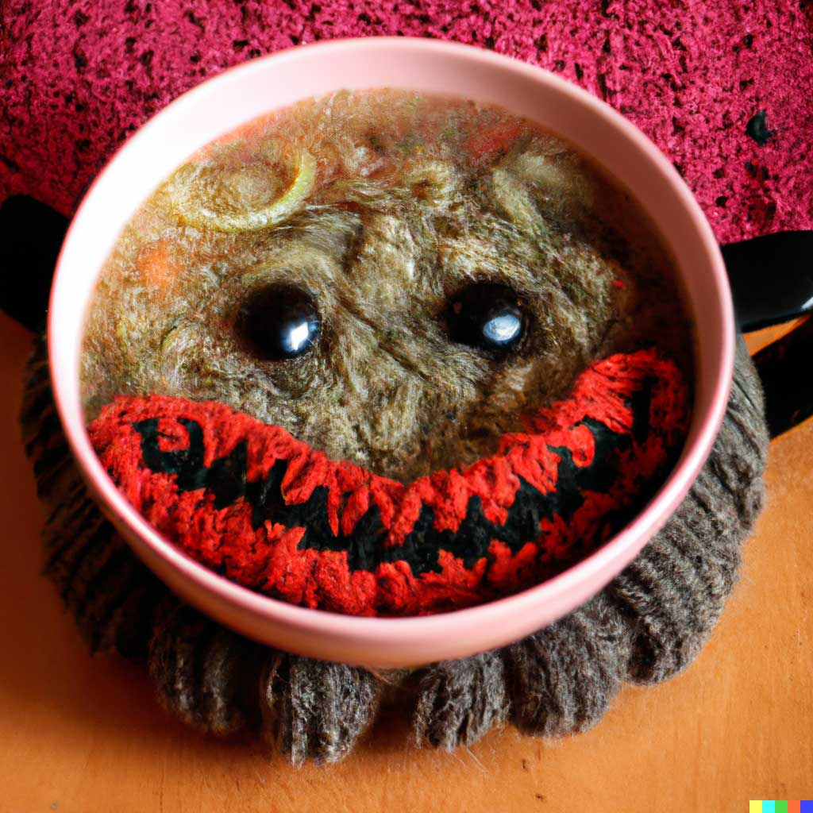
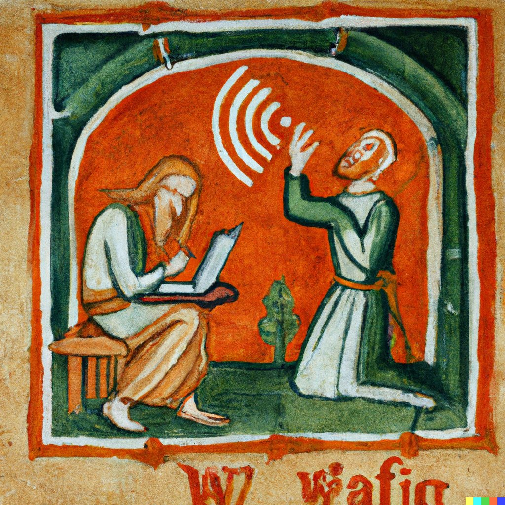
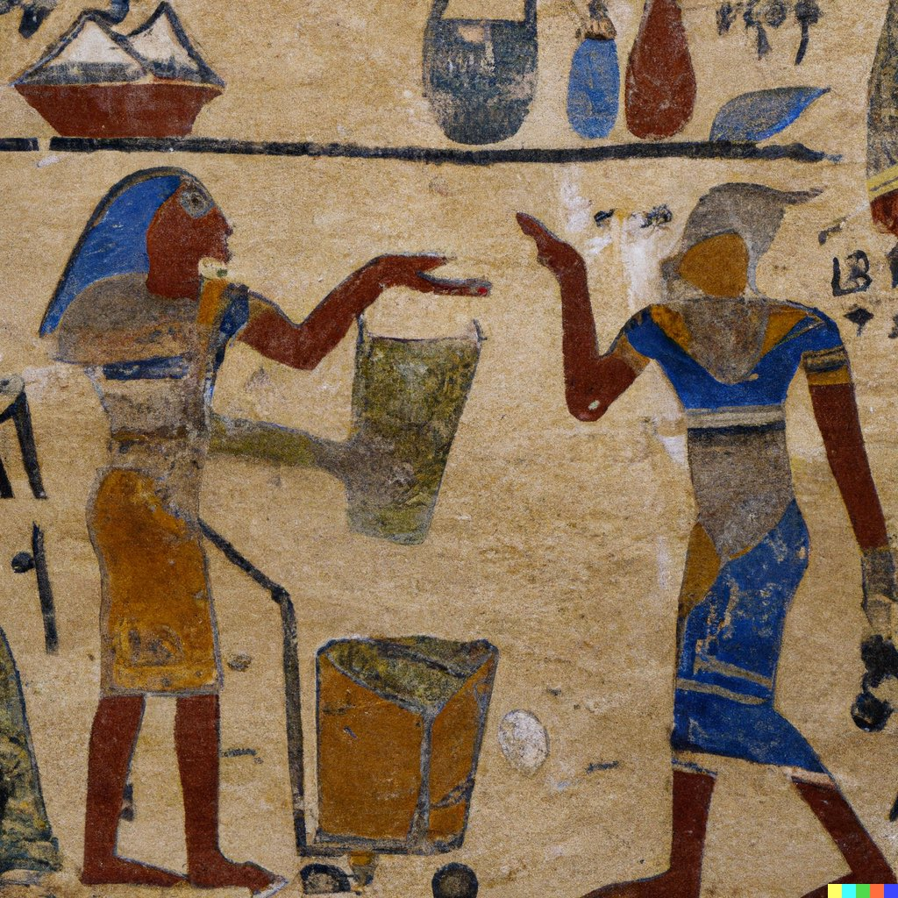
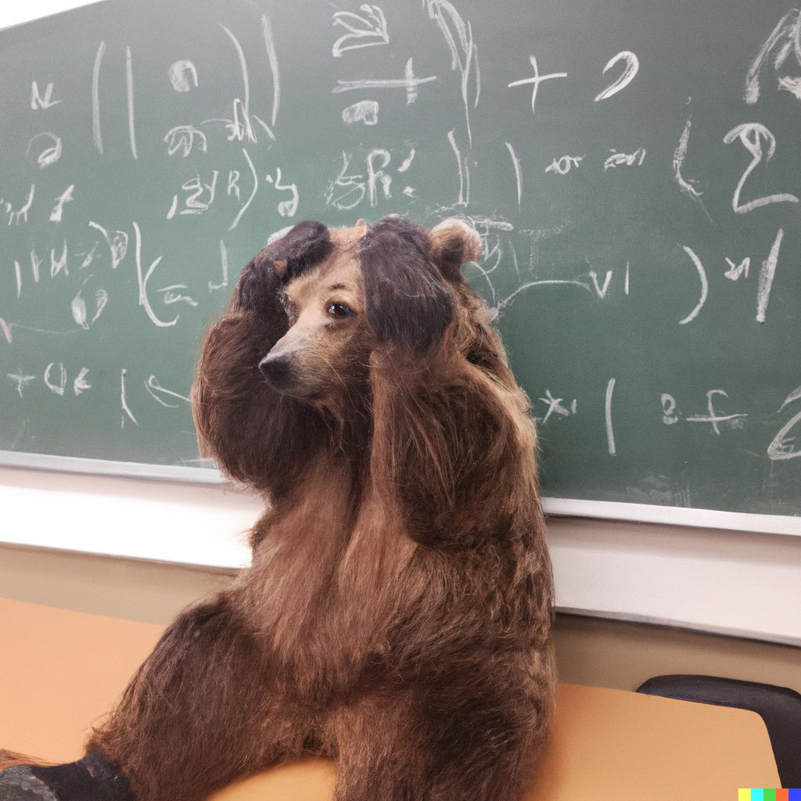
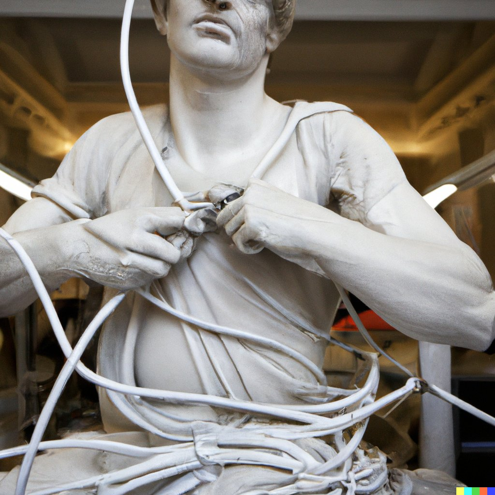
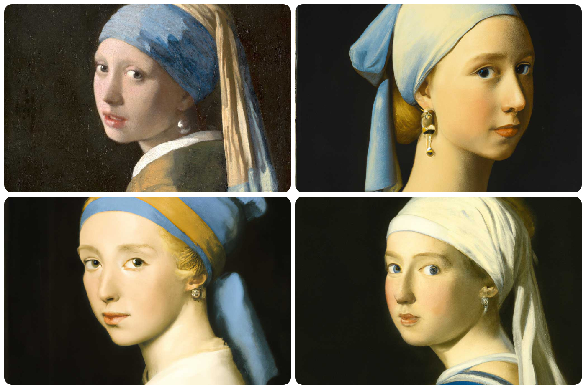
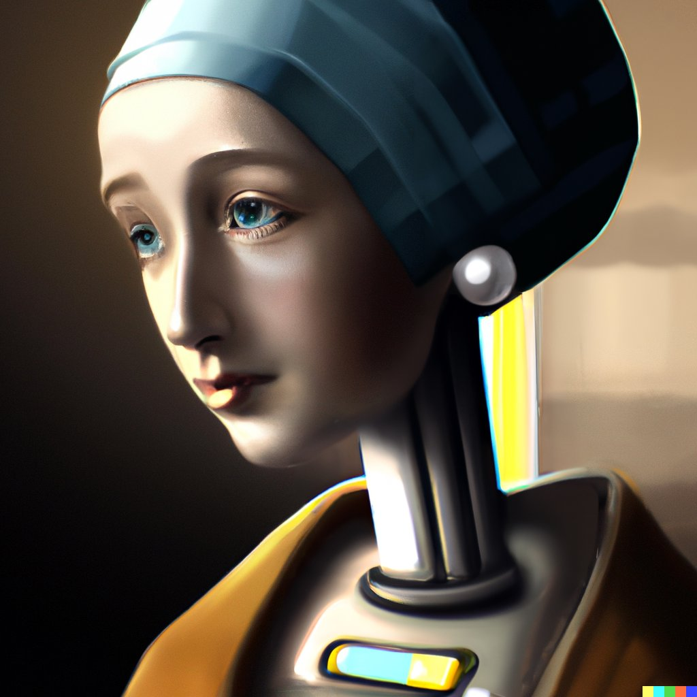
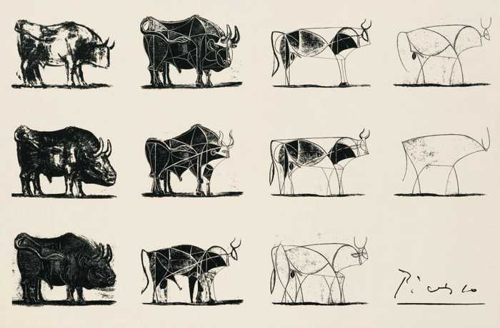

[DALL-E](https://openai.com/dall-e-2/) has been taking corners of the computer science community and the internet by storm.  People are dropping their jaws with exactly what it can do.  It hasn’t exactly made many big-time news sources, but it should because dropping jaws is the right reaction.

DALL-E is an artificial intelligence computer program that takes text and creates images.  It’s much easier to show you what it can do first than tell you.  Ready?  Here we go..

Let’s say you were sitting at your computer after a delicious dinner and there were some crumbs left on your plate in an intriguing pattern.  That made you think of planets, so you said, “I want a picture of olive oil and vinegar drizzled on a plate in the shape of the solar system.”No problem, DALL-E has your back:

That’s totally fake, never existed and looks very real.  Pretty cool.  How about “a bowl of soup that looks like a monster knitted out of wool”.  This is actually a prompt on Dall-E’s site.  Whimsical.

People have really had some fun with this too, trying to combine completely different ideas that should absolutely not make sense to a computer.  What’s really odd and surprising is that a lot of times, what you end up seeing.. kinda looks right.  The program is building things that have never been seen and probably never been asked for, and it’s doing a pretty good job.  For example, here’s a medieval painting of the wifi not working.  That was absolutely the command to DALL-E: “Show me a medieval painting of the wifi not working.”  And it’s my favorite because I think we all have felt the plight of these poor peasants.

And an ancient Egyptian painting depicting an argument over whose turn it is to take out the trash.

And a photo of a confused grizzly bear in calculus class.

People are really having a blast with this, and you can see why.  It’s a riot.  OK, a couple more before we move on.  We’ve already specified medieval and Egyptian styles, but you can really get specific with DALL-E, it doesn’t mind.  Here is, and I shit you not, this is exactly the prompt someone put in, “An IT-guy trying to fix hardware of a PC tower is being tangled by the PC cables like [Laokoon](https://en.wikipedia.org/wiki/Laoco%C3%B6n). Marble, copy after Hellenistic original from ca. 200 BC. Found in the Baths of Trajan, 1506.”  Some poor art history major was really upset with his IT.  But DALL-E nailed it.

Just like the style choices we saw, you can also start with some known piece of art and request variations on a theme.  Here are some different versions of Vermeer’s completely stunning Girl With A Pearl Earring.  None of them have the same mysterious and longing expression as the original in the top left, but if I told you a college art major or maybe even a professional painter did the others, you’d believe me.

And if your seventh grader didn’t really think Vermeer was cool enough and wanted a robot version, DALL-E has that covered.  This is a totally new version of art history.

There’s plenty [more examples](https://www.youtube.com/watch?v=alJdw4JDJ4o) to troll through on YouTube and Twitter.

## So How’s This Work?

Now that you’ve seen some of the crazy things it can do, *how* does it do it?  Like I said before, DALL-E is an artificial intelligence program.  That doesn’t mean what you think it means.  Most people think of consciousness and the ability to determine our choices. Like us, humans.  DALL-E is definitely not human.  It cannot think for itself, not exactly.  And it doesn’t have any general intelligence.  It has a very narrow focus, generating images from text input.

But given that narrow range, it does amazing things.  What DALL-E actually is, what makes it tick, is a whole lot of data.  It’s a "model" based on a massive amount of data from the internet, all of it text-image pairs.  If there was an image on the internet that was well described by some text, OpenAI probably included it. (OpenAI hasn’t actually released all the details yet.) All the data it uses had to be labeled at some point by humans.  This is why it can adhere to styles so well, because it’s something we would often note when describing a picture - “oh this one is like Egyptian hieroglyphs.”

So once it has all that data, it uses an architecture to transform text and generate the image.  The underlying architecture is actually called a Generative Pre-Trained Transformer (GPT).  As you’d imagine, it’s all *wildly* complicated. And new. The [Transformer architecture](https://en.wikipedia.org/wiki/Transformer_(machine_learning_model)) was only discovered in 2017.  The ability to accurately interpret text input and generate good output is more than a little unnerving at first.  And it’s important to remember that the reason DALL-E is so good in the first place is that the model and data itself are absolutely huge.

The other interesting thing to know is that DALL-E is a type of neural network.  Neural networks make decisions on inputs and transform data based on their model.  But for most neural networks, DALL-E included, *we can’t know how it works.*  In most computer programs, we can inspect the code and see what’s happening in the middle.  But neural networks and other kinds of deep learning are different, and there are whole subfields of computer science trying to understand [how to understand](https://towardsdatascience.com/understanding-neural-networks-19020b758230) what’s happening.

The point is that we can’t go to DALL-E and say “what were you thinking when you created this monster bowl of soup out of wool.”  All we’ll get back is a shrug, “I don’t know silly human, you gave me an input and I spat that out.  I think it’s cool.”

The more data these models have, the more accurate and unnerving they’re going to get.  It’s something we’ll need to get used to, and it has the potential to transform parts of our lives we haven’t even thought about yet.  [Dale Markovitz](https://daleonai.com/dalle-5-mins), a Google Applied AI engineer said, “It’s amazing, but not wholly unexpected; DALL·E and GPT-3 are two examples of a greater theme in deep learning: that extraordinarily big neural networks trained on unlabeled internet data (an example of “self-supervised learning”) can be highly versatile, *able to do lots of things weren’t specifically designed for.*”

### Becoming

> “What the smartest people do on the weekend is what everyone else will do during the week in ten years.”
>
> -Chris Dixon

Quite frankly, “a monster in a bowl of soup made out of knitted wool” sounds exactly like something that a fourth grader would say.  We should all be much *more* worried about what an unthinking and irreverent 11th grader or a straight evil adult might do with this technology.  DALL-E’s creators are worried about this too, it’s not trained on any porn and it’s an invite-only service right now.  There are a whole slew of other questions this technology will require that we answer, some of them much darker.  But the first thing I’ve been wondering since I saw DALL-E is: What kind of art will our kids do if they can just say a sentence into their iPad and spit out plenty of versions of whatever fun idea they have in their heads?

This instantly becomes a magical shortcut to build or describe the fantasy worlds that drive our children’s imagination.  It will change how kids are wired to build skills because it’s a whole different technology.  And it’s different in a *different way* than other new technologies.

Let’s stick with art for a second.  When the pencil was invented, our art (and writing) became neater and far easier than it was with charcoal or whatever we were using before.  Colored pencils let us write in color.  Pens are another new medium, as is painting with a brush.  And the iPad or Wacom tablets let us produce the same kind of art but on a computer instead of paper.  My order is probably wrong, but the point is that these are all tools and media that let us build our drawing skills.  We practice our drawing and get better over time, progressing from line drawings to shading to perspective and color and proportionality and realism.  As we get better at drawing, our output can more closely represent what our creativity lets us imagine. The technologies let us try different techniques, but they didn’t change how we build our artistic skills.

Picasso’s famous lithograph The Bull demonstrates this in reverse.  He starts with a lifelike and artistic drawing of a bull and breaks it down into the abstract lines that, to his artist’s eye, encapsulates the key essence of the bull.

But now, our kids can short circuit the hours and years of practice and skill it takes to be a good artist and ask DALL-E for the same thing.  Is this good?  Is it learning?

No idea!  But it is definitely new.  And it isn’t going away - Chris Dixon was right.  The kinda janky and weird things the smartest people are doing for fun today will be a part of everyone’s life in ten years.  We’re all glued to our phones the same way the supernerds among us were ten years ago when they were still new.  And ten years before that, the nerds were all online talking to each other way before the rest of us.

AI is a whole new form of technological leverage.  Eric Schmidt, the former CEO of Google, talks about AI being a new way for humans to interact with reality.  This is a view he developed with Henry Kissinger of all people.  They wrote a book together, The Age of AI, on the new landscape that’s coming our way.  He recalls some of his conversation with Dr. Kissinger on a [podcast with Tim Ferris](https://tim.blog/2021/10/27/eric-schmidt-ai-transcript/:)

> "We started talking about the Renaissance and he said that the Renaissance is really about the age of reason. It’s about individuals being able to think through their systems. It’s about society allowing experts to criticize other people. Before the Renaissance, decision-making was essentially hierarchical and from a king or a religious leader. That change allowed us to develop intellectual thought.
>
>He is arguing that we’re entering a new epoch, similar to the Renaissance, this age of artificial intelligence, because humanity has never had a competitive intelligence, similar to itself, but not human.”
>

We’ve never had a competitive intelligence, something that clearly learns or creates, however narrowly, on the same level as humans.  And we can’t understand it!  It’s a form of tacit knowledge, somehow similar to the intuition and fluidity that we undergo in our own creative process.

It’s going to take us decades to figure out how to leverage and understand this.  But in the meantime, we need to be sure not to *replace* the act of our own creativity with the idea of *our creations creating*.

About fifteen years ago, students at a high school sent letters to their favorite authors.  Only one replied and it was the inestimable Kurt Vonnegut.  His response is a wonderful reminder for us in this new world.

> Dear Xavier High School, and Ms. Lockwood, and Messrs Perin, McFeely, Batten, Maurer and Congiusta:
>
>
>
>   I thank you for your friendly letters. You sure know how to cheer up a really old geezer (84) in his sunset years. I don't make public appearances any more because I now resemble nothing so much as an iguana.
>
>
>
>   What I had to say to you, moreover, would not take long, to wit: Practice any art, music, singing, dancing, acting, drawing, painting, sculpting, poetry, fiction, essays, reportage, no matter how well or badly, not to get money and fame, but to experience becoming, to find out what's inside you, to make your soul grow.
>
>
>   Seriously! I mean starting right now, do art and do it for the rest of your lives. Draw a funny or nice picture of Ms. Lockwood, and give it to her. Dance home after school, and sing in the shower and on and on. Make a face in your mashed potatoes. Pretend you're Count Dracula.
>
>
>
>   Here's an assignment for tonight, and I hope Ms. Lockwood will flunk you if you don't do it: Write a six line poem, about anything, but rhymed. No fair tennis without a net. Make it as good as you possibly can. But don't tell anybody what you're doing. Don't show it or recite it to anybody, not even your girlfriend or parents or whatever, or Ms. Lockwood. OK?
>
>
>
>   Tear it up into teeny-weeny pieces, and discard them into widely separated trash recepticals [sic]. You will find that you have already been gloriously rewarded for your poem. You have experienced becoming, learned a lot more about what's inside you, and you have made your soul grow.
>
>
>
> God bless you all!
>
>
>
>Kurt Vonnegut
>

We’re entering a strange new world where we can outsource even our creative energies to the technologies we build.  In this new world, there’s nothing more important to remember than the act of becoming; of creating.  We can’t outsource what makes our soul grow, and kids need this kind of growth more than anyone.

Right now, we parents worry a lot about how much screen time our kids get, how much they consume.  There’s a new world coming where we’ll worry about how much of their creativity is built by some algorithm.  In both worlds, Vonnegut has the right measure of the problem.  It’s a question of becoming, of whether you can make your soul grow.
