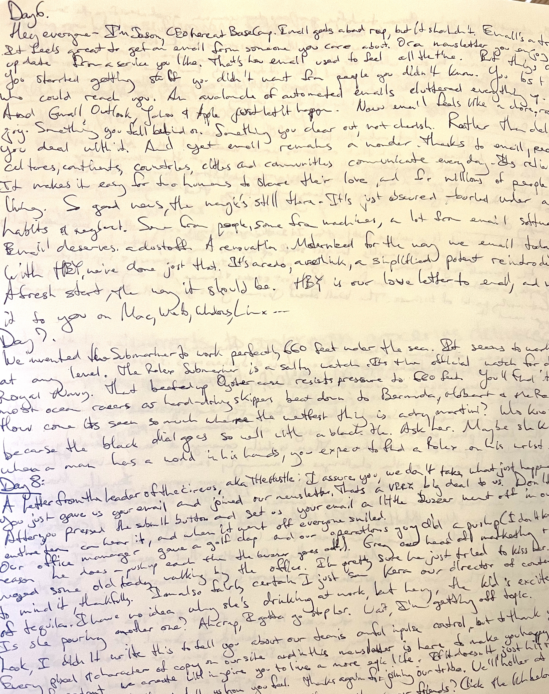

My son just started at a new school and for the last two weeks I’ve been watching him struggle through 25 math problems for homework.  Every. Single. Night.

What happens when you have to copy down the problem?  If you’re 8 years old, it starts out taking awhile.  The good news is we’ve gone from almost 3 hours down to about an hour.  We’re still grinding the time down.   The problems aren’t hard and he usually knows the answer.  Most of the time is whining and complaining and distraction.  All he has to do is write down the problem and the answer.  

It’s the writing-it-down part that has me fascinated.  I think it’s the most important part.

Earlier this year I took the excellent copywriting course [CopyThat](https://trycopythat.com/).  It was only ten days long and it was very simple.  Each day I copied - by hand and on paper - great pieces of copywriting and read through the analysis of why it was great.  This seemed lame at first, but I was a convert by day 3.  Writing it down forced me to slow down and think about what I was writing.  I thought a lot about word choice, sentence structure, overall theme and order.   It made me a better writer.

[Heart rate training](https://www.runnersworld.com/uk/training/beginners/a760176/heart-rate-training-the-basics/) is the same thing too.  Heart rate training focuses on lots of mileage in Zone 2, an easy and relaxed effort so that you can still hold a conversation and feel relatively comfortable.  Then every once in awhile you pound a high intensity day near your maximum -Zone 4.  The results are amazing.

Going slow for a long time pushes your ability to go fast.

One of the many reasons I don’t like using screens in classrooms and homework is that it takes away the manual work of copying down problems and answers.  This is not an efficiency!  A surprising amount of the learning happens in the process of putting in the reps and the work.  

The next time you want to learn something, don’t worry much about the concepts or the fancy tricks or any of that.  Just take basics and do it over and over and over.
