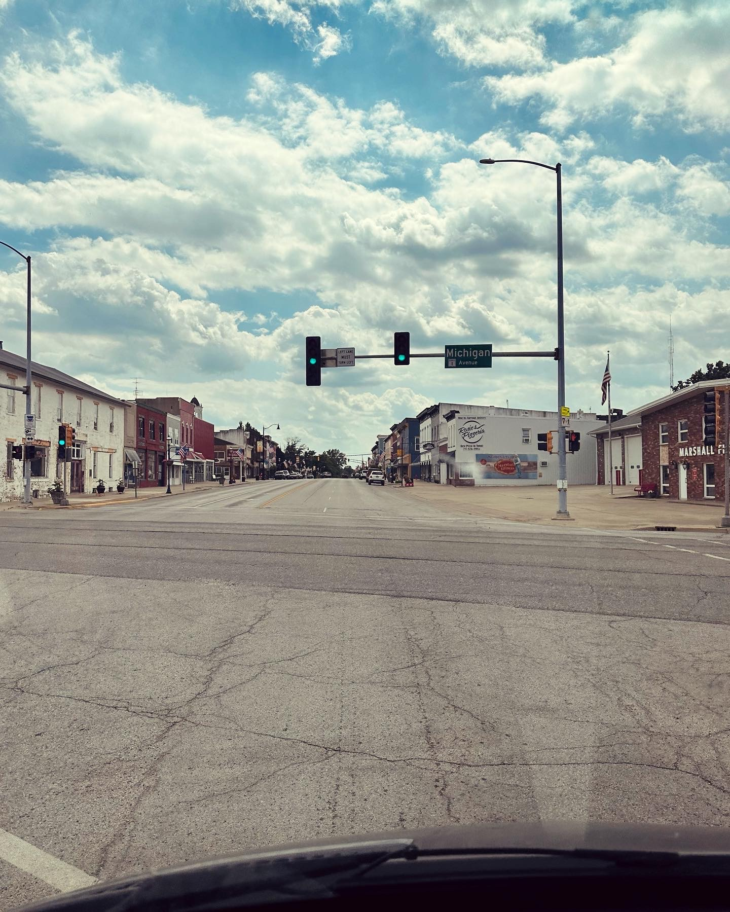
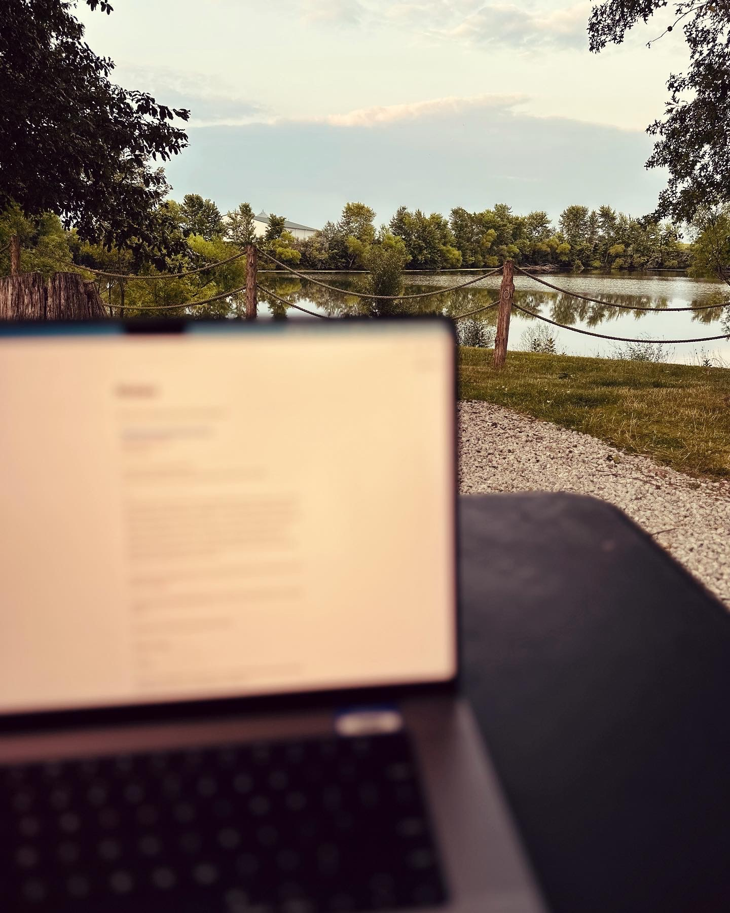
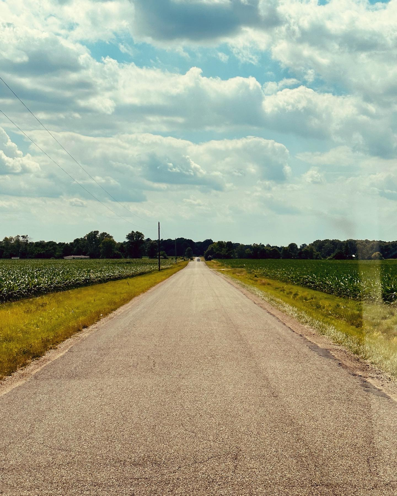

We’re one day into this.  10 hours.  673 miles.  A lot of bumps.  Some memories already.

So far, we’re cruising.  We left at 0500 and I did all of the driving today to get us out of the busy east coast.  Maureen will jump in and help on the way through Kansas.  The driving wasn’t bad.  Seating positions in bigger trucks are way better and I just threw on some podcasts and rolled.  

It was GREAT for the kids.  They slept in a bed until 7.  And when they woke there was plenty of room to lounge, there were no bathroom breaks unless it was for me, and they were all comfortable.  We made the first day the hardest, longest day and everyone was still all smiles when we arrived at the campsite.

Tomorrow’s first stop is to see two of my aunts in St. Louis and then we’re cruising across to Kansas.  6 hours and change on relatively straight roads tomorrow should feel just fine after today.  

I don’t have any words of deep insight just yet, except to say that we’re all out of our comfort zone, time has simultaneously slowed down and sped up, and that things that are hard aren’t necessarily bad.  


Ready to see more of this beautiful country!

