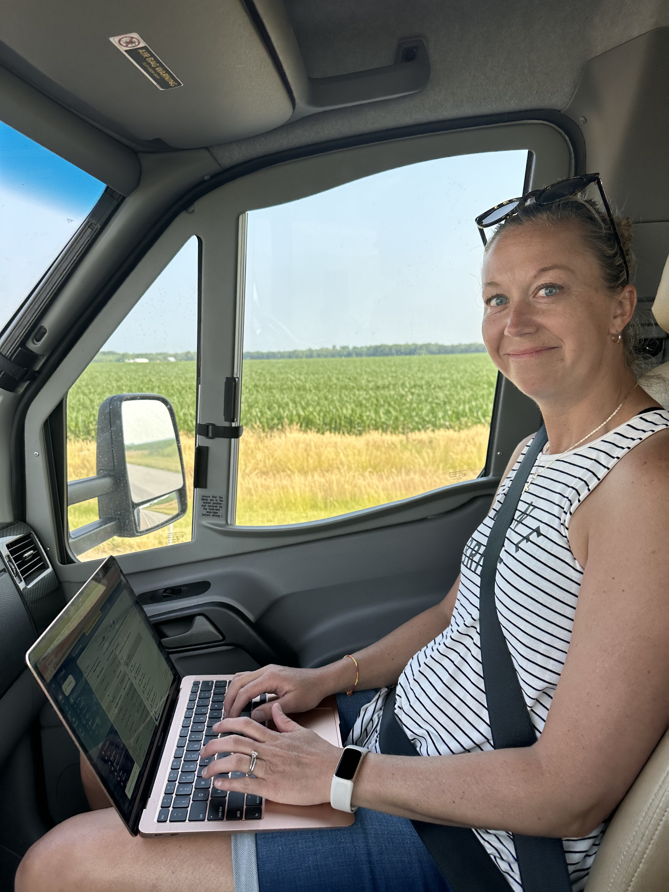
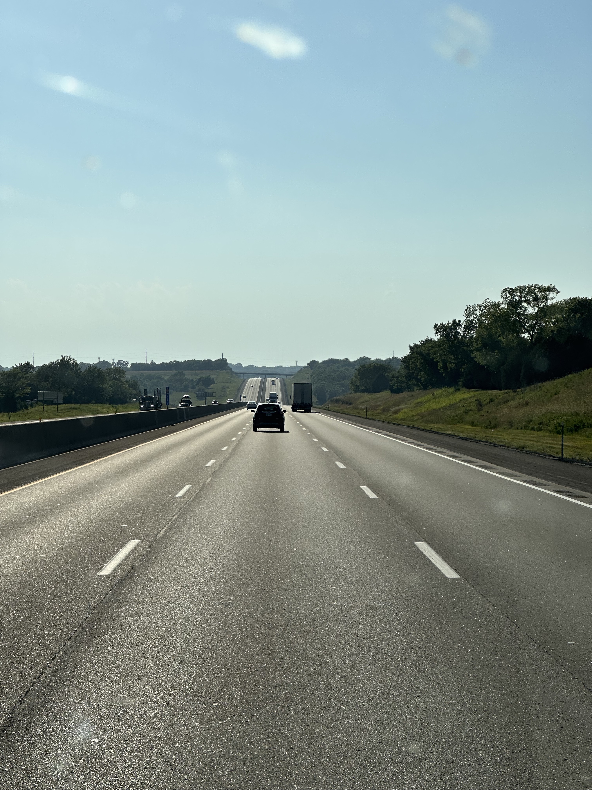
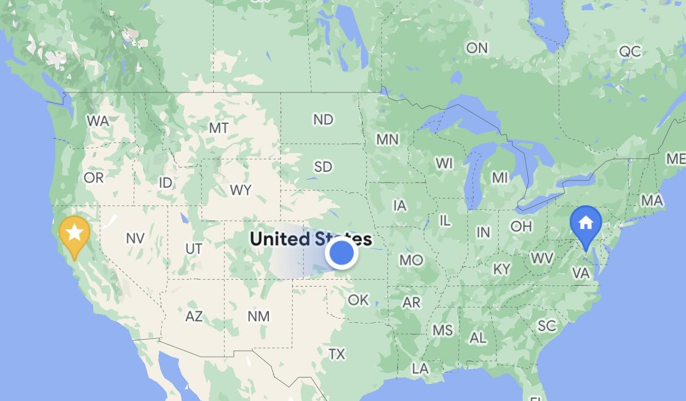
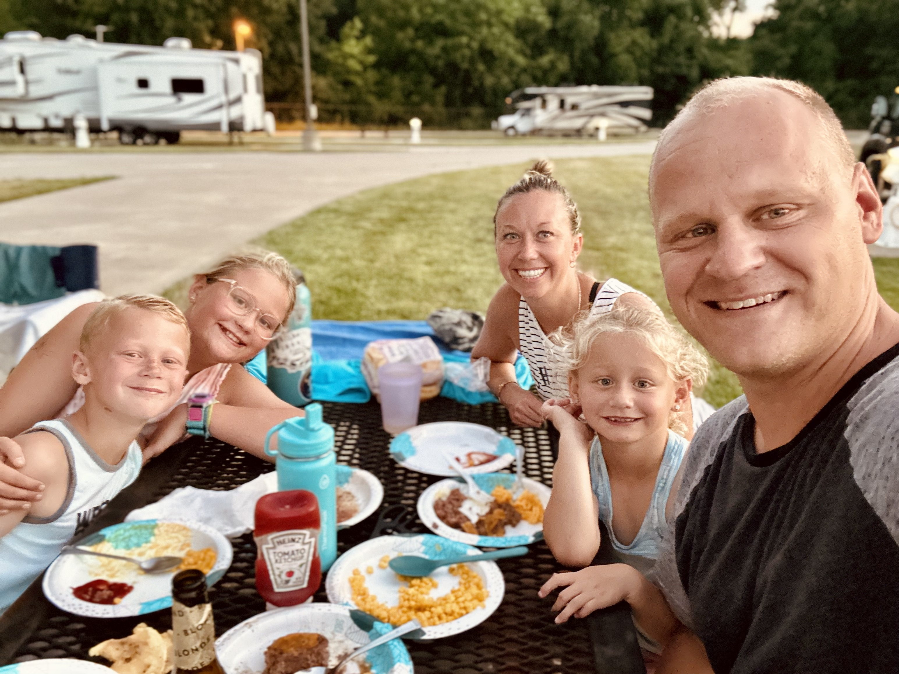
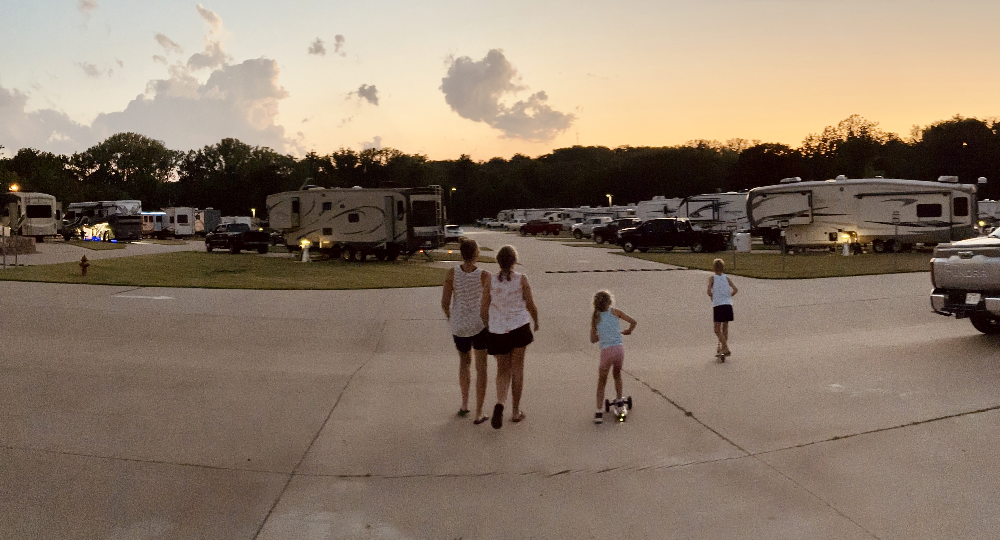
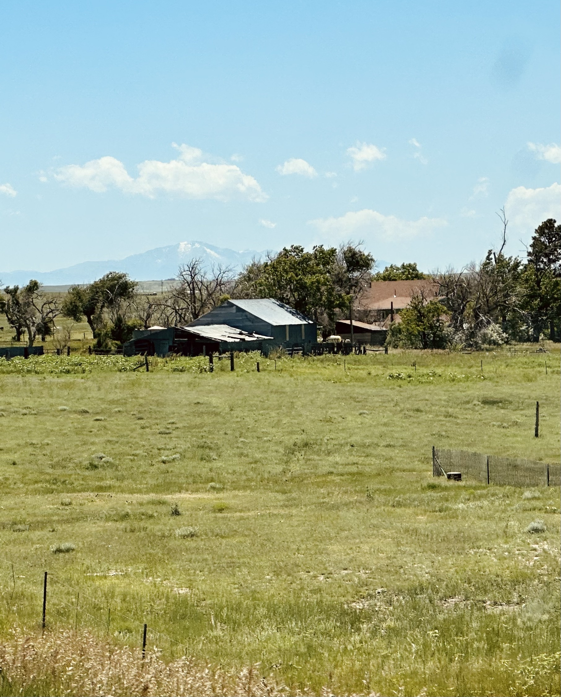
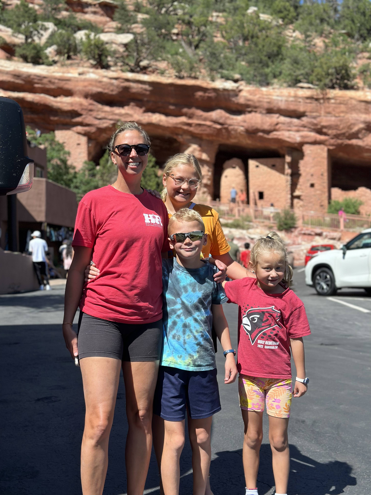
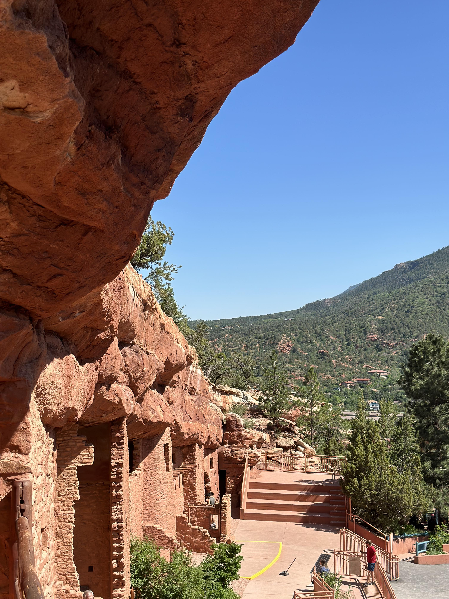

We’re on Day 3 now and in sunny and gorgeous Colorado Springs!

Day 2 was a tad more hectic than expected.  Our generator is working again thanks to a great mobile mechanic in Illinois.  And it’s a good thing because we needed it yesterday; the entire drive across Missouri was 97-99 degrees and there’s a big volume of air in the RV with 5 people.  We kept it near 80 the whole time.

Day 2 started off as a leisurely and peaceful midwestern morning.  The campsite was cool and green and a great place for tea.    We drove right through the center of St. Louis past the Arch, Busch Stadium and over the Mississippi into the west.  We had a quick visit with some of my family (who hadn’t met Maggie!) in St. Louis.  After loading up on carbs at the brunch shack we took off across Missouri.  

Missouri is a big state.  It’s not flat either.  Most of the states _around_ Missouri are flat but the Ozarks gifts Mizzoo with some rock and rolling hills.  We stopped at a huge Walmart in western Missouri for provisions and didn’t end up rolling into Topeka, Kansas until almost 7.

If the first RV park in Illinois was a bucolic interlude then Topeka was a concrete wasteland.  This was a whole different kind of place.  It was a huge expanse of concrete, perfectly manicured cuts of grass (no carpets or chairs on the grass!), restrooms that doubles as a storm shelter, about a hundred RVs already stationed and not a single soul in sight.  Granted it was still almost 100 degrees but there was literally nobody.  Then we started noticing the large propane tanks.  I took another look at the website and noted the monthly rates.  Probably a lot of longtermers.  This is a subgenre of the RV community we haven’t quite figured out yet.  Anyway, we found a couple of people at the pool and the kids broke out the scooters and zoomed every which way.  We cooked burgers on the grill and waited for it to cool down before packing it in.

We planned an early start today but between the need for sleep and workouts we didn’t get on the road until 8.  We failed miserably to find a mass at the right time (at least one website was wrong) so a rosary on the ride were our spiritual food for the day.

The third day was an exercise in patience and fortitude.  Kansas. just. keeps. going.  It’s a wonderful and peaceful drive but the patience of our kids was starting to wane.  They’ve been pretty incredible the whole time (having space to move around and pee whenever in the RV helped) but 3 straight days is a lot.  Yesterday there was a wind straight out of the south pushing the RV right all day.  Today it was straight from the north and stronger.  An RV is a driving brick and it moved and swayed a lot.  But finally we passed Kanorado, turned off of I-70 at Limon and started down the two lane highway through ranchland and wind farms to Colorado Springs.  Pikes Peak slowly grew on the horizon and suddenly the ranches gave way to suburbs and city.

We went straight to the Manitou Cliff Dwellings built into the red rock in the hills under Pikes Peak.  These were built by the Pueblo Indians during the [Great Pueblo Period](https://en.wikipedia.org/wiki/Pueblo_III_Period) 800-900 years ago.  They’re gorgeous and horrible at the same time.  The doors are only 2-3 feet tall and the whole point of them was to be able to pull up the ladders to keep safe from warring tribes.  Then it was off to the campground for the night.  This held a surprise for the kids in the form of a waterpark and slides.  They had a blast and it was the necessary sun and fun needed after 1,650 miles on the road.

