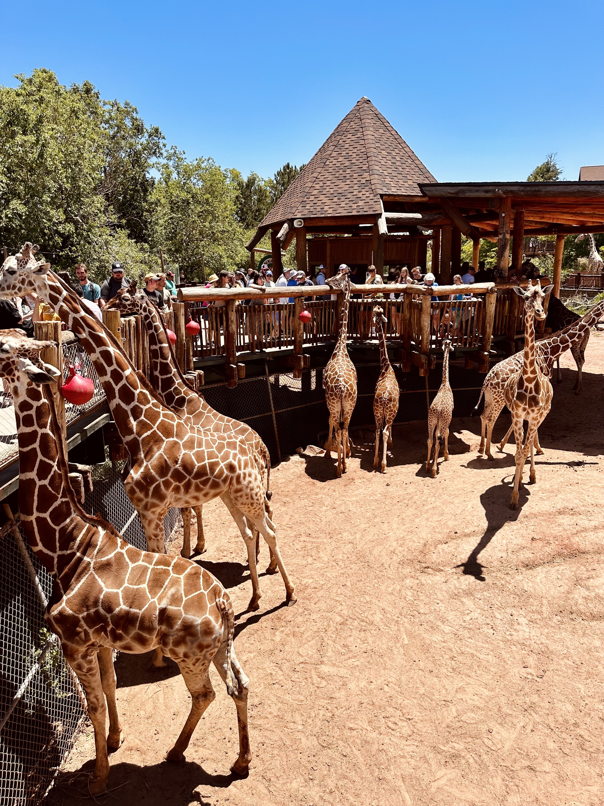
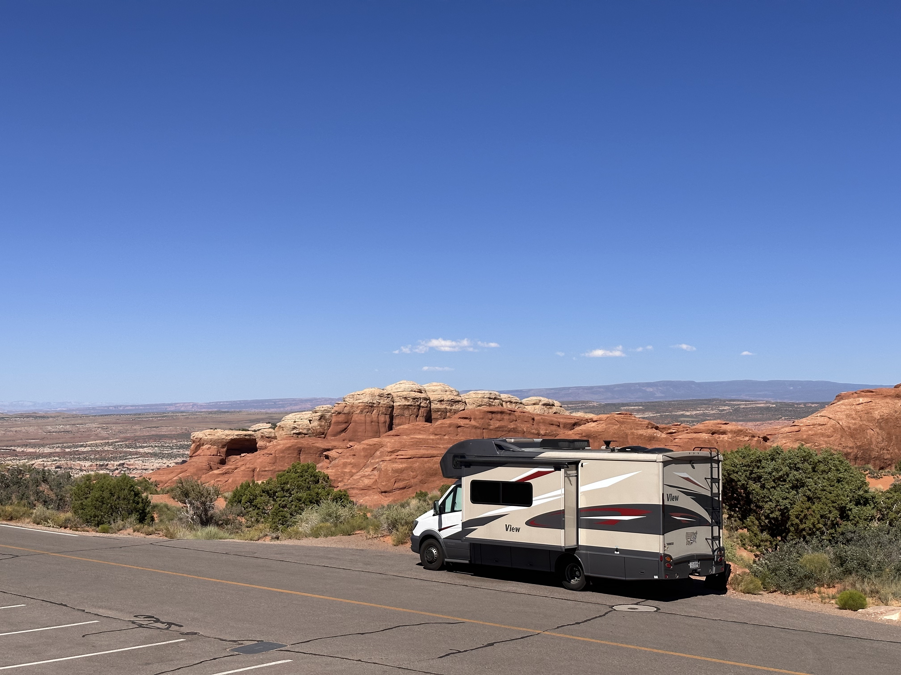
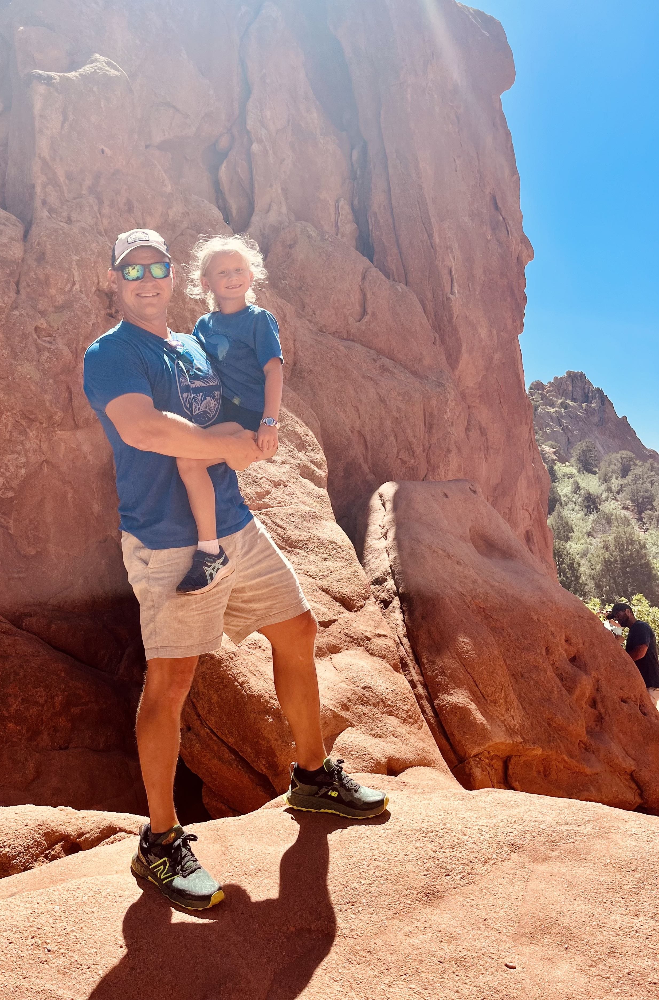
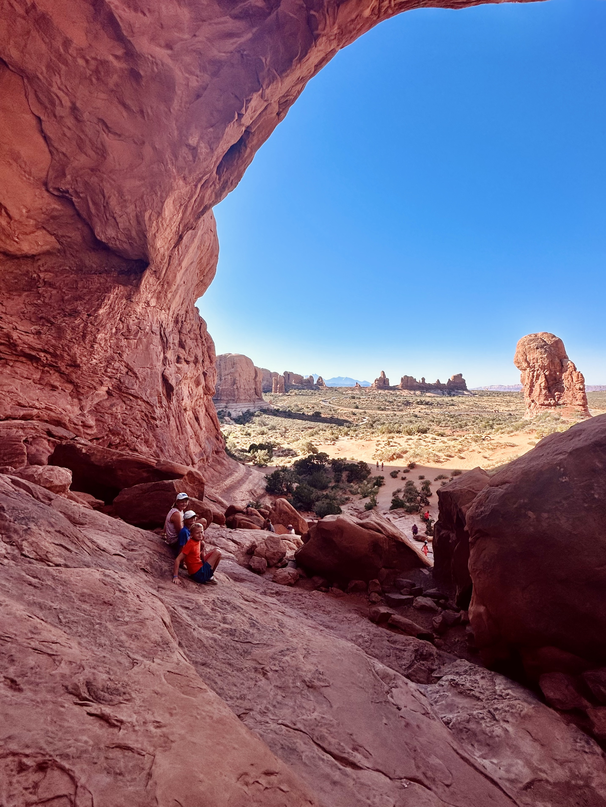
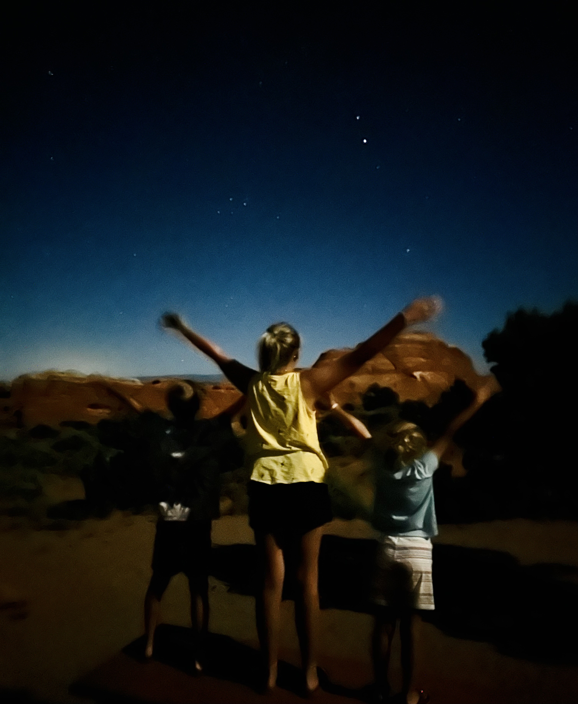

Yesterday we didn’t drive at all.  We hiked enough and I was exhausted enough that I genuinely looked forward to relaxing in the driver’s seat for a few hours today. The locals didn't seem to like Garden of the Gods but it was just right for our family and there was plenty of rock scrambling and views to keep us all excited.  In the afternoon we visited the Cheyenne Mountain Zoo - rated one of the best zoos on the continent.  It's up at 6700 feet on the side of the mountain with forever views looking east. The giraffe exhibit is the clear highlight.  You can feed them lettuce at head height about 15 feet up.  The kids ate it up and so did we.  Then it was back to the RV park for some fun in the water park and a relaxed evening before the next leg.

But today was a bit harder than expected.  Not harder.. let’s call it “more engaging”.  Once you head west of Denver you start going vertical quickly and you just keep going all the way to 11,000 feet.  And then you descend.  Quickly.  Maureen sat in the back for this part of the drive, along with a few other parts too.  

The drive was pretty incredible.  I-70 shoots through Glenwood Canyon right along the Colorado in spectacular fashion.  You have to lean way forward just to catch blue sky and you stay cast in shadow for half of the trip.  I’ve never driven a highway like that.  Then we took scenic Rt 128 on my cousin’s recommendation down to Moab and it was the same thing but crazier and redder.  The hills got red in Utah and then got _really_ red down 128.  It’s 25-40 mph the whole way and you expect a boulder to come tumbling any minute.  

We had to wait 20 minutes to get into Arches and the campground here is right at the end of the road about 20 miles in, so it made for a long day.  We went straight to the Devil’s Garden trails - maybe a mistake since it was 95 and dry.  Just off the trail is all red sand that we’re all convinced is the eroded stone of the rocks here.  The walls feel gritty to the touch and leaves a residue on your hands.  

The arches themselves are surreal, almost fake - as if Disney Imagineers had decided to start prepping their next park experience millions of years ago.  It’s weird to subject the ancient etchings of natural stone to a 21st century human analogy.  Not because modernity is so all-encompassing that we know Disney’s creations better than nature’s, but because there’s no evolutionary reason for these arches to be spectacularly beautiful to us.  What does beauty do for us?  Why do these shapes in the rock conjure ideas like majesty and divinity?  It doesn’t make sense.  This mystery is one of the cornerstones of travel.  Discovering new sites produces a rush of emotions deeply engrained in our humanity that we sometimes forget day to day.  

I’ve been thinking a lot about David Deutsch’s idea of explanatory knowledge, probably because I’m halfway through his incredible book _The Beginning of Infinity_.  Our ability to explain the world around us - to see it and understand it with more than just genetically encoded behavior seems to be the most importantly unique part of being human.  It’s this explanatory ability that somehow produces the goodness and wonder we see when we find beautiful places.  If Douglas Adams is right and the universe is the answer to a set of questions then we are as yet the single known medium that is capable of the reverse engineering needed to find those questions, and the responses we derive from our encounters with the world are the instructions and tools in our universe-hacker’s manual.  

So keep finding beauty and new experiences.  And hack the universe.

