All of a sudden it’s been a week since I last had a chance to get some words down.  Since then we’ve gone 1500 miles, hit temps of 107 and 52, had a wedding, a flat tire, and hell of a good time.  It looked like this.

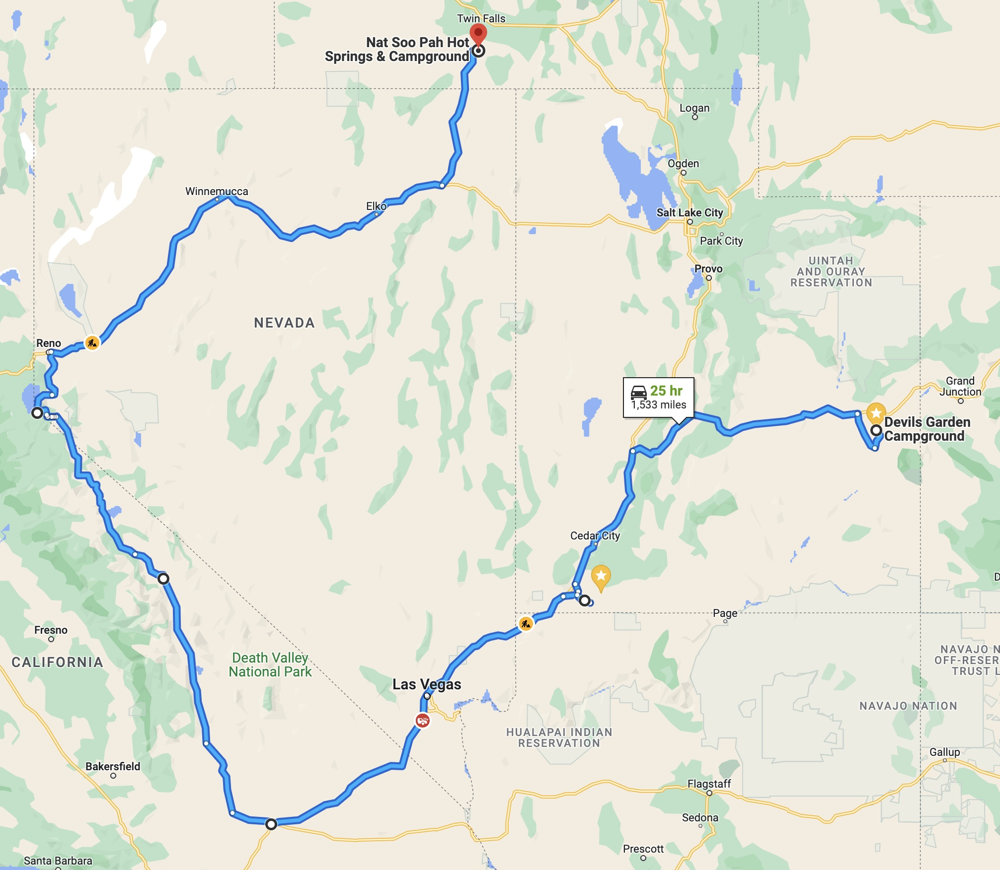

 We left Arches and drove across Utah, stopping at [The Creamery](https://thecreameryutah.com/) for lunch on the way for some pretty amazing mac n cheese.  Then we headed to Zion for two amazing days.  Zion is everyone’s favorite.  Zion is an amazing combination of mountains, canyons, desert, and the bright blue Virgin River.  Add the relaxed town of Springdale just outside the park entrance and you’ve got the right combo of scenic and bougie for us.  

Our first hike in Zion was a bit ambitious (oops) up the west rim to Scout Overlook.  The girls didn’t make it but Eric and I kept going up the switchbacks and enjoyed the views.  Then we decided to hold hands and RUN all the way back down the switchbacks.  It was insane and probably stupid considering the drop-offs and hilarious fun.  Our second hike was along the riverside up to The Narrows - the most famous hike in the park.  The canyon narrows down until you can only hike straight up the river against the current.  We ventured as far as we could.  Maureen, Eric and I went up around the first bend and then turned around.  The Right Way to do this is with dry boots and a pole and a few hours of time.  Kids can do it, but it doesn’t look as fun, so Maureen and I vowed to come back at some point just us and do it for real.  

We stayed in Watchman campground right along the river, so our kids wet their gills each day by walking down the trail and floating and swimming in the river next to the campsite.  Both nights we walked across the bridge and grabbed dinner in town.  The Spotted Dog serves filet and delicious pasta and chardonnay and rye manhattans and we felt very civilized.

We didn’t want to leave Zion but we had an itinerary to keep.  The next day was the worst drive we’ve had so far.  My cousin texted us the day before to let us know that her drive from Zion wasn’t great.  There was road construction in Nevada and some of the smaller roads through the mountains aren’t exactly designed for RVs.  So we changed the route and shot straight through Vegas through the 107 degree heat all the way down to Barstow, California just 50 miles or so from LA.  From there it was north on 395 paralleling the Sierra Nevadas up to Bishop.  We expected 6 hours and this was closer to 8, but we left extra early, we gained an hour into Pacific time and the kids were troopers.

We didn’t know what to make of Bishop, California at first.  It’s a small town at the base of the Sierras and at first it feels like there’s no real draw.  But it’s close to everything outdoors.  Mammoth is 20 miles away for skiing through July, and there’s mountain biking, climbing, camping, jeep and four wheeling, and hot springs.  It’s an outdoor activities central hub.  The town itself is old school California - dry, hot, quaint.  Between the dutch bakery and the bookstore, it grew on us quick.  

We were in Bishop for my cousin’s wedding so we went to a local pond area for the Friday night reception.  We finally got to meet the groom (Eric really hoped he’d be in his park ranger uniform) and hang out with my fam - we had 5 of the 7 cousins in one place!  Then we collapsed in our excellent borrowed house for the weekend.

We had most of the day before the wedding so we started at Pupfish Cafe.  The borrowed house was our close friend’s younger brother and his wife and our friends had been out to visit them there just a couple months before.  We went there on their recommendation as the best Belgian waffles ever.  They serve them plain and they did not disappoint.  Afterwards, we decided to stay pretty close to town and found [Keough Hot Springs](http://www.keoughshotsprings.com/) just outside of town tucked next to the Sierra foothills.  The main pool was 90 and the hot pool was 104 in the shade.  They drain and refill the 100 year old pool each week and it felt as fresh as that sounds.  Our kids swam for 3 hours straight and we worried about their endurance for the party ahead.

And then we had a wedding.  And what a wedding!  It was a 25 minute drive out of town in a tiny village called Aspendell.  You go straight up for the drive from 4200 feet to 8400 feet and the temp drops from 100 to about 70 and that suit jacket doesn’t feel like a bad idea at all.  The wedding was beautiful - right in front of some aspen trees and a little river bursting with snowmelt and then across a little bridge to the reception, some drinks, amazing bread, firepits and a dancefloor.  And our kids actually danced!

After brunch the next morning back up in Aspendell, we took off for the short drive up to Lake Tahoe.  We all had the highest expectations for Tahoe and we learned quickly that you should keep expectations low.  It.. was not our scene.  I think it was worse for Maureen (we were promised beaches!) but the sand area was small, loud and filled with obnoxious twenty somethings partying and drinking.  We tried again the next day up north on the quieter side of town and it was more of the same.  The only good news is that the beach was walking distance from a tire shop, so I could take the RV to get a flat repaired and still enjoy the day.

Tahoe is beautiful and the water really is crystal clear and I’m sad we missed out on the small coves filled with boulders you can lay out on.  A few weeks before or after probably would have been great, but the 4th of July is the big holiday and it was just too much.  We got back to the house and called an audible.  We found another hot spring in Idaho, booked it, called the Tetons to extend our stay and packed everything up.  The next morning we were gone early (after grabbing some _enormous_ pine cones for our kids) and arrived mid afternoon at Nat Soo Pah hot springs near Twin Falls.  We knew right away it was a good call.  Our kids swam and dove and slid the 4th away and had a blast.  We had a slow motion dinner under an incredible Idaho sunset.  It felt good to be back in the Glamper.  It turns out this really is our comfort zone.  We’re happy and comfortable in it and I slept better there than in the Airbnb’s king bed.  Today we’re going to take a couple of stops on the way to the Grand Tetons.  We’ve got three nights there and we’re done time zone changes until we book it home at the end of the trip.  Let’s see what adventures are next!

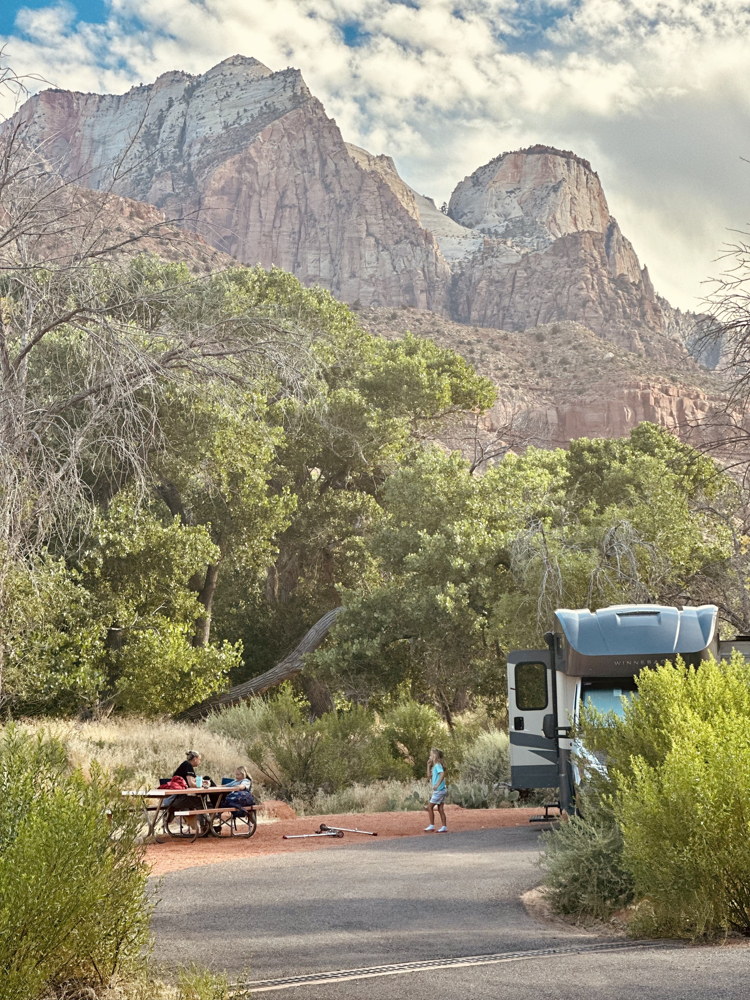
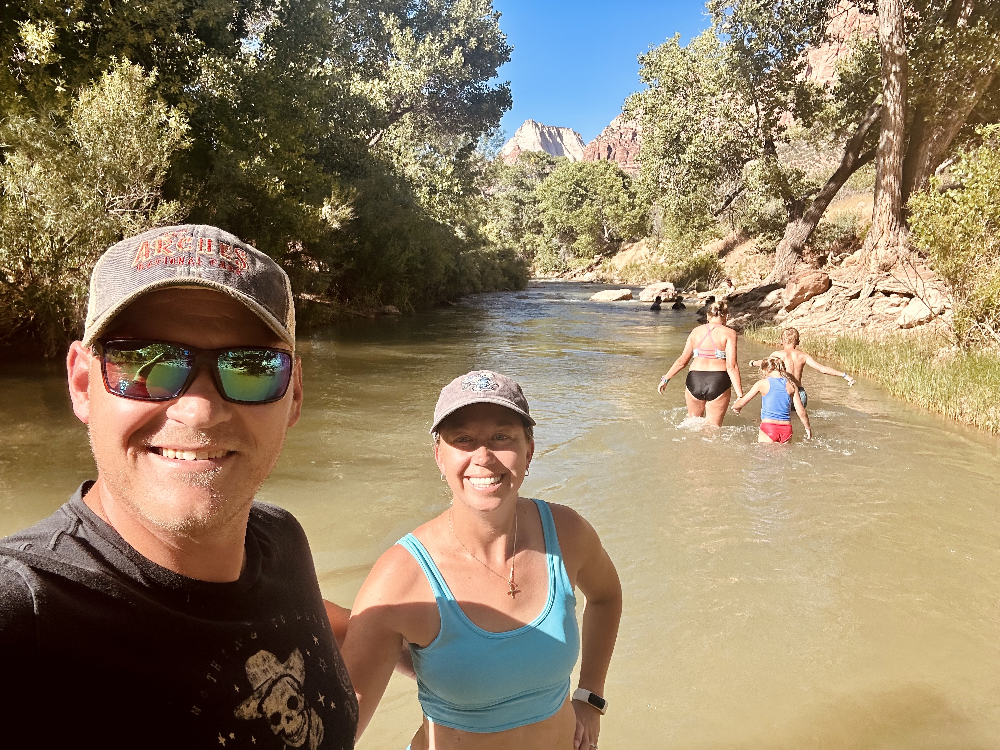
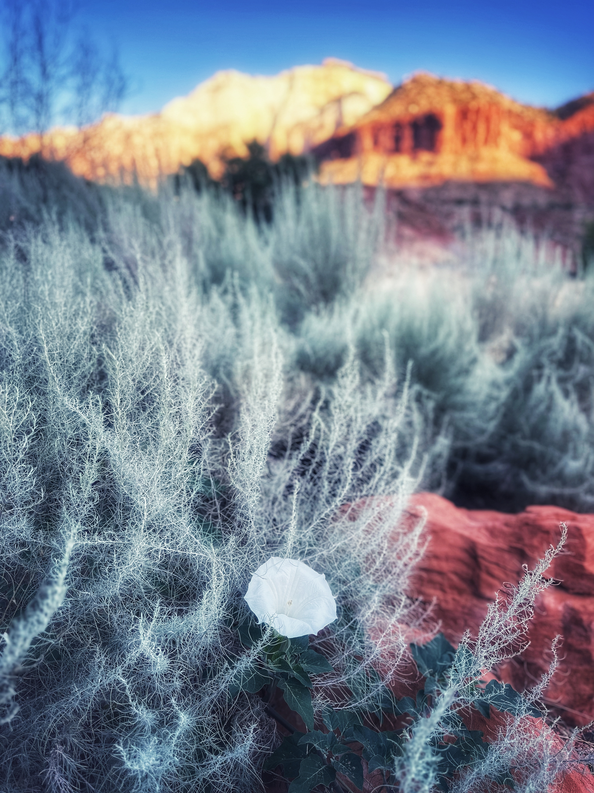
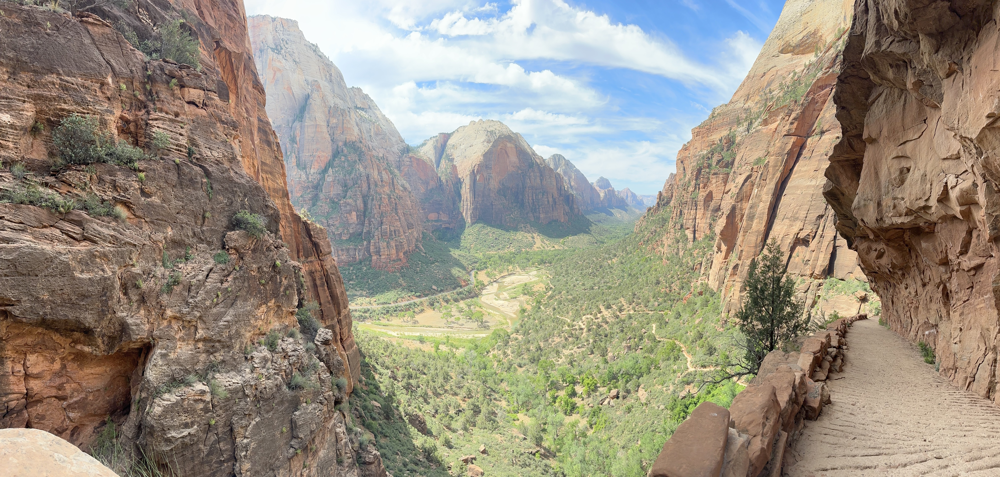
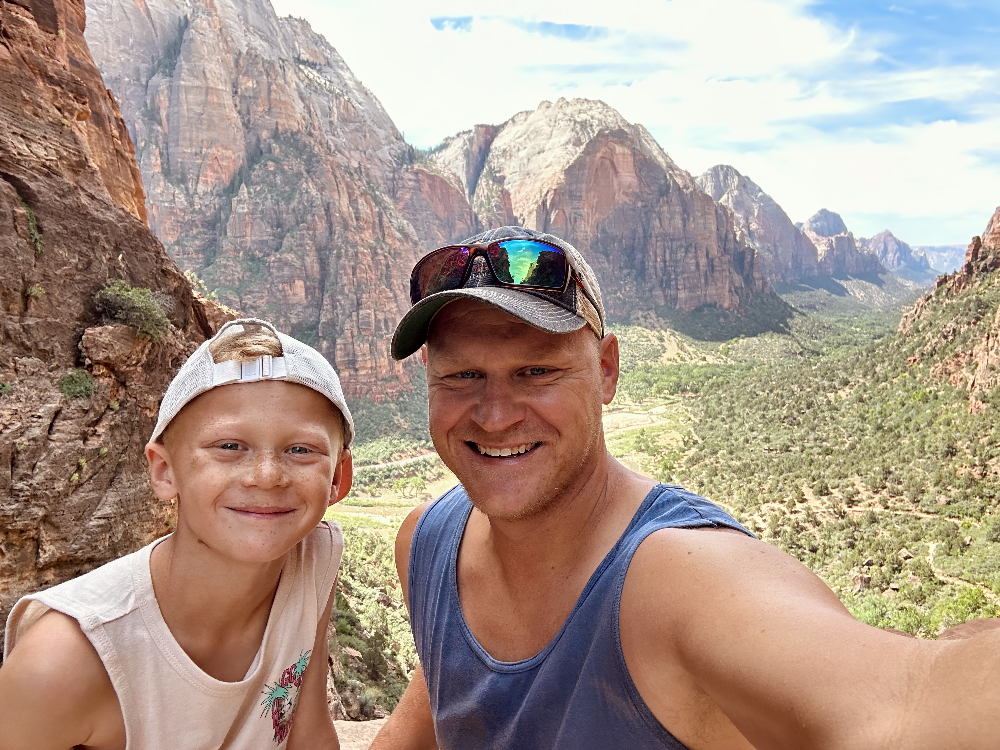
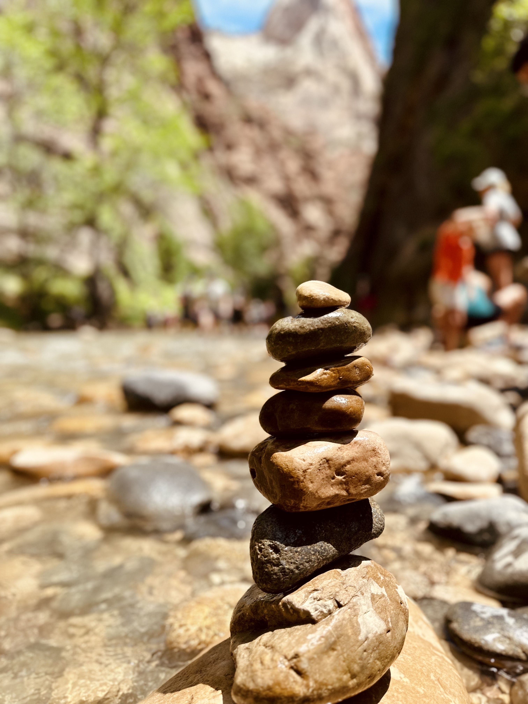
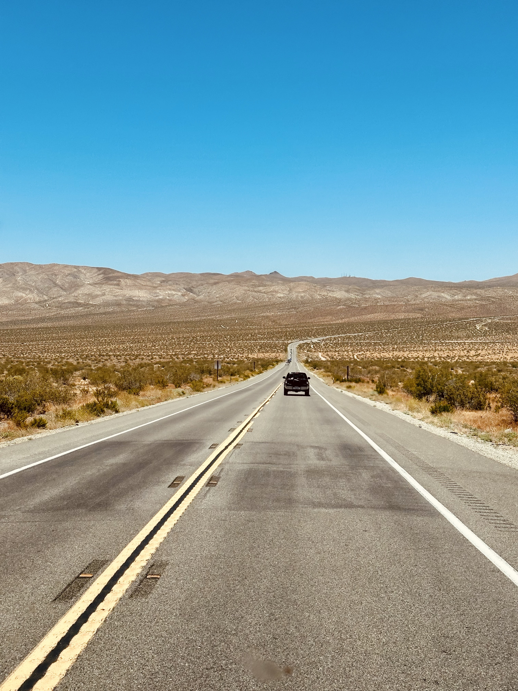
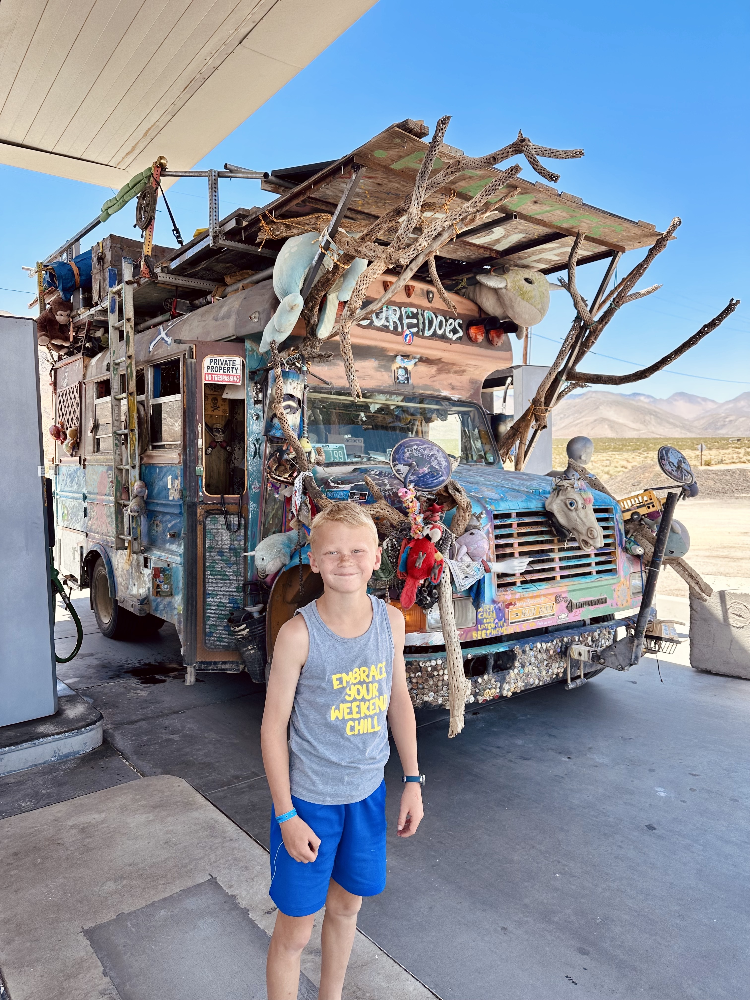
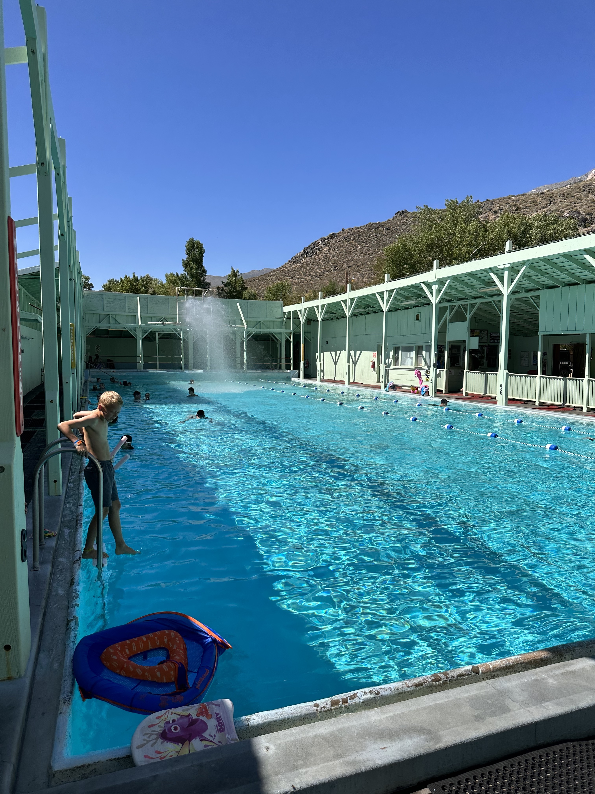
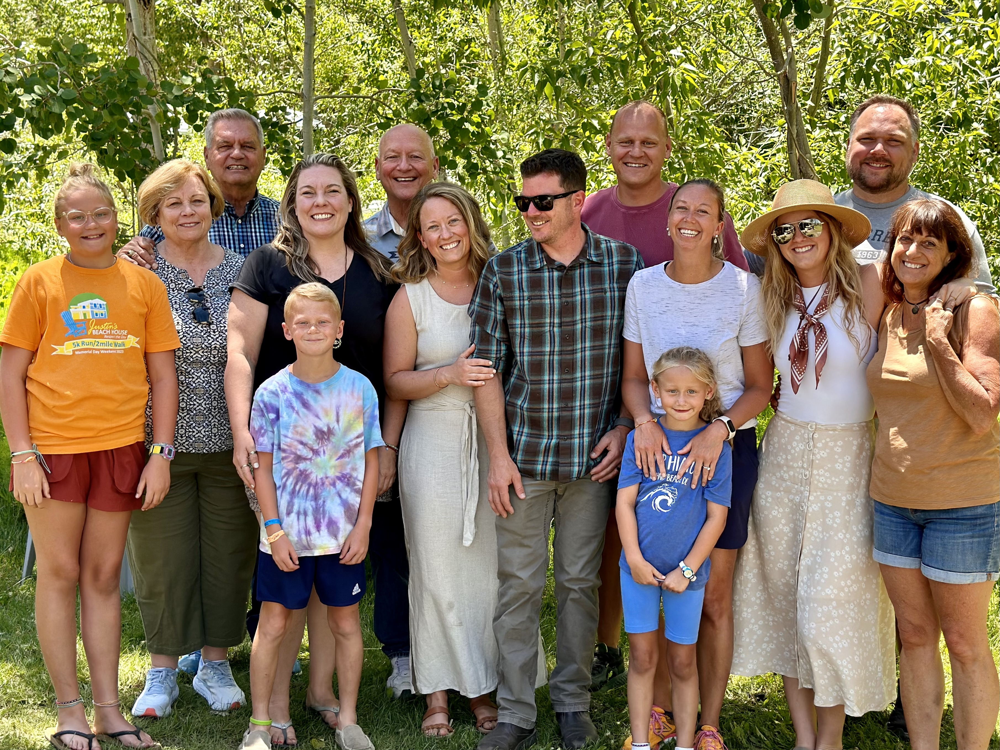
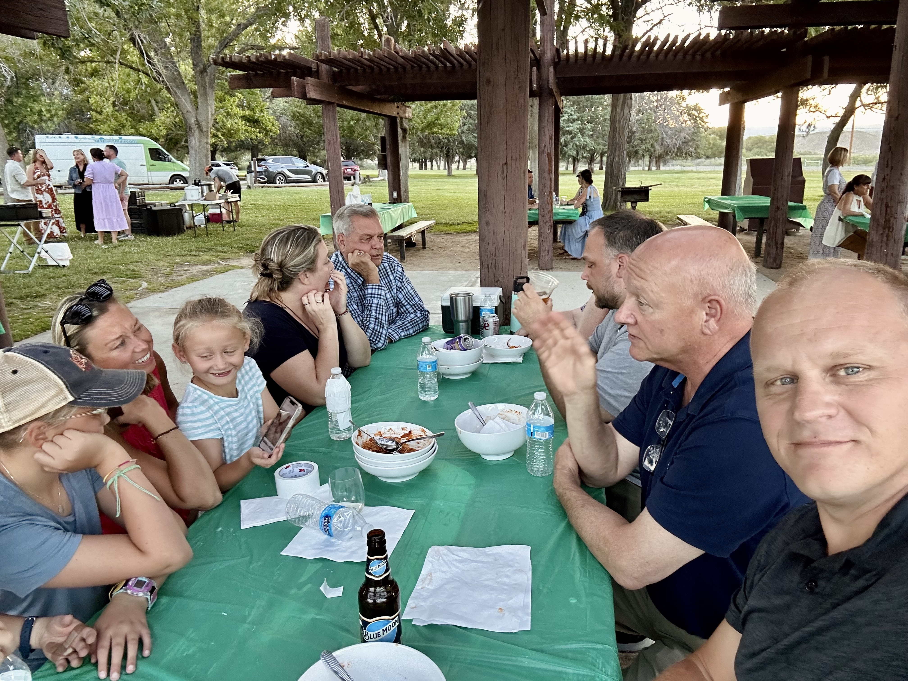
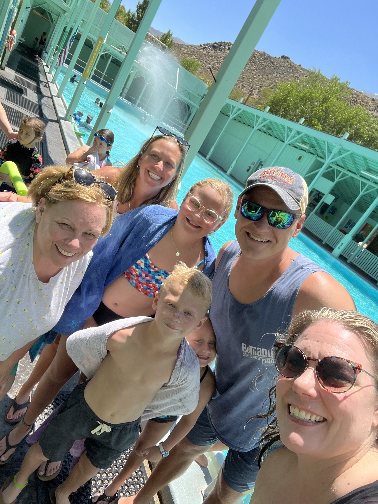
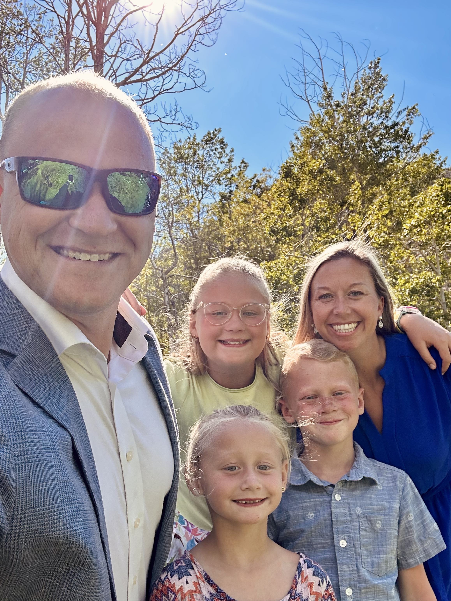

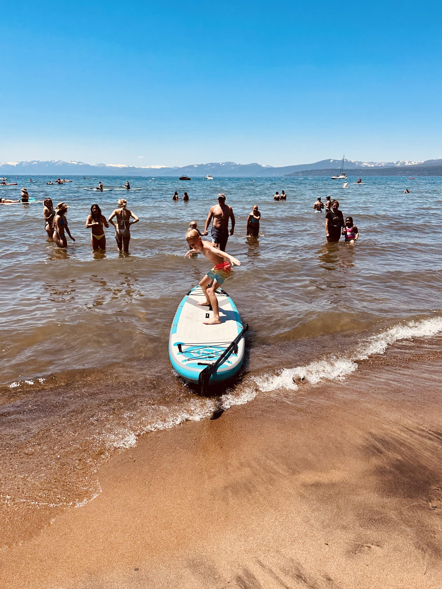
