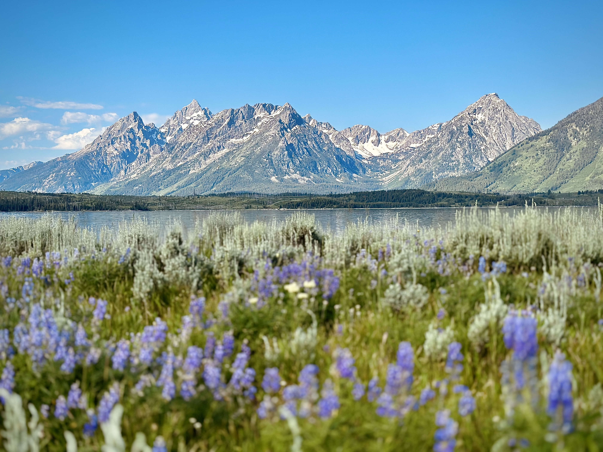
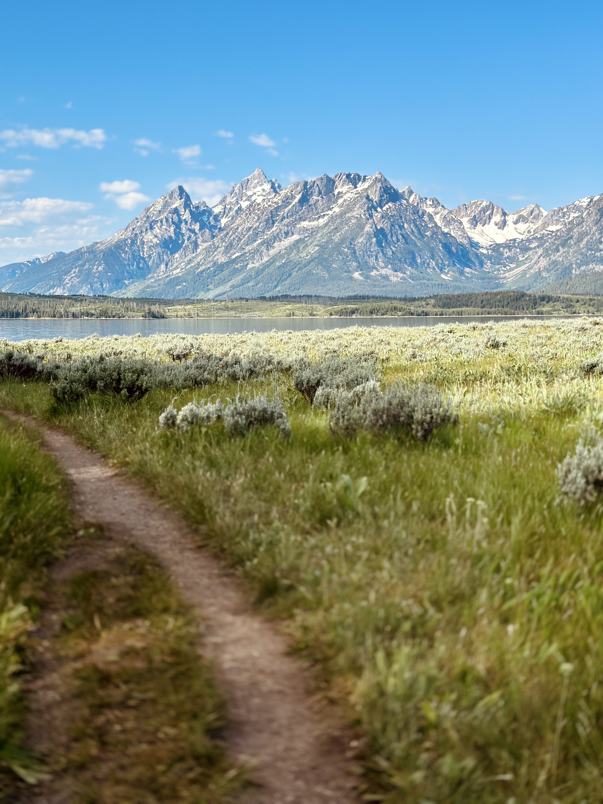
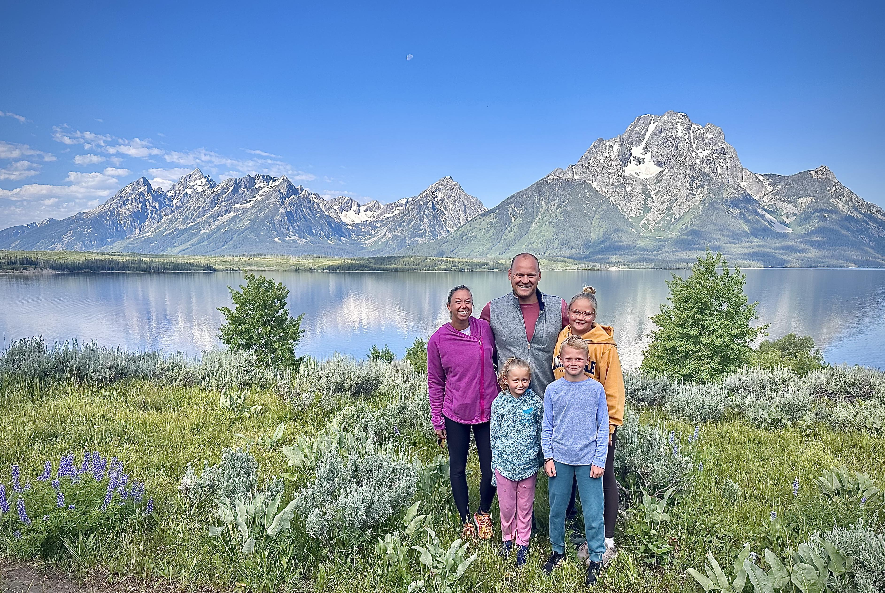

We met a family in Idaho with 3 kids that was on the way to the Tetons the next day for their second trip.  They had come from Washington state and met up with extended family in Idaho for the 4th before moving on.  We got some great recommendations from them for the drive to Wyoming and we tried them all out.  And they nailed it!

They also proved that we weren’t crazy to like this lifestyle so much.  During Covid they got out of dodge and spent 8 months on the road with their young kids.  Just this year did they rejoin the usual schedule of school and sports activities.  Hearing (and seeing) the peace and comfort they had together was affirming that we weren’t off our rockers.

Their first recommendation was to hit Shoshone Falls just up the road in Twin Falls.  Shoshone is called the Niagara of the West and it’s a beautiful waterfall coming down through a canyon just outside of town.  $10 to park and a walk down to take it in made for a nice stop and helped make the drive feel shorter.

After the falls we drove on to Jackson Hole in Wyoming.  I checked the route over the mountains and got lucky to avoid the Teton Pass, which climbs to over 10,000 ft with a 10% grade both ways.  Not great for the RV.  Instead we went around and added ten minutes and stopped in Jackson.

Jackson is a fantastic town.  The vibe is a combination of wild west saloon (which they push for us tourists) and high-style mountain.  The real estate windows all have multi-million dollar cabins with views.  There was FREE parking with spots for RVs just two blocks from the town square.  We explored the town square (with massive elk antler arches), the stores, and sights and got ourselves into trouble shopping.  

After dinner (I had an excellent Belgian beer called Avarice & Greed - love beer names), we took the road up into Grand Teton National Park.  We hit it right before sunset.  Out of Jackson, you drive next to a series of rolling hills.  Then you turn around them and BAM— the Tetons hit you in a flash and take your breath away.  It was the best reveal and we were all laughing.  That’s the kind of splendor they have, they make you laugh.

The entire drive up to the lodge the sun played hide and seek behind the different peaks, popping in and out.  Cars were parked at every turnout and people pulled our chairs and grills and cameras and enjoyed the slow reveal.  It’s refreshing to see lots of people take the time to just sit and watch a sunset, even with a magical mountain backdrop.  Even when we turned away from the mountains, the drive wasn’t done with us yet.  We drove right into a herd of bison right next to (and on!) the road.  Seeing bison was a big hope for Maureen and she was squealing and snapping bad pictures as we pulled over.  But finally we made it to the [Jackson Lake Lodge](https://www.gtlc.com/) and checked in, where the lobby has 3 story windows that perfectly frame the mountains.  

Our first cabin was nice but there was a funny scratching noise.  This made more sense when we discovered a pile of sawdust in the corner and an even bigger pile of sawdust above the windows.  A huge colony of ants were poking out through holes in the beams and pushing the sawdust out.  Maggie freaked just a little bit and we got a new room within an hour and crashed.

Our first full day in Wyoming started with a buffet breakfast and a drive down to the campground and the rocky lake beach.  Then we took off for Teton Village, the ski resort just outside the park.  The summer only shortcut road was closed so we had to backtrack through Jackson to get there, but it was worth it.  First up was a 12 minute tram ride up to the summit at 10,500 feet.  There’s a small cabin there that serves waffles which served for an oversaturated, sugary and very delicious lunch.  Eric and I found snow in July (Eric made a snowball) and we hiked around the summit.  We dropped back down, explored some shops  and then took another gondola up to the other restaurant at 9,000 feet and had a drink.  Talking about the views don’t really do these places justice.  Looking back from the summit is Idaho, but in front of you laid out like a map is the entire Jackson valley - a hole is just a wild west word for valley.  You can see all the way back up the park and down past the town of Jackson.

We liked Jackson so much that we stopped again the second night and hit some more shops and got in some more trouble.  Then back to the lodge for a late dinner at The Blue Heron lounge.  How could we NOT go to the Blue Heron?!

Day 1 in Wyoming was still just a warmup.  Day 2 was unforgettable.  We woke up early to get down to the marina by 7 for our boat cruise.  They haven’t done boat cruises in a couple of years because the marina has been dry.  Not enough snowmelt from a solid winter.  Even this year, 8 weeks earlier the water was too low.  We took a slow and pleasant cruise out to the middle of Jackson Lake - the mountains kept getting bigger - and landed on the south side of Elk Island.  We were greeted by the best hot chocolate, coffee, and a small fire, and then we had an incredible buffet breakfast in a meadow that felt like it was right under the mountains.  Fresh trout, eggs, bacon, sausage, pancakes, fruit, muffins and it felt like we were the only 30 or so people for miles- which I think we were.  It was clear we all felt peace here, including the kids.  They were quieter and happy the whole time, taking it in.  Maureen and I couldn’t stop smiling and laughing at our supreme good fortune.

After breakfast we took a small hike up the nearest hill for an even better view.  We took some pictures and took it all in.  All of us could have stayed for longer, but after a couple of hours on the island it was time to head back.  I haven’t had a morning like this in a long time.  It was a sense of total peace, complete detachment from the world and engagement with nature.  I know Maureen felt the same way, and I think our kids felt some of it too.

