A cross-country RV trip is on a lot of people’s bucket list.  We’ve gotten a ton of “I’ve always wanted to do that!” over the last few weeks and I’ve had several people ask about how we setup and planned this trip, so I wanted to try to consolidate some of the key practical points about it in one place.  If you want some more seat-of-the-pants stuff during the trip, [that’s here](/23-impractical/).

First things first: This is _entirely possible_ even with young kids.  Second: **you should definitely do it.**  Ditch your expectations and just roll with whatever you end up doing!

Here we go:

## RV Choices

- I highly recommend [RVShare](https://rvshare.com/) as a starting point for finding your RV.  It’s basically Airbnb for RVs.  There’s plenty of criteria to select from, you can specify your trip and mileage, and converse with the owners.  Note that some RV sellers and commercial services also use the platform and you will get some offers to your inbox from them.  We had great luck with the private owner we worked with and recommend that.
- I do NOT recommend using CruiseAmerica or El Monte or any of the big rental RV companies.  First, you’re getting very used equipment that has only had inexperienced short-termers in it.  Second, these companies are buying the budget low-option models for rental.  Expect lots of vinyl and plastic and the simplest layout.  
- Most importantly, these E450 chassis RVs that the rental companies use are slow, lumbering beasts.  They have diesel options, but every one we saw was gas.  We cruised the highways at 70-80 mph and consistently passed CruiseAmerica’s doing 60-65.  I’m sure some of that was the driver, but they looked very unpleasant to drive.
- Private owners will take better care and upgrade their rigs based on their experience, which is a huge advantage.  The owner of ours had done a few useful upgrades to make the entire experience much better.  A very simple example: he added Crossfire tire equalizers on the dually rear wheels for peace of mind on tire pressures.  Considering we had to do a patch on a front tire during the trip, this felt great.
- As a complete newbie, I drove down to Virginia to see the RV a couple months before our rental.  I wanted to get familiar with the driving experience and make sure it felt right and we weren’t walking into something that didn’t fit the pictures.  
- The owner also let us take it for a weekend-long “test run” to Williamsburg to make sure we were comfortable and knew the systems.  This lowered the stress and worry of taking off across the country in something new.
- For up to 3 children, I highly recommend a Mercedes Sprinter based Class C.  It’s a breeze to drive and still extremely agile for it’s size.  We had a 2018 [Winnebago View 24J](https://www.youtube.com/watch?v=tPaRaLbVNCs) with our 3 kids and it was plenty of space.  More than 3 kids and I’d recommend a small Class A (27-32’) with bunkbeds.

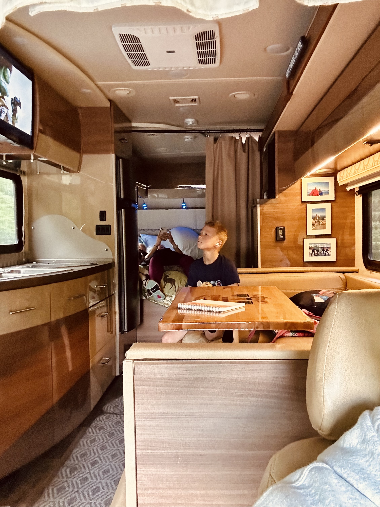
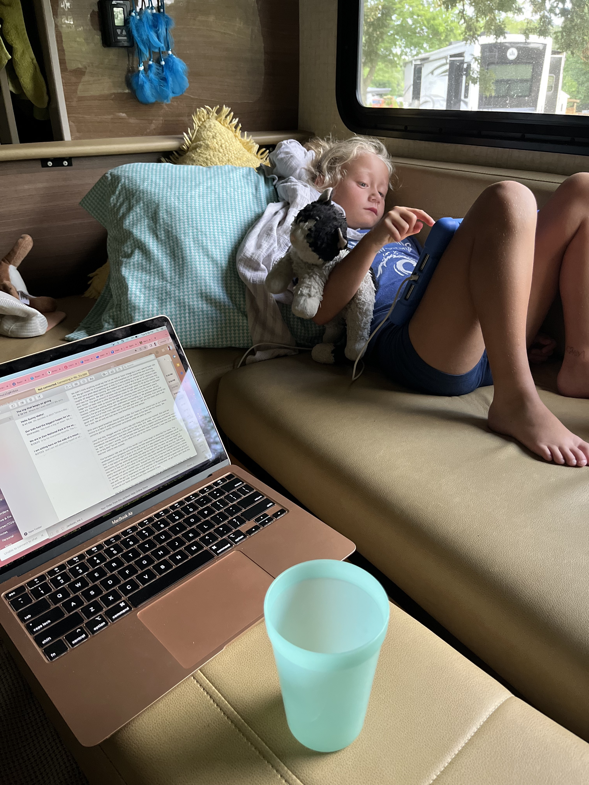

- The 3.0L turbodiesel in the Mercedes chassis in particular is amazing.  We were getting 13-14 mpg even with me driving, and others report 15-20 in a Class C.  That’s really stunning in a 10,000 lbs. vehicle - I remember towing behind a truck and regularly getting 8-9 mpg.  With a diesel you do need to add DEF (Diesel Exhaust Fluid) every 500-1000 miles.  This is not a big deal and is just like adding washer fluid, but it is something additional.
- The View had tons of outdoor storage space.  We took with us 2 inflatable paddleboards, 4 life vests, 3 helmets, 3 scooters, 5 chairs and a table, firewood, a propane griddle and propane, outdoor carpet, weights, backup fluids, and tools.
- There was never a time when we worried about the size of our tanks.  We always had plenty of room to spare even when we went a couple days without pumping and dumping.
- We come from a king bed at home, so you’d think the double would have been tough.  But it was great!  Very cozy, comfortable and both Maureen and I slept better in the RV than in the Airbnb we rented.
- An RV has a few big advantages over a pull-behind travel trailer or 5th wheel trailer.  First, everyone but the driver is not in a car while their driving.  You can watch TV, sleep on the bed, play Uno at a table, eat lunch, and pee all while on the highway.  There are different state laws on seatbelts in an RV but you get the idea.  Trailer setup also took longer, especially if they were disconnecting the tow vehicle.  They had to deal with the hitch, chocking wheels, and the leveling process was more extensive.  Everything took longer.  RV is the way to go, especially for a rental.

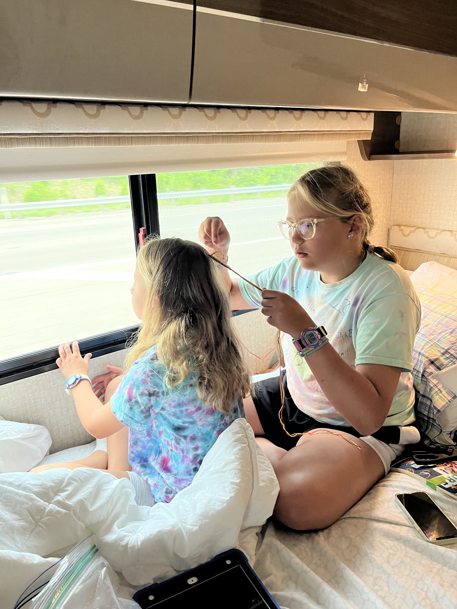
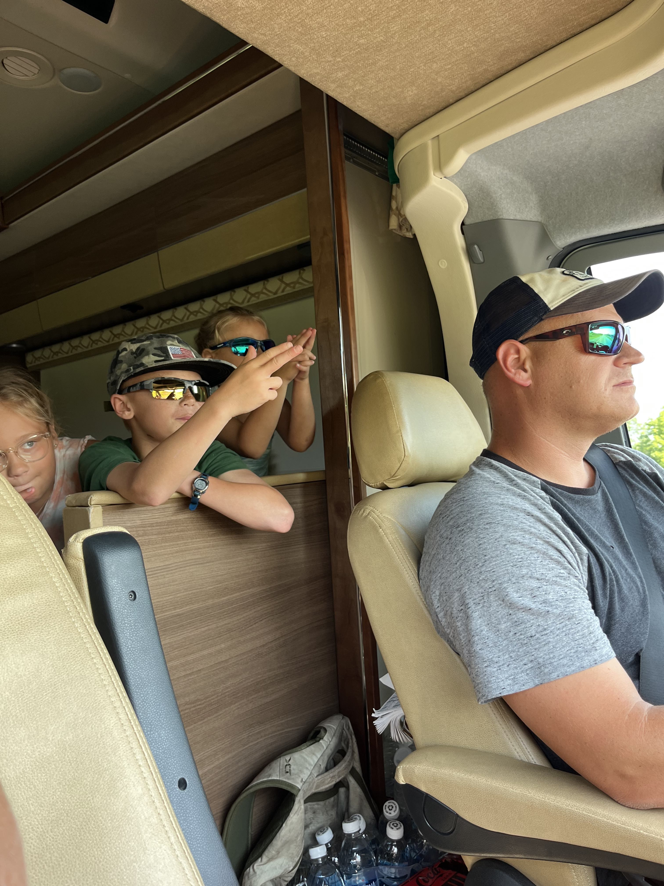

## RV Systems

There’s a few new systems on an RV, but it’s all pretty simple.

- There are house batteries separate from the car batteries.  With your inverter you can have power outlets and lights and water pump while on the road.  Solar panels can help charge them, otherwise you need to plug in or use the generator.
- The propane generator is just a Start button push on the control panel and will run full AC or heat and everything else.  We only needed to use this when it was very hot outside and the car AC couldn’t cool the entire volume of space.  It’s an odd feeling driving down the road with a generator going!
- The fridge/freezer can switch back and forth between electric and propane automatically.  As long as the propane valve is on it should last a very long time (weeks).
- You’ll have a fresh water tank for shower/sink/toilet.  We only turned the water pump on (there’s a button everywhere you’d need it) when hooked up or when we needed it.  There’s a tankless water heater (another button) and it dished out great hot water.
- Setting up at a campground is a pretty simple operation.  Park it where you want and close enough to the water and electric hookups.  Pull the electric cord out and plug it in.  Connect the hose and turn on the water.  Make sure everything is out of the way and deploy the slide.  That’s it.  You get this into a rhythm and it takes as long as it takes for the kids to put on their bathing suits.  Ask us how we know.
- Let’s talk about pump and dumping.  You’ve got a black water tank and a grey water tank.  Screw your hose into the sewer (make sure it’s secure) and pull the black lever first, then the gray.  Make sure everything is out of the hose and you’re done.  It’s simple and sanitary and not a big deal.

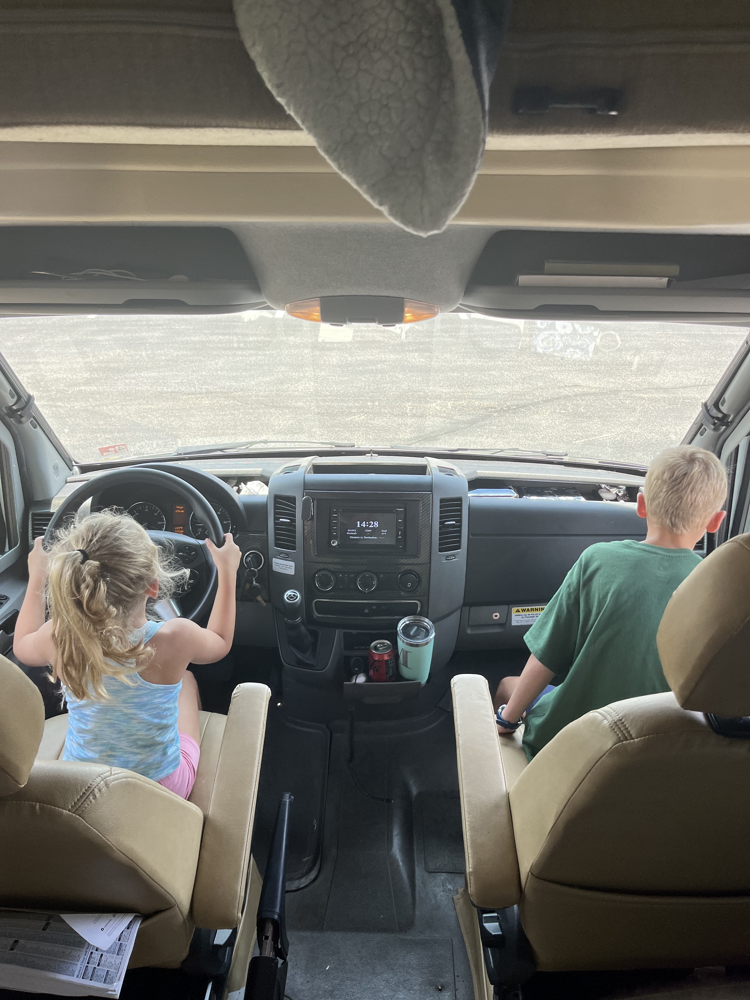
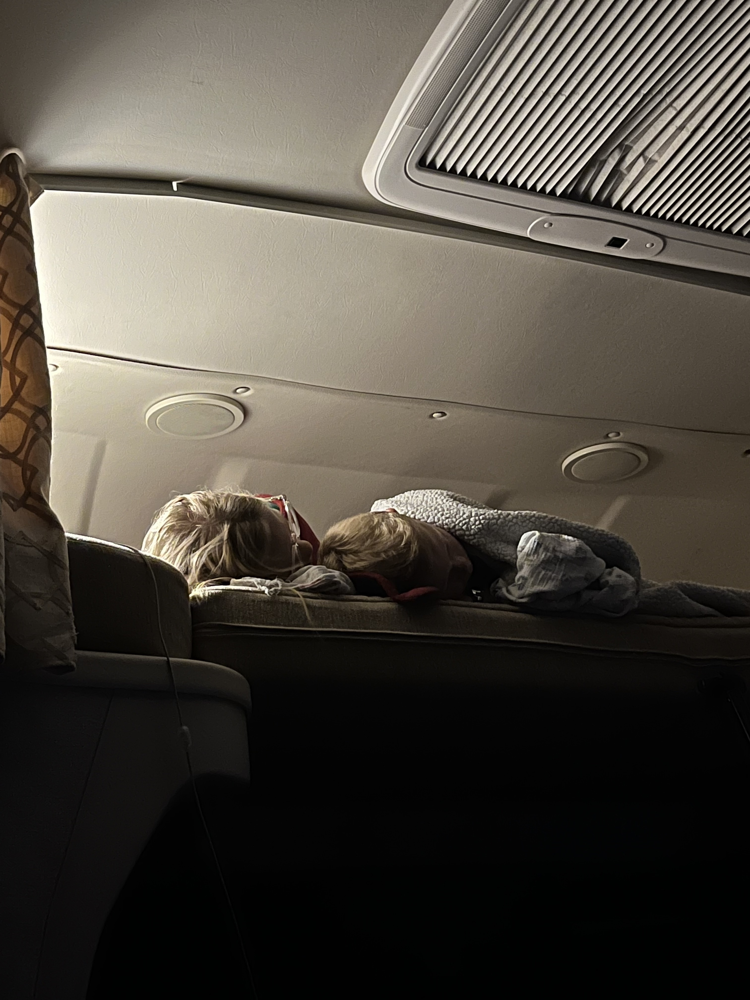

## Cost

Here’s a breakdown:

- RVShare cost includes nightly rental, basic mileage, taxes, insurance, and fees.  RVShare includes RV insurance as well as 24/7 roadside assistance service.  There was a $1000 security deposit which was completely refunded.  Altogether that came to $4850.
- We paid an additional $1100 for mileage overage.
- Our diesel bill came to $1845.
- KOAs were $50-70/night. NPS campgrounds were usually $30/night.  Boondocking was free.
- I had a front tire plugged in Tahoe for $30.
- Two jugs of DEF along the way were $52.
- We got a cabin in the Tetons and an Airbnb in Tahoe because we thought we’d need a break from the RV.  These averaged $450/night but they weren’t worth it and we didn’t need the break.  We actually all slept better in the RV!
- All told, the RV and travel costs (not including the cabin/Airbnb) came to $8400.  Not bad for 3 week total transportation and lodging for a family of 5.

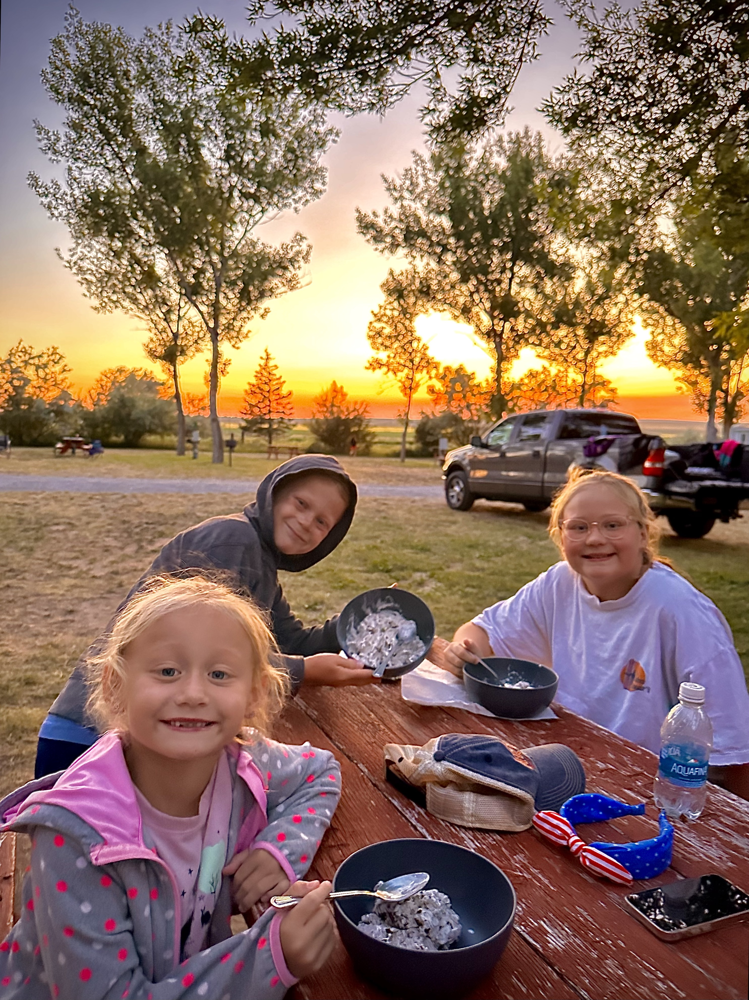
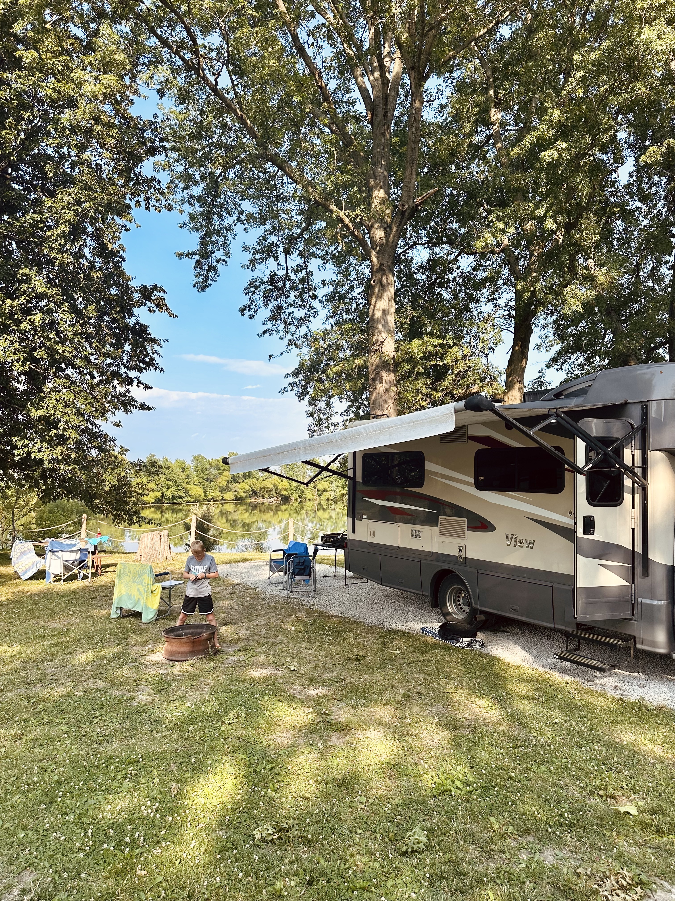
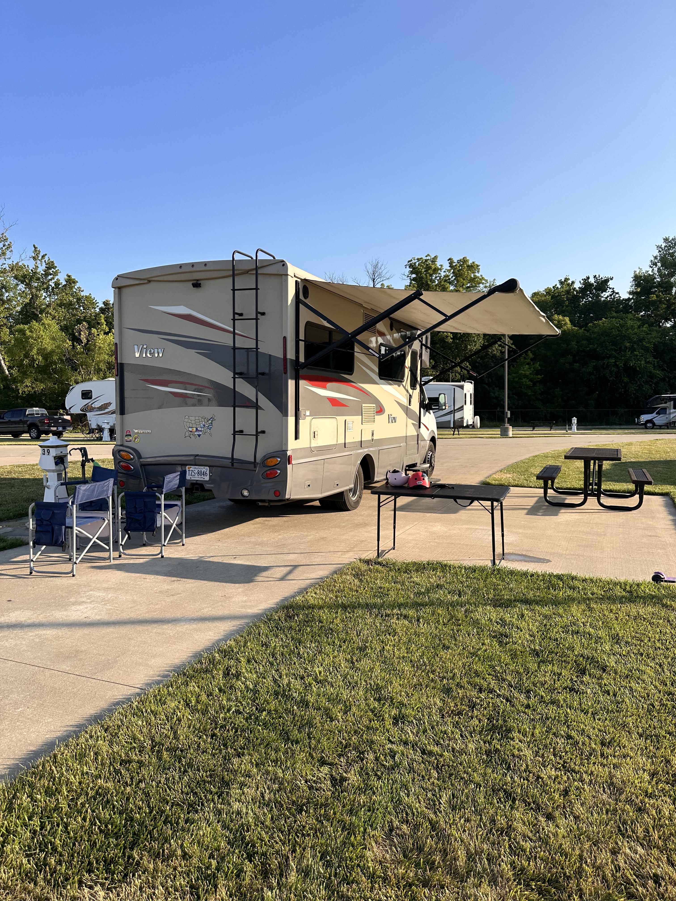

## Route Planning

- The best way to plan is to pop open Google Maps and start writing down ideas.  It helps to have a fixed point where you know you’ll be - for us that was Bishop, California.  So it was a matter of working backwards and forwards from there.
- Get down all your ideas and then start ordering them both by location and interest.  Youtube [travel channels](https://www.youtube.com/watch?v=XJpXsVBkoWk) have [great ideas](https://www.youtube.com/watch?v=y36MFHuKeZc) and are [more honest](https://www.youtube.com/watch?v=3l-mkh0wFyc) than the traditional travel guides.  They give you a sense of the feeling you’ll get in a place while also showing some of the downsides.  Interest is easy - if you’re really excited stay for longer.  If you want to see it and move on, do it for one night.  This was easy in spreadsheet form and ended up looking like this:

	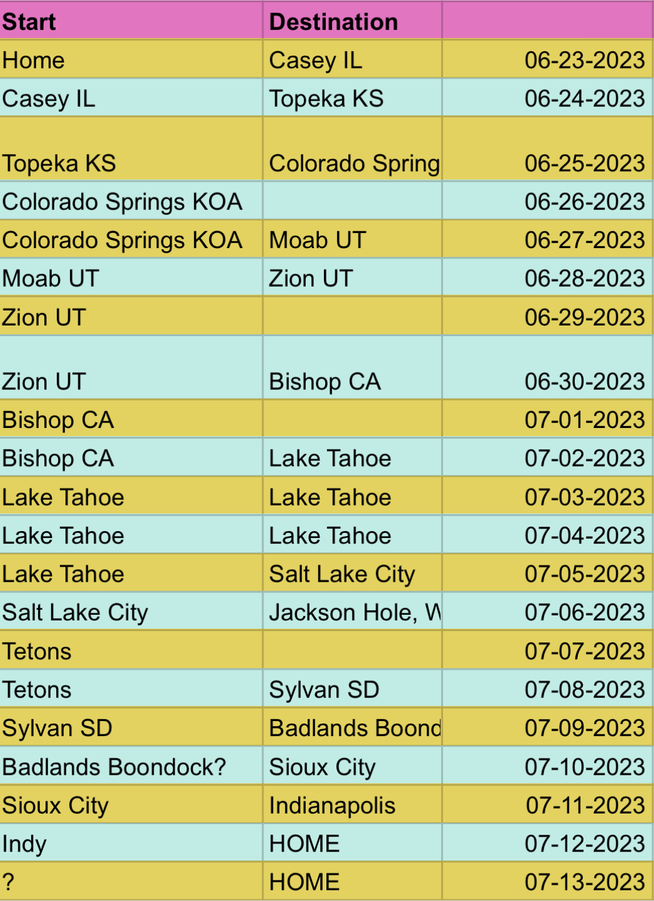

- Once you have some of the destinations, start picking campgrounds.  Where we could, we stayed in the parks themselves and this turned out to be a fantastic idea.  The [National Park campgrounds](https://www.recreation.gov/search?inventory_type=camping) were always clean and had the most amazing setting.  It requires planning ahead - most open 6 months before hand at 10AM EST and are very limited.  So be ready to reserve early!
- KOAs were a consistent positive experience for us, although slightly pricier.  We also tried a couple of private RV campgrounds and they varied from pretty sketchy to just weird concrete playgrounds.  You get what you pay for.  [RVLife campground reviews](https://campgrounds.rvlife.com/) were accurate and very useful.
- I made a Google Map route for each day of driving and added the link to my spreadsheet.  Breaking it down let us plan our schedule better, especially which days needed us to get up early and which could be more relaxed.  I included a column for number of hours driving per day.  Set custom Depart times to make sure you have a sense of any traffic issues around big cities.
- Driving out west is quite different than the east coast, and a 5 or even 6 hour day really isn’t a big deal.  We didn’t go as far as drive late into the night, but we did get up at 5 or 6 and let our kids sleep in so we could get a good headstart.  A 3 or 4 hour drive is no big deal.  Anything up over 7 starts to really limit doing anything except traveling that day.
- A simple and obvious hack (especially with kids) to make a drive easier was just to stop somewhere on the way.  We stopped in Jackson for dinner 40 minutes closer than the Tetons and made a 5 hour drive feel more like 4.
- Download offline maps on Google Maps.  We went plenty of places with zero service.  If I was doing this for longer than a couple of weeks I’d be ordering Starlink.
- Not all roads are RV friendly and the shortest route on Google Maps isn’t always the best.  We avoided some 10% grade roads twice by searching the route numbers on RV forums to see what other people thought and I’m glad we did.

I can’t fit the entire route we took in Google Maps!  So here’s our route out to California:

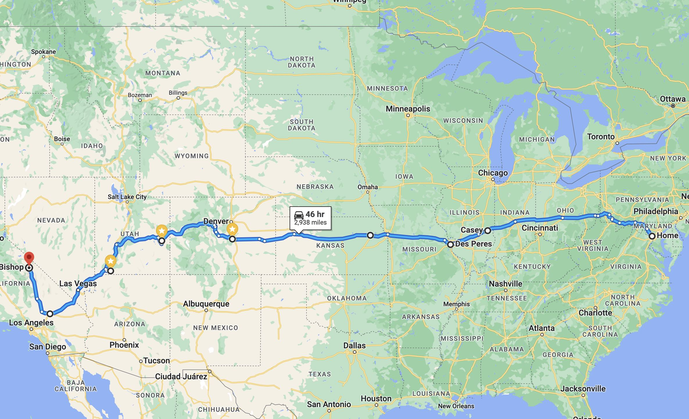

And here’s the way back:

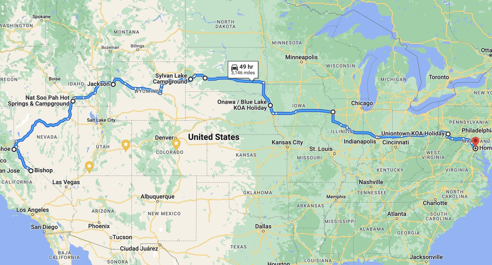

## Organization

Maureen put a lot of thought into this and it paid off!

- Everyone had a color-coded set of [packing cubes](https://www.amazon.com/Amazon-Basics-Packing-Travel-Organizer/dp/B014VBI9YC/ref=sr_1_1_ffob_sspa) for clothing kept in a compartment.  I was skeptical of these but they made finding shirt/shoes/underwear/socks easier for everyone and kept clothes from being everywhere.  Make sure everyone knows where there stuff is kept.
- Take 5-10 minutes every day to clean up the RV and put things away.  Keep a dustbuster under the sink.  The smaller space almost forces this, but it’s still worth saying.  Kids will explode all over the place, and it’s worth making sure you’re ready for the next day.
- This goes for everything, but you don’t need as much kitchen stuff as you think.  We took 1 cup and bowl for everyone, 2 coffee mugs, a cutting board, 1 pot for pasta, etc.  
- The fridge and freezer hold a surprising amount of stuff!  Stack and fill it up.
- On the road, Walmart is the best.  We had a big grocery trip each week and stocked up.
- Find one place for a gigantic laundry bag that’s out of the way.  For us this was under one of the seats in the dinette area.  
- A shower caddy for everything makes it easy.
- Put water bottles and things on the counter in the sink for driving.
- A couple extra pillows and a blanket go a long way to making a space feel more cozy.

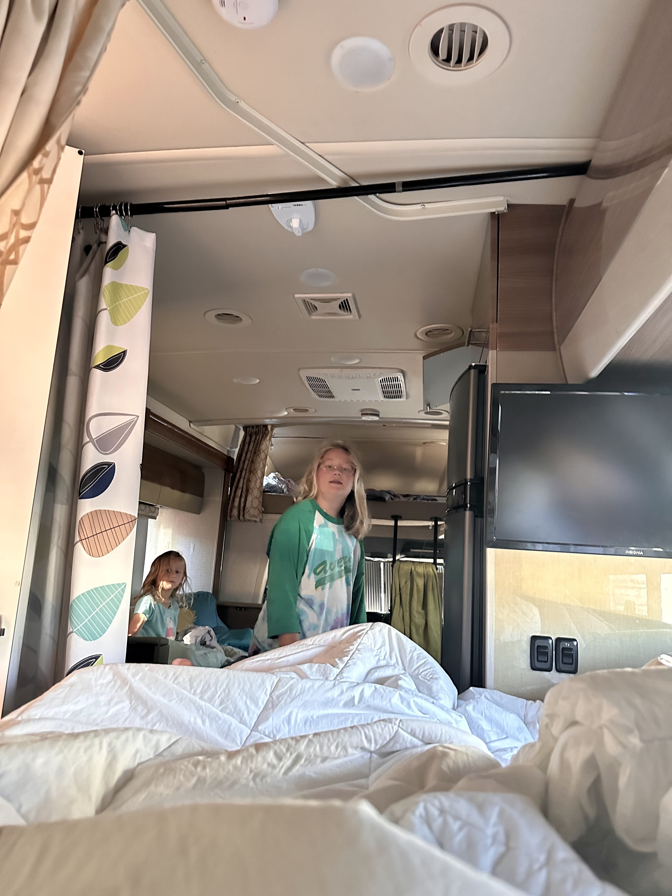
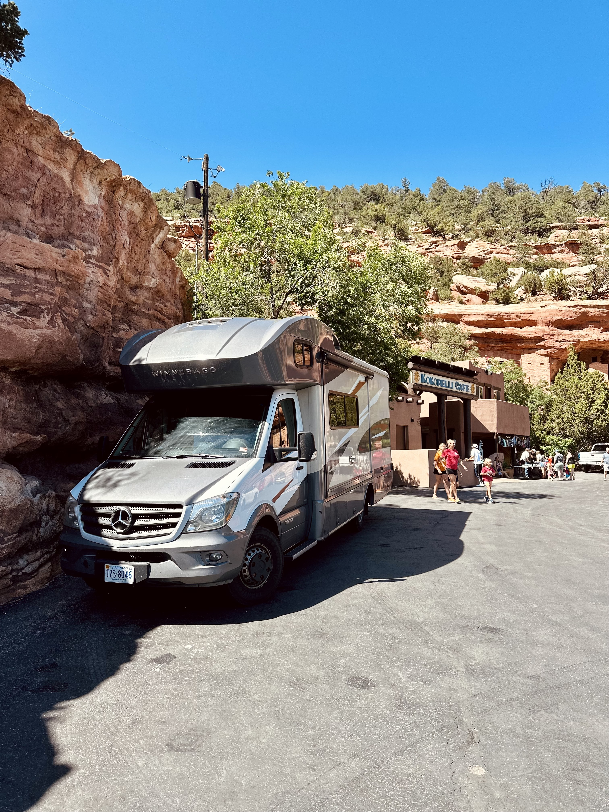

## On The Road

- We had no issues with grey or black water capacity.  When you’re not hooked up, maybe don’t flush pee until everyone’s gone.  If you’re really worried about grey capacity then take a camp shower and just use the water for rinsing.
- Fill up the fresh water before you leave camp and you’ll never run out.
- An RV is a big ‘ole box on the road and wind has the biggest impact.  Follow how the trees and plants move along the road so you know what to expect.
- It’s also a big volume of air and it will get hot in the back.  We had to run the generator while driving for a few days to crank the air temps back down.
- Talk to your camp hosts in national and state park campgrounds.  They usually know the area well and have great ideas for hikes, places to hit, where flowers are in bloom, etc.
- RVs drive, brake, and move more like buses than cars.  This sounds really minor but finding gas stations that are on the same side of the highway as your exit adds a lot of convenience.
- We were able to park pretty much anywhere we need, including busier grocery parking lots. Backing it into a normal parking spot with an island behind is usually the trick. The back overhang is long enough that you don’t stick out more than a big truck if you can get it all the way to the rear wheels. Anything bigger would be significantly harder. I get why people flat-tow a car.
 - Keep dramamine for kids.  Motion sickness is definitely a thing, especially in the back laying on the bed trying to read or watch a show.
- Keep a travel log!  I know, I know we’re crazy and we like writing.  Do it your way.  Make bullet points.  Keep dots on a map.  But do something that will help you remember all of the moments - they add up quick!

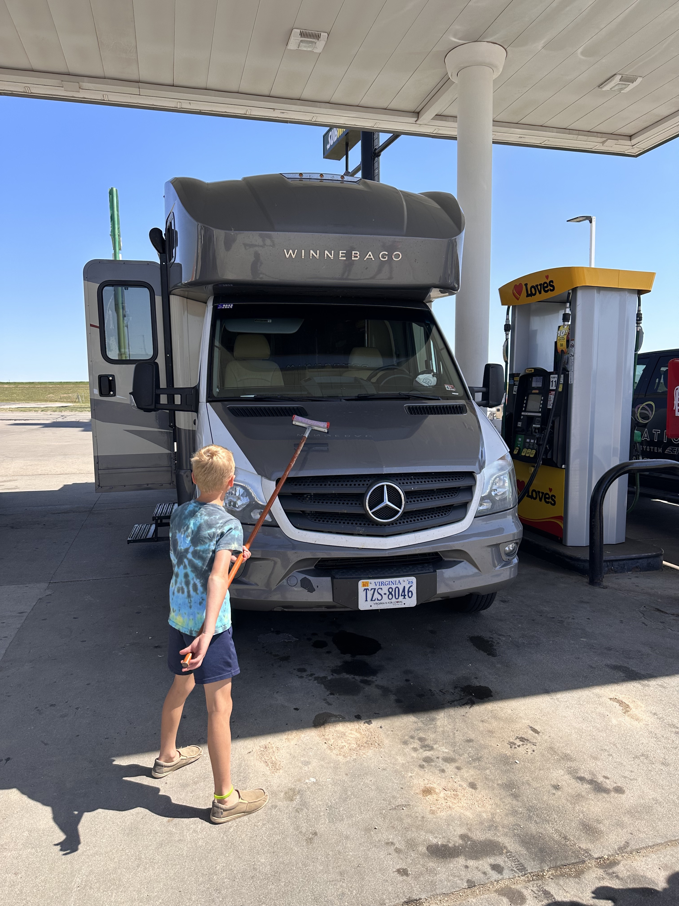
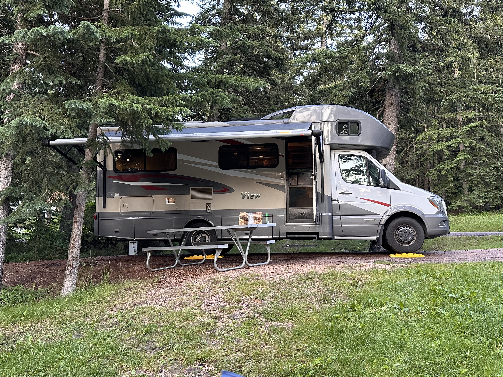
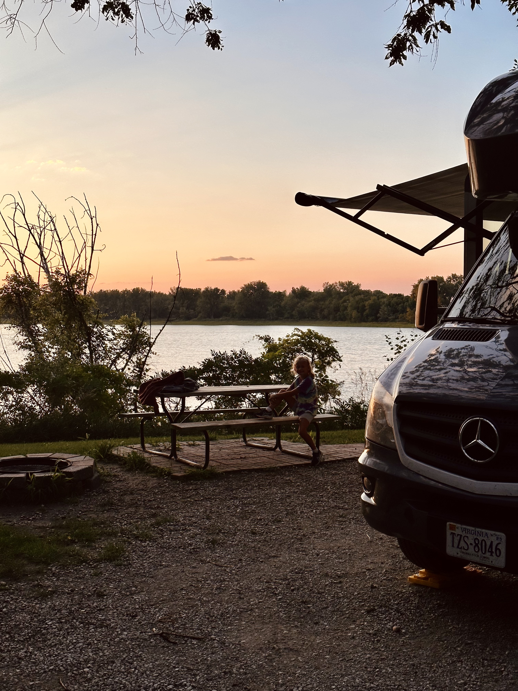

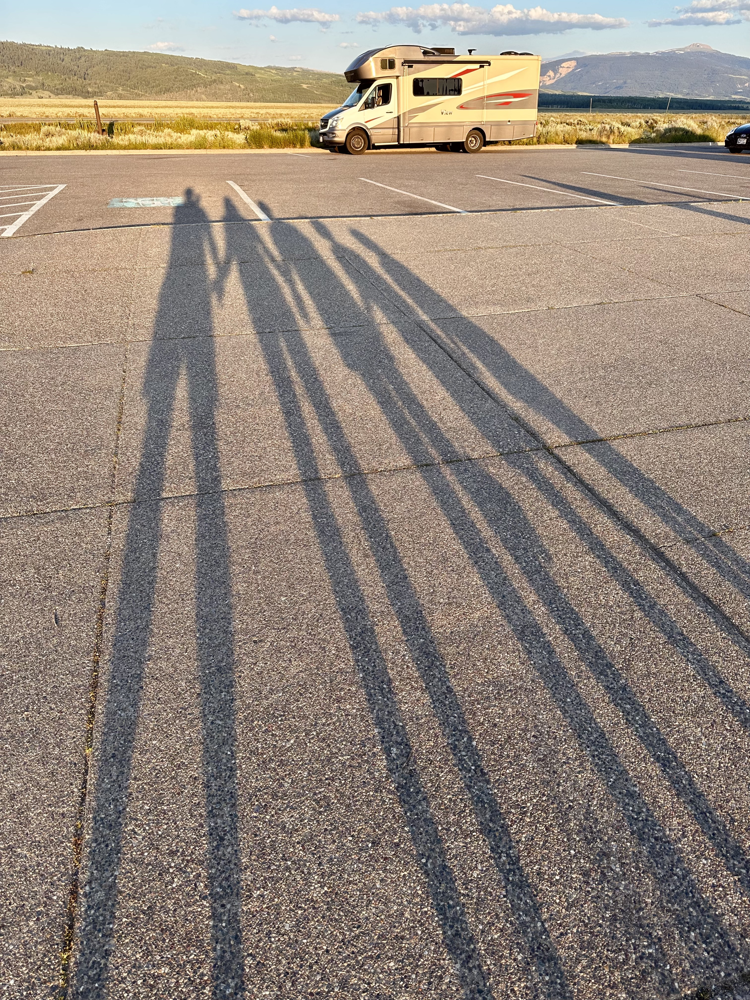

(You don't need one of these, but they're cool)
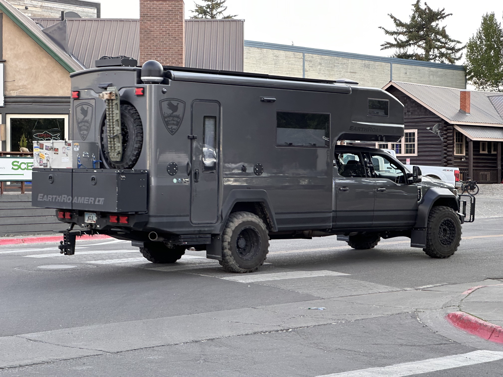
