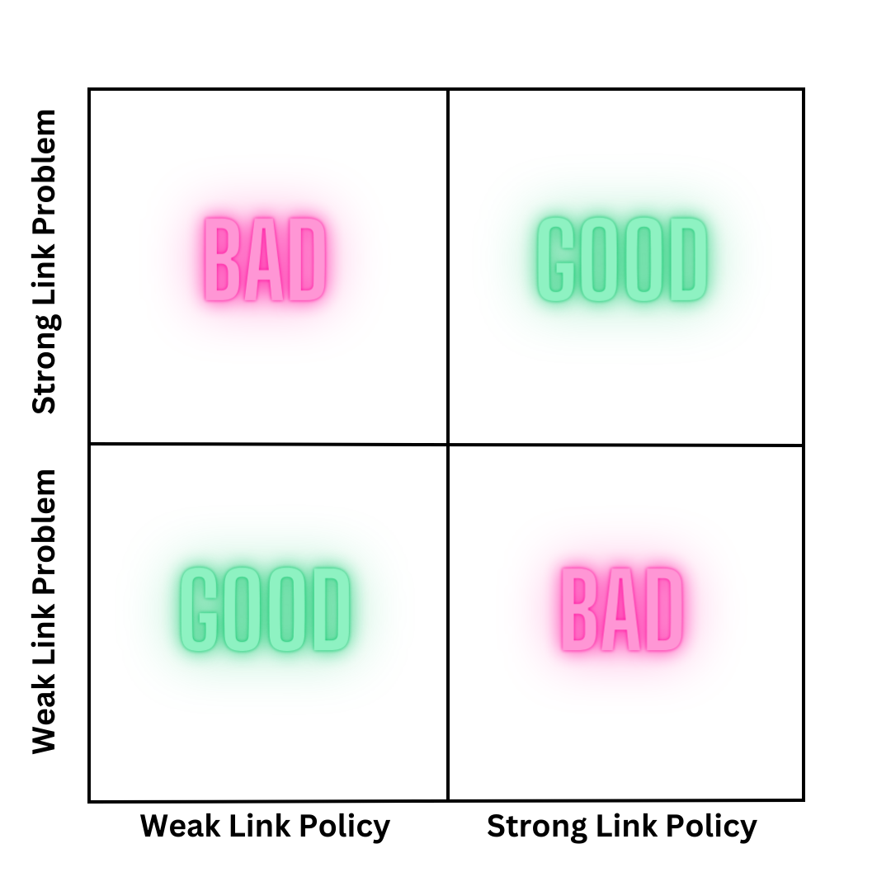

I just read Adam Mastroanni’s piece [Science is a Strong Link Problem](https://www.experimental-history.com/p/science-is-a-strong-link-problem) and my first reaction is: finally!  [Adam](https://www.experimental-history.com/) is one of my favorite new writers, ever since he publicly called for the extirpation of the [peer review system](https://www.experimental-history.com/p/the-rise-and-fall-of-peer-review).  I’d never heard of this strong link idea, but it was like a missing puzzle piece for me.  I’ve long thought that different people or groups approach problems by trying to manage  edge cases and that this edge case management produces most of the contention that exists in policy debates.

Here’s what I mean, using Adam’s pretty picture not mine:

In a weak link problem, the outliers on the negative side of a distribution are super important.  Adam cites examples like food safety and car maintenance as weak link problems.  On the other hand, the positive outliers matter a lot for other problem types.  The eponymous example here is Science!  But also music, the Olympics, friendship, and venture capital.

I took a crack at this framing as one of my [Thiel Answers](https://www.kanonical.io/thiel-answers/) awhile back, using the computer science-y idea of false positives and false negatives.  If everything is bad then we ignore the good as false. And if everything is good then we ignore the bad as false.  But that was jumping straight to the idea of policy and starting with problem types as Adam does makes far more sense.

And so here’s my not-so-pretty picture:

I’m willing to bet that a significant portion of the policies that you really dislike sit in the BAD quadrants of this chart.  You see the problem one way and policy X sees it another.  This makes common solution spaces more obvious too.  For instance, creating value and innovation is a strong link problem and a market system is a clear solution.  On the other hand, air safety is a weak link problem and better fitted to government regulation and agency.

I continue to be blown away by how well this helps frame problems.  It covers how people think of Elon, how we understand capitalism and socialism, how Republicans and Democrats approach tax policy (they just climb opposite slopes on the Laffer Curve), how optimists and pessimists see the world (by focusing on different problems), or how negative and positive rights interact.  Once you see it you can’t _un_-see it and it becomes foundational.

I also just ran across this [interesting study](https://www.science.org/doi/full/10.1126/science.abm3427?utm_medium=email&utm_source=substack) about traffic safety messages increasing the number of crashes.  This served as a gentle reminder that even though categorization helps - car safety is a weak link problem - it’s not always a direct road to policy.  Incentive systems remain the most complicated systems we try to build.
