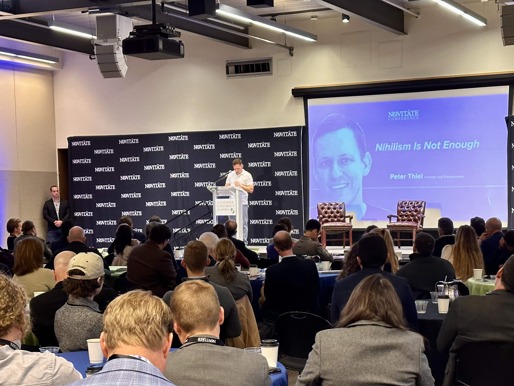

I attended the first Novitate conference last week on the life and works of Rene Girard. There are a few prominent Girardians in the world today, most notably Peter Thiel. But Girard's ideas have become prevalent among even more plebeian coastal thinkers like me, mostly because of the book [Wanting](https://www.amazon.com/Wanting-Power-Mimetic-Desire-Everyday/dp/1250262488) by the conference's organizer, Luke Burgis.

The whole day was a whirlwind. I took copious notes. I met some new people. I talked with old friends. I tried to keep up with the ideas flying around. I saw two intellectual heroes of mine in person (Peter Thiel and Tyler Cowen) and got to listen to one of them deliver a profoundly deep oratory on Girardian ideals through history and literature (that was Thiel).

Peter Thiel. With bodyguard.

To a person, the conference goers were earnest, engaging, magnanimous, and interested in the nature of reality and Girard's lens for it. Many of the panelists and speakers are a part of the Twitter intelligentsia, a place known for arrogance, dismissal, rancor, and vitriol. These are intellectual and popular elites - people like Coleman Hughes, Tara Isabella Burton, Thomas Chatterton Williams, Ross Douthat, Hamish McKenzie, and Ryan Resch. And there was none of the negativity you’d expect from online environments. There was no vitriol. No dismissal. Twitter is not the real world, and it turns out that people are still just people. This was a day for conversation, engagement, and happiness. There were debates but they were never hostile (with one fascinating exception on media). I saw new friendships solidifying and new enterprises taking their first hesitant breaths. There was hardly any ego; only interest in trying to figure out what the heck is really going on.

Outside of the cerebral enrichment of the day - which was constant and overwhelming - there are two particular moments that stood out to me.

The first was when Peter Thiel first took the stage. His bodyguard stepped through the door first, big shoulders squared and head on a swivel. He looked around for a half second and then Thiel came immediately after him, ducking around with his head down while his second bodyguard appeared in midair in the corner of the room on the other side of the lectern. Thiel mumbled his introduction. He looked nervous and shifting at first and it blew me away. This is a guy worth _billions_, who has stood in front of far bigger crowds than this, who has boldly and without fear of rebuke taken what a majority of the elite consider ostracizing positions. And here he was, looking listless. I was reminded of an answer he gave to Bari Weiss in an interview earlier this year: "I don't always have a master plan, I'm just trying to figure things out."

Once he started his prepared speech he was suddenly in his element. The world re-aligned and it became immediately apparent that this is a person who is far more comfortable surrounded by ideas than he is surrounded by people, whether sycophantic, empathetic, or antagonistic.

The second poignant moment was during the closing remarks, given by Rene Girard's own son, Martin. Martin was clearly overwhelmed by the presence of so many interesting and interested people, still taken by the thoughts of his father. As you'd expect, Martin talked more about the everyday reality of growing up with his father; their discussions at dinner, their Sunday rituals after Mass each week, their relationships.

But it was a comment Martin made about some of Girard's intellectual work that caught me. Martin remembers how, after a particularly intense argument with one of his fiercest critics who was working to tear down Rene Girard's primary theories, someone in his family asked Rene how he felt after the encounter. Rene's answer was: "He might be right."

If some of the intellectual giants of our world are still humble, still nervous, still earnest, still worried about what others might think.. well, there's no better evidence for us to accept that those pesky insecurities will always be there. They are normal. More importantly - _these titans did their thing anyway_. They were nervous they might be wrong but they still put together their ideas. They climbed the steps to the lectern despite being worried what a room full of bright people thought.

More than any of the particular content, Novitate was an invitation to keep working with a sense of humility and earnestness. Festina lente.

### Unedited Notes

- How does the power of the scapegoat change over time and get passed on by generations? This relates to how different generations see black Americans.
- We've created a digital panopticon constantly looking for heretics to scapegoat and cast out (social media). What the heck does THIS do for kids?!
- Lester Spence - what's his latest book?
- Friend/enemy distinctions - there are public forces pushing against blacks but at the same time hip hop is the highest popular musical art form.
- There's an active competition between Columbus Day and Indigenous Peoples Day. This is a competition for the national narrative that defines our country.
- Another way to look at our laws is by asking what narrative for the country is described by the 2nd amendment vs the later 13/14/15th amendments
- Nobody ever thinks they're joining a mob, they think they're doing the right thing.
- I support the current thing! Virtue signaling is literally the modern version of Havel's Greengrocer. We do this in both big (national) and small (subcultural) groups
- After 1965 our borders opened to much more than just European immigrants. It's important to understand affirmative action through different lenses both post quem and anti quem.
- The idea that the State creates competition and forces different groups into it's own scapegoat mechanisms.
- The preoccupations and vernacular of American culture and concerns are permeated on social media in a special way compared to anywhere else. And so this projects things like race politics onto things like Israel/Hamas when it makes zero sense. Americans think of Jews as "white" because they know Ashkenazi Jews, but most of those in Israel are Mizrahi - closer to Arabs. But Americans scapegoat anyway.
- If you're a political scientist you naturally see everything through the lens of the State.
- Nihilism is not enough.
- Thiel's got bodyguards on both sides - wild to see in person.
- Surprising how awkward and nervous he looks until he starts reading from his script. A big crowd still seemed to be an uncomfortable thing to him.
- Girard said that Christ was the first political atheist - the first to truly say that the State or the Emperor or whatever was not divine.
- What do we conform our life too? All exterior schemas are empty.
- We amuse ourselves to death. The process of scapegoating is always from Violence. Jeremiad.
- There's been a loss of interest in the exterior world, turning to an interior or virtual world. That we create ourselves.
- Descartes redirected people from the external schema of God into the mind. From external to internal. And then we lost ourselves for the next 350 years.
- Is World Government synonymous with the Antichrist? In modern thinking we usually think of this entity as a single individual vs. a collective. Important to understand that the motto of the AntiChrist is "peace and safety".
- 1 Thessalonians 5:2-11
- How much of our humanity is tied to risk and risk taking? Sometimes we'd do better to approach the christianity of Constantine than we would of Mother Teresa.
- Asking what we would do after the championship win is like the dog catching the car. He won’t know what to do about it when he does it.
- Ryan Resch: “the trophy at the end of the season does not absolve you of anything.”. The next day you have to get up and go to work.
- The problem with being a watcher is that you always feel like you’re being watched. The problem with caring what others do is that you always care what others think of what you do.
- Holy shit Tyler Cowen just walked by
- How much is innovation tied to heresy? There's a relationship here to contrarianism and the willingness to shed the coat of propriety and take on risk
- We all build a profile online and brand ourselves in some way. Kids start doing this at a very young age now.
- Question: is there something that ought to be imitated? How do we decide what's worthy? How can we conform to some higher good? This is the idea behind Platonic ideals. But do we know what these are any longer?
- There's been a valorization of originality as the primary value to dignify. So much so that there's become a much larger willingness to do evil than before. It's fine to be evil as long as it's original - that's what's important.
- Attracting attention is the new currency. The platforms gamify this such that we all want it. You don't win by moving towards a goal, you win by building audience. That is the end itself. You desire attention.
- The perfect influencer is not the most innovative. Or the first. They're the perfect image of some subgenre or group. They're what you imagine. This is literally a Keynesian beauty contest, with the influencer trying to presage what you expect. The influencer is an archetype.
- We use our identity and any facts about ourselves as material resources for building audience. It's fuel for the attention machine.
- There's a tension between the work to become an influencer and your rizz. The answer to this attention is that you need to want it bad enough. You need to desire audience for the sake of itself to make it. The primary desire is to become an icon. This is Mr. Beast. This is what he's doing and he's plugged into being the best Youtuber 24-7.
- All content is just drops in the river of the attention economy. It's all flattened: video, writing, photos, etc. There's no differentiation any longer. It's all just content.
- Earnestness is almost a taboo. You can shitpost or you can sincerepost. It's a game to get the right balance between cringe and cool.
- People want to be brands and brands want to be people. All teenagers want to portray themselves as bigger than they are. Meanwhile brands want to relate. Thus we get the Geico lizard and the Progressive lady (Flo).
- Burton critiqued Thiels' valorization of Constantine: what aesthetic choice are we making in terms of how we think about the Apocalypse? But isn't Constantine the striving for more? How do we bridge this gap?
- Social media replaces value with metrics. Like clicks. All while it fries our brains.
- People still want to buy stuff. They still want material goods but the things they want are changing as the generations march on. Zoomers don't care as much about a house and a fancy car. They want simpler, cheaper stuff.. but they want it for the influence it gives them. They want it not for itself but because it includes them as part of the in-group.
- The problem of old media is that it doesn't make enough money - it can't compete online. The problem of new media is that it works far too well - there's plenty of revenue but no defined objective; it's not trying to drive towards truth.
- The media wants to manage our mimesis for the purpose of satisfying the needs of corporations and the State, much like cartels.
- Everybody splits their attention when they consume content. It's not enough to listen intently to gifted speakers, you also need to check what's going on in the Twittersphere, post about it or check your mail. That's what the whole audience is doing. Being engaged and in the monent is now a superpower.
- Algorithms build homophily.
- Walter Kirn scapegoating big media.
- What's the Virality Project?
- A platform built on advertising requires engagement to increase revenue. That's the goal, increased engagement - more eyeballs, more often. Substack and others work off subscrtiption and try to challenge the advertising premise. Costs for eyeballs is too high - this is the new transaction cost.
- Our culture's mimesis is increasingly suggesting that we don't need the city of Jerusalem. Science and markets along are sufficient.
- Think of the three-city problem as an internal problem instead of an external one. These three cities reside in each of us as individuals. And we need Jereusalem.
- A study showing that people receiving charity from some recent calamity appreciated the help and goods from Christian and Islamic groups much more than secular groups. Part of this is because the religious sense of these groups produces the ability to see others as children of God. And those receiving the charity felt that.
- If you're native to Silicon Valley (re: digitally native) then you're a foreigner to Athens and Jerusalem. This is the state our kids are in.
- This changes the fundamental interface we have to the world. It's not focused on the external reality (whether God or Science) (remember what Thiel said about Descartes!). We're focused internally and inherently MORE driven by mimesis.
- Who is Charles Taylor? What did he say about authenticity?
- The three-city problem is tremendously challenging to digital natives because the natural focus Is inward and not on reality or external to the self.
- By leaving behind Jerusalem we are leaving behind our current wisdom in institutions.
- We're more apt to develop consensus reality. We have some homogeneity in what we want - but do we have the same freaking such that we don't or can't share the same objectives? Our realities are literally different. They're based on what we have as the ordering of these three cities.
- Are the digitally native the same type of human? Thsi is homo techno - that we live in an internally focused digital and consensus based reality with no external form. When people say "this is my truth" they mean it. We have generations that have totally lost the attachment to external reality.. Homo Techno MUST be capable of combining our inner and outer realities. Whereas digital natives give the virtual world precedent. This recent inversion is the cause of a ton of our current problems. We need to bring back Athens and Jerusalem.
- Girard what do you think of this vociferous argument with another scholar. How do you feel about it? “He might be right.”