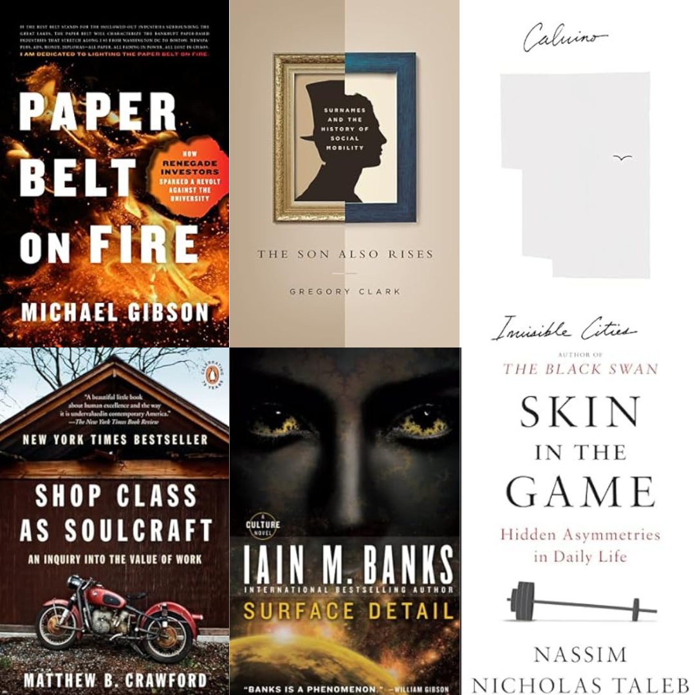
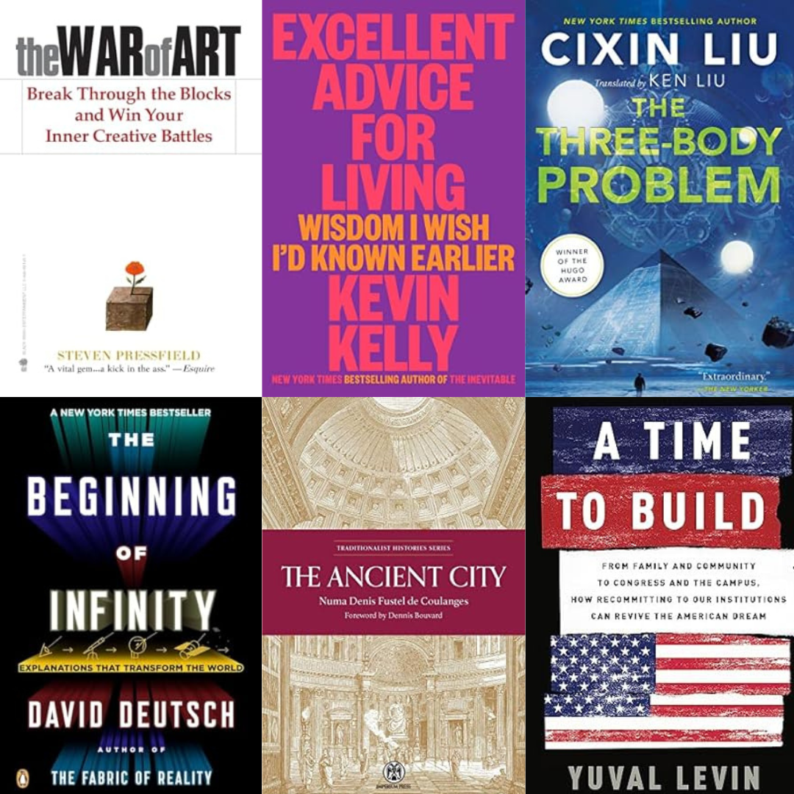

2023 is over and it was a heck of a year for reading. Perhaps too good, but more on that in 2024. Here it is by the numbers:
- 64 books
- 41 nonfiction
- 23 fiction
- 7 re-reads
- 5 started and unfinished (not counted)

Something I've thought a lot about this year is where I get recommendations from. What's interesting is how they vary. For fiction - which is what most people read - I get recommendations just like anyone else.. from friends that have similar tastes as I do. But it's trickier for nonfiction. Less people read a lot of nonfiction and it's mostly the stuff that is making cultural headway. Things like Atomic Habits or the latest Isaacson biography or the latest right/left everyone-in-politics-is-out-to-get-you hype book.. you already know these books and they're on the nonfiction bestseller list.

Getting good nonfiction recommendations is much harder. It's not worth it to read what everyone else is reading from the bestseller list. You don't get new ideas that way, you're just fed the same stuff that everyone else is getting. 

> "That’s why I read them. If you only read the books that everyone else is reading, you can only think what everyone else is thinking. That’s the world of hicks and slobs. Real people would be ashamed of themselves doing that. Haven’t you noticed, Watanabe? You and I are the only real ones in the dorm. The other guys are crap." -Nagasaki, from Norwegian Wood

Instead, you need to find the well-read intellectuals and follow the breadcrumbs they lay down. This year I found recommendations from Marc Andreesen, Tyler Cowen, Peter Thiel, [the people at the Novitate conference](/novitate/), Reid Hoffman, and Balaji among others. Anytime I hear or find something from someone I respect I throw it on my [Amazon wish list](https://www.amazon.com/hz/wishlist/ls/1D9493K6AJY3O?ref_=wl_share).

I think there needs to be a better solution for this, and I'm intrigued about what is being built over at [Bookmarked](https://www.bookmarked.club/people). I've had a similar idea - a community-built recommendations site feeding off Amazon affilitate links. We'll see how it does. Lord knows Goodreads needs a competitor.

On to the top books! In no particular order..

- [Invisible Cities](https://www.amazon.com/Invisible-Cities-Italo-Calvino/dp/0156453800/) by Italo Calvino. This book is like a poem in novel form, occasionally opaque but still beautiful. Sometimes you have to read a page twice to capture the imagery. The entire setup is a dialogue between Marco Polo and Kublai Khan wherein Marco Polo details some of the cities he's seen in his travels and doles out the wisdom the Khan needs. Gore Vidal's one-liner is more than enough:

  > "Of all tasks, describing the contents of a book is the most difficult and in the case of a marvelous invention like Invisible Cities, perfectly irrelevant."

- [Paper Belt On Fire](https://www.amazon.com/Paper-Belt-Fire-Fight-Progress/dp/164177245X/) by Michael Gibson. Part memoir, part treatise on education and venture capital this one helps confirm my 2023 biases against higher education. Gibson helped Thiel create the Thiel Fellowship and then followed it up with a VC fund based on young, uneducated founders. It's an engaging read and makes you think more about the purpose of education and it's relationship to work and conformity.
  If I were to build a hierarchy of prestige in higher education today, the top slots would be:
  1. Thiel Fellowship
  2. Harvard/Stanford/MIT dropout
  3. I _think_ Harvard and the Ivies still occupy slot 3.. for now.

- [The Son Also Rises](https://www.amazon.com/Son-Also-Rises-Surnames-Princeton/dp/0691168377/) by Gregory Clark. Income inequality, social mobility, and class structures are one of the haute topics of the 2020s so far but nobody seems to talk particularly deeply about them - they just serve as a political cudgel to bash the other side. But Gregory Clark goes deep. How deep? Try 10s of generations and hundreds of years. He leverages rare aristocratic surnames in multiple countries to demonstrate that social mobility is actually much lower than we expect it to be. The top decile of society today is largely descended from the top decile of society several hundred years ago.
    
    This is an academic book with lots of data and charts and so it can be dry at times, but the conclusions are worth it, and some of them are rather devastating both to our own egos and to the writers of social policy. The evidence suggests once more that genetics is the biggest factor.

    Another interesting thing about this book is that the Amazon reviews are a gold mine too. Here's the start of the top review:

  > The social sciences and humanities are in trouble. They are largely predicated on the erroneous idea that social forces divorced from genetic endowments are responsible for producing the broad social patterns we observe. Professor Clark has been challenging this view for years, and devising hypotheses that will prove to have much better explanatory and predictive power as the science of genetics matures.
  >
  > Due to the technicality of its subject, the chapters of The Son Also Rises are difficult to read. But the chapter introductions and conclusions are a gold mine of insight. Among the many things you'll learn from Clark's book is the importance of distinguishing the social phenotype (the sum of one's observed characteristics) from the social genotype (one's underlying genetic characteristics).

- [Skin In The Game](https://www.amazon.com/Skin-Game-Hidden-Asymmetries-Daily/dp/0425284646/) by Nassim Taleb. This is the first book from the _Incerto_ that I've read and.. it's interesting. Taleb's style is both engaging and offputting. The editing seems incredibly light and it sometimes feels more like stream of consciousness than anything else. Taleb focuses on both incentives and disincentives and expresses the power of all things _via negativa_. The idea of the Silver Rule - and it's role on the ideas of negative and positive rights - has stayed with me. Most importantly, and reiterated over and over and over by Taleb, identify others, leverage groups, and have for yourself some skin in the game that you're playing.

- [Shop Class as Soulcraft](https://www.amazon.com/Shop-Class-Soulcraft-Inquiry-Value/dp/0143117467/) by Matthew Crawford. This is the second book by Crawford I've read. While reading it I thought it good but didn't think it would make my top list. But then it sort of just stuck with me and I kept coming back to it. In a world filled with spreadsheets and "knowledge workers", analyzing the value of manual labor feels both countercultural and necessary. Crawford himself received a PhD in philosophy and then went and started a motorcycle repair shop. He has found for himself that there is far more intelligence waiting to be used in his hands than in his head. It made me think of my own very small workshop and I'm convinced that I learn more in that messy, dirty, disorganized room than in any other place that I frequent.

- [Surface Detail](https://www.amazon.com/Surface-Detail-Culture-Iain-Banks/dp/0316123412/) by Iain Banks. God what an insane book! I don't think you really understand what is going on until maybe halfway through, but the characters and settings and subplots keep you engaged until you see the bigger picture. This one deals with all sorts of crazy futurist post-scarcity ethical questions - death, punishment, artificial hells, profit, slavery and plenty more. It's not the first Culture Series book anyone should read - you need to have a sense of the universe before you try this one - but Surface Detail makes a couple other books' effort totally worth it. Really wild.

- [The War of Art](https://www.amazon.com/War-Art-Through-Creative-Battles/dp/1936891026/) by Steven Pressfield. I've known of this book for awhile and I've loved _The Legend of Bagger Vance_ for awhile too, but for whatever reason I hadn't gotten there yet. This is perhaps the most inspiring book I've read. Pressfield teaches you how to overcome Resistance - an idea that anyone who has tried to tackle a project bigger than a day or two will know immediately - so that you can get something meaningful done. I expect this to be a book I come back to regularly.

- [Excellent Advice For Living](https://www.amazon.com/Excellent-Advice-Living-Wisdom-Earlier/dp/0593654528/) by Kevin Kelly. If you know me you know I love aphorisms. Kevin Kelly is always fun to read too, so there was no way combining the two wouldn't make a book I love. I love this book. So many simple and elegant lessons. My kids will each get a copy of this when they're older.

- [The Ancient City](https://www.amazon.com/Ancient-City-Imperium-Traditionalist-Histories/dp/0648690547/) by Numa Denis Fustel de Coulanges. What a mouthful of a name! De Coulanges was a 19th-century french historian and one of the most well-read academics in original Greek and Latin texts of the time. The Ancient City is an exposition of the nature of the ancient Greek and Roman world, in particular the role that religion played on culture and social structures, all built on insanely deep primary text references. He suggests that most ancient societies were effectively a series of interlocking cults and that all of the form and rules of the larger societies were generated from these beliefs. I'm still trying to combine some of these ideas around religion and beliefs with the mimetic theories of Girard.

    So how the heck did I find out about this obscure 19th century book? I'll tell you. My two favorite techno-elite intellectuals are Peter Thiel and Marc Andreesen. What makes these two so fascinating is not their technical chops - although they're considerable - it's the fact that most of their reading and thoughts revolve around the humanities. I've come to believe that capabilities in science, math and engineering have simply become table stakes in the 2020s - skills in these areas aren't the critical edge to get ahead they were 20 or 30 years ago. The critical edge today is the ability to understand humanity and societies: how they move, what principles underpin them, and how they're developed, which is, in essence, the classical view of the humanities. Thiel and Andreesen have both followed this path. Thiel mentions frequently in his public addresses the coming of the Antichrist and the _katechon_ and Andreesen rattles off ideas about religion and history at a furious clip.

    This book came from Andreesen. He talked about it in an interview and then proceeded on a 15 minute explanation about how it has informed his thoughts on cults and societal groups since World War II.

    So yeah, give it a whirl.

- [The Beginning of Infinity](https://www.amazon.com/Beginning-Infinity-Explanations-Transform-World/dp/0143121359/) by David Deutsch.  Deutsch is a modern treasure and I have a whole new appreciation for the idea of explanatory knowledge. If you think you know what human civilization is, what science is, politics, ethics, art or the rest of modernity, then read and prepare for a strange new angle on the whole thing. Read [Fabric of Reality](https://www.amazon.com/Fabric-Reality-Parallel-Universes-Implications/dp/014027541X/) too.

- [A Time To Build](https://www.amazon.com/Time-Build-Community-Recommitting-Institutions/dp/1541699270/) by Yuval Levin. In some unmeasurable way, this is probably the weakest book on my list, but it affected me deeply. The general trend in the attention economy is to want to take any institution worthy of criticism (read: all of them) and tear them down completely. This book reiterates that this a fool's errand, that institutions become institutions because generations of people like us make them worthy enough to carry on, and that the veneer of civilization relies on the thin surface tension of cultural behavior. Which makes 2024 more than a little scary.

- [The Three Body Problem](https://www.amazon.com/Three-Body-Problem-Cixin-Liu/dp/0765382032/) by Cixin Liu. This book was interesting in a few ways. First, it's just really good science fiction. Second, it's translated from the original Mandarin and takes place entirely in China during both the Cultural Revolution and today. The dialogue and character interactions have a distinct vibe compared to what I was used to. It's a sample set of 1 here, but I'm inclined to say that some of this is cultural. And finally, China is the representative society that first encounters the aliens in this book. It's an odd thing to realize that every alien sci-fi book you've ever read has the U.S.A. talking to aliens first. There's no reason this would be true, and it's fun to reflect on the differences this would create.

#### Honorable Mentions

Man there were a lot of good books this year, so here's some other doozies that you should definitely pickup!
- [The Two Hour Cocktail Party](https://www.amazon.com/2-Hour-Cocktail-Party-Relationships-Gatherings/dp/1544530072/) by Nick Gray because we need more of these!
- [Fossil Future](https://www.amazon.com/Fossil-Future-Flourishing-Requires-Gas-Not/dp/0593420411/) by Alex Epstein because oil is better than the narrative will tell you and the future is better too.
- [Impromptu](https://www.amazon.com/Impromptu-Amplifying-Our-Humanity-Through/dp/B0BYLSCPPV/) by Reid Hoffman and GPT4. Nominally the first book officially coauthored by an AI.
- [The Vanishing American Adult](https://www.amazon.com/Vanishing-American-Adult-Coming-Crisis/dp/1250181208/) by Ben Sasse. People are changing a lot.
- [Generations](https://www.amazon.com/Generations-Differences-Millennials-Silents_and-Americas/dp/1982181613/) by Jean Twenge. No really.. PEOPLE ARE CHANGING ALOT.
- [How To Fail At Almost Everything And Still Win Big](https://www.amazon.com/How-Fail-Almost-Everything-Still/dp/B0CG8H9YGG/) by Scott Adams. Fun good advice.
- [Elon Musk](https://www.amazon.com/Elon-Musk-Walter-Isaacson/dp/1982181281/) by Walter Isaacson because boy, what a life.
- [Die With Zero](https://www.amazon.com/Die-Zero-Getting-Your-Money/dp/0358567092/) by Bill Perkins because who needs money when you die?
- [Happy Go Lucky](https://www.amazon.com/Happy-Go-Lucky-David-Sedaris/dp/0316392456/) by David Sedaris. Funny, heartbreaking, and provoking family essays.
- [What's Our Problem](https://www.amazon.com/Whats-Our-Problem-Self-Help-Societies-ebook/dp/B0BTJCTR58/) by Tim Urban. Politics is weird and Tim Urban is the best.

