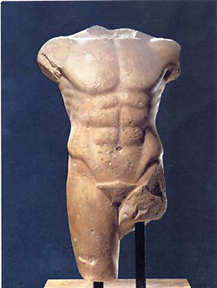

I recently had the privilege to encounter a new poem that relieved me of both my breath and my attention. That poem is called [Archaic Torso of Apollo](https://poets.org/poem/archaic-torso-apollo) by Rilke. I had to read it over and over and over and every time the last line smacked me in the face. It is powerful because - as [Douglas Murray so beautifully articulates](https://www.youtube.com/watch?v=atGo1xJqH_I) - it comes not from the viewer, but from the _subject_: the torso of Apollo itself.

_You must change your life._

The idea that truth and beauty might have something to say to us - that they are active forces in the world rather than absorbed passively - is antiquated to the modern man. It's a discarded but memorable childhood toy laying dusty near a baseboard in the corner of our room. Our culture has only a vague memory of the triumph and emotion that truth and beauty once had. Its glory has faded, its greatest generational prophets - ironically, those steeped in the terror and despairs of the 20th century - are old or dying.

It's up to us now.

This may seem like a dramatic and overserious way to start a session on thinking about yearly goals. Haha good. I'm glad it's striking! I used to be one of those unserious people who scoffed at resolutions, suggesting like so many others that if you really wanted to make a change in your life that you can do it any day you wish. This argument seems just as considered as suggesting we try Christmas in April or move the US capital to California. The new year is a time for new beginnings, and some of the power is in the arbitrary commons of the date. We all wait for the ball to drop. We all start over in some way. When we stop, we get the chance to let reality tell us something about ourselves.

Someone once said that the distance between your dreams and reality is action. This is the metamorphosis proposed to us by truth and beauty. Reality is begging us to use our agency and bring about the world of our dreams. The evolving questions from the Greeks to the Enlightenment have all been questions of curiosity. What is the purpose of reality? Of truth and beauty? Of evil? Of suffering? Of ourselves? The universe is the answer, but - as Douglas Adams and Elon Musk suggest - perhaps we haven't compiled all the right questions yet. Our privilege as humans is that we have agency to help shape both the answers and the ongoing questioning.

The critical debate of our time is: do we even acknowledge these questions? Rushing around late to our meetings while staring down at the videos on our ever-present screens are we capable of hearing the message the statue of Apollo whispers to us? Or is our attention too saturated and too divided to even recognize that truth and beauty exist? The modern human impulse is not an outward motion towards reality, but an inward sweep towards a virtual hologram. We live today in a digital panopticon of our own shared making, where desire and acceptance are more important than virtue or goodness.

We need to change. _I need to change_. This idea of change is not one that divides humans into groups; rather they are ideas that divide every one of our hearts. We each have a side that is yearning to listen for the divine whispering in our everyday reality. And we have another side, eager for dopamine, ready to be molded into what the mob demands of us. Each side is an animal ravenous for the activity, attention, and exercise that will help it grow. Which animal will be fed?

You must change your life.

## Goals

If you couldn't tell, 2024 feels like a year of significant change for me. I have been holding myself back and it's time to change that. Time to get rid of the excesses that steal my attention and keep me from the action that will help build my dreams. That's what this is really about. If I sound somber, then it's only to impress upon myself the seriousness of making the changes.  It's 2024, I'm 43, the world is achingly beautiful, exciting, and I've got stuff I want to do.  

**LFG!**

### No Social Media

I've been deleting and reinstalling Instagram for a few months now. Same with X. But it's time to go cold turkey. It's worth saying that Instagram has gone through a boiling frog kind of change; it used to be the cool place to go to see what your family and friends and maybe some celebrities were up to. Now it's one big advertisement - half of the reels sometimes seem to be for OF girls - and the primary revenue goal is just to win as many eyeballs as possible. And with TikTok especially, competition is fierce.

So nothing on my phone this year. Ever.

I'll still use X generally. It's where interesting things happen, where news happens, and it's intellectually stimulating. Just not on a phone.

### Cut Down Content. Including Podcasts.

Haha this one might surprise people, especially my wife! But these first few goals are all _via negativa_.. (taking away).

I listen to too many podcasts. Long form content is engaging and a great way to learn, but consumption crowds out production and I'm not producing enough. And a lot of it is more artificial than I'd care to admit too. All-In and MFM are staying - they're both once a week or so. Everything else will mostly go. It's just junk food.

> "You will not learn anything of lasting importance from TV, movies, podcasts, or that execrable Existential Comics thing. Even at 3x speed, they’re junk food. The way serious people learn is by reading. The way they share important information is by writing it down. Read, read, read. Rich people read a lot — Forbes asked a while ago, and the modal answer was two hours per day." -Byrne Hobart

I'm looking forward to listening to more music again. There's been a lot of Shane Smith and the Saints playing. And I've got Glenn Gould's Goldberg Variations on repeat too.

### No Phone Before Bed.

Books, not phone. What a time suck. I'm moving my charging cable across the room. Maureen, hold me to it.

### 6 AM

My schedule is still too variable and it's too easy for an appointment to jump up, hit me in the face, and ruin the rest of my plans. The only way out of this I can see is to keep working to be better about waking up. 6 AM every day. Weekends too. This is the real reason I don't want my phone next to my bed at night.

### Avoid Convenience Stores

My closest peer group has a very clean diet for a bunch of Americans and a hilariously guilty conscience about it. Obnoxiously so.. it's usually like "Oh, today was a bad day I only had one salad and even snuck a homemade cookie" or "I really need to cut back on all these fruits, there's a lot of sugar in fruit!" or even "yes, I did make this entire 5-course homecooked meal for 24 people from fresh ingredients.. but I'm Italian and that's a lot of homemade pasta. Carbs, ya know. Want some olive oil with your fresh bread?"

As if.

I am at least partially a product of middle American consumerism driven towards ultraprocessed food and Pop. 7-11 and Wawa feel like home. If I were in Texas I think I'd love Buc-ees.

I get too many stupid calories from convenience stores. I'm not looking to be a paragon of clean eating all the time here, or even cut things out entirely. I still love Diet Coke and chocolate on occasion. But getting a hot dog and some candy and a giant soda from a convenience store is the sort of deliciously foolish stunt that you should mythologize with your own vision of middle American ultra-consumerism, rather than regularly act out.

### Anti-Goal: Reading

I don't have a reading goal this year. It always makes me feel good to say I read a bunch each year. But let's be honest, this is so fundamental to who I am that it isn't going anywhere. And last year it's actually possible I read _too much_ and let it crowd things out a bit. I'll still read, I'll still keep a list. But [no metric'd goal](https://en.wikipedia.org/wiki/Goodhart%27s_law).

### Run. Every. Day.

This one is comical. I've had this idea brewing in my head for a couple weeks now. Day 1 - January 1 - comes and I go for my first run. Great! Day 2 - January 2 - comes and my stomach starts acting like a very angry alien hatching into my intestines and I spent a lot of time in the bathroom. And then I spent a lot of time in bed.

I was pretty out for about 36 hours so there was no activity on January 2 or January 3. Just a little shoulder nudge from God to remember that I am not in control! Loud and clear!

I'm back on plan as of yesterday. Trying to focus on at least 30-60 minutes of Zone 2 each day - trying to actually focus on improving over time - with perhaps one faster workout per week.

I really do mean every day too. Absent any additional dysentery, I don't plan on taking a day off. That means this isn't just about running, it's also about scheduling, managing recovery, staying healthy, stretching, and keeping my knees and feet healthy. No plantar fasciitis allowed.

Running also needs some defined parameters too. It means a minimum of 1 mile per day. If it's a slower zone 2 day, 3 miles of walking is equivalent to 1 mile of running. A 2 mile ruck with a weight vest is equivalent to 1 mile of running. So really this is "move and sweat every single day".. but run every day sounds better. Hopefully further into the year the runs will get longer.

### Strength Three Days A Week

Revealed preferences have taught me I always gravitate back to free weights when I'm not on a plan. I'm better at them and they're more fun. So I want to keep making this a thing. When I have a gym available, I'll use weights. When I don't, this will simply mean 100 pushups, 100 air squats and some other supplemental stuff.

### (Self-)Publish A Book

It's half written. I think the ideas in it are interesting; at least I'm still taken by them months later. It needs to be refined. Edited. Published. Finished.

More than anything, this is a statement that I need to actually **take this skill seriously**. It's easy to let the act of writing devolve into typing out a half-witted bulleted list and letting it stand. But if I actually believe that narrative will help create the world over the next several decades and that it should be a serious component of my time and energy over that time as well (yes and yes), then I need to treat it like the craft that it is and hone it to have a sharper edge. I've thought before of taking [Write of Passage](https://writeofpassage.school/). I still may do that. But the key point here is practice...

### Write One Good Paragraph A Day

I'm not sure where I saw this metric exactly. I'm sick of word counts or other lofty thresholds. One good paragraph each day would be a great thing. That's called practice. Write. Edit. Repeat.

> "Writing is easy. All you do is sit down at your typewriter and bleed." -Ernest Hemingway

### Festina Lente

I need to stop being in such a hurry and enjoy the things I'm doing. The attention economy we're caught up in allows us to unthinkingly sacrifice the important at the altar of urgency. And then we get in our car and get easily mad at all the bad drivers - which is everyone except you.

At the same time, urgency properly channeled is dead useful. I've grown very fond of the idea of _festina lente_: [make haste slowly](https://en.wikipedia.org/wiki/Festina_lente). That sounds right.

### Build Two New Projects

I want to start and build new projects this year. I have no idea what these are right now, although of course I have a list of ideas. The point here is mostly to get so intrigued by something that I just _have_ to focus on it exclusively and make it appear.

This requires some structure to let it happen. Deep work sessions without interruption. Coffee shop sessions with intense focus. And all-nighters? I remember some fun times when I was so compelled by an idea that I just had to stay up to see it through. I want to have that feeling again.

### Experiences With The Kids

We've started traveling more with our kids in the last couple years to wild success. Travel leads to new experiences and opens up new doors, but it doesn't always need to be a big, grand trip. I want to make sure we keep bringing the same spirit in smaller ways too. This means continuing to give them more independence: over their time, their clothing (haha, somewhat), their responsibilities. I'd also like to try more outside-the-comfort-zone places. Ethnic restaurants is a great example. We're a family of buttered pasta and chicken nuggets. Let's go try curry, pho, hibachi, hot pot, and Hmong. They're all local and easy to try - we just need the openness to do it!

### New Ways To Serve

I need to find a new way to serve others. I don't know what this means - whether it's helping more at schools or something more dramatic. It could be through another company or nonprofit of some sort. I don't really know yet. This is perhaps the least formed idea on this list!

### In Person

In 2023 I had more in-person gatherings with people, went to [conferences](/novitate/) and just generally connected with people in a larger way. It feels good to have a growing network and more of that needs to continue. What else is the point of life if you can't spend it shared with others and for others?

### RV Trip Part Deux

We liked [last year's rv trip](/rving/) so much we're doing it again. And this time we're dragging some good friends. 4 adults, 9 kids, 16-18 states, 5,000 miles and 2 RVs sounds like a crazy good time.

One of the interesting things this time around will be sharing the experience with more than just our immediate family. The kids will have friends to share it with (and we will too) and part of the challenge will be to ensure that the guaranteed hurdles that arise are handled reasonably. On the one hand, more hands and heads make for lighter loads. On the other, emotions can feed on each other more too.

It will also be good to find out just how much we like this lifestyle. Part of the mystique of the first trip was the joy of every single day being new and exciting. The second trip will tell us much more about whether or not we're destined for more RV trips in the future.

### Fly Somewhere Fun

This didn't happen last year, it was a full year. It may not happen this year either, as it's already slated to be a full year again. But it's [important](/why-I-run/), and so it's not coming off the list until it happens.

### What's Life At 50 Like?

Back in 2014 I wrote down [some long term goals](/career-goals/) for the first time. I had goals before, but they were never written. At the time, the goals seemed preposterous. Spend entire summers at the beach with my family? What craziness! And yet that's exactly what's happened. I own a home there next to a canal with a woodshop on the ground and osprey surfing wind currents over the pine trees. The last two summers I've been there for three months. It's magic.

Writing down the goals transformed them into a sort of totemic vision of a free and vibrant future life. But now I'm here. I'm in my early 40s (about the timeframe I imagined in the first place) and I have beautiful children growing up far, far too quickly. I've said this for a couple years now, but right now feels a little bit like an in-between period - an interregnum. It's been formative not just for me but also for my family and my kids. Looking ahead, new meaning and new priorities must be crowned supreme. I feel compelled to ask a similar question over again:

What do I want my life at 50 to be? What do I imagine will be the main drivers and plans for the next 5-10 years? The statue of Apollo - and the universe - demands an answer.

> “As each situation in life represents a challenge to man and presents a problem for him to solve, the question of the meaning of life may actually be reversed. Ultimately, man should not ask what the meaning of his life is, but rather he must recognize that it is he who is asked. In a word, each man is questioned by life; and he can only answer to life by answering for his own life; to life he can only respond by being responsible.” -Viktor Frankl

