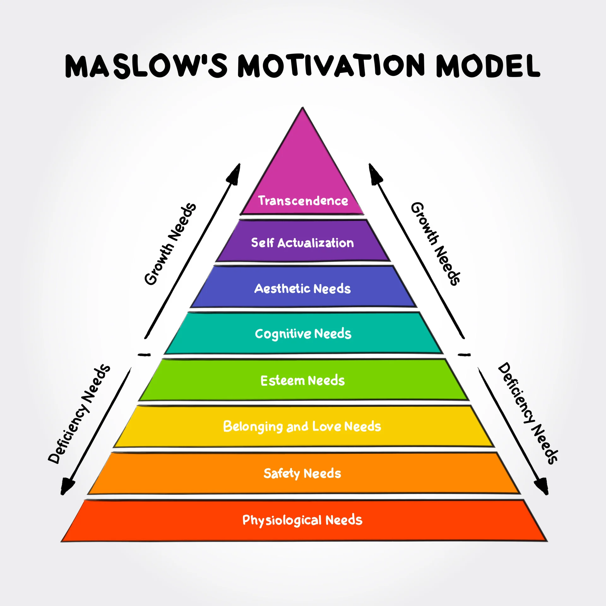
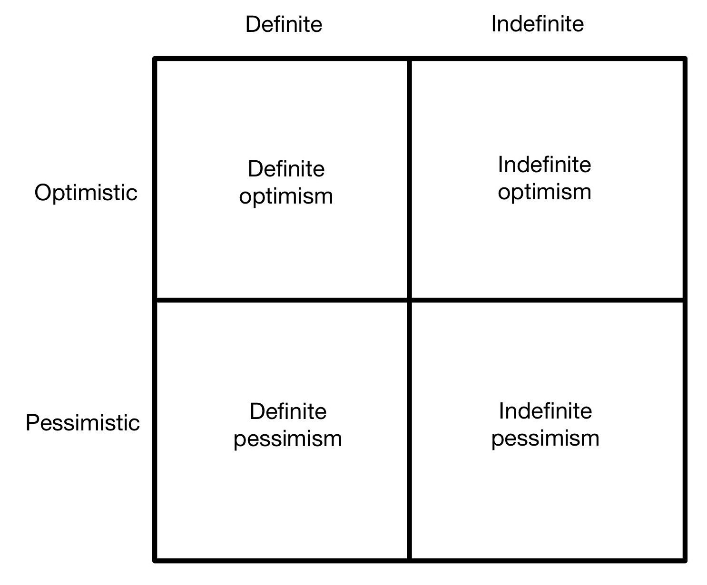
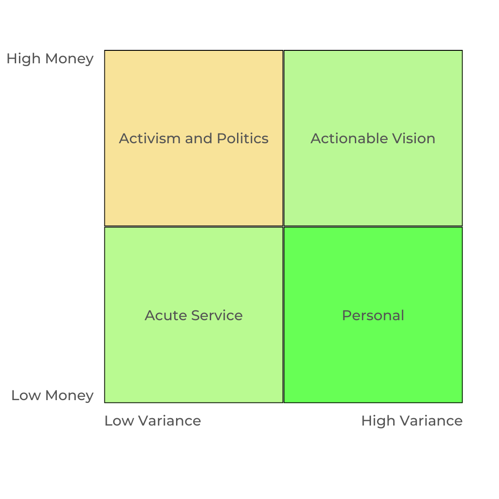

I was talking recently with a friend about all the amazing things we want to do with our lives.  I’m intoxicated by my own ideas, just like everyone else, and so most of my list looks like a bunch of company ideas and products that should exist, sprinkled with some book-writing.  We both have a nice long list and we were working through how to accomplish them. I believe strongly that the biggest difference between the rich and the poor is the ability to change and shape the world as you see fit, usually with capital. This is what wealth can purchase and it’s the big reason why I think [generating wealth is The Best Option](/the-options/). 

But then he pointed to my list again and said, “Greg, there’s no charity that you really believe in on here. Where do you want to make a bigger impact in the world? Maybe we should start there.”

I cycled through a few reactions.
1. Shit, I’m an asshole.
2. No you don’t understand what I’m saying about wealth! So I started writing a scree about why we shouldn't start with charity. After writing for awhile, I realized that..
3. Clearly _I_ don’t understand either.

And here I am, trying to reason out my issues with charity. Because I do have some issues, and I think it’s valid.

But first let's dip into some related topics that will interlock together.

## 1. Transaction Costs

Back in 1972, Peter Singer unleashed on the world an excellent little essay called [_Famine, Affluence, and Morality_](https://personal.lse.ac.uk/robert49/teaching/mm/articles/Singer_1972Famine.pdf). Singer makes a visceral analogy between the moral imperative one has when they see a kid drowning in a pond and the obligation everyone has over starving children in a famine-stricken country on the other side of the world. For Singer there is no difference in our modern world. In his words:

> From the moral point of view, the development of the world into a "global village" has made an important, though still unrecognized, difference to our moral situation. Expert observers and supervisors, sent out by famine relief organizations or permanently stationed in famine-prone areas, can direct our aid to a refugee in Bengal almost as effectively as we could get it to someone in our own block. There would seem, therefore, to be no possible justification for discriminating on geographical grounds.

This essay was effectively the beginning of the Effective Altruism movement. At least, it's what started Will MacAskill down the formulation path from utilitarianism to EA. But we'll get to that later.

Mike Munger and Ben Goldhaber have several different answers to this including ideas around consequentialism and obligations to others, but the argument that I think is the most practical to people is around transaction costs.

Transaction costs are broken down into the 3 T's - triangulation, transfer, and trust. To use Singer's Bengali example, it's still tremendously difficult to get money to the Bengali refugees and to have a strong assurance that most or all of it (for some definition of "most") gets there. At best this is an inefficient process. At worst, the money is consumed somewhere in the middle by well-meaning 501c3's or selfish, corrupt foreign politicians. Our global village is still a difficult and opaque box, filled with the same human systems and faults that have always existed. Despite our progress, Singer's moral equivalence remains false: the moral activation expected of us for those suffering in our direct sphere of influence is not the same as what's expected halfway around the world.

This is not an empathetic argument, and those who make it in public get lambasted for it. [Chamath made it once on his podcast](https://www.youtube.com/watch?v=qbeHyN15HQE). Jason Calacanis started talking about the Uighurs in China and Chamath gave him an honest answer: "That is below my line." The mob wasted him for it. He was more honest than most are willing to be; I'm not sure he'll ever be that honest again.

But Chamath's answer is _accurate_ in some way, even if we don't like it. We _cannot_ care about everything; it's the moral equivalent of caring about nothing. This is the primary argument Munger gives against Singer, and reaches back to Adam Smith in _The Theory of Moral Sentiments_ to do it. He quotes a long passage of Smith that begins:

> Two different sets of philosophers have attempted to teach us this hardest of all the lessons of morality. One set have laboured to increase our sensibility to the interests of others; another, to diminish that to our own. The first would have us feel for others as we naturally feel for ourselves. The second would have us feel for ourselves as we naturally feel for others. Both, perhaps, have carried their doctrines a good deal beyond the just standard of nature and propriety.
>
> The first are those whining and melancholy moralists who are perpetually reproaching us with our happiness, while so many of our brethren are in misery, who regard as impious the natural joy of prosperity, which does not think of the many wretches that are at every instant labouring under all sorts of calamities, in the langour of poverty, in the agony of disease, in the horrors of death, under the insults and oppression of their enemies.

Smith goes on and suggests elegantly that commiserating is not only not moral, but also not helpful. Time and geography overcome whatever ability we have:

> Take the whole earth at an average, for one man who suffers pain or misery, you will find twenty in prosperity and joy, or at least in tolerable circumstances. No reason, surely, can be assigned why we should rather weep with the one than rejoice with the twenty. This artificial commiseration, besides, is not only absurd, but seems altogether unattainable .... And, last of all, this disposition of mind, though it could be attained, would be perfectly useless, and could serve no other purpose than to render miserable the person who possessed it. Whatever interest we take in the fortune of those with whom we have no acquaintance or connection, and who are placed altogether out of the sphere of our activity, can produce only anxiety to ourselves, without any manner of advantage to them. To what purpose should we trouble ourselves about the world in the moon? All men, even those at the greatest distance, are no doubt entitled to our good wishes, and our good wishes we naturally give them. But if, notwithstanding, they should be unfortunate, to give ourselves any anxiety upon that account seems to be no part of our duty. That we should be but little interested, therefore, in the fortune of those whom we can neither serve nor hurt, and who are in every respect so very remote from us, seems wisely ordered by Nature; and if it were possible to alter in this respect the original constitution of our frame, we could yet gain nothing by the change.

As much as Singer would like it to be so, we have not yet overcome the actual transaction costs created by both time and space to efficiently help people halfway across the world. If anything, modern man's situation is more problematic because, while the transmutation of money and energy across the Earth remains difficult, information travels easily. Our news is filled with every tragic event from every country in the world and we feel more compelled than even before to perform the commiseration that Smith warns us against.

I can think of no better remonstration to Singer than Smith, 200 years his prior.

## 2. Maslow

> "It is quite true that man lives by bread alone — when there is no bread. But what happens to man’s desires when there is plenty of bread and when his belly is chronically filled? At once other (and “higher”) needs emerge and these, rather than physiological hungers, dominate the organism. And when these in turn are satisfied, again new (and still “higher”) needs emerge and so on. This is what we mean by saying that the basic human needs are organized into a hierarchy of relative prepotency" -Abraham Maslow

Maslow introduced the idea of a hierarchy of needs back in the 1940s as an effort to reflect a positive, healthy component of psychology to contrast the forever negative "sick" part. Nearly everyone is familiar with the hierarchy now, and it's been expanded and refined over time. It's less well known that you can divide the pyramid in half. At the bottom are the "deficient needs"; these are the ones that take over completely whenever they're lacking. If you don't have enough to eat, you don't think about much else. It's the same with a roof over your head. And it's worse with bread and roofs for your kids or immediate family too. You need all of these and you can't think about much else.

Back in the 60s and 70s, Benjamin Bloom conducted research to determine how different educational systems compared to each other. He tested students using a traditional classroom curriculum and using a tutoring-based mastery program where students must perform above 90% on testing before moving on to the next step. Bloom discovered what came to be called the "two-sigma problem": equivalent students using mastery learning techniques performed _two standard deviations_ better than those in the classroom, a remarkable difference.

There's a whole range of problems that we consistently fail at because we think they need incremental solutions. It's why diets produce mostly temporary results and how parents slipslide into having kids addicted to their screens. Parents usually start with some reasonable level of screen time and then it grows and GROWS. And suddenly the parents are striving for the magical state of "moderation" by setting incremental goals like "20% less screen time". What it's 20% less _of_ varies - sometimes it's past habits and sometimes the relative usage of their peers. At first this sounds like a laudable goal, but "20% less" doesn't make the change parents are looking for because it doesn't change the child's focus or their screen time cravings. It's not _transformational_. In order to make that kind of change, you need to do the mastery-equivalent and remove screen time almost completely; otherwise the kid's habits and values won't change.

Mastery learning reflects transformation, a totally different outlook on the objectives defined by a threshold. We can apply the same transformational form to Maslow's deficient needs. If you give someone who is hungry 10% more food it will remain ineffective until it's enough to surpass the barrier of their basic needs. You must reach a level at which they no longer need to worry about food or hunger. Until that point, incremental steps are inconsequential.

Before an individual is capable of climbing the pyramid and focusing on higher-level goals - those related to growth - they must undergo the transformation required to satisfy all of their deficient needs.

## 3. Capital Allocation

Maslow's ideas operate at the level of an individual, but policy decisions operate at the level of populations and statistics. Let's say we make you the king for a day and give you a billion dollars to do as much good as you can: what do you do? There are so many problems!

What most people would do, with the best intentions in their heart, is make as many people's lives better as they can. Could you do that by simply giving 1 million people each $1,000? Is that enough or should you try to affect more people? Should some stipulations be put on the money? Do you give them a stipend so that they use the money positively and don't just go buy booze and drugs?

And why give 1 million people $1,000 at a time? Why not give 10,000 people $100,000! That's enough to be transformational for most people. Which would have more impact? How could you measure? And how do you choose people? Someone won't get it and they won't be thrilled.

And what if your bucket of money isn't big enough? A billion dollars is a lot of money that could go towards some great causes, but if climate change is your big focus then a single billion is a drop in the bucket and you won't see much impact. If you choose to give it to climate change, is that a waste when it's such a marginal difference to the total funding? Or is that problem so important that you should combine your billion with other billions?

The idea of what you could actually do with a bucket of money is usually an unexamined calculus that should raise more questions than it does. The primary tradeoff is breadth vs. depth. Go deep with focus and you can try to have a transformational impact on one issue. Go broad and you can spread impact wider, but at the cost of depth. It's easy to think that money simply solves everything but it turns out that the world has a lot of problems and a finite amount of money. The [Copenhagen Consensus](https://copenhagenconsensus.com/copenhagen-consensus-ii/outcomes) has tried to run this very experiment. They've put together a panel of economists (among others) and asked them to allocate a fixed amount of money to maximize the amount of good the money can do. The resulting list favors straightforward and direct impacts - it's much better to have a big impact on someone poor right now (e.g. malnutrition in children) than to have a smaller impact on someone 50 or 100 years in the future (e.g. rising sea levels). Once again Mr. Singer, time and geography matter.

***

Everyone has biases and so do I.

When I think of the types of charities that really excite me they sound much more like Venture Capital than charity - things like [Emergent Ventures] and the [Thiel Fellowship]. The first grant from Emergent Ventures went to a Ukrainian economist who wanted to write more economics books in his native language; he eventually became Zelenskyy’s economic advisor. And the amount of change that’s come out of winners of Thiel Fellowships is completely ridiculous. There's Vitalik and Ethereum, the founder of Figma, one of the youngest people to successfully produce nuclear fusion, a 20 year old who built software to detect Parkinson’s, and Boyan Slat, who founded the Ocean Cleanup. By taking many shots and distributing a relatively small amount of money - $100,000 per person - across a larger number of promising young people, Thiel has been able to drive more impact than he could in other ways.

These are all non-zero-sum investments. High variance. Risky. But potentially transformational. None of them affect the poor or the needy or anyone with Maslow's deficient needs. At least not directly and not immediately.

And maybe that's OK. Technology is the largest lever we have to change the world. The problem is just that we don't always understand _how it works_. Which is why NASA, and more recently SpaceX, and every other moonshot have had to justify their raison d'etre to politicians and the public alike, even though we've had centuries to catch on. Technology extracts us from problems in ways we can't possibly foretell. The [horse manure crisis](https://www.historic-uk.com/HistoryUK/HistoryofBritain/Great-Horse-Manure-Crisis-of-1894/) of the 1890s never panned out the way the catastrophists envisioned. Nothing much has changed since then. The pessimists continue to squeal and self-flagellate while innovation and technology continue to change the world.

Marc Andreesen and Peter Thiel are the prophets of this view of the world. Andreesen has explained his vision of the world in his essays Software Is Eating The World and the Techno-Optimist Manifesto. And Thiel lays all this out in _Zero to One_. Here's his chart for how you can think about the world:

Thiel wants to focus his capital on _definite optimism_.  As Tara Isabella Burton [says](https://www.city-journal.org/article/the-gospel-according-to-peter-thiel), "The creation of a cutting-edge company, for Thiel, should be about remaking the world."

Thiel's VC investments represent a definite focus on a specific _problem_ that a company is trying to solve. His Thiel Fellowships represent a definite focus on specific _people_ that can help transform the world.

## 4. EA and Calculation Problems

Back in the 19th and early 20th centuries capitalism was a significantly exploitative system. Capitalism transforms labor and raw materials into profit. Since almost all of the labor available back then was still fundamentally human backs and muscles (and some horses too) and all the raw resources we needed kept rising in direct correlation with the amount of profits and GDP, there were lots of pretty valid concerns about both the human backs and the amount of material the Earth can offer. Neither was infinite. But profit demanded to increase, and we kept stripping both raw.

A lot of smart and optimistic people rejected this system and started aiming for something better, something owned by the people. Something where everyone could contribute and nobody would be left behind. "From each according to his ability, to each according to his needs." And these ideas built a different path away from capitalism and over to vanguard parties and dictatorships of the proletariat and relishing the revolutionary gusto of all things socialist.

And that's fine as far as it goes! The ideas of socialism are captivating because they sound so right and just and equal. Especially next to the exploitation of capitalism. It took another set of smart and optimistic people over in Austria to explain why one system was so good and the other so bad even when it seems like the exact opposite. Mises [wrote back in 1920](https://en.wikipedia.org/wiki/Economic_Calculation_in_the_Socialist_Commonwealth) about the failure of socialism to understand the simple information signaling inherent in prices. A price, it turns out, can define a market and drive the efficient use of both labor and materials.

This particular problem with socialism became known as the Economic Calculation Problem and it suggests that centrally planned systems are fundamentally incapable of having the information necessary to efficiently allocate resources. Where capitalism starts out looking selfish and exploitative, it ends up _eventually_ driving progress and makes the world better. It's not altruistic, there's none of the intent to do good, but that's the state the system moves toward. Socialism, on the other hand, starts out looking empathetic and equal and just and ends up evil and terrifying. It has done this every single time it's been tried.

The economic calculation problem is not the only problem with socialist ideals - there's plenty of those! But this idea has been repackaged in the Effective Altruism movement. EAs believe strongly in the utilitarian urge to maximize the amount of good they can do in the world. Just like socialism, they start with a laudable goal and rapidly diverge.

On the other hand, markets prevail because they value experimentation and the collective wisdom of crowds. By allowing markets to function we enable this process to unfold. Markets act like a river. A river seems to meander across a landscape, but at every step the water is choosing the most efficient path: down. Markets don't seem efficient either, but they have proven to be effective.

Hayek encapsulated all of this with one delightful sentence:

> "The curious task of economics is to demonstrate to men how little they really know about what they imagine the can design."

We're still trying to make the same assumptions: that we can flawlessly design a system from the start. All the charitable altruists translate their desire to maximize a good into a belief in central knowledge that doesn't exist. And it's just as wrong as socialism or Singer's hedonistic utilitarianism for that matter.

Twenty years ago, Stafford Beer made the [staggeringly simple statement](https://en.wikipedia.org/wiki/The_purpose_of_a_system_is_what_it_does) that "the purpose of a system is what it does." His goal was to remind system designers that, regardless of the intent of the design and operation of a system, what matters is what happens when it runs.

If Hayek is the _ex ante_ view, then Beer states it _ex post._ We can judge the engines of modern society by their obvious successes and failures and, between the socialist and capitalist versions, there's a clear winner. It's too early to judge the system of EA on how it runs (and it's probably fair to say the same for mercantilist China, although the cracks are getting pretty big), but episodes like FTX and SBF don't present well. How long until the defenders of EA say that "real effective altruism has never been tried"?

**Footnote 1:** As an aside, [Byrne Hobart](https://www.thediff.co/archive/amazon-sees-like-a-state/) has an incredibly interesting argument that we may have finally reached a point in human technology where we have enough data to centrally solve the economic calculation problem. He argues that it isn't the State that can do this, but Amazon and Google and Facebook. His counterpoint to Hayek is this line: "We have reached a weird point in history where we can say that true communism has never been tried, because they didn’t have enough RAM."

**Footnote 2:** I have a fair amount to say about the growing EACC movement and the idea of acceleration in general. Mostly, they revolve around the equilibrium that is a strong and sustainable growth vector and the idea that societies oscillate around over and underregulating or controlling that growth. We're in an obvious time of overregulation and EACC represents a cathartic dampener on that trend so as to regain the equilibria. Yes, compute should be free and so should speech and ideas and all sorts of other things, but regulation is useful and unfettering to the degree that externalities take over is bad too.

## 5. Corporations and Risks

The modern limited liability corporation is a remarkable construction for collective action. It's taken hundreds of years to optimize since Adam Smith began discussing the invisible hand and the self-interest of the butcher and the baker. A corporation's role is to spread the greatest value to it's shareholders by distributing that value across customers and accumulating profit.

Profit is still denigrated. Socialists despise profits as evil. Altruists see it as inefficient. Perhaps most concerning, many trad western capitalists see profit as a sign of short term thinking measured by the quarter that can hinder a company's progress or vision.

The design of corporations and profit is neither inherently good nor virtuous; they can be either, depending on their actions and goals. They can be evil and decadent too. But none of this is inherent in the idea of profit. Profits represent an information sharing mechanism. We can assess a corporation's performance relative to it's goals, which is a separate question from whether the goals are moral or virtuous.

Thomas Sowell describes prices this way:

> “Prices are important not because money is considered paramount but because prices are a fast and effective conveyor of information through a vast society in which fragmented knowledge must be coordinated.”

This measurement is important. Non-profits don't have the same conveyor of information, they simply have the goals. And without a separate measurement to account for their goals, non-profits inherently draw towards metrics that are not measurable in markets, especially power.

I propose what I call the [Cincinnatus Test](/cincinnatus/) for non-profits and activist organizations. This test draws inspiration from Cincinnatus of ancient Rome, who relinquished his dictatorial powers after completing his mission and returned to farming. Non-profits and activists often claim to have a specific goal in mind, so we can use their goals to determine if they are genuinely seeking to make a positive change or merely pursuing power. If they are willing to "step down" after achieving their goals, they pass the test. Which is why something like Greta Thunberg's shouting about a Free Palestine is so deeply dissonant; she's piercing the facade of manufacturing power.

A non-profit's job is to amplify and magnify. Corporations are designed to win. The best model of a company is a conspiracy with a specific model of the world they want to see in the future. Every company has a secret that makes them powerful. And we can test that secret quarterly. And even activist capitalists have a role to play because they can leave the stock if the profit is bad or they can leave the product if the mission is bad.

Provided their model of the world is ethically sound, corporations are usually the best solution. They work to accumulate power too, but we know _exactly_ why (revealed vs. stated preferences), we can measure it, and both shareholders and customers can respond and react inside the marketplace to effect changes. (I acknowledge lots of assumptions here: a positive regulatory environment, non-monopolistic market, etc.)

Stafford Beer's assessment that "the purpose of a system is what it does" isn't just a truism about the operation of an entity, it's also the method by which we can judge them against their intent. Is a system adhering to its intent?

For a corporation, the direction is set by their model of the world. And the evaluation is driven by profit.

> “Finally, when young people who “want to help mankind” come to me asking, “What should I do? I want to reduce poverty, save the world,” and similar noble aspirations at the macro-level, my suggestion is: 1) Never engage in virtue signaling; 2) Never engage in rent-seeking; 3) You must start a business. Put yourself on the line, start a business. Yes, take risk, and if you get rich (which is optional), spend your money generously on others. We need people to take (bounded) risks. The entire idea is to move the descendants of Homo sapiens away from the macro, away from abstract universal aims, away from the kind of social engineering that brings tail risks to society. Doing business will always help (because it brings about economic activity without large-scale risky changes in the economy); institutions (like the aid industry) may help, but they are equally likely to harm (I am being optimistic; I am certain that except for a few most do end up harming). Courage (risk taking) is the highest virtue. We need entrepreneurs.” — Nassim Taleb

**Footnote:** None of this is to discount the value of charitable 501c3 and other organizations that drive towards a specific cause. At their best, they can provide the funding necessary to drive help for their cause. But when it's time to effect more transformational change - to drive a different model of the world - a corporation is a better structure. The Cystic Fibrosis Foundation is a great example of this. They provided care and funding for cystic fibrosis for decades, but when a potential drug was found they funded and spun off a company to fund Kalydeco. The resulting drug has helped hundreds of thousands of patients and eventually provided a $3.3 billion payday back to the Foundation.

***

We're all just making bets. We undervalue trial and error. Trial and error is the most powerful force in our world and underpins nearly everything we do. It's literally what science is: hypothesize, test, evaluate, and try again with a new hypothesis. And we ourselves are shaped by nature's trials and errors in the form of evolution.

We need to be able to make mistakes as quickly as possible. The quicker we do, the easier it is to find out we're wrong. Experimenting in a small way let's us iterate more than taking on a project in bigger chunks.

Why is it so hard for us to remember how important trial and error remains? Well for one, we like to think we're smarter than that. That's what Hayek's quote on economics is really about: humility. And Chamath points out that we need to retain humility even after our successes too:

> “There’s a tendency after things work to create a narrative fallacy that feeds your ego. You want to have been the person that saw it coming. And I think it’s much more honest to say we were very good probabilistic thinkers that tried to learn as quickly as possible, which meant make mistakes as quickly as possible." -Chamath Palihapitiya

Beyond humility, we also don't generally model our world properly. We tend to think the world presents total and accurate knowledge and that life is a zero sum game. If we analogize this to a game, it's chess. We know where the pieces are and the other player knows too. For us to win, they have to lose.

But this is a poor model for reality. We don't simply see the pieces, maneuver them, and outsmart anyone else. Rather, we take risks, make bets, leverage luck, and read the people around us. And if we do all that perfectly, we _still_ might lose!

Simply put, we think too much about chess and not enough about poker.

Modern markets are like a poker game where we're minting more currency as we go, building the pot larger and larger until everyone ends up with a stack larger than when they started. Some will end up with monster stacks. But that's ok, because capitalism is a [strong link problem](https://www.experimental-history.com/p/science-is-a-strong-link-problem) and a rising tide lifts all boats. Corporations give us the collection action model to bet in the market and get it wrong (and then right), both as individuals and as groups, and grow the pie.

Marc Andreesen said that "Technological innovation in a market system is inherently philanthropic." Technology and corporations have been proven for over a century to be the right place to make incremental positive changes for people and for society at large. It provides the correct blend of systems and incentives and regulations to do so.

# Charity

So where are we at here? A quick recap..
- Despite Singer's best efforts to convince us otherwise, utility needs to be discounted across time and space, mostly because of transaction costs.
- Maslow defined deficient needs as a set of fundamental requirements that humans will focus on to the exclusion of all else if they're lacking. Transformational change is required to eliminate these needs.
- Allocating capital requires a tradeoff between depth of impact and breadth of impact.
- Technology provides higher risk and higher variance and more capability to change the world than anything else.
- Central planning is a myth we're apt to repeat because the idea of upfront knowledge is very appealing.
- We should judge a system based on what it does rather than what it _intends_ to do.
- Because they can measure progress consistently and repetitively, corporations are usually the best way to leverage technology to change the world and to make bets that produce iterative change.

So with those ideas out there, let's talk about charity.

Charity, just like business or venture capital or government legislation, ends up being a problem of capital allocation. While there is no such thing as perfectly efficient capital allocation, we can choose what kinds of inefficiencies we should harbor. Direct transfers of capital should be as efficient as possible so as to minimize transaction costs and allow the money to help individuals jump the gap of Maslow's deficient needs. On the other hand, technology bets - whether on people or problems - can afford to be inefficient. They can be transformational not to an individual, but to a particular problem and to society at large.

We're going to break charity down on two axes. Some charities are big money and some are small money. And some charities have low variance outputs and others have very high variance outputs:

Variance doesn’t necessarily equate to impact. All charities want to have impact but variance qualifies whether the impact is inline with the money allocated. For instance, a soup kitchen has a well-defined and strong continuing positive impact on a local level. It’s highly unlikely that a single soup kitchen will change the world. It's too low variance. On the other hand, a healthcare grant - effectively a donation to fund some research - could be the breakthrough that solves Alzheimer’s. Most grants won’t change the world, but it’s possible that a few will.

### Activism and Politics

Activism is the kind of charity that goes after a cause. It can be grassroots, but it’s usually big money and low variance. The goal is to change hearts and minds or enact regulation as often as it is to help directly. It is very broad and focuses on big ticket bullet point items, rather than decomposing the cause into smaller and more concrete problems. Greenpeace campaigns on “nurturing life”. The Sunrise Movement campaigns on “climate emergency”. PreBorn is dedicated to saving "babies and souls".

Why does politics go with this?

These kinds of changes inevitably intersect with political spheres. At it's best, politics is trying to do the same thing: change hearts and minds or enact regulation. It fails to do this often because hearts and minds in the political sphere are hardened.

### Actionable Vision

These are big ticket items that require large amounts of money or organization and are going after a singular and well-defined goal. The first that comes to mind - in part because I believe in it and have donated to it is the [Ocean Cleanup](https://theoceancleanup.com/). Boyan Slat is on his way to helping fix the plastics problem in the oceans _and_ the underlying issue at river sources. This requires a lot of money, support, and research. But it’s also well-defined and easy to metric: either the ocean is much cleaner or it is not. Boyan Slat will go on to do something else, but the Ocean Cleanup won’t. It's job is over when the ocean is clean. It’s also high variance. If it works - and it may not! - it’s a massive environmental win and fundamentally changed the world.

### Acute Service

Acute services are the local charities that usually come to mind when we think about charity. It’s not trying to raise money to push legislation or policy so that the future world is better. It’s not trying to accomplish one world-crushing and visionary goal. It’s trying to help real people, locally, right now. And there are so many needs: the homeless, the poor, foster children, scared new moms, teenagers with mental health concerns.. there are needs everywhere. These kinds of “right now” problems can’t wait for some product or policy to help. They need more people and many hands can help make light work. In the grand scheme, with enough elevation, these are low money and low variance charities. But that doesn't stop them from being high impact. This is the highest impact with the smallest time discount. If you want to help right now, this is a great place to do it.

### Personal

Personal charity is, well, personal. It’s helping to fund your godson’s future education, or supporting the local 501c3 that your friend's family runs out of their house, or spending time with kids that lost their parents, or helping someone rebuild their business after a weather disaster. These sorts of charities don’t usually mean a huge chunk of money, but small money or small effort can very suddenly make big differences in people’s lives. The impact is often not the money as much as it is the fact that someone is paying attention. That someone cares. People see value in themselves sometimes only when someone else shows them that they have value.

Tyler Cowen has a quote I think about often:

> At critical moments in time, you can raise the aspirations of other people significantly, especially when they are relatively young, simply by suggesting they do something better or more ambitious than what they might have in mind. It costs you relatively little to do this, but the benefit to them, and to the broader world, may be enormous. This is in fact one of the most valuable things you can do with your time and with your life.

We can push people to become more than what they would otherwise. Sometimes they’ve already started and we just have to keep nudging them forward and sometimes we have to give them some better initial conditions.

Regardless of the circumstance: there’s nothing more high variance than helping change the course of someone’s life.

## Change Lives

We want to help the world. What should we do? First things first, we should go read that Taleb quote again.

I get why people gravitate in this political direction. Some of the biggest problems of the 21st century involve externalities that aren’t captured in the systems we have right now. Climate change is a problem because CO2 isn’t a variable in the equations of resource trade today. And because it’s an externality that affects the whole globe, we think the solution needs to be global too. Incentive system design is perhaps the most important problem humanity has to solve, but driving this design into the realm of politics just exacerbates the issue. As Ernest Benn said:

> Politics is the art of looking for trouble, finding it whether it exists or not, diagnosing it incorrectly, and applying the wrong remedy.

And then there's all the virtue signaling and personality contests, which brings me to another problem I have.. not with charity, but with our modern times. One of the incredible secrets about performing charity is the amount of good and change it can bring about in _us._ Those who perform charity can fundamentally change themselves. The struggle today is that, like so many other activities, this can become performative - an act we stage to demonstrate our goodness and character. Point us in a given direction and tell us there's an audience and we'll let you measure our.. well, anything really.

I’m sure there’s diamonds in politics somewhere, but I’m going to cross that quadrant off.

Let’s look at acute services. These charities are often great and make real, local impact. And here's where I sink into a quagmire for a loyal Catholic. Christopher Hitchens wrote a brutal critique of Mother Teresa and her work in which he said, among many other things, “She didn’t love the poor, she loved poverty.”

It’s true that Mother Teresa spent her life dedicated to service. But it’s also true that she worked inside a set of systems and didn’t do much to change them. (Hitchens would say she perpetuated them.)

I don’t share all of Hitchens’ disdain for her work, but I do think there is a complement to this kind of intimate service that is missing. We need dedication to serve those in need, but we also need those willing to evaluate the systems themselves, to understand scale, and generate system change. System changes are inherently high variance. They’re also far harder to predict and to understand.  Or we could change the system.

What I believe most non-profits and public policies get wrong is the tradeoffs they make for depth and breadth. They allocate very large amounts of capital to try to drive small incremental changes and end up very capital inefficient.  We should take more shots. They won't all work or all be big, and that's just fine.

Charity should be high variance. We should be looking to make transformational changes in people's lives. Give them something they never thought they could have. Not just make a difference, but _change lives._

# PRD: Time and Treasure

I started thinking about all of this because I wrote some stuff about what I think about for the future and one friend challenged that I should think more about charity. So I wrote some more and tried to describe why I don't think charity is all that great of an idea.

And then more recently another friend challenged me again. I was ranting about something related to charity and making a difference. It might have been somewhat coherent, but it was all talk. So he looked at me and said, "Greg let's just do it. Come on, let's go lift someone out of poverty."

I mean how do you respond to that? Yes! Let's do it.

How?

No idea. Where do you find people to help? What do they need? How long does it take?  

This sort of change is high variance and pulls ideas from the operation of business, venture capital, and charity. It’s not enough today to just kick some money to the local charity and feel happy. If you’re upper middle class or higher income, that is just table stakes. 

We need to build more. It takes vision, capital, risk, and effort to change the world.

The more I think about it, the more I believe there's a gap that needs filling. Here's what I think that might look like.

**Mission:** Take your time and your treasure and change someone's life.

**Assumptions:**
- Transformational change at an individual level isn't all that expensive. You need to lift someone above their deficient needs (per Maslow) for a long enough time that they build the capacity to sustain it for themselves.
- This relationship should be local and face to face. Time and geography ruin the bond and trust that needs to occur for transformation.
- Trying to judge and evaluate who should get what on a relative basis creates incentives that are besides the point. Whoever is providing the time and treasure should choose for themselves.
- It's more important to deeply impact an individual or family than lightly impact many.
- We cannot predict how these impacts will offur.

**System:**
- Build a "matchmaking" market for both sides of charity.  Model this against "patronage" and match individual donors with individuals or families with needs.
- Allow those seeking help to describe what transformation of their lives looks like to them. Per Mauricio Miller, autonomy of their own future is critical, so the system should have very few to no opinions about the changes beyond providing the medium.
- Work with local charities like food banks, battered women shelters, homeless shelters, foster programs, etc. for the initial tranche of candidates.  
- Build tools for the matchmaking process including some set of criteria. Allow those providing time/treasure to describe what they're capable of and provide potential matches. Include a random-local match should they just want to have an impact.
- The site itself should allow zero transfer of funds. No money should flow through the site. The actual transition of resources will be intimate and will vary. The site is for matchmaking only.
- The system should collect metrics and observe what occurs over a larger sample size.  Which conditions allow transformation to occur and which do not?  Per Mauricio Miller, the principle of observation only should be strict.
- The site should be incredibly simple on the technology side.  It should be inline with Hacker News which, to this day, runs off 1 VPS and serves millions of requests. The simpler the better to incur minimal expenses.
- Once you select someone you are dedicated to them and having a strong impact. There should be a minimum time and money investment, based at least loosely on the described needs of the people.
- This is not just about money, it's about time and expertise too.  Helping avoid predatory loans. Improving their credit score. Figuring out how to rent or buy a house or get to a good school district. Help provide better care so their kids can build the right habits. Whatever it takes.
- A long term goal should be for people that were originally seeking time and treasure to be able to give their own time and treasure back.

#### References

- Dignity by Chris Arnade: https://www.amazon.com/Dignity-Seeking-Respect-Back-America/dp/0525534733/
- The Alternative by Mauricio Miller: https://www.amazon.com/ALTERNATIVE-Believe-About-Poverty-Wrong-ebook/dp/B0BWGBBRDK/
- [Strong Link Problems](https://www.experimental-history.com/p/science-is-a-strong-link-problem)
- [Income Inequality](https://paulgraham.com/ineq.html)
- [Does Capitalism Beat Charity](https://www.astralcodexten.com/p/does-capitalism-beat-charity)
- [Ten Times As Much](https://www.betonit.ai/p/do-ten-times-as-much)