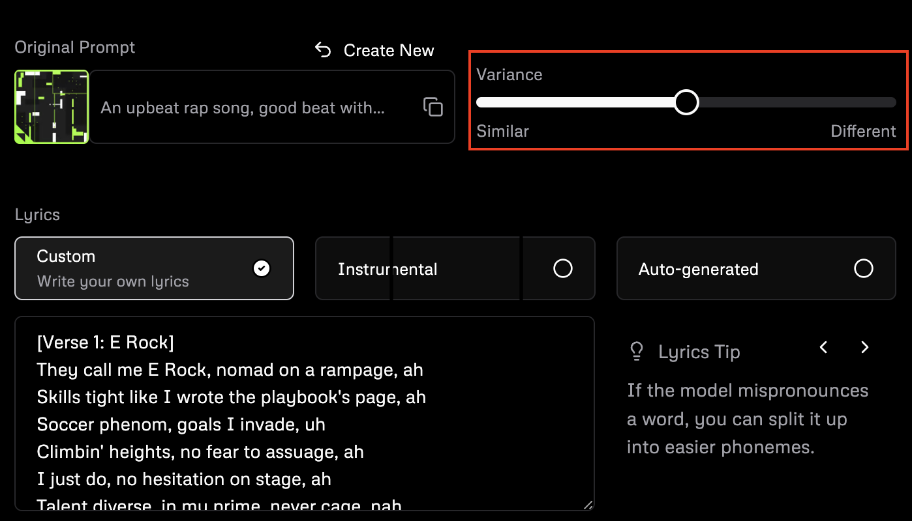
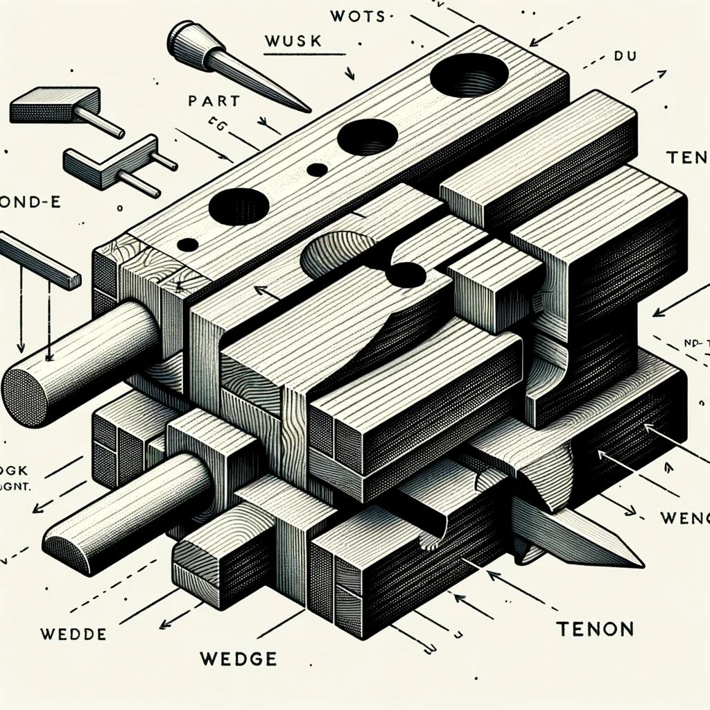

When I was a kid, I got Bryce 3D for my birthday. I was fascinated by computer art and I thought this program was the shit. It had mathematical ties back to fractal geometry and Benoit Mandelbrot - which made it cooler mind you - and it would produce the most magical, realistic landscapes. The designers made Bryce a really beautiful program. The program _itself_ was beautiful but they made it incredibly easy to make beautiful things too. Which was important because Bryce had no real purpose, it was just a beloved toy. You couldn't do anything real with it, except play or show off. I sunk hours into building sci-fi looking scenes, sunsets, managing color palettes, manipulating planes and shapes, and getting things _just right_. And finally, when I knew my art rivaled the Sistine Chapel, I would hit the magic button: Render... and wait for minutes or even hours for the final product.

Bryce was a raytracing program. When you hit render, it would take the light sources in your 3D world and cast out rays into the world and use a whole heap of math to evaluate how those rays reflect, react, or scatter against the surfaces in the world. Then it would update the values of the pixels based on those rays and add another layer. I would sometimes get halfway through a render, take a peak at how the image was turning out, cancel the render and go make some adjustments. Maybe the texture on the mountains wasn't what I was expecting and looked ugly with the blue sky so I'd go and change it. Then I'd hit render again and wait.

***

Udio just came out and blew everyone's minds, including mine. Give [Dune the Musical](https://www.udio.com/songs/eY7xtug1dV6hbfCDhyHJua) a listen. Someone describe this as the first AI to pass the Turing test in music - you wouldn't know it was AI generated.

Naturally, I made some songs about my kids. And they were fun! The lyrics stayed on point and were sometimes inventive. The beats were good. The layers filled out the sun. My kids love them.

A couple were good but I wanted to change the beat or manipulate the lyrics. Udio has a Remix button and here's what you get:

How similar do I want it to be? I want it to be exactly the same, just with a bit less snare and a modified bass line.

In more traditional music software, each of the sounds would be built up over different tracks and I'd be able to manipulate them individually to build up the sound. With AI, I can't.

[Ilya keeps saying](https://www.youtube.com/watch?v=8BPtNZ8S3e0) that "when we train a large neural network to accurately predict the next word in lots of different tasks, what we are doing is that we are learning a world model.. it turns out that to just learn the statistical correlations in text, to compress them really well, what the neural network learns is some representation of the process that produced the text. This text is actually a projection of the world. There is a world out there, and it has a projection on this text."

Language is an incredibly messy higher dimensional problem. I would argue there's no really good model for what's going on in language. But in 3d geometry and imagery and music we have really well defined models for what these things look like. Chord structures and times and pixels and ray traces and scatter textures. I'm not saying these are the best models or even the only models, but they are very good models of these worlds.

And AI obviously has some kind of model of the world! The stuff it's doing would have been considered sci-fi just 10 years ago. But nobody understands the model it has. Nobody can manipulate or change it. The closest we get is "oh make it similar". Midjourney has `--cref` and `--cw` to help a ton with character consistency. It's better, but it's still an ignorant command.

AI commands are largely ignorant. We have no idea what we're going to get. We've learned plenty of ways to access these models in different ways, but this has largely been trial and error.

***

Awhile back, I was trying to remember what joinery these old woodworking benches used to make them portable. So I asked ChatGPT: "What are the joints called for the legs in a traditional Moravian workbench?" and got a fantastic answer:

> In traditional Moravian workbenches, the legs are often attached to the top using a specific type of joint known as the "wedge tenon joint" or "tusk tenon joint." This joint is a variation of the mortise and tenon joint, which is a fundamental woodworking joint. In the wedge (or tusk) tenon joint, a wedge-shaped piece is used to secure the tenon into the mortise. This design allows for a very strong connection that can be easily assembled and disassembled, making the Moravian workbench popular for its portability and sturdiness.

That's exactly what I wanted. Next step: "Can you show a diagram?"

There's an idea of a wedge tenon in there somewhere, or maybe three or four times, but that is not it. There's zero precision, and it is therefore useless. If these neural nets really are building a world model - and I still accept that they may be - there's going to consistently be an upper bound to the limit of their utility.  It's not enough for the AI to build a model. Humans need to be able to understand the model so that - like the shapes and structures in a raytracing program - we can manipulate precise details of the model.  Right now, we are almost entirely ignorant of the worlds these models are building.  