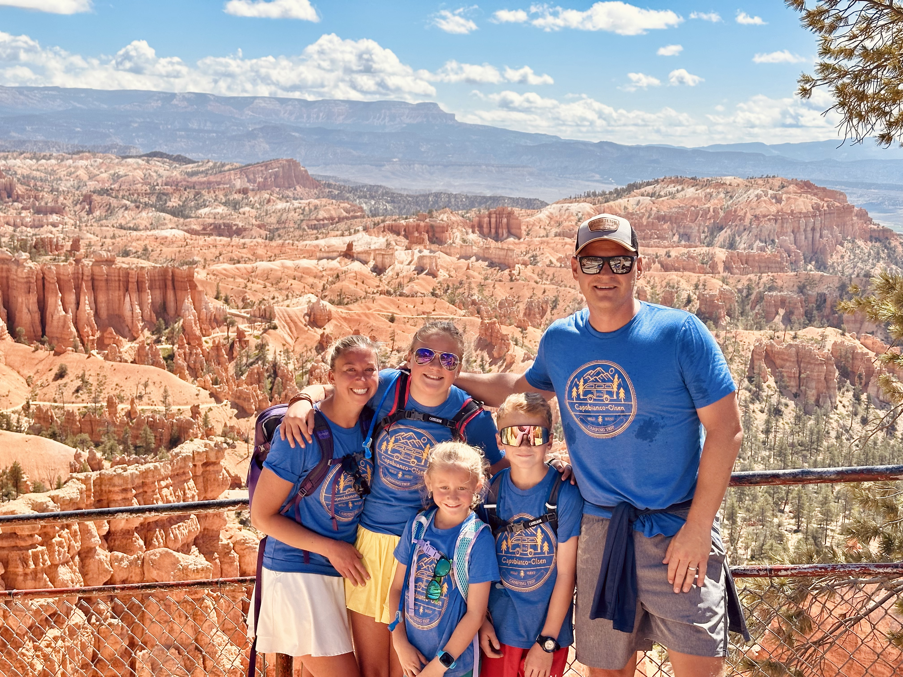

We're two weeks into this trip and I haven't written a single word. This is for many reasons including starting the trip off very sick (likely COVID finally), lots of driving, having 9 kids around (traveling with another family), and the sheer pleasure of being mostly cutoff from the world. But most of all this trip has been about sensory experiences first with contemplation and the inside life of the mind taking a distant backseat for awhile.

There are so many tropes about living "in the moment" and going out to "touch grass" and the annoying thing about them is that they're all true. Getting out in the world, constantly moving, and having novel experiences is the finest way to reset. Your personality will become more natural. If you're a natural optimist, you'll be optimistic on the road. If you're a pessimist, you'll be pessimistic. If you're anxious, anxiety will rear up at each gas stop. And if you're excitable, you'll be excited all the time.

None of these are bad, even though anxiety and pessimism have negative connotations. The point is that these components aren't driven by an artificial world humans have built up around you, but by the more fundamental sensory inputs of movement and nature and daily rhythms. The natural pessimist allowed to be pessimistic rather than conform will be happier. And out on a trip, anxiety is not a concern to be medicated but a natural reaction to sensory inputs. You may be very nervous about the height and speed of the gondola ride, but you still get on. Downhill mountain biking might be brand new and intimidating, but you still do it. Sometimes out on the trail there's no choice but to let your 7 year old daughter walk along next to 100 foot high cliffs.

Our senses are more real than the worlds we make with our minds. Traveling is properly lauded as the best way to get out of our own way and reconnect with the world around us. Of the different ways to travel, I've found nothing better than taking an RV. In two weeks we've stayed at 10 different campgrounds and hit 4 different national parks so far. We've had snowstorms in Wyoming and 90 degree scorched earth in South Dakota. Our kids have eaten every day up and gone to bed exhausted. I haven't had time to write or do much of anything aside from simply reacting to what's next and taking in whatever is around me. For the second year in a row, I'm again surprised that I think I could do this for much longer.

Some other random thoughts:
- I don't know if I really had COVID but whatever it was took me out for a few days. It was one of those coughs that makes your ribs hurt. My lung capacity is still not 100%
- Wyoming is always spectacular. I want to see it in the winter though.
- Yellowstone is enormous - larger than Rhode Island and Delaware combined. We did the lower loop (96 miles) and barely scratched the surface.
- The easiest way to make yourself illegible is to get off the Internet. People in the real world are illegible.
- I used to be one of those coastal natives that thought talking to strangers was rude. I'm in my head thinking, why are you interrupting me?! The older I get the more I appreciate the awareness and politeness of the middle of the country.
- Phones corrupt our experience of the real world. It's not the device per se, it's the Girardian Terror of the social ecosystems we've built. Everybody you know is in your pocket, talking and posting and reacting to everything all the time. How can the red rock and dust of the trail under your feet compete with that?
- Campfires are magic.
- This is our second RV trip and we worried that it wouldn't hold us captive like the first experience. Our worry was baseless - this is just as great the second time around. It might be better, because..
- RV size matters. Our 32 ft. rig with a queen bed and more seating is worlds better than the smaller rig we had last time. I was worried about the ponderousness of the Ford E450 chassis but it's been a dream.
- When it comes time to get our own RV, the Super C feels like our favorite option so far. Diesel Freightliner chassis, 35-38 ft long, and pull a car behind.
- Traveling with friends is worlds better too. Everyday is a new party. Our kids are having a blast and becoming closer.

