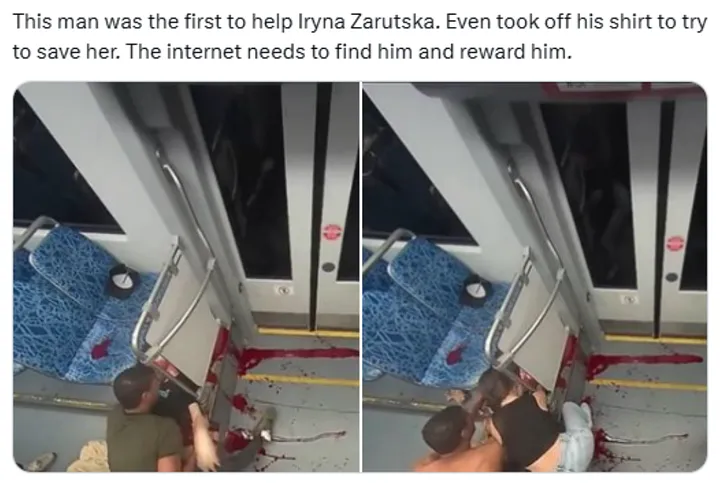

### Incentive System Design and The Path To Virtue

The MAGA movement, you see, is an internet thing. It’s another vertical online community — a bunch of deracinated, atomized individuals, thinly connected across vast distances by the notional bonds of ideology and identity. There is nothing in it of family, community, or rootedness to a place. It’s a digital consumption good. It’s a subreddit. It is a fandom.  — Noah Smith

This week, after two outrageous murders, I found myself reading not only the news but also the replies — the non-celebrity reactions and murmurs that gather like iron filings around a strong magnet. There were the usual pieties, but there was also something darker: there were normal twenty-somethings with respectable jobs treating a man’s death as content. Many thousands celebrated the murder of a 31-year-old father of two. A day before, after Iryna Zarutska was stabbed and bleeding on a bus, the other passengers ignored it. They sat there while she bled and wept. It took 2 minutes before a young man tore off his shirt to try to stop the bleeding. 

Solzhenitsyn’s observation is still true this century: the line between good and evil does not run between parties or classes but, as he wrote, through every human heart. I don’t believe any of these people are monsters. I can’t believe that. But monsters are being made today from the raw material of normal people. Souls are rendered down and stamped into regular units of engagement.

No names, that’s not the point. What systems demand attention seeking like this?

The factory that does this is not any single ideology but a set of systems, and the systems are arranged around a primitive god: attention. Every platform is an altar to it. We have built a culture in which going viral is treated as a sacrament, and like all sacraments, it comes with theology. It proposes a simple bargain: attention is proof of worth. The rest of our moral vocabulary bends itself to fit this new heresy. Mercy is showy, justice is spectacle, courage is a pose, and cruelty — if performed for the right audience — feels like virtue.

Consider the arithmetic of it: systems do what they measure and our modern systems measure attention. So we manufacture it. We make it cheap to produce and expensive to ignore. The consequence is not merely that we see more of what is lurid, it’s that our moral tuning-fork is struck dumb. And so we don’t recoil; we refresh and rewind and watch over and over. 

The desensitization is not a metaphor. A teenager who has watched a thousand murders at arm’s length, each enveloped in the frictionless theater of a phone, grows calluses around the soul so thick the prick of conscience can never get through. You cannot practice numbness for years and then produce authentic sympathy on cue. 

We used to know virtue is a craft. Aristotle said it, every household once enacted it: you become good by habit, not by opinion. You practice justice until it becomes the angle of your will; temperance until your appetites obey; courage until fear is outnumbered. The algorithms instead make a permanent audition for applause and trade habit for impulse. Where character is built by small, unwitnessed choices repeated until they stick, the feed insists every act be seen or it isn’t real.

It’s easy to outsource blame to the faceless systems building for attention, but that’s not the whole landscape. Parents still hand these devices to children with no scaffold. Schools claim to teach ‘digital literacy’ as if there’s an orderly limit to be held. Here, 13-year old: you’re allowed 2 shots of vodka, 4 cigarettes, and 2 hours of attention-seeking per day. Look: when you put a kid inside a market for attention, they are forced to trade the same extreme assets as everyone else: indignation, exhibition, and the small triumph of being seen. Call the result “rotting” if you like. It’s moral scurvy: a deficiency disease. Just as sugar masquerades as food, so too does attention impersonate virtue.

The online world demands ethics at planetary scale while removing the local duties by which ethics is learned. We live in Peter Singer’s world now: his empathetic, laudable parable of the drowning-child has been universalized by the network. Every morning your pocket delivers the child drowning in the pond in your neighborhood and the starving child on another continent and the child of some other cause— real or counterfeit, you can’t tell. The cost of ignoring any of them is framed as complicity; the cost of choosing one is framed as betrayal. We were not built to adjudicate the globe before breakfast. So we numb out, or we gesture, or we convert moral life into the management of signals. 

And all of the signals make the world feel small and movements feel large. Affiliation, no matter how niche or extreme, is a click away. Families and neighbors retreat behind real fences to block out humanity while curating the personalized echo chamber on their phone. Every movement today is what Noah Smith saw in MAGA: ‘a subreddit’, ‘a fandom’, humanity atomized. 

He could have been talking about nearly any movement today. Humanity atomized, responsibility diffused until it evaporates.

This is why the spectacle of people cheering a death reads to me not as evidence of native depravity but as systems failure. The systems of our public life are built to feed on souls. They pay out status for transgression and nothing for patience. They magnify the part of us that wants to be noticed and starve the part that wants to be good. In such a regime, justice is repurposed. It becomes not the steady application of law with an eye to mercy, but a performance of power—our side’s power—over enemies who are not citizens or neighbors or people, but temptations for the metrics.

The Christian grammar serves us better: Fall, confession, forgiveness, redemption, the lifetime apprenticeship of becoming someone worth trusting. You do not have to be religious to see the point. Children need ideals to reach for and rails to hold while they fail up toward them. We have removed the rails and replaced the ideals with “authenticity,” which means the right to spray your unformed soul onto the public square and call it Truth. It is no wonder the results look like malfunctioning adulthood. We have asked the young to master the most volatile media system in history, and then we act surprised when they behave like the market that formed them: skittish, herdish, prone to stampede.

What, then, to do? The answer will sound old because it is. The only coherent response is organized withdrawal. We need to exit and construct an alternative world where the currency is character. 

We face a civilizational choice dressed as a personal one. Either we abandon these systems or they complete their work of remaking us. There's no moderate position because the systems don't do moderation. They do extraction and amplification and are designed for total capture. They won't reform themselves — their pathology is their profit model.

These old systems worked because they were more sophisticated than we realized. The ritual and repetition and willingness to account for imperfection were the horsepower of virtue. They were designed to maximize the best parts of us. Virtue was practiced, not performed.

The building starts at home. If you are a parent, curate your child’s attention as if it were food and air, because it is. Read them the same book 50 times until they know every word. That’s what focus feels like. Write thank-you notes with them by hand, slowly, badly. That’s what effort feels like. Spend your days with no phones, not because phones are evil but because your child needs to know what their own thoughts and ideas sound like.

Delay the phone. Starve the feed. Refuse the constant audition. Practice by example. Build a world with work that bites, duties that recur, pleasures that compound. Praise invisibly. Reward endurance. Make the habits easy to begin and difficult to escape. Home can be a small republic where virtue builds. Where every act doesn't need to be seen to be real. Where the only algorithm is the imperfect, willful, and aspiring human.

If you want to live in a world of virtue, even aspirationally and failingly, you can’t live in the current online world.

None of this will abolish cruelty. The human heart will go on dividing. But the present system actively rewards our worst parts. When a culture builds devices that convert attention into social clout, it should not be startled to discover citizens minting currency from someone else’s blood. If the reactions to this tragedy feel shocking, it is because they are (for now) still legible as a departure from what we were taught to expect. Keep the incentives as they are and the shock will fade. Numbness is a habit too.

This week's tragedies cut me closer than others — why these murders and not others, this shooting and not that one? I am describing the muck on my own boots. I can't defend the logic of it. Once this made me feel shame, but now I believe Singer was wrong. If you empathize with everything, it means nothing. Every tragedy is not equally urgent to each of us, every wrong not equally ours to adjudicate. Genuine moral response is particular. The algorithms call this a failure. I’m starting to believe it’s what keeps us human.

You cannot practice good by doomscrolling, you cannot raise the dead by refreshing, you cannot become merciful by repeating public trials for sport. We need the old path back. The path toward virtue: local, repeated, guided practice on being human.

We’ve replaced it with an engine that corrodes the best of us and fuels the worst. If we do not change the engines, they will change us. At some point there will be nothing left to shock us at all. 

This is where the monsters live.