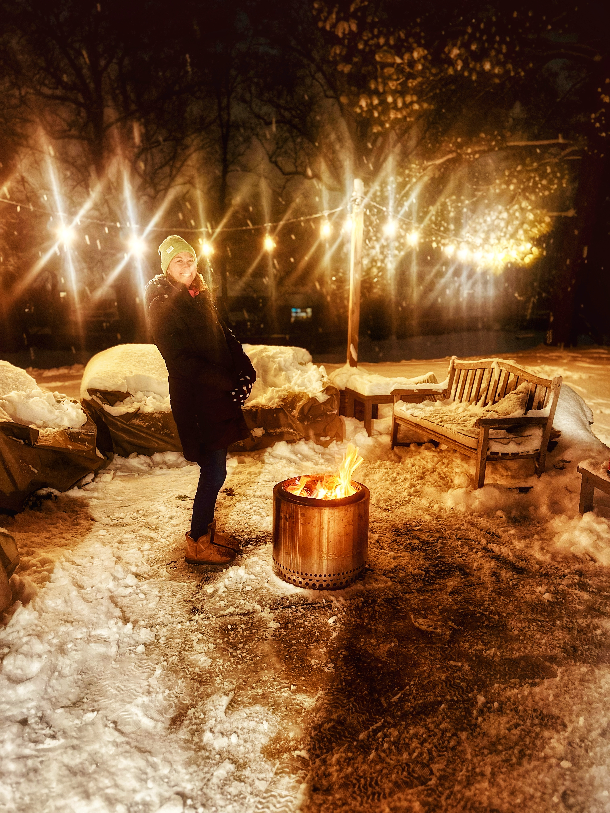
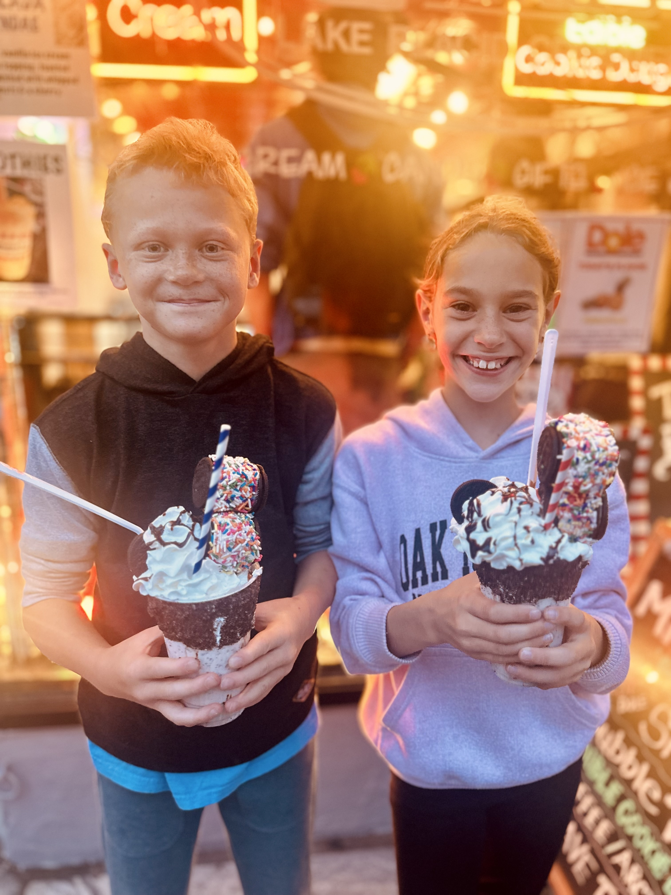
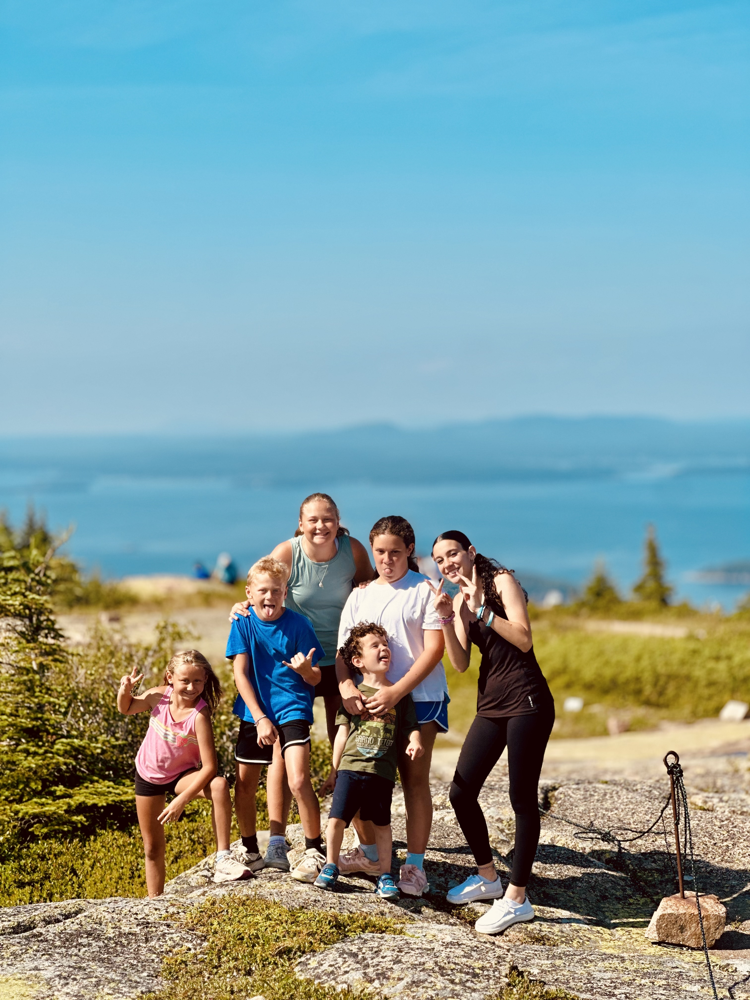
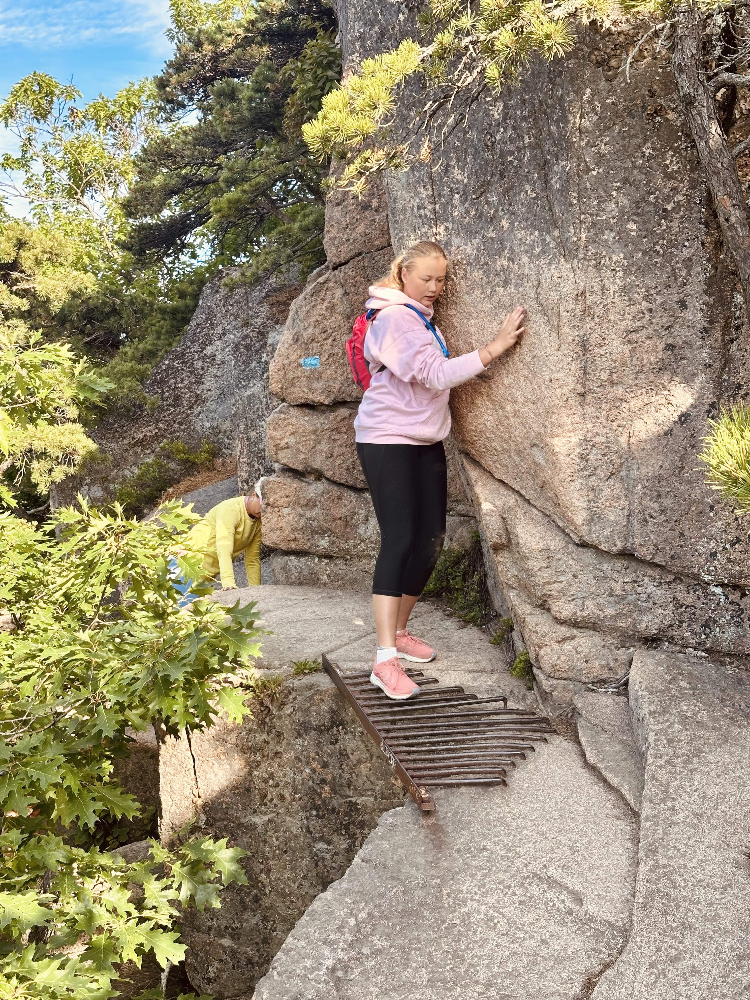
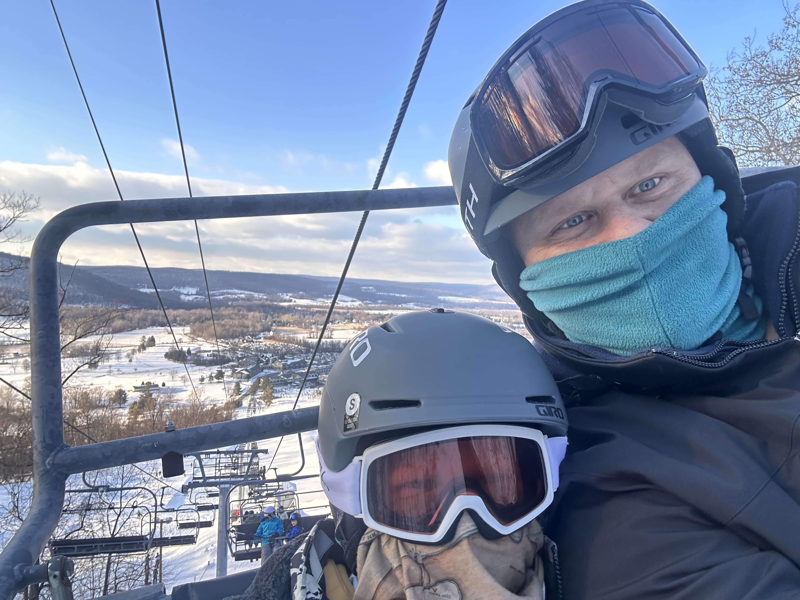
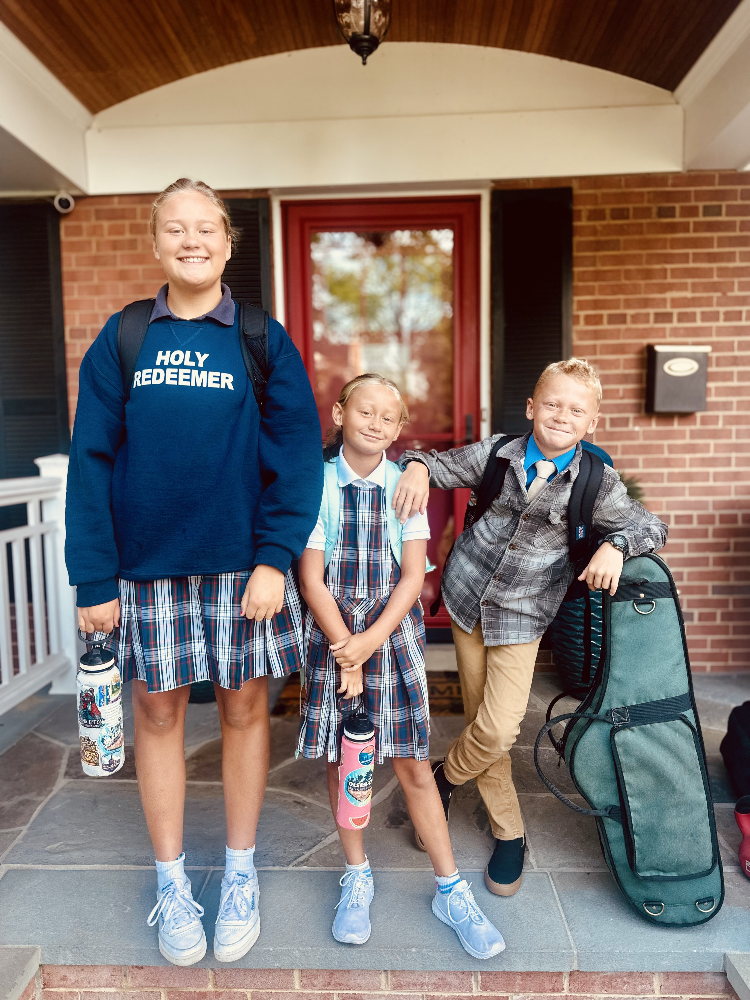
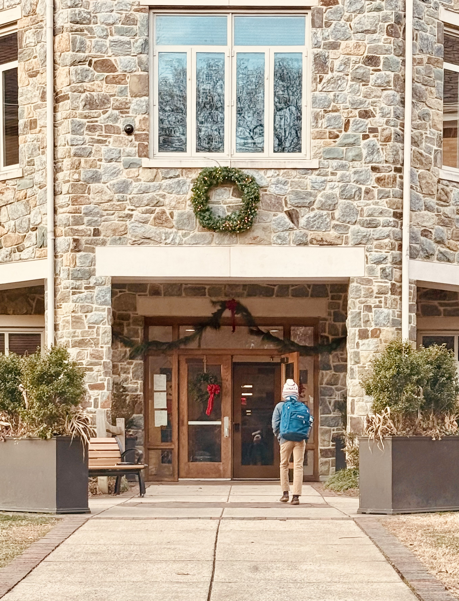

Another year full of triumphs and tragedies. High water and depressions. I don't have any high flying erudite overview filled with pablum and blather. Except to say.. we didn't do amazing on the goal this year. Now I need to figure out where that was a problem with goals and where it was a problem with me.

Other quantitative metrics that matter..

- 222 workouts on Strava, 75 gym workouts
- 474 miles walked or run
- 41 posts on [The Furious Opposites](https://www.thefuriousopposites.com/), not including almost a full year of [Fodder](https://www.thefuriousopposites.com/s/friday-fodder)
- 10 significant new repos on [Github](https://github.com/mhyrr) (mostly private)
- (Only) 35 books read, a modern low I think

So let's get to it!

### Better Daily Schedule

This has gotten quite a bit better. It's more regular and feels more comfortable. It's not perfect; I'm not snapping out of bed at 530am or anything. But workout schedules are on lock. Family meal times are consistent. Those are good things to build on.

### Ditch Youtube

I still watch a lot of YouTube. But it's mostly not Shorts and junk. It's longform interviews and how-tos. And it's useful and interesting and satisfies my infovore needs. So this is a fail but I'm not sure how much it matters.

### Liminal Spaces

Something I've been leaning more into this year is voice interaction. I'm using Whispr on my Mac and Reflect/Claude on my phone and just talking things out. Sometimes 30 seconds at a time, sometimes blabbing on a walk for 20 minutes straight. I'm still loving my AirPods in a cafe, but I've discovered new ways to use my phone as an exceptional tool for capturing the things I'm thinking about. When you remove all the content distractions, phones remain remarkably useful.

### An Alarm Clock

There's an alarm clock sitting on my nightstand, winking at me. I always know what time it is in my bedroom. I do not use it. I am on my phone way too much before bed.

### No Convenience Stores

Quite surprisingly to me, this is a huge win in the second half of the year. I've mostly stopped going to convenience stores! Much less soda. No candy.

### Find More Conspiracies

Conspiracies are properly hard to find. I've found a couple more this year. I've started working to create a few too. No, I'm not telling you about them.

But I'm still long $MSTR (got close to selling though..)

### Fix Back Pain

It's much, much better! Not perfect but a lot of it is core strength. Unrelated, I added some knee pain this year, for the first time in my life. Turned out to be a meniscus tear, which means I also got my first cortisone shot. Hurray for getting older!

### Indoor Skydiving

*sigh* Didn't do it.

### Visible Abs

Hahahaha. I honestly forgot about this one, which is dumb. But I'm still at 26% BF.

Two problems here: 

1. I love lots of food, and that's 90% of it. Still working on this. GLP-1s are not it. Tried it, and it sucked my soul. [Wrote about it too](https://www.thefuriousopposites.com/p/liquid-willpower), if you're interested.

2. As usual, I always get sucked up into a focus on getting stronger. My end of year goal was 25 reps of 225 on bench and I hit 26 yesterday, which puts me on the stronger side of starting NFL linebackers. I've said this before, but that's strong enough dammit.

### Fashion

I've made some progress. My wife will be the first to tell you I have more to do. Ariat jeans are comfy. Some Vineyard Vines stuff. Some other stuff. Keep it rolling.

### Kid Independence

We've had some progess and some setbacks here. Our eldest is in her own room in the basement and is doing great. The younger two need some more responsibility.

> "Don't handicap your kids by making their lives easy." — Robert Heinlein

### 100 Pushups

This lasted until about May when some shoulder pain happened. Didn't pick it back up, but it felt like it served a good purpose and then was ready to be put aside.

### Social Drinking Only

Eh. Mixed results.

### No Judgement

This was a good goal. It changed perspective and was a success.

### More Fires

Impromptu backyard cocktails on a random Wednesday. Book club. Meetups. Morning coffees with a friend. All good things and make life worth living. We're out of firewood at home and need to buy more, so I'll take the W.

Cheers 2025, you've been a dream!

