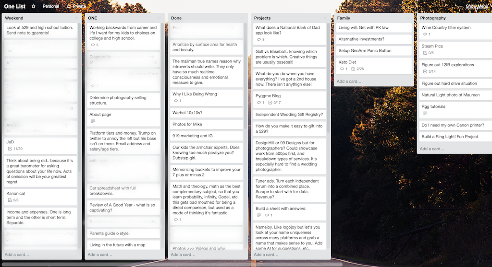

I've been on a roll lately.  For once, some of my grand aspirations have started a slow transfer into reality.  This is the 14th post of 2018 and I'm also doing more of my pet personal  projects.  It's a good feeling.  I think there's three reasons why things have picked up, and I'm recording them here for my future self and others (*cough* Matt).

#### Trello

Like everyone else, I'm enamored with the newest, latest tools for tasks and todo lists.  I've tried a lot of them, which has made me have a bunch of different todo lists in disparate places.  A little while back I nixed them all and centralized around Trello.  More specifically, I only have one Trello board and everything goes on there, whether it's work, play, ideas, checklists, whatever.

Only having one place for everything has somehow given me a bit more clarity.  When I was motivated to do something, I used to fumble over all the potential avenues.  Now, I just pick one on the list and go.  

It doesn't have to be Trello.  Whatever works  But one, super simple tool.

#### Give up on quality

One of the original points of having a blog was to establish a minimum bar for quality.  In a journal only I read, I can spit out a stream of whatever.  I won't do that here.  But it's easy to take this too far.  I have a load of half written stuff that scare me because I was so unable to get out what it is I was trying to say.

> Articulation
>
> Is a precise art, and so
>
> I fear my great thoughts.

After figuring out the [potential energy analogue](/potential-energy/) I've mostly stopped.  There's still a bar, but it's much lower now.  I'm focused more on rhythm, feel, and practice.  The quality will come in time.

#### Like What You Do

For quite awhile, I had a day job that I didn't like.  It sucked the energy out of the air, and I'd end up at home in the evening sitting in a chair wondering why I wasn't motivated.

That changed recently, and my day job now has both meaning and energy.  I have less time now, but somehow I'm still doing more out of way less time.  I didn't realize how big a drain this was on my system.  It's all about energy.
