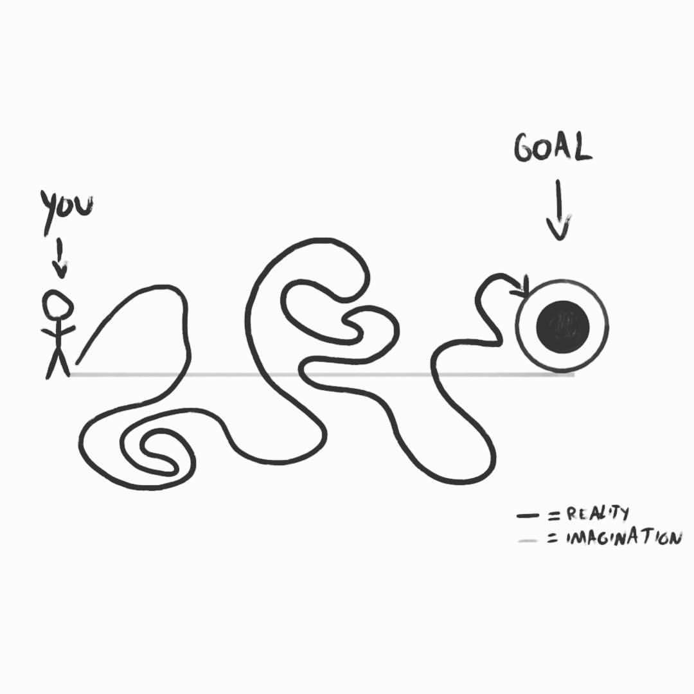

*Caveat Lector*

This started out as a simple idea: to work backwards from the adults we hope our children will be and use this to think about how we raise our kids now.  9,000 words later it turns out there was a lot to say (sorry about that).  

The format is also different.  Twitter threads have actually become a really interesting way to lay out an argument, set of axioms or principles in a fairly concise way.  Two great examples of this are [Naval on getting rich](https://twitter.com/naval/status/1002103360646823936) and [@vgr on Waldenponding](https://twitter.com/vgr/status/1047925106423603200?lang=fi).

---

### Table of Contents

- [Premises](#premises)
- [Adulthood](#adulthood)
- [Twenties](#twenties)
- [College](#college)
	- [College Choices](#choices)
	- [Expectations](#expectations)
	- [Finances](#finances)
	- [Majors](#majors)
	- [Freedoms](#freedoms)
- [Before College](#before)
	- [What Matters](#matters)
	- [Financial Understanding](#financials)
	- [Projects](#projects)
	- [Phones](#phones)
- [Parenting](#parenting)
- [Resources](#resources)

---

### Premises

- It’s never too early to think about high school, college, or even what kind of adults we want our kids to be.

- Everyone focuses on thinking about education because it works as a sort of proxy for thinking about the kinds of people we want our kids to be.  We want them to be smart which translates into good grades.  We want them to be successful which translates into focus on a career; in college, it’s a major.  We want them to have a family and a good life which translates to stability and a set of credentials so they can always make enough money.

- Most people think about the outcomes they want but not the processes that will get them what they want.  So we just take things one day at a time.

- We imagine our children’s futures as a straight line from here to there because we think backwards about our own lives this way.  In hindsight, it’s easy to diminish all the complexity and imagine it was a straight path too, but it wasn’t.  All of our paths have meandered and wound around time in interesting ways, and serendipity has played her role too.  I call this the Retrospective Path Dilemma: we remember things in two dimensions, but experience them in three.

- Somehow, this leads to a lot of people wasting a lot of life focused on the wrong things.  We miss important things in high school, party and drink too much in college, accrue huge mountains of college debt, pick majors that don’t matter, and careers that we don’t like.

- The motivations and interior mindset of our kids is at least as important as what you see on the outside.  For example, a 19 year old backpacking across Europe.  They could be entitled, lazy and letting their parents pay for it.  Or they could have planned the whole trip themselves, figured out how to save for it, pay for it, and have some idea of what they want to get out of it (experience, culture, a job in Europe, writing, etc).  It could be really great.

- The difference between those two is what’s happening on the inside and what lead to the trip.  What do they value in their life?  What is their relationship with money?  With their family?  How do they see education?  How do they see work?

- As parents, these are some of the most important questions to ask with and for our kids.  But we too often leave these subjects unexamined.

- Working backwards through a lifetime helps examine the decisions we make along the way.

- So let’s consider the traits of the thriving adults we hope our children will be, and then walk back to the present to understand better what’s actually important along the way.

### Adulthood

- Our hopes for our children are mostly our hopes for ourselves: a long rich life filled with love, laughter, meaningful work, and family.

- These external realities reflect a set of characteristics about our children too: they should be kind and generous to others, regardless of their station.  They should be able to interact well with the world and people around them.  They should have great families and friendships and be able to strongly pursue their own interests.

- Most parents will have a similar viewpoint for their kids.  This is true because we build the list by thinking back on our own lives.  We don’t think of shallow relationships and acquaintances; we think of deep talks and fun times with our close family and friends.  We don’t think of boring time spent in a cubicle from 9-5; we think of the “eureka!”s from learning and exciting work, whether it’s performing music, math, our own pet projects, business ideas, etc.

- Education in today’s world is primarily driven towards setting us up for our working lives.

- Meaningful work to a human is often emphatically different than having a career.  It’s possible for them to align, but they are definitely not coupled to each other.  Approximately 50% of the current workforce in America is [disengaged from their jobs](http://execdev.kenan-flagler.unc.edu/blog/engaged-disengaged-actively-disengaged.-whats-the-difference).

- Good work is something you can do your whole life.  You don’t need to retire.

- Disengaged careerism is not the kind of work I want for my children, nor do I want to set them up so that they have to settle for it.

	> “We’ve built a society where being career-focused is rewarded and encouraged. As long as you’re focused on work, it’s okay if you don’t know how to clean your clothes, cook your own food, take care of family, catch up with friends, build relationships, explore the local neighborhood, or help your community. Workaholism is an accepted excuse for all of your life’s problems, including the need to ‘adult.’” - David Perell

- Therefore career is not a primary goal for my children, and the value of their work shouldn’t be measured that way.  If they end up in a wonderful career - a doctor, nurse, dentist, or teacher - the measure of that value is not the career, it’s the meaningful work.

- Entrepreneurship should be a chief value when considering work.  If not in practice (actually starting a business) then at least in the model of fearlessness to try something of your own.

- Entrepreneurship is non-conformist.  Being non-conformist means you’re constantly asking “why?”, which is how you get to the truth.  If you’re not asking why and you don’t have the whole picture, you’re just accepting things as they are.

- Conforming is a narrow path, by definition.  If you conform, there’s a smaller set of things you can do because you have to follow the accepted way.  You’re focusing on the ideas of others - you’re conforming to some standard view - rather than thinking things through.

- It’s also worth noting that rebellion is letting the ideas of others rule what you do too.  It’s just like conforming, but moving in the opposite direction.  People that are able to work things out from First Principles, like Elon Musk as an extreme example, are able to recognize truths and meanings that other people miss.  By not conforming, you get to answer your own questions.  And if you decide to conform, at least you’re doing it for the right reasons.

### Twenties

- Your 20s is when you’re expected to start a career.  A lot of 20-somethings don’t like this.  It feels boring and dull because it often is.

- Careers are a tradeoff between longevity, stability, productivity and payoff.  In the extreme case, huge companies or government bureaucratic jobs let you agree to a stable 30 year span of medium-level wages for a high guarantee of continuing those wages for the entire span.

- Consequently, your expected output of meaningful work is low and steady over a long period of time.  Bureaucrats can have very meaningful careers, but it’s almost always true in hindsight when looking back over the entire 30-year span.  It’s a relatively linear sum of value over the whole time.

- This may be great for some people.  Stability is very useful when you have responsibilities.  This is probably why careers evolved in the first place: stability is especially important when raising a family.

- In your 20s, you have NO responsibilities.  No family.  Hardly any money (usually).  You’re in good health.  You are responsible for yourself and not much else.

- Society has pushed 20-something’s responsibilities out and replaced it with an unsustainable hedonic period.  How many 20-somethings slide around easy early career jobs, enjoy the bars, loafing on the couch and playing video games?

	> “Well-educated, urban living adults don’t expect to get married until their early 30s or have kids until their late 30s. As a result, the time between adolescence and parenthood is more than a decade long. Young adults please themselves instead of preparing to raise children.”  - David Perell

- This is a time for risks.  The downside is basically zero.  The potential upside is very high.

- If you decide to go have adventures, your upside will be measured in experience.

- If you decide to go start a business, your upside will be measured in income or wealth.

- Either way, the upside is a proxy for freedom.  You are free to make your own life, not the life or schedule a boss and a job chooses for you.  This is why the entrepreneurial spirit is so important.  It let’s you learn to take freedom seriously.

- Startups in Silicon Valley have learned over the last couple of decades to take full advantage of this.  They take young, talented, ambitious adults with no responsibility and let them try to very quickly build orders of magnitude more value than they could at a regular job.  Some of them succeed and become millionaires or billionaires with significant power and substance.  The first goal for these startups is to become “Ramen profitable”: you make enough money to cover yourself and do whatever you want.

- Use your 20s to take these kinds of risks.  In addition to no responsibilities, failure is _expected_ at this stage in your life, so there’s no reputational risk either.  Any success is gravy on top of all the learning you’ll do.

- As parents, we shouldn’t expect to finance this - unless our kids are looking for investors.  The kids don’t need it either; they should be able to make it work and it’s invaluable adult experience for them to do so.

- As a general rule, parents should not subsidize the expenses of their adult children.  A lot of parents justify letting their children use their health insurance or their cell phone plan because it’s cheaper.  Frugality, they say, is helping their kids get ahead in their careers.

- It isn’t.  The difference in costs isn’t going to make a big difference, especially over the long term, and the lesson they’re getting is to shy away from more responsibility.  For parents, this can also be the last vestiges of parental control they have.  For the children, it’s the last pieces of responsibility they’re still allowed to institutionally evade.

	> “Don’t handicap your children by making their lives easy.” — Robert Heinlein

### College

- Historically, college was the center of higher education - the place for specialization or advanced learning and expertise.

- For a couple of generations now, college has been important for a different reason than education.  It’s been the time when children start to learn adulting.

- But today this is largely bullshit.  We’ve taken all of the adulting back out of college.  It’s now mostly a vocational school wrapped up in a very big debt-laden and boozy party.

	> “College was built to help prepare people to be an adult. Now it prepares them to get a job. The shift away from the liberal arts and towards a vocational education is a direct result of the modern economy and rising debt levels. Instead of praising the University of Chicago’s Great Books program, we applaud Stanford’s computer science curriculum. I can’t criticize the impetus to make money. With that said, increasing specialization blinds us to the world we live in. I don’t want to romanticize how smart people used to be, but universities don’t promote holistic knowledge like they once did. We’re hyper-competent in our domain of expertise, but incompetent outside of it.” - David Perell

- Parents and children want very different things from college.

- Parents want the credential college provides.  They want their kids to start taking that stable path towards a career.  This may be a proxy for the desire for grandchildren, but it’s the normal way people hope for success for their children.  Everyone tends to be very risk averse for their children.

- The kids want the adventure, they don’t think much about the credential.  They want to be out on their own.  To be individuals.  Adults.  Out in the real world and learning advanced and interesting things.

- Before the always-connected world, going away to college was much more of a lesson in adulting.  They needed to learn whatever they didn’t know about taking care of themselves.

- Both the credential and the adventure have devolved significantly.

- A college degree doesn’t mean the same thing it did for our parents.  For the working lower class, a ticket to college was the path towards the middle class American dream.  For the established bourgeoisie, the reputation of your degree could escalate your caste rank; a Harvard education could rocket you into the upper echelons of society.

- Similarly, the adventure is also muted.  Nearly everything is taken care of for college students today.  Parents or family that have taken care of them since birth are only a text message way.

- As soon as they can, many run off the deep end of individuality.  A sense of self is replaced by a sense of tribe, the more specific and misunderstood the better.  The sense of adventure often turns into an endless social sequence of parties and drinking.

- There is perhaps no more squandered resource in this country than the capacities of smart and capable 18-22 year olds.

- A lot of kids fall into this trap, but it’s mostly not their fault.  This is the system given to them by the adults around them.  And the adults have allowed it to happen because they’ve seen the expectations of our culture writ large and assumed there is no other way.

#### College Choices

- A quick tangent on college choices.  Colleges all try to compete on prestige and brand.  They spend huge dollars doing this, but there are really only 4 categories of college:

1. **Harvard**.  Look, if you get into Harvard, you ought to go.  The complete short list is Harvard, Yale, Princeton, Stanford, MIT, and Caltech, although it’s arguable that Harvard is special.  Oxford and Cambridge would be the British equivalents.
2. **A short list of exceptionally prestigious institutions.**  This is the rest of the Ivy League schools, Washington University in St. Louis, University of Virginia, University of Chicago, Duke, and a handful of others.
3. **Specific departments at specific schools that are special.**  For example, people say they went to Wharton, not the U Penn School of Business.
4. **Everything else.**  Sorry, that's just the way it is.

- This is not a popular view, because everyone wants to value the education and choices they make.  The [importance of this choice has been overhyped](https://www.theatlantic.com/education/archive/2017/09/education-and-economic-mobility/541041/?utm_source=atlfb), and it is absolutely true that some schools will be better for a specific person than others.  But that’s not how schools do their marketing and branding.  They’re mostly still trying to imitate the prestigious institutions at the top of this list and buy admissions based on brand and prestige.

- This only works at the top.  Elite colleges manage brand better than almost anything else on the planet.   They take an academic tradition of hundreds of years and use it to sell an environment that caters to tomorrow’s rich and powerful.  Harvard is the pinnacle of educational prestige, but let’s be clear, the reason you go to Harvard isn’t the great education you’ll get.  It’s the connections you’ll make and the value of the credential you’ll have afterward.  In essence, it’s a very expensive social club for intelligent people.  And the secret societies on Ivy League campuses are just an extension of that.

- There’s a lot of very smart kids out there - more than the single-digit thousands that enter Ivy League freshman classes each year.  If these elite schools were all about the education, the enrollments would grow to fill the needs of all those smart kids.  Instead, [college enrollment grows](https://nces.ed.gov/programs/coe/indicator_cha.asp) overall while Ivy League enrollment stays flat.  The high-prestige schools want to continue the story that they can pick the kids that will represent tomorrow’s rich and powerful.  They are exclusive _on purpose_.

	> “There is something very odd about a society where the most talented people all get tracked toward the same elite colleges, where they end up studying the same small number of subjects and going into the same small number of careers… It’s very limiting for our society as well as for those students.” - Peter Thiel

- Exclusivity, connections, and credentials.  What this means is that college prestige is all about signaling, not education.  This doesn’t make it less worthwhile - as I said, if you get into Harvard you ought to go - but it means we should be honest about what matters and what we expect to get out of college.

	> “Would you rather have a Princeton diploma without a Princeton education, or a Princeton education without a Princeton diploma? If you pause to answer, you must think signaling is pretty important.” - Bryan Caplan on signaling

- None of this is a justification for going to a prestigious school.  An experience at Common College could be far better.  You might meet your spouse there.  And we haven’t touched on education or finances yet.  Prestige is the prime marketing tools for college, but the hype about prestige is largely irrelevant, especially when it comes to using the credential and getting a job after college.  In the rare cases it is relevant, you already know the college name (Harvard) and they don't need to market that much, they just need to remain exclusive.

#### Expectations

- If enrollment at the prestigious schools in categories 1-3 are staying relatively flat, then the rest of the colleges in category 4 - which is most of them - are competing for the rapid overall enrollment growth over the past 25 years.  They can only compete on prestige to a point, so there’s been an arms race in the experiences that college provides.  The book [Weapons of Math Destruction](https://www.amazon.com/Weapons-Math-Destruction-Increases-Inequality/dp/0553418815) documents this arms race, starting with the metrics quantification of the _US News & World Report_ college rankings that started in 1984.

- College used to be about the classes and the professors and the departments.  Now it’s all about the dorms and the cafeterias and the athletic facilities (and the parties and the social scene).  Colleges have rock climbing walls, tablets for every student, insane gyms, pools and 4 star accommodations.

- Most college students would say that a lot of learning in college happens outside of the classroom.  This is the adulting we talked about earlier.  But today, not much individual responsibility is required.  You get to live in a theme park with occasional classes and homework.  The rest of the time, you get to party with all the other kids that are only just now on their own.

- We’ve removed all the responsibility, so that college students can theoretically focus on learning.  But that doesn’t seem to be happening.  A college provost said in an NPR interview, “We're an academic institution.  Teaching is what we do."   There’s a difference between focusing on teaching and focusing on learning.  You can teach _at_ a completely passive audience.  But in that case, what are you paying for?

	> “It's amazing how much people complain about 'the cost of education' given the amount of free and cheap information available out there.
	>
	> - Books (physical, digital, audiobook)
	> - YouTube videos
	> - Podcasts
	> - Online courses
	> - Mentors
	>
	> If you're serious, get learning. 🧠” - Zuby

- A good student can learn anywhere.  They can learn in a great class or a bad class.  They can learn in class or outside of class.  They can learn in school or outside of school.  This is another reason that a place like Harvard is special.  They may have great professors and reputation, but they also have more inquisitive, curious, and interested students per capita than other schools too.

- Consider the expectations that get set in this environment during college: a college kid shooting hoops by himself on an empty basketball court in a brand-new gym with a free locker room, sauna, pool, and whirlpool nearby is at the zenith of wealth access.  He’ll never be able to do that again at his own home, unless he ends up in the class of multi-multi-millionaires.  In this context, most people have more wealth and more freedom while living at college than any other time in their life.  It’s like being on MTV Cribs when you’re 20.

- Being in an environment like this sets college kids up poorly for anything _but_ a stable career.  Their expectations are of gilded halls and feather pillows for the rest of their lives.  These expectations translate directly into a career salary-plus-benefits.  It’s stable and it’s handed to them with low risk.  They will feel _entitled_ to it.

- In many ways, that’s subhuman.  It’s how you _don’t_ take any chances.  That’s what college is for kids today.  It’s a low risk and expensive credential to set you up for a low risk and stable life with enough money so that you can have very few real problems and focus on having a family.  The entitlement that goes along with this means that any problems you do have feel like the end of the world.

- Our society focuses a lot on giving the middle class what they want.  We perceive them as the engine of America.  I’m not sure about that in economic terms, but I can say for sure that the groups in America that have real problems aren’t the middle and upper-middle class - it’s the poor.  That’s where the issues are.  Politicians have done an amazing job at making the middle class think the world revolves around them.  As if they’ve “made it”, when in fact those whose parents were also in the middle/upper classes have simply followed the coddled and easy route.

- The college experience we have today is a byproduct of this; it’s built to guide the kids of middle class families on an easy, coddled, and relatively boring route to careerism.

#### Finances

- Finances are another big college problem.  All of those new facilities and expectations cost a lot of money.  It’s not the free lunch many kids perceive; it’s exorbitantly expensive.  And all the additional administration required to help each college increase their revenue— I mean, enrollment.. that’s expensive too.

- Parents today expect to pay for college themselves, or to use debt financing.  This feels completely unreasoned.  Most families don’t incorporate finances into college discussions; it’s all about the child’s school choice and acceptance.

- This is absurd considering the gross inflation of the last few decades.  When a private college can cost $50,000 a year or more, a cost/benefit analysis is required.  If you are an elementary education major with an expectation of making $40,000 a year for the foreseeable future, the decisions you make should be different than if you’re a petroleum engineering or pre-med student with a soon-to-be six figure job.

- This needs to be ok.  It’s become gauche to consider the idea that not all majors are considered equal.  But they aren’t equal.  The rigor and type of education you receive is different.  And if your goal is to get a job after college, the prospects are different too.  College has become a ridiculously expensive credential for the career-oriented world, especially when it’s mostly a convention.  A mature 17-year-old could do many entry-level post college jobs.

- But let’s say a kid going to college really does know what they want to do and really does need the credential for it.  Ok, cool. A cost/benefit analysis to select the right school is still important.  And the experience still shouldn’t be a free lunch.  College kids are burgeoning adults that should be learning how to own decisions.  This autonomy translates into shared financial responsibility.

- Shared financial responsibility means more than just a high-interest education loan that the kid doesn’t think about until college is over.  They should be thinking about it up front as part of the decision.  If they’re getting loans, part of the parent’s responsibility is to make sure they understand what they’re signing up for.  They need to have the financial awareness, maturity, and math underpinnings in their teens to consider the costs of college and the value they receive over time.

- We should also think hard about room and board.  It can eliminate more than 1/3 of the yearly cost (e.g. Ithaca College: $42k tuition, $16k room and board), and it also eliminates some of the country club entitled feel.

- We can probably eliminate colleges entirely by evaluating student housing and facilities.  Those that are showcasing the amazing buildings that students live in may be focused on the wrong things.  They’re driving towards revenue goals instead of student outcome goals.

- If part of the goal of college is to help students grow into adults, we can order the living possibilities based on the likelihood that they will help:

1. An apartment or shared condo near college sounds ideal.  The kid can learn to pay for it (or part of it), and the cost isn’t getting rolled up into a snowball of college loan debt later.  They’re in the real world (to some degree) and have to manage it.
2. Living at home and commuting to college sounds like the next best option, especially for the first year or two.  It can still be a great way to transition into adulting.
3. Full room and board seems like the last option, and should be considered against the financial impact and the perspective that the kid can hold.

- This all probably sounds a bit difficult.  As parents, we love our children more than we could have even imagined possible.  But it’s entirely too easy in our world to coddle them right into middle-age.  It’s an easy fault to see in others and hard to see in ourselves.  We should guard against it and continually evaluate what is right for our children and what will allow them to grow into the people they can be.

#### Majors and Other Choices

- The [most popular majors](https://www.niche.com/blog/the-most-popular-college-majors/) today seem to be Communications, Marketing, Business, Management, Accounting, Engineering, Nursing, Education, Biology, and Psychology.  There’s a much longer tail of majors now as well, to include things like Recreation and Leisure Services Management (Oklahoma State), Bowling Services Management (Vincennes), and Ornamental Horticulture (Cornell and others).

- We said before that not all majors are created equal.  There’s two directions to measure: the depth and value of what you can learn when correlated to your interest, and the value of what you can learn correlated to your future earning power.

- For the first direction the measure is largely qualitative, although it’s important to note that you don’t really have to be “taught” much to do a lot of these things.  The best learning is done by doing.  So, in this sense, a degree is largely a proxy for working with and being taught by experts in a field.  Professors, and professors that can do stuff matter a lot.  A professor that will work with you to actively curate a formal garden or develop new plant hybrids will teach you a lot more than one who will lecture on about the theory of Ornamental Horticulture.  If this sounds a lot like an apprenticeship, then good.

- The evaluation that demonstrates the second value direction is the cost/benefit analysis.  What type of college should someone who is looking to enter an elementary education career choose?  The answer seems to be: the one that is the cheapest.  Despite the work being important, the earning potential of a teacher is limited (assuming they actually want to teach).  The goal of college is to get the credential and learn how to teach while inflicting the least amount of pain possible.  You don’t need a $50k/year degree from Villanova for this.

- On the other hand, for a chemical engineering major with immediate six-figure earning potential it isn’t unreasonable to spend a significant amount of money on a degree.  One big reason for this is that intellectual rigor also matters more in some majors than it does in others.

- A lot of people really don’t like this statement, but it’s just true. The conceptual load required for some majors is higher.  Physics, math, engineering and others require a very significant amount of intellectual ability and knowledge to produce work in their fields.

- Consider some of the common majors we mentioned before: Marketing, Business and Communications.  We have a very interesting environment now where a lot of marketing and business majors dream of either being highly creative professionals or high-level managers and come out as executive assistants or baristas.  When was the last time you heard about someone coming out of school with a degree in physics or math without being able to get a high-paying job in that field?

	> “Intellectual effort and academic rigor, in the minds of many of the nation’s college students, is becoming increasingly less important. According to the authors, Professors Richard Arum of New York University and Josipa Roksa of the University of Virginia: “Many students come to college not only poorly prepared by prior schooling for highly demanding academic tasks that ideally lie in front of them, but — more troubling still — they enter college with attitudes, norms, values, and behaviors that are often at odds with academic commitment.”
	> Students are hitting the books less and partying more. Easier courses and easier majors have become more and more popular. Perhaps more now than ever, the point of the college experience is to have a good time and walk away with a valuable credential after putting in the least effort possible.”
From _[College: The Easy Way](https://www.nytimes.com/2011/03/05/opinion/05herbert.html)_

- Let me be clear: I’m not suggesting that some majors are “better”.  They’re different.  We’ve considering elementary education majors a couple of times, so let’s also point out that teaching is a noble, meaningful calling requiring high degrees of empathy and the ability to make big impacts on children’s lives.  It’s possible you can have far more impact on the world as a teacher than as an engineer.  And the creativity and inspiration behind great writing and literature can outstrip both.  Unfortunately, there’s a natural perception to consider majors requiring higher conceptual loads to be better, and this has caused a trend of Scientism in our colleges.  Roger Scruton put it best:

	> “Philosophy is not the only subject that has been 'scientized' by the modern university: literature has been shrunk to 'literary theory', music has been colonized by set theory, Schenkerian analysis, and generative linguistics, and architecture has been all but abolished by engineering.  Pretended science has driven honest speculation from the intellectual economy, just as bad money drives out good.  This Gresham's law of the intellect operates wherever university teachers in the humanities exchange knowledge and imagination for the chimera of scientific 'research'.  A philosopher should certainly make room for scholarship: but scholarship has no 'results', no explanatory 'theories', no methods of experimentation. It is, at best, a spiritual discipline, and what will emerge from scholarship depends intimately on the soul of the person who engages in it.“

- Science does a good job at providing a system of rigor based on reason and maths.  But in trying to make everything a science, it can break the connection between scholarship, intuition, joy, and the given field of study.  The modern science student less frequently engages their soul in their study.  They rarely, as [Whitman would suggest](http://www.bartleby.com/142/180.html), "look up in perfect silence at the stars."

- This separation is sad enough in fields like physics where intuition and joy have played such a major role.  How much more sad is it when subjects are 'scientized' out of place?  An aspiring poet today becomes an English major and is reduced to literary theory and analysis; will they still play with words and rhythm simply for the love of it?  If not, who will teach the next generation of poets to write evocatively and stir our souls?  It won't be our universities.  Perhaps it never was.

- Like most things, there’s a right way and a wrong way to do college.  Reasoning about both the parent’s and the kid’s underlying motivations helps clarify choices.

- Not going to college can be a really good choice too, one our society currently undervalues.  Starting a job at 18 is a perfectly valid path, especially if you can start doing a job that most people think requires a college credential when it doesn’t.

- Depending on the work, this could begin as an apprenticeship.  It’s surprising how similar this can be to some college experiences with good professors.  I believe the next couple of decades will see a revival in this model, and some professional and service jobs (HVAC, plumbers, electricians, carpenters) will make a comeback.  New methods for trade learning are coming online too.  Online education has become a major resource, but companies like the [Lambda School](https://lambdaschool.com/) are creating well-respected, professional apprenticeships with zero up-front costs.

- Starting a business at college age is a great idea too.  It’s just like your 20s: you have no responsibilities and no risk, including no reputational risk.  One nice thing about being your own boss is that you get to decide what credentials are important - Bill Gates never worried about not having a degree.  If you can work hard and make something happen, why shouldn’t you? What’s the worst that will happen?  You’ll go to college a year or two later but with a lot more wisdom.

#### Freedoms

- The point of all of this, again, is for our kids to have a fulfilling life with family, friends, and meaningful work.  Having autonomy, agency, and adventure are critical for this outcome.

- Parents use the credential that college provides as a proxy for this.  With their risk-averse perspective, they perceive the credential and the career as success.  Meanwhile, kids are using rampant individuality to achieve autonomy, agency, and adventure.

- Both of these paths drive towards individual responsibility.  Success comes after you’ve learned to adult, and adulting is all about responsibility.

- Responsibility.  Autonomy.  Agency.  These are all related concepts around **the freedom to direct your life as you see fit and the power to execute on your vision**.  They’re all different sides of the same coin, parents and kids just come at it differently.

- That difference is all about risk calibration.  Parents are looking backwards at their own choices and their own station in life and thinking about it in retrospect.  They’re cautious and calculating; they probably have a stable life they want to protect with some savings and equity.  Kids on the other hand have much less and much less to lose.  Their ability to take risks is much, much higher.

- The kids are calibrated more correctly for their own situation than the adults.  Just like your 20s are an excellent time to take some risks to pursue the work you want, so to is college an excellent time to take risks to learn about who you are.  But the world that parents live in is all about reducing risk.  So we end up with these very controlled, all-encompassing college experiences.  Kids are looking for adventure in this calculated world, can’t find it, and start raising a ruckus.  That’s where all the partying and drinking comes from.  It’s a lack of real adventure and real responsibility.

- Too few 18-22 year olds have meaningful work.  Too few have enough responsibility, autonomy, agency, and adventure to build the life they hope for.  We owe them this environment, even if it’s scarier.  And it needs to be introduced gradually from well before they hit college age.

### Before College

- Financial reasoning, responsibility, autonomy, agency, and adventure doesn’t just happen over night.  They accumulate over years.  Parents think very hard about the post high school plans for their kids, although the answer always seems to be the same debt-doesn’t-matter college track.

- Instead, perhaps we can focus on growing responsibility, autonomy, agency, and adventure gradually over time.  Instead of being such a large step function, the decision to go to college (or not) is just another move along that curve.

- If we think more about the kinds of adults we hope our kids will be instead of focusing on maximizing the college lottery, the primary concerns for school and raising children change too.

- High school has a very traditional aspect the same way that college does.  We as parents want our kids to relive the memories we have from this time of life.  This is the Retrospective Path Dilemma again.  We look fondly back on these times because they seemed important at the time.

	> "High school isn't a very important place. When you're going you think it’s a big deal, but when it's over nobody really thinks it was great unless they're beered up.” - Stephen King

- Most high schools focus mostly on information consumption and grades.  You “succeed” if you can recall the most information (in a test) and have good grades.  Let’s be honest, extracurricular activities these days are just boxes you check along the way.  It all helps to maximize your college opportunities.

	> "Childhood has become professionalized. The goal is to build a resume. Soccer practice and SAT prep is mandatory. The path to college begins in elementary school. In major American cities, parents apply to elementary schools, middle schools, and high schools. All them are designed to help their students attend an Ivy League university." - David Perell

- In mathematical terms, this is a local maximum.  It doesn’t necessarily optimize for the long term.  There’s a a local private boy’s school called [The Heights](https://heights.edu/).  One of my favorite anecdotes is their head of the middle school telling parents to focus on habits.  “Focus on habits for now” he said, “and the grades will follow at some point.”  He’s saying this because nobody looks back at your middle school grades.  But your high school grades don’t matter long term either.  They just matter for college.

	> "It's dangerous to design your life around getting into college, because the people you have to impress to get into college are not a very discerning audience. At most colleges, it's not the professors who decide whether you get in, but admissions officers, and they are nowhere near as smart. They're the NCOs of the intellectual world. They can't tell how smart you are. The mere existence of prep schools is proof of that." - Paul Graham

#### What Matters

- The traditional order of importance for K-12 school focuses on information and good grades first; in other words, it focuses on what is easy to measure.  But for our goal of raising interesting and responsible adults this is almost entirely backwards.

- One of the most important things K-12 education should help focus on is the “Development of the person”.  It also has a huge impact on all of responsibility, autonomy, and agency, so this underpins everything else about K-12 education.  This is the big reasons many people want private school or Catholic educations for their kids.  The academic aspect is important, but character is more important.  Kids need other adults besides their parents to help instill this.

- K-12 education should focus on (in order):

1. Love of learning
2. Discipline and habits
3. Different ways to think
4. Information

- I have a simple metaphor for how I think about learning that maps well to these goals called Information Bucket Theory.  This is how I’ve always thought about my own head (which means there’s confirmation bias here).

- People make buckets in their head for different pieces of information.  There’s a bucket for your Mom’s phone number and another for the quadratic equation.  These buckets can have different shapes, sizes, and feel.  A bucket for the quadratic formula is much different than one that hold facts about the Civil War.  The information in them is different too, and you need to be able to pull it out and use it differently.

- Most schooling seems to focus most on the information in the buckets.  But that’s actually the least important thing.  The most important thing is that kids are excited about making new buckets, or about the information they’re adding to their buckets.  Parents, teachers, and schools should be especially focused on excitement, beauty, and wonder.  Wonder is the foundation of adventure.  Wonder and excitement will keep people going even when some of the work gets harder.

- The importance of wonder and fun can't be understated. It's the most important thing.

	> “Do you think Shakespeare was gritting his teeth and diligently trying to write Great Literature? Of course not. He was having fun. That's why he's so good.” - Paul Graham

- Next is the discipline and habits around bucket creation and maintenance.  Learning good ways to manage, add, change, and recall your buckets is a key part to how you think and solve problems.  When I was growing up I relied heavily on memorization.  I was very good at it and overused it to the point that it was the only tool in my tool belt.  Eventually, in college, this lead to problems and I had to quickly develop better habits for learning.

- Having a good fleet of bucket types to use for different kinds of information is also critical.  This is one way to think about the value of different school subjects.  Core skills like reading, writing, and math help provide new buckets and new ways to think about information.  Learning a new language or music does the same thing.  Computers have opened a whole new set of different kinds of buckets.  Science is more of a mix between modes of thinking (types of buckets) and information (what’s in the buckets), as are history and most of the other liberal arts.

- The least important part is the information.  If you have good buckets and good practices, the information will come.

#### Financial Understanding

- Sound financial understanding is a key area that isn’t even touched in most schools.  If they’re going to help consider the important cost/benefit analysis of college, kids need to have good financial grounding and understanding well before they’re 18.

- This means giving kids freedom to do what they want and allowing them to manage (or mismanage) their own money and learn from it.

- [The First National Bank of Dad](https://www.amazon.com/First-National-Bank-Dad-Foolproof/dp/1416534253) provides a fantastic framework for doing this, starting at an early age.  As a kid gets older, they need to build a gradual and increasing level of responsibility, one that corresponds to their maturity.

- Sound financial skills also means having sound mathematical skills.  The high school curriculum incorrectly focuses on a classical strategic path through algebra -\> geometry -\> trigonometry -\> calculus.  The focus is on continuous functions.  This is great for physics, but not great for practical application.  Having some understanding of linear algebra and statistics is far more useful to most people in their personal life and their professional work.  Far too many people today are effectively neutered from making substantive points in our increasingly data-driven public world because they don’t have the discrete math understanding needed to do it.

#### Projects

- A kid needs projects; something that is their own, not their parents or other adults.  This develops autonomy.  They need the trust of those around them and the opportunity to show responsibility.

- It doesn’t matter much what the project is, as long as it’s productive and not consumptive.  Parents often try to angle kids into projects that they themselves like.  While perfectly natural, this is counterproductive.  The kids need to choose it, and it doesn’t matter whether the parents think it’s valuable or not.  The most important thing about the project is that they own it.  It’s theirs.

- Paul Graham describes this wonderfully in his latest [Bus Ticket Theory of Genius](http://www.paulgraham.com/genius.html).  He says:
	> "When my kids get interested in something, however random, I encourage them to go preposterously, bus ticket collectorly, deep. I don't do this because of the bus ticket theory. I do it because I want them to feel the joy of learning, and they're never going to feel that about something I'm making them learn. It has to be something they're interested in. I'm just following the path of least resistance; depth is a byproduct. But if in trying to show them the joy of learning I also end up training them to go deep, so much the better."

- This isn’t to say that we should find projects for our kids.  In fact, the opposite is true.  Children need to [learn how to be bored]([https://www.nytimes.com/2019/02/02/opinion/sunday/children-bored.html]).  Out of boredom dawns imagination, creativity, and new interests.  It also fosters - amazingly - responsibility.  If you’re not always told what to do with your time, you have to learn how to handle it yourself.

	> “Parents plan everything for their children. They drive us to school, schedule our play dates, and do our homework for us. They call us to check-in whenever we’re out. If we don’t respond, they act like the world is ending. Children don’t start working until college. Since they aren’t expected to work, they don’t take on responsibility until they’re much older.” - David Perell

- Kids also need to learn to fail some, and projects are a great place for that.  If it’s their own project, their high interest level will carry them through.  Fear of failure is an overwhelming guide in most people’s paths.  How often is it true that on one side of a decision are a hundred reasons and on the other side is fear - and yet we still side with fear?  This is mostly true because most people have never failed that much.  Failure will teach more about the choices we all have in life than any success.

#### Phones And Technology

- Phones and communication need to be a big part of the conversation around education for kids.  Screens have completely changed our world and how we interact with it.

- (Interestingly, our world is made up of both atoms (physical) and bits (virtual), but it has only changed radically in terms of bits.  Eric Weinstein proposed an interesting thought experiment: he said walk into almost any room and subtract away the screens and that room will be indistinguishable from the same room in the 1970s.)

- For most parents, this topic seems important but there doesn’t seem to be anything concrete that they can do about it.  They resist indulging their young children when possible - not often enough - and their kids get phones of their own between 5th and 8th grade.  If we decompose this problem, I think we can do better.

- Phones can have both destructive and constructive uses, and we need to distinguish the difference.  Most of the destructive uses we worry about relate to FOMO (fear of missing out), social media, and the wide range of bad behavior on the internet.  But phones can be constructive too, like looking up the answer to a math question, answering a geography question on Wikipedia, or simply finding a word definition.  Phones are a magical knowledge augmentation device that we couldn’t even dream of 20 years ago.

- It’s also important to make a distinction between phones and computers more generally.  We can use these devices for both consumption and production.  Screens - and consequently phones and tablets - are built for consumption.  You can’t create much on them, you can just consume information.  On the other hand, you can build all manner of things with a keyboard: writing, poetry, software, websites, and even some gaming is fantastic and very productive.  A keyboard in their hands is an empowering tool that helps kids learn to build things.  But screens are just a path to consumption.

- **Guiding principle: if they’re producing, let them work.  If they’re consuming, limit.  And it generally takes keyboards to produce.**

- Phones also actually train our brains to operate differently.  When we’re on our phone we consume information in smaller pieces.  We take things in 140 characters (Twitter), a picture (IG), a status update (Facebook), or a 30 second video (Vine? Snap? TikTok?) at a time.

- Deep work - the ability to focus and concentrate on something for hours at a time - and information consumption have a sort of “anti-affinity”.  You can only do one well at a time, and you have to train for it.  As most people are addicted to their phones and constant information consumption, the skill of “deep work” is going away.  This means that it will be much more sought after over the next couple of decades.  Creation (of an idea, a story, a computer program, a thing) takes a lot of time in large chunks.  This type of work will be in-demand.

- This change in the intake of information is changing some of our societal norms.  The value of the highlight reel is higher than ever.  It may even be changing our definition of courage and heroism.  We think today only of the single amazing act captured in a well-framed picture or video.  We never think of the underlying practice and habits that have been built over time to help people.  Heroism isn’t a single thing, it’s a little bit of effort every day and day after day.  The same is true with sports and other skills.  We idolize the result and forget the 10 months or years of practice it took to get there.

- A major goal of parenting should be to find things that our kids love and let them do it over and over and over.  It doesn’t matter if it’s a sport, crafts, braid styling, friendship bracelet making, martial arts, parkour, yarning, or baking.  The enjoyment and love of these activities teaches them to enjoy the process itself and to revel in achieved mastery.  The process fosters both a love of learning and the formation of habits and discipline (#1 and #2 in importance on our list for education above).

- The ability to read and read A LOT gets supplanted when we always have access to a phone.  This is true for adults and kids, but it’s especially important for kids who are forming habits they’ll use the rest of their lives.  If they always have access to a phone, they’ll never fully develop the habit of reading.

	> “In my whole life, I have known no wise people (over a broad subject matter area) who didn't read all the time -- none, zero.” - Charlie Munger

- Social media is another major factor in the phone dilemma.  As they get older, social pressures seem to be the largest demand for kids having a phone.  When they ask for a phone, even the most mature kids aren’t thinking of safety and logistical challenges.  They’re thinking of selfies and comparisons and social media videos and always-on messaging connections with friends.

- Being honest, lots of kids do lots of shitty social things with or without phones.  Phones take the standard teen social problems and make them worse.  They help reinforce petty behavior and the inanity of teenage social constructs.  Even in the best circumstances where kids have strong friendships, phones reinforces small means of communication over face-to-face and in-depth interaction.

- Much of our behavior is driven by our peer groups.  This is especially true for kids and teens.

- When we consider the combined force of consumption, information in smaller quanta, and mismanagement of social interaction, the smartphone becomes an overwhelmingly negative influence on kids.

- As important as a chid’s peer group is, the parents of their peers is even more important.  Our kids have lots of social circles, but we can help guide what those circles are.  If we, as parents, can all agree to postpone everyone getting phones for awhile, we can set an agreed-to standard for the social stigmas, and the FOMO can, to some extent at least, be mitigated.

- **Guiding Principle: No phones until 16 at a minimum.  Finding social groups with parents that all agree with this is vital.**

- The overwhelming influence of phones is so big, in fact, that it should impact school choices.

- The trend has been for schools to prize having technology in the classroom - especially tablets.  This doesn’t seem to accomplish much in practice aside from information consumption and signaling.

- A school that understands these problems and has a very strong no-phone policy seems not just more desirable, but almost a change in type of education.

### Parenting

- We’ve spent a lot of time talking about school and goals, and we should end with a couple of brief notes on parenting.  As much emphasis as we put on school, it plays a [relatively small role](https://www.povertyactionlab.org/sites/default/files/publications/3871%20PACT%20Intervention%20Chicago%20NBER%20Oct2015_0.pdf) in our kid’s education.

	> “Children spend the vast majority of their time from birth to adulthood in a family or other environment selected by parents and not in schools. For example children in the United States will spend only about 13-15 percent of their waking hours in school between birth and age 18.” - Susan Mayer

- As a child, you get your love of learning from your parents, teachers, and other adults around you.

- You get discipline from learning and practicing habits, and you learn discipline and habits from the adults around you.  For example, kids that read a lot generally have parents that read a lot too.

- If you want your kids to love learning, make sure they see the wonder and adventure you still hold in your heart.

- If you want your kids to learn the value of discipline and habits, strengthen your own discipline and habits.

- If you want your children to learn fiscal responsibility, exercise it yourself.

	> “To put the world in order, we must first put the nation in order; to put the nation in order, we must first put the family in order; to put the family in order; we must first cultivate our personal life; we must first set our hearts right.” - Confucius

### Additional Resources

A significant number of articles, books, and quotes contributed to this line of thinking that weren’t already quoted or linked above.  Here’s a partial list for further exploration:

- [Range](https://www.amazon.com/Range-Generalists-Triumph-Specialized-World/dp/0735214484) by David Epstein
- [Why Nerds Are Unpopular](http://www.paulgraham.com/nerds.html) by Paul Graham
- [What You’ll Wish You’d Known](http://www.paulgraham.com/hs.html) by Paul Graham
- [Learn Like An Athlete](https://www.perell.com/blog/learn-like-an-athlete) by David Perell
- [Selfish Reasons To Have More Kids](https://www.amazon.com/Selfish-Reasons-Have-More-Kids/dp/0465028616/ref=sr_1_4?keywords=bryan+caplan&qid=1574954099&s=books&sr=1-4) by Bryan Caplan
- [The First National Bank of Dad](https://www.amazon.com/First-National-Bank-Dad-Foolproof/dp/1416534253/ref=sr_1_1?crid=39E3ZBGG63VMV&keywords=national+bank+of+dad&qid=1574962185&sprefix=national+bank+of%2Caps%2C137&sr=8-1) by David Owen
- [The Case Against Education](https://www.amazon.com/Case-against-Education-System-Waste/dp/0691196451/ref=sr_1_2?keywords=bryan+caplan&qid=1574954099&s=books&sr=1-2) by Bryan Caplan
- [What Money Can’t Buy](https://www.amazon.com/What-Money-Cant-Buy-Childrens/dp/0674587340) by Susan Mayer
- [Zero To One](https://www.amazon.com/Zero-One-Notes-Startups-Future/dp/0804139296/ref=sr_1_1?keywords=peter+thiel&qid=1574954286&sr=8-1) by Peter Thiel
- [Education Isn’t The Key To Good Income](https://www.theatlantic.com/education/archive/2017/09/education-and-economic-mobility/541041/?utm%5C_source=atlfb)
- [Peter Thiel and Eric Weinstein on The Portal](https://www.youtube.com/watch?v=nM9f0W2KD5s&t=8529s)
- [Weapons of Math Destruction](https://www.amazon.com/Weapons-Math-Destruction-Increases-Inequality/dp/0553418831/ref=sr_1_1?crid=3I1L6EH7SYOGI&keywords=weapons+of+math+destruction+cathy+o%27neil&qid=1574962162&sprefix=weapons+of+%2Caps%2C130&sr=8-1) by Cathy O'Neil
- [The Importance of Being Little](https://www.amazon.com/Importance-Being-Little-Children-Grownups/dp/0143129988/ref=sr_1_1?keywords=the+importance+of+being+little&qid=1574962212&sr=8-1) by Erika Christakis
- [The Alternative](https://www.amazon.com/Alternative-Believe-About-Poverty-Wrong/dp/1483472256/ref=sr_1_1?crid=18KPCUFA7VX1X&keywords=mauricio+miller+alternative&qid=1574954143&s=books&sprefix=mauricio+mill%2Cstripbooks%2C127&sr=1-1) by Mauricio Miller
- [What The Best College Teachers Do](https://www.amazon.com/What-Best-College-Teachers-Do/dp/0674013255/ref=sr_1_1?crid=11ASMGZVRGWMW&keywords=what+good+college+professors+do&qid=1574962252&sprefix=what+good+college%2Caps%2C126&sr=8-1) by Ken Bain
