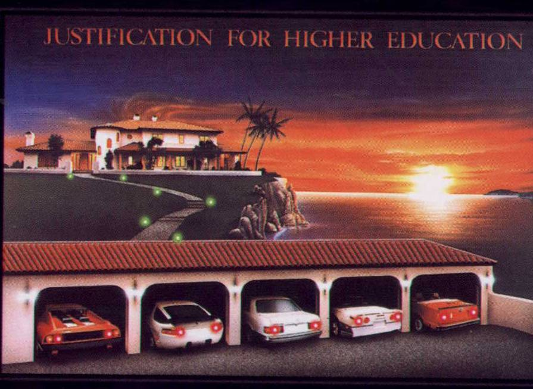
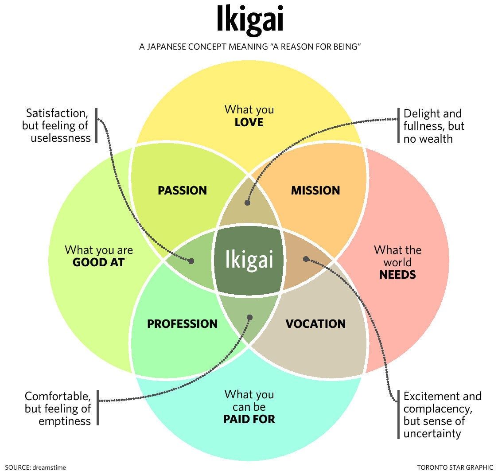

# The Options

When I was a kid, this was my favorite poster.

I got it pretty early - early enough that I didn’t really understand the punchline.  But I LOVED the cars, and I knew I wanted a garage like that.  My parents thought it was hilarious, and they kept telling me that school was how you got there.

I’m old enough now to know that really isn’t true.  The world has changed since the 1980s.  Back then, getting an MBA and becoming an upper-level manager was considered the lower or middle class path to being rich.  But education was never the path to actual wealth.  Those who get PhDs aren’t statistically of drastically higher income or higher net worth than those with Masters degrees.  And a considerable number of the most wealthy people out there dropped out of school to pursue the thing that made them wealthy.

So for my parents, that poster was a slightly skewed and narrow version of worldly success.  And for me, it was a version of the the game “If I had a million dollars, I would buy…”

Cars.  Lots and lots of cars.  That was my 8-year-old answer.  We have all played this game at some point, and the answers shift over time.  But we all play this game poorly.  We make it a pie-in-the-sky, vague sort of daydream.  And because of that, we undervalue the importance of this question.

### $50 Million

So let’s make it concrete and start off with a little thought experiment.  Let’s also increase the amount so that, in today’s day and age, you can have nearly anything you want.:

**What would you do and what would you buy if you had $50 million dollars?**

Take a couple minutes and think about it.

$50 million is an interesting number.  It’s a whole ton of money, but it doesn’t sound as completely radical and insane as being a billionaire.  You might know a couple people worth that much, or they're separated you by only one degree of separation.  There are [estimated](https://dqydj.com/how-many-millionaires-decamillionaires-america/) to be nearly 100,000 households in the US worth $50 million or more, and there are probably over a million households worth at least $10 million.  So while these numbers are stratospheric, they’re not unreachable moonshots like Jeff Bezos and Mark Zuckerberg, and this constituency can still lead relatively anonymous lives.

It’s an interesting number for another reason too.  If you had $50 million, you basically have the means to buy just about any consumable good you want.  Million dollar sports car?  No problem.  100ft super yacht for $5mm?  In range.  $15mm dreamhouse in Malibu?  Check.  The variance between your buying power at this level and a billionaire’s is much less than you think.

So take another minute to reconsider what you would do.  How would you be setup?  Be specific.  Where would the $50 million go?

Well, here’s my answer:

- We’re fortunate to have two houses already and we love them both.  We enjoy doing projects on what we already have and fixing them up.  They’d be completely paid off and I’d do a few more projects and definitely build a combined garage/workshop in my backyard.  Figure $700k.
- We know where we likely want to retire and I’d buy a really nice spot there.  I’d also buy a bunch of land nearby so that we can use it and maybe have a shared retreat area for our friends.  Figure $2 million.
- We’d want to be on the water a lot and I’d like a boat.  Figure $200k.
- I’d love to have a spot in Florida somewhere for some of those long winter months.  Figure $700k.
- A couple of rental properties that provide regular income would be great to have.  Do this right and it would cover a significant portion of yearly living expenses.  Figure another million.
- Cars.  We’re back to my poster but I don’t need that many.  I enjoy driving them not admiring them.  Porsche GT3 would be on the list.  Audi S8 for a daily.  Some flavor of convertible - maybe a used Lamborghini.  A nice truck for towing.  Definitely a project car or two.  All told, that’s probably $500k.  And I’d rotate them.  I’d probably get more, but only when others are gone.  More than that number of cars and it starts to become a real chore to manage them all.
- I’d set aside additional money for my family and my children for sure.  There’s a lot of factors here and this wouldn’t be more than a million.
- Back to that garage and workshop.  Woodworking is the newest hobby and I’d spec the shop out with a ton of great tools.  That’s probably $50k.  A lift and tools for working on cars is another $20k.
- I’ve always had a thing for old wine, especially old Madeira.  I’d probably go on a spree there and enjoy collecting some 19th century stuff to share with friends. Same goes for rare Bourbons.  Figure $50k.
- Assorted and random toys and vacations.  There’s places I’d like to go and future hobbies I’m sure I’d like to do.  Add another $500k to cover all of that.

I’m trying to be liberal with my money but also realistic about what I’d _actually_ do.  Think about all the things that are NOT on this list.   I don’t need and also don’t want a 15,000 square foot house.  I know people that do (both need and want it) but it’s not for me.  I also don’t need a really crazy hypercar, even though I’m a heavy car guy.  At some point cars become pieces of engineering art.  And just like I can go to a Museum to admire a Da Vinci, I can go to an exhibition or (if I’m lucky) a Cars and Coffee to admire a Bugatti.

I also haven’t included living expenses on the list.  I put rental properties on there because that’s a capital expense, and that would provide income.  There’s plenty of other ways to deal with this too.  $5 million in investments would conservatively churn out $200k/year for the rest of our lives.  That’s a very comfortable lifestyle, especially with all of the main expenses of living like mortgages and cars and hobbies taken care of.

In a lot of ways, the everyday lives of billionaires aren’t that different from ours.  They use the same phones, eat the same food, take the same medications, and mostly wear the same clothes.  They just do it on a pricier piece of real estate with a helipad.

And they spend their time much differently.

The point of this exercise is that you can have most of the trappings of a _very_ wealthy life at a wealth level that is way less than what you think it is.  If I had this kind of money, my haircuts wouldn’t suddenly become $200 and my lunches wouldn’t include $500 Champagne.  The buyers of Louis Vuitton and Bentleys and high-end BMWs and Prada aren’t all billionaires, they’re people that make $100k-500k and want to look rich.  When you’re _really_ wealthy, that’s not what you focus on.  You don’t care about those things because you can buy them any old time.  Those things only matter when they feel almost unattainable and become an achievement.  And that’s exactly what those brands sell too: the perception of being The Best wrapped in the perception of scarcity.

> There's more important shit than what you wear and where you live and who you fuck and what you drink and what you spend and what you drive
> -Tom MacDonald, Dear Rappers

Back to my specific list: I’ve managed to spend a bit over $5 million dollars.  It’s possible I’m a conservative outlier, but I don’t think I am. I bet when most people add up all the things they really dream about, it doesn’t amount to that much money.  Even so, let’s double it.

_I still have $40 million left._  So now what?

Well there’s a few other things on my list I haven’t mentioned yet.

- Time.  The older I get the more I realize that time is the scarcest resource we have.  I always have different projects going - we’ll talk about them more in a bit - and instead of trying to fit them around my schedule of “things I have to do”.. they would _be_ the thing I have to do.
- I’m also not a big fan of most any office.  So if I was working - and that’s what these “projects” are - the space would be comfortable and informal.
- I also really don’t like dressing up, except for celebrations like weddings and funerals.  Paul Graham said that suits impress the wrong people and constrain the wearer.  I agree, so I’d be in sweatpants or shorts most of the time.

And this is where we get to the secret about what wealth really buys you.  It buys you two things.  The first is that it buys your freedom back, since you’re removed from the regular requirement that most people have of needing more money to put food on the table.  But secondly and more importantly:

**Wealth buys you the ability to change the world.**

### Projects

Now back to my unspent $40 million and those projects.

Some of my projects are just hobby sort of things, like project cars or a woodworking project I want to build, or an essay I want to write (like this one).  But there’s another set of bigger projects that represent companies or products I want to exist in the world.  People I know that think like this always have a list of ideas, so I’m going to drop a few from my list as some examples:

- An app for kids and parents to manage their kids money and allowance and teach them about finances
- A [rating and review site](https://www.collegevalue.dev/) for colleges that takes into account the value proposition that colleges should provide for careers
- A build thread site for car enthusiasts to maintain and document their car builds.  The monetization would represent a classifieds/auction site that would compete with Bring A Trailer and would allow the build thread information to transfer ownership along with the car.  (Possible name, Six Speed Car Club and how about this for a domain name? 𐋅.cc!  Yes, I own it)
- Spread the build thread idea to other hobbies under the idea of showing your work.  Where people use social media these days to glorify the finished products of their labors, this would glorify the process, the learning to get there, and could help spread the knowledge to others.
- CYAD.app.  Officially that would mean Can You Assemble Decisions, but also are you CYA’d.  It would be an internal voting and decision log for companies to use so that decisions could be recorded and better understood at different levels of the company.
- Similar idea for software repositories to record architectural decisions and map them to specific commits.
- Donation and Marketing software for private schools.  The incumbents are huge, expensive and everyone hates them.
- A debate app that encourages civil and constructive discourse by using [Graham’s Hierarchy of Disagreement](https://upload.wikimedia.org/wikipedia/commons/thumb/7/7c/Graham%27s_Hierarchy_of_Disagreement.svg/640px-Graham%27s_Hierarchy_of_Disagreement.svg.png) as the feedback mechanism instead of Likes and Hearts.
- An e-book called How To Drive that gives a more realistic and less shitty version of the horrible driver’s ed courses we have in this country.
- A newsletter and news site like The Athletic, but for cars and racing.
- Better text/SMS integration for small, local firms like plumbers, handymen, HVAC, etc.  Nobody wants to call these people, they’d rather text.  But the company needs organization and hooks on the backend and most of the existing products are for larger firms.
- Org Chart software.  Sounds so simple, but isn’t.
- An e-book on how to own and live in multiple properties, why it’s valuable, and why it’s more approachable than most people think.
- A cryptocurrency bank that provides safe storage and backups of cryptocurrency in local closed bank branches using their safe deposit boxes. There’s [examples of this](https://qz.com/1103310/photos-the-secret-swiss-mountain-bunker-where-millionaires-stash-their-bitcoins/) with rigorous security in places like Switzerland, but most people don’t need it to that level.
- A Delaware-based physical mailing address focused on newsletter owners (that are required by law to have a physical address in each email) or purchasers of larger items that want it shipped to a location that doesn’t have sales tax.  I don’t know about the rules/legality of that second part, but I think it’s really interesting and it follows the idea of [art freeports](https://en.wikipedia.org/wiki/Geneva_Freeport) in Europe.
- Leveraged: A community that let’s people talk about the steps they’re taking to either get out of debt or to use debt to further their life.
- Several novel (as in, fiction) ideas.

This list isn’t exhaustive, there’s more ideas and more come all the time.  The point is that these are all different things I think should exist in the world and that represent opportunities because things aren’t good enough for people.  Some of these probably don’t sound like world-changing ideas either, and a lot of them probably aren’t - the market caps vary.  But if they sound small, then good.  Twitter was just a way to write 140 characters to a bunch of other people.  For all the vitriol that it contains now, it’s also the foremost place in the world where the cognoscenti debate and discuss out in the open, for anyone to read.  Twitter was a simple idea that became revolutionary.

I’d like to think I’m a pretty productive person, but there is no way I can execute on even half of these ideas in my lifetime.  This is where capital comes in.  Because I can’t do all this work, but I can oversee and provide the vision for them.  So the $40 million I have lying around would be spent capitalizing and initiating these businesses, providing the vision, and assembling the team to execute.

This is exactly where most wealthy people spend their time and money.  It’s also what company executives do.  It is enriching, wildly difficult, and often misunderstood.  It’s also the same basic idea as philanthropy, except that one is focused on non-profits and one is focused on for-profits.  Most very wealthy people do both.  Jeff Bezos, for instance, donates huge amounts of wealth to charities, but he’s also setup his real baby, [Blue Origin](https://en.wikipedia.org/wiki/Blue_Origin), as a for-profit company and he purchased the Washington Post as an exercise to help maintain the free press.  Bill Gates gave billions to endow the Gates Foundation, but a lot of the spinoffs from this work end up as for-profit companies like [Terrapower](https://www.terrapower.com/).  Philanthropy and investment capital are very often just two different ways to achieve the same basic vision: changing the world.

### The Options

Which, in my delightfully impactful and no doubt rivetingly circuitous path, brings me to the point.  What, dear 20-or-30-something reader, should you do with your working life?  What, even, are the options?

Fortunately and surprisingly, there are only really 3 options.

- **Do something with passion.**   Not everyone is focused on something they love day in and day out.  Office workers aren’t usually passionate about their spreadsheets, but teachers are very often passionate about their students.
- **Get Wealthy.**  Actively strive to get rich and build wealth.   Being rich means having a high income and spending a lot.  Being wealthy means having a high net worth.  Nearly everyone that’s wealthy has been rich, but not all those who are rich are wealthy.  To make the leap means focusing on some different specific types of work: finance and M&A, startups and entrepreneurship, some parts of pure tech (combined with startups), executive roles, possibly law.  It also means actively rejecting the trappings that come with those jobs.  Rich people often move to swanky houses, drive swanky cars, and start looking at what their neighbors are doing, just like anyone else.  They’re still in the rat race and feel certain social obligations, they’ve just moved up a level.  Unless you really hit it big, which means starting and owning a business, you need to be independent and very savvy to jump from being rich to wealthy.
- **Have a career.**  This has become the default position and it’s what most people do.  It means trading your time for money, often on something you probably don’t like that much.

Here’s where I’ll admit my biases: I don’t like careers very much.  I don’t like them because they’ve become the default path and because people are misled by them.  A lot of society believes that the way to success is through a career, that you take incremental steps up the ladder and make equivalent steps up the financial ladder as deemed appropriate by your elders and your station.  Elder salarymen give you all sorts of advice about Master’s degrees and certifications and steps you should take to further your career and get more money.  And more money is great!  But by the time you realize that it’s a bit of a sham and that you’ll be doing this until you’re almost 70, you have a house and a wife and children and obligations.

And it _is_ a sham.  Because having a career means doing what others tell you and adhering to their specifications and trading your time directly for money.  Many people are just doing what they think others think they should do (go read about [Keynesian Beauty Contests](https://en.wikipedia.org/wiki/Keynesian_beauty_contest) sometime).  And the carrot dangled in front of you in your career is ever-increasing money and the chance to be rich and in charge one day.

Nobody - really, _nobody_ - gets wealthy by having a career.

Now don’t get me wrong, having a career is just fine.  It can be great in fact, as long as you see it for what it is.  But it’s also important to recognize that it’s the default path for most people, and like any default position, that means it’s something we should question.

On the other hand, a lot of people promote taglines like “Follow your passion” or “Do what you love.”  Paul Graham captures the problem with this trope:

> But the fact is, almost anyone would rather, at any given moment, float about in the Carribbean, or have sex, or eat some delicious food, than work on hard problems. The rule about doing what you love assumes a certain length of time. It doesn't mean, do what will make you happiest this second, but what will make you happiest over some longer period, like a week or a month.
>
> Unproductive pleasures pall eventually. After a while you get tired of lying on the beach. If you want to stay happy, you have to do something.

And there’s the whole desire many of us have to change the world, hopefully for the better.  I’ve said already that wealth let’s you change the world, and that’s true.  But what’s even more interesting is just how most people get wealth in the first place: they change the world.  Starting a business and having an ownership stake in that business is how most people get truly wealthy.  Every tech startup that’s IPO’d, even franchise restauranteur, every private equity partner, all of them have built and own a share in something that has produced enough value to change the world in a meaningful way.  So while wealth let’s you change the world, it’s also true that the wealthy have gotten there by changing the world too.  It’s just that the first time most people do it, they often don’t realize.  Zuck didn’t start out trying to connect most of the humans on the earth, he just saw the social college scene as an interesting problem to solve.  Larry and Sergey weren’t trying to start a search engine, they just saw an interesting graph problem about relative weights of links between webpages.  Warren Buffett saw the opportunity to turn around a manufacturing company and make it successful, then he helped do that to varying degrees over and over again building incredible value in a holding company he had significant ownership in: Berkshire Hathaway.

### Ikigai

So those are the options.  What should you do?

The Japanese have a word to describe this quandary: [ikigai](https://en.wikipedia.org/wiki/Ikigai).  It translates to “a reason for being”.  And some delightful diagrams have been built to break it down:

The answers to these questions and where you fall will vary over the seasons of life.  The point is not to hit the right spot - diagrams will make you do that -  but to ask the right questions; to have some intention about your life.  To think about your reason for being, your purpose, your place in the world.

And this is the main reason I dislike the career option: it’s easy for it to be so unintentional.  Careers are what happen when you follow your parents advice (who are naturally risk averse for their children) or that of other, older adults (who, since most adults have a generic career, have natural confirmation bias built in and so affirm the same path).  Unless you’re getting advice from people that have taken the risks to walk on a path towards wealth, or been willing to sacrifice for a path of passion, then you’re getting the same thing from the same people.

Which is another reason I dislike career-as-default: it caters to the opinions of other people.  It is absolutely amazing just how much of human behavior is built around caring what other people think.  A lot of this is called signaling.  As an example, [Bryan Caplan estimates](https://www.amazon.com/Case-against-Education-System-Waste/dp/0691174652) that something like 80% of the value of college is signaling.  Rene Girard uses this as the foundation of all human behavior, which he calls [Mimetic Theory](https://en.wikipedia.org/wiki/Mimetic_theory#:~:text=The%20mimetic%20theory%20of%20desire,historian%20and%20polymath%20Ren%C3%A9%20Girard.&text=Mimetic%20theory%20posits%20that%20mimetic,Girard%20called%20the%20scapegoat%20mechanism.).  He says:

> Man is the creature who does not know what to desire, and he turns to others in order to make up his mind. We desire what others desire because we imitate their desires.

I’m a contrarian by nature, for whatever reason, so take this with a slice of my own confirmation bias:  Not giving a shit what other people think is a superpower.

### Choose

So what do you do?  This is a question I hope is asked frequently by intentional, excited, interested and interesting teenagers, 20-somethings, and 30-somethings.  I think too many of them get wrapped up in choices between fields and majors and which advanced degree to get, and don’t ask the higher-level question about why they’re doing it in the first place.

In a sense, a career is a fail-safe mechanism.  If you really need to, you can get back to it at any old time.  So, instead, I think you should choose to follow a passion or try to get wealthy.

And between the two?  I’d pick getting wealthy.  Passion is important and this is not a mutually exclusive choice; it’s a decision about where to focus.  By nature, following passion is going to give you an intimate and personal experience in whatever community or practice you’re passionate about.  That’s wonderful, as is the dedication and drive to effect good.

But in a well-lived life, you will get that feeling no matter what.  On a very personal level the most important, most meaningful impact I will ever have on the world is my children and my wife.  That’s true no matter what other impact I have, and that passion is ever-present.  Even very wealthy people would agree with this; [it’s not wealth that makes the wealthy happy](https://www.theatlantic.com/family/archive/2018/12/rich-people-happy-money/577231/).  

Getting wealthy gets a bad wrap because we’re still stuck with ideals about money and wealth that make more sense a hundred or two hundred years ago.  We look at the rich and assume that some of it was unearned, stolen, or received by some ill-gotten gain.  We think of the world as a zero-sum game, something called the [Pie Fallacy](https://www.aei.org/carpe-diem/the-fixed-pie-fallacy/).  But most people that generate wealth today earn it by bringing (hopefully positive) value to the world.  Charlie Munger says:

> To get what you want, you have to deserve what you want. The world is not yet a crazy enough place to reward a whole bunch of undeserving people.

This works both as a way to think about the wealthy and as words of advice for the aspirational.  You need to deserve it because you’ve earned it.  You’ve created some value for others.  You’ve helped define the way the world works in the future in some way.

### Build The Future

> “The best way to predict the future is to invent it."
> -Alan Kay

Alan Kay worked at [Xerox PARC](https://en.wikipedia.org/wiki/PARC_(company)) when nearly all of the computer world we know today was invented in one fell swoop.  As research scientists, they were following their passions.  Some of them followed one or more of those ideas and got wealthy too.

But what’s really interesting about Kay’s quip is how similar it is to another well-known quote.

> “Be the change that you wish to see in the world.”
> -Ghandi

In some ways, these are the same thing.  Some or all of passion, wealth, and career can intersect in various ways, and we simply can’t predict how our Ikigai will swerve over the arc of a lifetime.  But being risk averse, looking at incremental steps, and following safe paths is how we eliminate the more exciting of all the infinite possibilities.

Choosing to try to get wealthy may seem selfish at first, but it doesn’t have to be.  Very few people can buy more than a few million dollars worth of stuff.  All the drama of the rich we see on TV and Instagram is just a modern day version of the Roman Mob watching battles in the Colosseum, or the capriciousness of the French Royal Court of the Sun King cavorting while the citizens starved.  Those ridiculous housewives and Bilzerians of the world are just bored and trying to buy their way into the purpose they don’t have.  (Although even Dan Bilzerian is building a CBD business, and that’s where his purpose seems to be.)

The process of building wealth helps you find purpose because you need to create value and change the world.  You need to deserve it, as Charlie Munger says.  You need to invent the future, as Alan Kay says.

And even if that doesn’t happen the way you want, once you have wealth, you can use it to change the world even more.

---

##### Footnote

It’s true that wealth isn’t the only way to change the world.  Politicians, philosophers, and others do that too.  It’s debatable just how many politicians change the world in a truly revolutionary way by building the future.  At best they have a marginal positive or negative impact on the status quo right now.  Very seldomly do they have lasting impact, and when they do it’s not what they’re known for at the time (like Eisenhower and the federal highway system).

There’s a quip about this that reminds me of some of the trade-off here: you can be rich or famous and still be a good person, but not both.
